# Web Crawl Results

Generated: 2025-12-11T06:17:40.738Z
Total pages crawled: 50

---

## Budget tracking app that brings transparency to youth sports teams

**URL:** [https://www.ideabrowser.com/idea/budget-dashboard-for-sports-teams-that-shows-parents-real-time-spending-394/](https://www.ideabrowser.com/idea/budget-dashboard-for-sports-teams-that-shows-parents-real-time-spending-394/)
**Depth:** 0

[

❄

❄

❄

24 Daysof Startup Ideas — Day 11/24

Claim free ideas & earn your Dec 25 gift!

Free Gift →

](/advent-calendar)

Find IdeasBuild Ideas[Pricing](/pricing)More

1

Family Three

1

Idea Actions

[

Build This Idea

](/idea/budget-dashboard-for-sports-teams-that-shows-parents-real-time-spending-394/build/landing-page)

[

Build This Idea

](/idea/budget-dashboard-for-sports-teams-that-shows-parents-real-time-spending-394/build/landing-page)

# Budget tracking app that brings transparency to youth sports teams

🌍Massive Market

🌍Massive Market

⏰Perfect Timing

+10 More

Youth sports team finances are a mess. Parents constantly ask "where did my $500 registration fee go?" Treasurers scramble with Excel sheets and receipts. Arguments break out over uniform costs and tournament expenses. TeamBudget fixes this by giving every team real-time financial transparency that parents and coaches can actually understand. You get automatic expense tracking, receipt uploads, and budget breakdowns that show exactly where every dollar goes. Parents see live updates when fees are collected and spent. Team managers get clean dashboards instead of messy spreadsheets. Everything syncs with existing payment systems and sports management platforms. The wedge is youth sports teams drowning in financial chaos. At $24-50 per team per month, you're targeting the 200,000+ organized youth sports teams in the US. You grow through Facebook parent groups where budget drama unfolds daily, partnerships with TeamSnap and SportsEngine, and word-of-mouth from treasurers who finally stop getting angry texts about missing money. Start simple with expense tracking and parent notifications. Then expand into budget forecasting, fundraising tools, and white-label solutions for sports leagues. The 290-comment Reddit threads and 18,000-member Facebook groups prove parents are desperate for this. Youth sports spending hits $30+ billion annually, but nobody's built the financial infrastructure these teams actually need. You become the trusted layer between team organizers and frustrated parents, turning budget chaos into budget clarity.

\*Analysis, scores, and revenue estimates are educational and based on assumptions. Results vary by execution and market conditions.

Keyword:Personal money management app

165.0K

Volume

+3650%

Growth

### Opportunity

9

Exceptional

### Problem

9

Severe Pain

### Feasibility

6

Challenging

### Why Now

9

Perfect Timing

## Business Fit

💰

Revenue Potential$1M-$10M ARR potential with strong demand for transparency in youth sports finances.

$$$

🛠️

Execution DifficultyModerate build with standard integrations, 3-month MVP timeline

5/10

🚀

Go-To-MarketExceptional traction potential with rising demand across social platforms and key communities.

9/10

[

🧠

Right for You?Ideal for founders with experience in sports tech or financial apps

Find Out

](/idea/budget-dashboard-for-sports-teams-that-shows-parents-real-time-spending-394/founder-fit)

[Offer](/idea/budget-dashboard-for-sports-teams-that-shows-parents-real-time-spending-394/value-ladder)[Why Now](/idea/budget-dashboard-for-sports-teams-that-shows-parents-real-time-spending-394/why-now)[Proof & Signals](/idea/budget-dashboard-for-sports-teams-that-shows-parents-real-time-spending-394/proof-signals)[Market Gap](/idea/budget-dashboard-for-sports-teams-that-shows-parents-real-time-spending-394/market-gap)[Execution Plan](/idea/budget-dashboard-for-sports-teams-that-shows-parents-real-time-spending-394/execution-plan)

### Start Building in 1-click

Turn this idea into your business with pre-built prompts

[

Ad Creatives

High-converting ad copy and creative concepts

](/idea/budget-dashboard-for-sports-teams-that-shows-parents-real-time-spending-394/build/ad-creatives)[

Brand Package

Complete brand identity with logo, colors, and voice

](/idea/budget-dashboard-for-sports-teams-that-shows-parents-real-time-spending-394/build/brand-package)[

Landing Page

Copy + wireframe blocks

](/idea/budget-dashboard-for-sports-teams-that-shows-parents-real-time-spending-394/build/landing-page)[

More prompts...

View all available prompts

](/idea/budget-dashboard-for-sports-teams-that-shows-parents-real-time-spending-394/build)

Works with:

+more

### Idea Actions

Download, analyze & more

[

#### Get Instant Answers

AI Chat with this idea

](/chat/idea/budget-dashboard-for-sports-teams-that-shows-parents-real-time-spending-394)[

#### Download Data

Export all research & analysis

](/idea/budget-dashboard-for-sports-teams-that-shows-parents-real-time-spending-394/download-data)[

#### Founder Fit

Is this idea right for you?

](/idea/budget-dashboard-for-sports-teams-that-shows-parents-real-time-spending-394/founder-fit)[

#### Claim Idea

Make this idea yours

](/idea/budget-dashboard-for-sports-teams-that-shows-parents-real-time-spending-394/claim-idea)

[

Research Tool

Research Tool

### Get a Report Exactly Like This for Your Idea

Have your own business idea? Our AI Research Agent conducts a comprehensive 40-step analysis to validate and research any idea you give it.

Research My Idea

Research Tool

### Get a Report Exactly Like This for Your Idea

Have your own business idea? Our AI Research Agent conducts a comprehensive 40-step analysis to validate and research any idea you give it.

Research My Idea

### Get a Report Exactly Like This for Your Idea

Have your own business idea? Our AI Research Agent conducts a comprehensive 40-step analysis to validate and research any idea you give it.

Research My Idea

](/idea-agent)

## Offer

1

Lead MagnetTeam Budget Tracker Demo (Free)

An interactive online demo showcasing how real-time updates work with sample data.

2

FrontendSports Team Budget Starter Plan ($24/month)

Basic access to the budget dashboard for one team, including real-time updates and spending alerts.

3

CorePro Budget Management Suite ($49/month)

Enhanced dashboard with additional features including personalized alerts, multi-team support, and priority customer service.

[View full value ladder→](/idea/budget-dashboard-for-sports-teams-that-shows-parents-real-time-spending-394/value-ladder)

## Why Now?

The optimal timing for launching the 'TeamBudget' dashboard aligns with surging financial transparency needs in the rapidly growing $40+ billion youth sports market, aided by demographic and technological shifts.

[See why this opportunity matters now](/idea/budget-dashboard-for-sports-teams-that-shows-parents-real-time-spending-394/why-now)

## Proof & Signals

The business idea for a budget dashboard for sports teams finds strong validation through distinct pain points, market timing, barriers in existing solutions, and demonstrated demand from the community.

[Explore proof & signals](/idea/budget-dashboard-for-sports-teams-that-shows-parents-real-time-spending-394/proof-signals)

## The Market Gap

The biggest market gap lies in real-time financial transparency for youth sports teams, addressing both acute pain points and systemic barriers. This unmet need is driven by surging costs, digital adoption, and legacy system limitations.

[Understand the market opportunity](/idea/budget-dashboard-for-sports-teams-that-shows-parents-real-time-spending-394/market-gap)

## Execution Plan

Launch an MVP offering real-time financial transparency for youth sports teams, tackling the chaos of budgeting with interactive dashboards. Integrate smoothly with Facebook and Google Ads for immediate traction, then convert demo users to paid subscribers. Ready to expand into school clubs and refine features—are you in?

[View detailed execution strategy](/idea/budget-dashboard-for-sports-teams-that-shows-parents-real-time-spending-394/execution-plan)

## Framework Fit

See how this idea fits into popular frameworks

[

### The Value Equation

View Analysis

](/idea/budget-dashboard-for-sports-teams-that-shows-parents-real-time-spending-394/value-equation)[

### Market Matrix

### Tech Novelty

High uniqueness

Low value

### Category King

High uniqueness

High value

### Low Impact

Low uniqueness

Low value

### Commodity Play

Low uniqueness

High value

View Analysis

](/idea/budget-dashboard-for-sports-teams-that-shows-parents-real-time-spending-394/value-matrix)[

### The A.C.P. Framework

Audience8/10

Community8/10

Product9/10

View Analysis

](/idea/budget-dashboard-for-sports-teams-that-shows-parents-real-time-spending-394/acp)[

### The Value Ladder

Bait

Frontend

Core Offer

Backend

Continuity

View Analysis

](/idea/budget-dashboard-for-sports-teams-that-shows-parents-real-time-spending-394/value-ladder)

### Start Building in 1-click

Turn this idea into your business with pre-built prompts

[

Ad Creatives

High-converting ad copy and creative concepts

](/idea/budget-dashboard-for-sports-teams-that-shows-parents-real-time-spending-394/build/ad-creatives)[

Brand Package

Complete brand identity with logo, colors, and voice

](/idea/budget-dashboard-for-sports-teams-that-shows-parents-real-time-spending-394/build/brand-package)[

Landing Page

Copy + wireframe blocks

](/idea/budget-dashboard-for-sports-teams-that-shows-parents-real-time-spending-394/build/landing-page)[

More prompts...

View all available prompts

](/idea/budget-dashboard-for-sports-teams-that-shows-parents-real-time-spending-394/build)

Works with:

+more

### Idea Actions

Download, analyze & more

[

#### Get Instant Answers

AI Chat with this idea

](/chat/idea/budget-dashboard-for-sports-teams-that-shows-parents-real-time-spending-394)[

#### Download Data

Export all research & analysis

](/idea/budget-dashboard-for-sports-teams-that-shows-parents-real-time-spending-394/download-data)[

#### Founder Fit

Is this idea right for you?

](/idea/budget-dashboard-for-sports-teams-that-shows-parents-real-time-spending-394/founder-fit)[

#### Claim Idea

Make this idea yours

](/idea/budget-dashboard-for-sports-teams-that-shows-parents-real-time-spending-394/claim-idea)

### Categorization

Type

saas

Market

B2C

Target

youth sports

Main Competitor

TeamSnap

Trend Analysis

The youth sports market is experiencing significant growth and increased demand for financial transparency, combined with advances in technology that lower barriers for real-time solutions.

[

### Community Signals

](/idea/budget-dashboard-for-sports-teams-that-shows-parents-real-time-spending-394/community-signals)

[

Reddit

5 subreddits · 2.5M+ members

8 / 10

](/idea/budget-dashboard-for-sports-teams-that-shows-parents-real-time-spending-394/community-signals/reddit-analysis)[

Facebook

5 groups · 150K+ members

7 / 10

](/idea/budget-dashboard-for-sports-teams-that-shows-parents-real-time-spending-394/community-signals/facebook-analysis)[

YouTube

13 channels · views

7 / 10

](/idea/budget-dashboard-for-sports-teams-that-shows-parents-real-time-spending-394/community-signals/youtube-analysis)[

Other

3 segments · 3 priorities

8 / 10

](/idea/budget-dashboard-for-sports-teams-that-shows-parents-real-time-spending-394/community-signals/other-communities)

[View detailed breakdown](/idea/budget-dashboard-for-sports-teams-that-shows-parents-real-time-spending-394/community-signals)

### Top Keywords

Fastest Growing

[

personal money management app

LOW competition

49.5K

](/idea/budget-dashboard-for-sports-teams-that-shows-parents-real-time-spending-394/keywords?keyword=personal money management app)[

personal finance management app

LOW competition

2.4K

](/idea/budget-dashboard-for-sports-teams-that-shows-parents-real-time-spending-394/keywords?keyword=personal finance management app)[

financial management app

LOW competition

3.6K

](/idea/budget-dashboard-for-sports-teams-that-shows-parents-real-time-spending-394/keywords?keyword=financial management app)

Highest Volume

[

budget apps

LOW competition

135.0K

](/idea/budget-dashboard-for-sports-teams-that-shows-parents-real-time-spending-394/keywords?keyword=budget apps)[

personal money management app

LOW competition

49.5K

](/idea/budget-dashboard-for-sports-teams-that-shows-parents-real-time-spending-394/keywords?keyword=personal money management app)[

top budget apps

HIGH competition

33.1K

](/idea/budget-dashboard-for-sports-teams-that-shows-parents-real-time-spending-394/keywords?keyword=top budget apps)

Most Relevant

[

budget apps

LOW competition

135.0K

](/idea/budget-dashboard-for-sports-teams-that-shows-parents-real-time-spending-394/keywords?keyword=budget apps)[

personal money management app

LOW competition

49.5K

](/idea/budget-dashboard-for-sports-teams-that-shows-parents-real-time-spending-394/keywords?keyword=personal money management app)[

free budget app

HIGH competition

33.1K

](/idea/budget-dashboard-for-sports-teams-that-shows-parents-real-time-spending-394/keywords?keyword=free budget app)

[View full keyword analysis](/idea/budget-dashboard-for-sports-teams-that-shows-parents-real-time-spending-394/keywords)

### What'd you think of this idea?

Chef's kiss

Pretty interesting

You didn't bring the heat

## Get Instant Answers

Ask anything about this business idea

Powered by Idea Agent

Popular questions

What problem does this solve?How big is the market opportunity?What's the competitive landscape?What's the revenue model?How hard is it to build?What are the key risks?

**Important:** Revenue estimates, scores, and market data are illustrative based on research and assumptions. Results vary by execution, timing, and market conditions. Not investment or business advice.

### More Ideas

[

#### Materials estimation app that calculates exact quantities for home renovations

Home renovation costs skyrocket when you buy too much drywall or run out of paint halfway through. EstiMate uses computer vision to scan your room and instantly calculate exactly how much material you need, down to the last tile and gallon. Upload photos, answer a few questions about your project, and get precise shopping lists that account for waste, cuts, and your skill level. You charge $9.99/month for the pro version after a free basic tier hooks people in. The app learns from millions of real projects to get more accurate about edge cases like uneven walls, complex cuts, and material-specific waste factors. You grow by partnering with Home Depot and Lowe's for seamless checkout integration, sponsoring popular DIY YouTube channels, and building a community where people share their successful projects with exact material costs. The initial focus is individual DIYers, but you expand into small contractors who need quick, accurate estimates for client quotes. At $50-200/month for business accounts, you become the essential tool for anyone measuring twice and cutting once. Add features like cost tracking, project timelines, and supplier price comparisons. Eventually, you're the operating system for home improvement, turning every weekend warrior into a precision renovator who completes projects on budget without excess materials piling up in the garage.

](/idea/smart-material-estimator-app-with-ai-predicted-waste-reduction-354)[

#### Newsletter ad tool where sponsors book slots, upload assets, and pay automatically

Newsletter operators waste hours managing sponsor relationships through email chains, tracking payments in spreadsheets, and manually coordinating creative assets. AdBooker creates a Calendly-style booking system where sponsors browse available slots, select dates, upload materials, and pay instantly. You get automated invoicing, real-time analytics, and seamless payment processing. Pricing runs $49-$199/month plus a 5% transaction fee on bookings. Target newsletter creators earning $5K-$50K/month who want to replace administrative tasks with creative time. Growth comes through newsletter Facebook groups, YouTube tutorials demonstrating the booking flow, and Reddit AMAs in newsletter communities. Begin with a simple booking widget that embeds into existing newsletters. Later expand into: • Sponsor discovery marketplace • Creative approval workflows • Cross-platform analytics dashboards • Performance reporting for sponsors With 2,000 active newsletters averaging $500/month in fees, this becomes a $12M ARR business. The ad booking market remains underserved despite significant demand, creating an opportunity to build infrastructure that transforms manual sponsor management into predictable, scalable revenue.

](/idea/self-serve-ad-booking-calendar-for-newsletter-operators-that-lets-sponsors-select-open-dates-and-pay-instantly-362)[

#### Auction tool that predicts prices and suggests winning strategies for collectors and resellers

Most people lose money at auctions because they're bidding blind. You see something you want, guess what it's worth, and either overpay or get outbid by someone who knows something you don't. BidSmart changes the game by analyzing thousands of completed auctions to predict what items will actually sell for and tells you exactly when to bid, how much to offer, and when to walk away. The tool works across eBay, Heritage Auctions, LiveAuctioneers, and other major platforms. Upload a photo or paste a listing link, and you get an instant price prediction with confidence intervals, comparable sales data, and a custom bidding strategy. For a vintage watch, it might say "This will likely sell for $800-$1,200, bid up to $850 in the final 30 seconds." For comic books, it shows recent sales of similar grades and suggests your maximum bid before you lose money. You charge $29/month for casual collectors and $99/month for professional resellers who need bulk analysis and profit margin tracking. The pro version includes inventory management, tax reporting, and alerts when underpriced items hit the market. At scale, you can offer white-label solutions to auction houses at $5K-$15K per month. The wedge is frustrated collectors who keep overpaying and resellers who need better profit margins. You grow through Reddit auction communities, Facebook collector groups, and YouTube channels focused on flipping and investing. Start with eBay integration and expand to specialty auction platforms as you prove the concept. This becomes the Bloomberg Terminal for auction markets, turning gut-feeling bidders into data-driven profit machines who never wonder "what's this really worth?" again.

](/idea/ai-auction-strategist)

Get ideas for profitable startups, trending keywords, and go-to-market tactics, powered by data.

### Browse Ideas

*   [Idea of the Day](/idea-of-the-day)
*   [Idea Database](/database)
*   [Trends](/trends)
*   [Market Insights](/market-insights)

### Tools

*   [Idea Generator](/idea-generator)
*   [Research Your Ideas](/idea-agent)
*   [Idea Builder](/idea-builder)
*   [Chat & Strategize](/ai-chat)
*   [Founder Fit](/founder-fit)

### Resources

*   [Platform Tour](/welcome-tour)
*   [Features](/features)
*   [Tools Library](/tools)
*   [Pricing](/pricing)
*   [FAQ](/frequently-asked-questions)

### Company

*   [About](/about)
*   [Success Stories](/success-stories)
*   [Announcements](/announcements)
*   [What's New](/updates)
*   [Contact & Support](/contact)

© 2025 Ideabrowser. All rights reserved.

[Terms and Conditions](/terms)[Privacy Policy](/privacy)[Data Protection](/data-protection)[Disclaimer](/disclaimer)

Ideabrowser shares research and education, not promises or advice. Revenue estimates, scores, and examples are illustrative only; your results will vary. Always do your own due diligence.

0

### Images

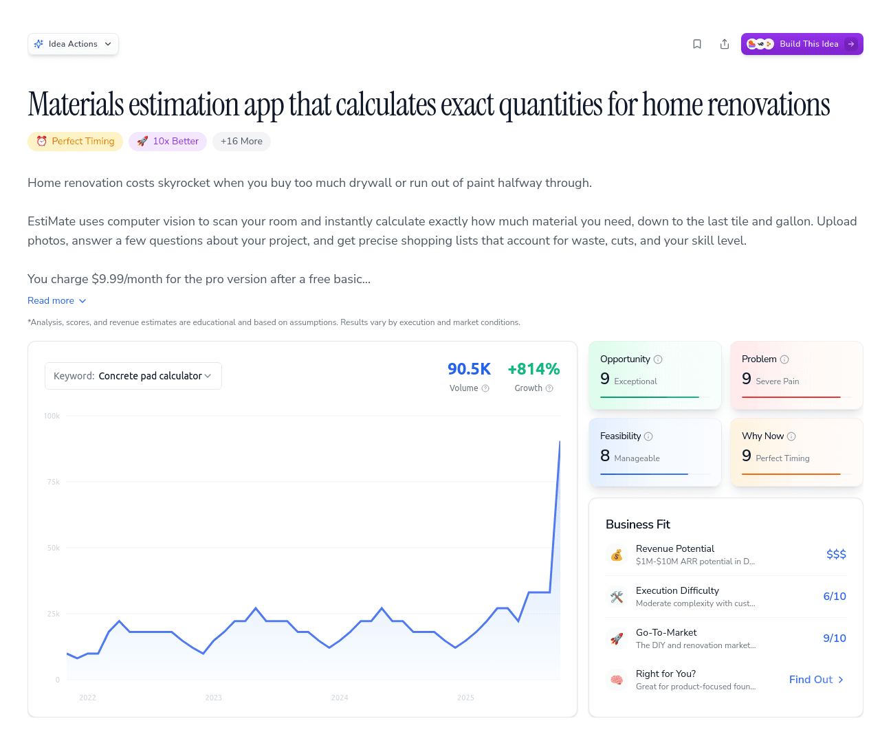

---

## Ideabrowser | #1 Software to Find Startup Ideas Worth Building

**URL:** [https://www.ideabrowser.com/idea/budget-dashboard-for-sports-teams-that-shows-parents-real-time-spending-394/build/landing-page](https://www.ideabrowser.com/idea/budget-dashboard-for-sports-teams-that-shows-parents-real-time-spending-394/build/landing-page)
**Depth:** 1

[

❄

❄

❄

24 Daysof Startup Ideas — Day 11/24

Claim free ideas & earn your Dec 25 gift!

Free Gift →

](/advent-calendar)

Find IdeasBuild Ideas[Pricing](/pricing)More

1

Family Three

1

[Back to Templates](/idea/budget-dashboard-for-sports-teams-that-shows-parents-real-time-spending-394/build)

## Idea Builder

Choose a template to get started building

Learn how templates work

Popular3

[

Ad Creatives

High-converting ad copy and creative concepts

](/idea/budget-dashboard-for-sports-teams-that-shows-parents-real-time-spending-394/build/ad-creatives)[

Brand Package

Complete brand identity with logo, colors, and voice

](/idea/budget-dashboard-for-sports-teams-that-shows-parents-real-time-spending-394/build/brand-package)[

Landing Page

Copy + wireframe blocks

Active

](/idea/budget-dashboard-for-sports-teams-that-shows-parents-real-time-spending-394/build/landing-page)

Marketing8

Product3

Business4

Research2

[

Custom Prompt

Create your own prompt

](/idea/budget-dashboard-for-sports-teams-that-shows-parents-real-time-spending-394/build/custom)

Landing Page

# Budget tracking app that brings transparency to youth sports teams

Landing Page

+

### Let's Build It!

Click any AI builder icon to copy your prompt and get started,  
or copy first and choose your tool.

Copy Prompt & See All Tools

+

### Your Landing Page Prompt

Create a complete, high-converting landing page for this business idea. This should include all copy, layout instructions, and wireframe details that could be handed to any developer or AI builder to create the actual page. ## LANDING PAGE BLUEPRINT ### 1. PAGE STRUCTURE & WIREFRAME \*\*Above the Fold (Hero Section)\*\*: - \*\*Layout\*\*: \[Describe layout - left/right split, centered, background image, etc.\] - \*\*Primary Headline\*\*: \[Powerful headline that hooks attention\] - \*\*Subheadline\*\*: \[Supporting text that clarifies the value\] - \*\*Hero Image/Video\*\*: \[Detailed description for visual content\] - \*\*Primary CTA Button\*\*: \[Button text and styling notes\] - \*\*Social Proof Element\*\*: \[Customer count, testimonial quote, etc.\] \*\*Trust Indicators Strip\*\*: - \*\*Customer Logos\*\*: \[Types of companies to feature\] - \*\*Testimonial Quote\*\*: \[Short, impactful testimonial\] - \*\*Stats/Numbers\*\*: \[Key metrics that build credibility\] ### 2. PROBLEM/PAIN SECTION \*\*Section Headline\*\*: \[How you frame the problem\] \*\*Pain Points\*\* (3-4 bullets): - Pain Point 1: \[Specific problem your audience faces\] - Pain Point 2: \[Another frustration they experience\] - Pain Point 3: \[Cost or consequence of not solving it\] \*\*Visual Element\*\*: \[Image, diagram, or graphic that illustrates the problem\] ### 3. SOLUTION OVERVIEW \*\*Section Headline\*\*: \[How you position your solution\] \*\*Value Proposition\*\*: \[Clear explanation of what you offer\] \*\*Key Benefits\*\* (3-4 primary benefits): - Benefit 1: \[What they gain\] - Benefit 2: \[What they avoid\] - Benefit 3: \[What they achieve\] \*\*Demo/Preview\*\*: \[Screenshot, video thumbnail, or product preview\] ### 4. HOW IT WORKS (Process Section) \*\*Section Headline\*\*: \[Make it simple and clear\] \*\*Steps\*\* (3-4 steps maximum): 1. \*\*Step 1\*\*: \[Action they take\] - \[Brief description\] 2. \*\*Step 2\*\*: \[What happens next\] - \[Brief description\] 3. \*\*Step 3\*\*: \[Final outcome\] - \[Brief description\] \*\*Visual Treatment\*\*: \[Icons, illustrations, or process diagram\] ### 5. FEATURES/BENEFITS SECTION \*\*Section Headline\*\*: \[Position features as benefits\] \*\*Feature Blocks\*\* (3-6 features): - \*\*Feature 1 Name\*\*: \[Benefit-focused title\] - Description: \[How it helps them\] - Icon/Image: \[Visual representation\] - \*\*Feature 2 Name\*\*: \[Benefit-focused title\] - Description: \[How it helps them\] - Icon/Image: \[Visual representation\] \[Continue pattern...\] ### 6. SOCIAL PROOF SECTION \*\*Section Headline\*\*: \[Position social validation\] \*\*Testimonials\*\* (2-3 detailed testimonials): - \*\*Testimonial 1\*\*: "\[Full testimonial quote\]" - Name, Title, Company - Photo: \[Description for headshot\] - \*\*Testimonial 2\*\*: "\[Full testimonial quote\]" - Name, Title, Company - Photo: \[Description for headshot\] \*\*Alternative Social Proof\*\*: - Case study results - User-generated content examples - Press mentions or awards ### 7. PRICING SECTION (if applicable) \*\*Section Headline\*\*: \[Frame pricing positively\] \*\*Pricing Tiers\*\* (1-3 options): - \*\*Tier Name\*\*: - Price: \[Amount and billing period\] - Features: \[Key features included\] - CTA: \[Button text\] - Best for: \[Who should choose this\] ### 8. FAQ SECTION \*\*Section Headline\*\*: \[Address common concerns\] \*\*FAQs\*\* (5-7 most important questions): 1. \*\*Q\*\*: \[Most common question\] \*\*A\*\*: \[Clear, reassuring answer\] 2. \*\*Q\*\*: \[Price/value concern\] \*\*A\*\*: \[Address objection directly\] \[Continue with other key objections...\] ### 9. FINAL CTA SECTION \*\*Headline\*\*: \[Create urgency or reinforce value\] \*\*Supporting Text\*\*: \[Remove final objections\] \*\*CTA Button\*\*: \[Action-oriented text\] \*\*Risk Reversal\*\*: \[Guarantee, trial, refund policy\] \*\*Secondary CTA\*\*: \[Alternative action like "Learn More"\] ### 10. FOOTER \*\*Company Info\*\*: \[Essential contact/legal info\] \*\*Links\*\*: \[Key pages and resources\] \*\*Social Media\*\*: \[Relevant platforms\] --- ## COPY GUIDELINES - \*\*Tone\*\*: \[Match brand personality - professional, friendly, urgent, etc.\] - \*\*Reading Level\*\*: \[Target 8th grade reading level for accessibility\] - \*\*Keywords\*\*: \[Include relevant SEO keywords naturally\] - \*\*Scannability\*\*: \[Use bullet points, short paragraphs, clear headings\] ## TECHNICAL NOTES - \*\*Mobile-first\*\*: Ensure all sections work well on mobile - \*\*Loading Speed\*\*: Optimize images and minimize elements above fold - \*\*A/B Testing\*\*: Note elements that should be tested (headlines, CTAs, etc.) Base all copy and positioning on the provided market research, target audience insights, and competitive analysis. ## BUSINESS CONTEXT ### Idea Overview \*\*Product/Service\*\*: Budget tracking app that brings transparency to youth sports teams \*\*Summary\*\*: Youth sports team finances are a mess. Parents constantly ask "where did my $500 registration fee go?" Treasurers scramble with Excel sheets and receipts. Arguments break out over uniform costs and tournament expenses. TeamBudget fixes this by giving every team real-time financial transparency that parents and coaches can actually understand. You get automatic expense tracking, receipt uploads, and budget breakdowns that show exactly where every dollar goes. Parents see live updates when fees are collected and spent. Team managers get clean dashboards instead of messy spreadsheets. Everything syncs with existing payment systems and sports management platforms. The wedge is youth sports teams drowning in financial chaos. At $24-50 per team per month, you're targeting the 200,000+ organized youth sports teams in the US. You grow through Facebook parent groups where budget drama unfolds daily, partnerships with TeamSnap and SportsEngine, and word-of-mouth from treasurers who finally stop getting angry texts about missing money. Start simple with expense tracking and parent notifications. Then expand into budget forecasting, fundraising tools, and white-label solutions for sports leagues. The 290-comment Reddit threads and 18,000-member Facebook groups prove parents are desperate for this. Youth sports spending hits $30+ billion annually, but nobody's built the financial infrastructure these teams actually need. You become the trusted layer between team organizers and frustrated parents, turning budget chaos into budget clarity. \*\*Why Now\*\*: The youth sports market is at a crucial juncture. With spending surging 46% over five years and families seeking transparency amidst complex cost structures, TeamBudget offers an immediate solution. As the market grows towards $64 billion by 2033, the demand for real-time financial visibility and control has never been greater, positioning this tool perfectly in the current ecosystem. Technologically, advancements in cloud-based infrastructures and standardized payment APIs have significantly lowered development barriers, enabling effective and scalable real-time dashboards at competitive costs. This technological maturity, combined with the tech-savvy demographic now managing youth sports finances, creates a potent environment for TeamBudget's adoption. Moreover, competitive dynamics favor rapid action. While major platforms like TeamSnap dominate general management tools, they lack specialized financial transparency features. By launching now, TeamBudget can leverage first-mover advantages and establish a foothold before larger platforms develop competing solutions. This critical timing is enhanced by robust community demand and an untapped market need, making immediate execution essential. ### Market Analysis \*\*Pain Score\*\*: icon: 🔥 label: Pain Score score: 9 byline: Youth sports teams face severe budgeting challenges, demanding urgent solutions. pain\_type: Acute analyzedAt: 2025-11-26T19:08:22.939Z pain\_trends: Increasing score\_reason: The need for a specialized budgeting tool is validated by high emotional frustration, systemic barriers, and significant community demand. pain\_frequency: score: 8 reason: Budgeting challenges are a constant issue during sports seasons. pain\_intensity: score: 9 reason: The emotional and operational stress is severe and disruptive for team managers and parents. key\_pain\_points: \[ Stress from Budget Mismanagement Confusion and Accusations Urgency in Real-time Financial Transparency Gap in Real-time Transparency Features \] market\_evidence: \[ 290-comment threads on Reddit demanding better budgeting tools. 18,000-member Facebook groups voicing frustration with current solutions. High engagement on YouTube for budgeting app tutorials and reviews. \] current\_solutions: score: 3 reason: Existing solutions lack real-time financial tracking and integration with sports team needs. willingness\_to\_pay: score: 8 reason: Teams and parents are motivated to invest in solutions that offer transparency and ease of use. \*\*Opportunity Score\*\*: icon: 💎 label: Opportunity Score score: 9 byline: Strong demand for transparency in a growing youth sports market. key\_risks: \[ Competitive response from major platforms User adoption challenges Integration complexity with payment systems Regulatory compliance concerns \] analyzedAt: 2025-11-26T19:08:15.891Z score\_reason: The opportunity leverages a clear market gap and benefits from robust technological and social enablers. key\_strengths: \[ High demand for financial transparency Untapped market segment Scalable technology solutions First-mover advantage \] market\_timing: score: 9 reason: Surging demand for financial transparency aligns with growth in youth sports spending. market\_potential: score: 9 reason: The youth sports market is projected to grow significantly, increasing the demand for budget solutions. opportunity\_type: Market Gap opportunity\_window: Just Right competitive\_advantage: score: 8 reason: Lack of direct competitors focusing on financial transparency provides a clear entry point. execution\_feasibility: score: 5 reason: Moderate complexity due to necessary integrations and user adoption strategies. \*\*Market Gaps\*\*: The sports team budget dashboard opportunity stems from escalating youth sports expenditures, inadequate transparency in financial management, and a shift to tech-savvy parents demanding modern solutions. Existing systems lack real-time, parent-facing features, creating a ripe market for disruptive innovation. \*\*Go-to-Market\*\*: icon: 🚀 label: Go-To-Market score: 9 byline: Exceptional traction potential with rising demand across social platforms and key communities. analyzedAt: 2025-11-26T19:07:55.825Z gtm\_tactics: \[ Leverage Facebook groups for targeted ads and engagement Create instructional YouTube videos on team budget management Host webinars with sports clubs on financial transparency Collaborate with sports management platforms for integration partnerships \] short\_reason: Clear signals from Reddit, Facebook, and YouTube highlight unmet demand for sports budgeting solutions. traction\_signal: Strong traction audience\_clusters: \[ Youth sports team managers Parents managing team finances Club treasurers seeking digital solutions \] channels\_with\_signal: \[ Reddit (21.5M+ followers in relevant subs) Facebook Groups (18,000+ members in finance discussions) YouTube (500K+ views on sports budget content) Google Search (high growth for 'team budget app') \] early\_positioning\_angles: \[ 'Real-time budgeting for real teams' 'Transparency your team deserves' 'Budget smarter, play harder' \] ### Business Model \*\*Value Ladder\*\*: offers: \[ goal: Generate leads and build trust. name: Team Budget Tracker Demo price: Free stage: Bait description: An interactive online demo showcasing how real-time updates work with sample data. value\_provided: Instant insight into budget tracking capabilities, creating transparency and trust. goal: Convert leads to customers and validate product. name: Sports Team Budget Starter Plan price: $24/month stage: Frontend description: Basic access to the budget dashboard for one team, including real-time updates and spending alerts. value\_provided: Reduces stress and time spent on budget management by providing clarity and transparency. goal: Expand core user base and revenue. name: Pro Budget Management Suite price: $49/month stage: Middle description: Enhanced dashboard with additional features including personalized alerts, multi-team support, and priority customer service. value\_provided: Improves efficiency and control over multiple team budgets, with support and custom alerts. goal: Increase customer retention with recurring revenue. name: Team Budget Plus Subscription price: $10/month add-on stage: Continuity Program description: Monthly add-on providing advanced analytics and deeper insights into financial trends. value\_provided: Unlocks valuable data insights, helping teams make informed decisions and optimize budgets. goal: Capture high-value clients through premium offerings. name: Enterprise Sports Management Solution price: $25,000–$50,000+/year stage: Backend description: Customized white-label solution for sports organizations, integrating with existing systems and offering bespoke features. value\_provided: Provides a comprehensive budget management system tailored to meet specific organizational needs, enhancing operational efficiency. \] analyzedAt: 2025-11-26T19:08:10.336Z \*\*Revenue Potential\*\*: icon: 💰 label: Revenue Potential score: $$$ byline: $1M-$10M ARR potential with strong demand for transparency in youth sports finances. examples: \[ Team subscription: $24–$50/mo Partnership bulk subscription: $500–$5,000/yr Premium analytics: $10–$20 add-on/mo \] analyzedAt: 2025-11-26T19:07:40.192Z funding\_type: Seed short\_reason: Recurring subscription model with features that specifically target an underserved market need. example\_comps: \[ TeamSnap SportsEngine Blue Sombrero QuickBooks Mint \] business\_models: \[ Monthly subscriptions Bulk organizational partnerships Freemium with paid premium features White-label solutions Affiliate revenue through integration partners \] \*\*Execution Plan\*\*: label: Business Classification steps: \[ Conduct market research and competitive analysis. Develop interactive demo tool. Create targeted ad campaigns. Initiate pilot program with select teams. Gather feedback and iterate on product features. \] actions: \[ 1. Develop and launch the MVP dashboard. 2. Initiate the marketing campaign focusing on Facebook and Google Ads. 3. Onboard early adopters and gather feedback for product improvement. \] b2x\_type: B2C lead\_magnet: type: Interactive Tool format: Online Demo Tool delivery: Website and email sign-up creation\_steps: Develop a simplified version of the dashboard showing how real-time updates work with dummy data. conversion\_rate: 20% conversion of demo users to trial users core\_pain\_solved: Provides instant financial clarity to parents and teams. value\_demonstration: Allows users to see how real-time budget updates reduce confusion and improve transparency. mvp\_strategy: Launch a web-based platform with core functionalities like real-time updates and spending alerts. initial\_offer: model: Subscription price: $24/month value\_prop: Saves time and reduces stress by providing transparency in team finances. fulfillment: Online platform with automated updates conversion\_rate: 15% of trial to paid conversion buyer\_personas: \[ Parents of youth athletes Sports team treasurers \] key\_pain\_points: \[ Lack of financial transparency Time-consuming budget reporting \] success\_metrics: cac: $150/customer churn\_rate: <5% per quarter pilot\_conversion: 30% from free trial to paid loan\_approval\_time: N/A resources\_needed: team: \[ Product Manager Marketing Specialist Customer Support Rep \] budget: $150,000 for initial development and marketing timeline: Begin execution within 7 days with a 6-month initial phase expansion\_strategy: goal: Expand into school clubs and other group activities. type: Vertical expansion focus: Customization for different sports and organizations. dev\_timeline: 12 months go\_to\_market: Pilot with selected clubs and collect feedback for refinement. pricing\_changes: Higher tier pricing for advanced features. traction\_milestone: Achieving 1,000 paid subscriptions by the end of 18 months. acquisition\_channels: \[ reason: High engagement among target audience discussing similar pain points. channel: Facebook Groups metrics: Engagement in group discussions frequency: Weekly posts content\_format: Short videos and testimonials implementation\_steps: Create engaging content that addresses common budgeting problems in youth sports. reason: Growing interest for budgeting apps in online searches. channel: Google Ads metrics: Click-through rate and trial sign-ups frequency: Ongoing campaign content\_format: Search ads focusing on keywords like 'team budget app' implementation\_steps: Conduct keyword research, set up targeted ads, and optimize based on performance. reason: Targeted audience discussion around personal finance solutions. channel: Reddit Communities metrics: Post engagement and leads frequency: Bi-weekly content\_format: Educational posts and AMAs implementation\_steps: Participate in relevant subreddits and host AMAs to engage directly with parents and treasurers. \] risks\_and\_mitigation: \[ Resistance to new technology → Provide strong onboarding and customer support. Data privacy concerns → Implement robust security measures and compliance with regulations. \] competitive\_landscape: The current market is fragmented with many generic budgeting apps but lacks specialized tools for sports teams offering real-time spending transparency to parents. \*\*Execution Difficulty\*\*: icon: 🛠️ label: Execution Difficulty score: 5 byline: Moderate build with standard integrations, 3-month MVP timeline analyzedAt: 2025-11-26T19:07:46.733Z mvp\_timeline: Use of mobile/web frameworks (e.g., React, Flutter) with payment processing APIs (e.g., Stripe) and basic scheduling tools. short\_reason: Moderate complexity due to integration of team management and payment systems. execution\_risks: \[ Potential delays in API integration User adoption challenges in diverse teams Limited initial budget for development \] timeline\_estimate: 3mo MVP technical\_challenges: \[ Integration with third-party payment systems Developing cross-platform compatibility Ensuring data synchronization across devices \] non\_technical\_challenges: \[ User onboarding and education Gaining trust from parents and team managers Managing diverse feature requests from users \] --- Use this business context to inform all recommendations, ensuring they're specifically tailored to this opportunity and target market.

InstructionsUpdate with AI

### Ready to Build? Choose Your AI Tool

Copy your prompt and paste it into any of these AI builders to bring your idea to life.

[

Lovable](https://lovable.dev)[

v0](https://v0.dev)[

Replit](https://replit.com)[

Cursor](https://cursor.sh)[

Bolt.new](https://bolt.new)[

Claude](https://claude.ai)[

ChatGPT](https://chat.openai.com)[

Gemini](https://gemini.google.com)[

Manus](https://manus.ai)

Get ideas for profitable startups, trending keywords, and go-to-market tactics, powered by data.

### Browse Ideas

*   [Idea of the Day](/idea-of-the-day)
*   [Idea Database](/database)
*   [Trends](/trends)
*   [Market Insights](/market-insights)

### Tools

*   [Idea Generator](/idea-generator)
*   [Research Your Ideas](/idea-agent)
*   [Idea Builder](/idea-builder)
*   [Chat & Strategize](/ai-chat)
*   [Founder Fit](/founder-fit)

### Resources

*   [Platform Tour](/welcome-tour)
*   [Features](/features)
*   [Tools Library](/tools)
*   [Pricing](/pricing)
*   [FAQ](/frequently-asked-questions)

### Company

*   [About](/about)
*   [Success Stories](/success-stories)
*   [Announcements](/announcements)
*   [What's New](/updates)
*   [Contact & Support](/contact)

© 2025 Ideabrowser. All rights reserved.

[Terms and Conditions](/terms)[Privacy Policy](/privacy)[Data Protection](/data-protection)[Disclaimer](/disclaimer)

Ideabrowser shares research and education, not promises or advice. Revenue estimates, scores, and examples are illustrative only; your results will vary. Always do your own due diligence.

### Images

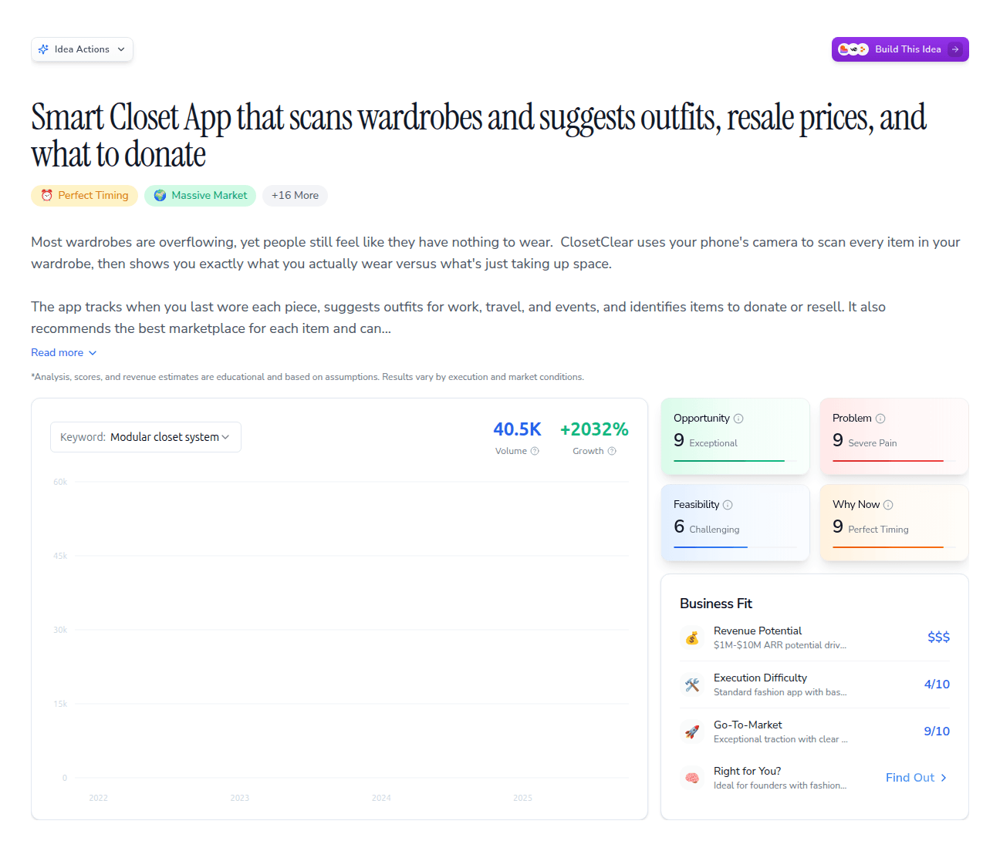
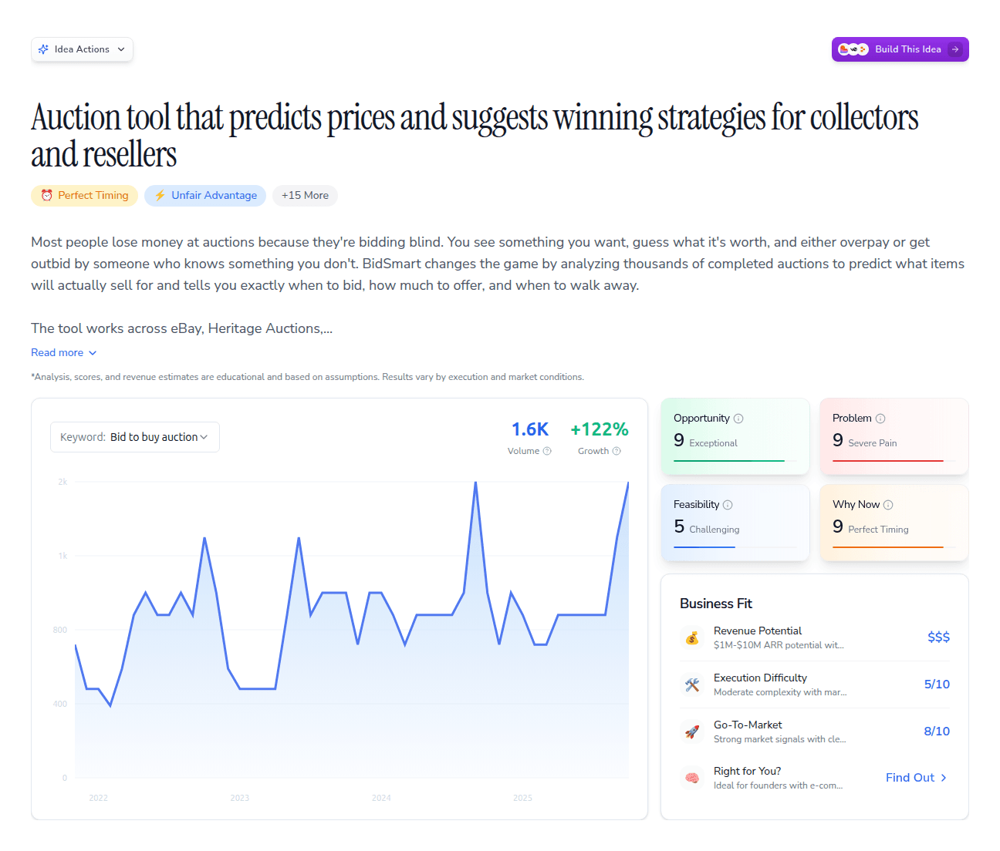
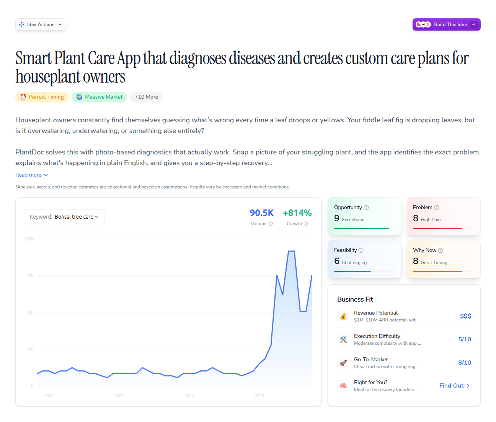

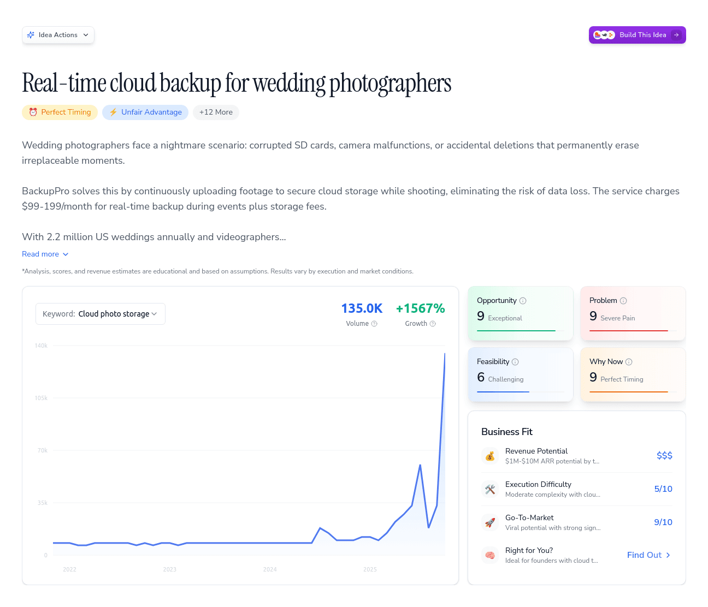
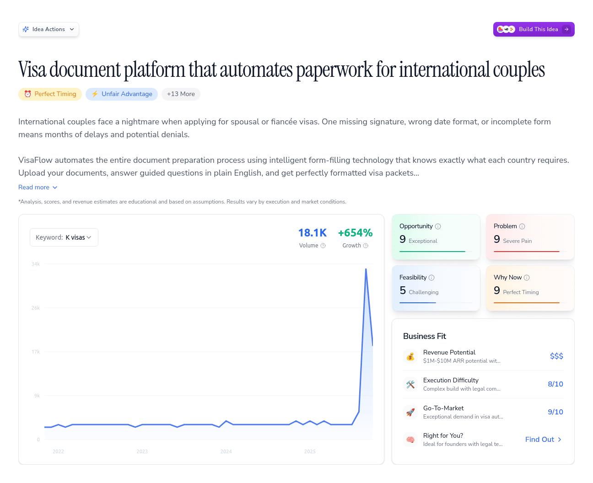
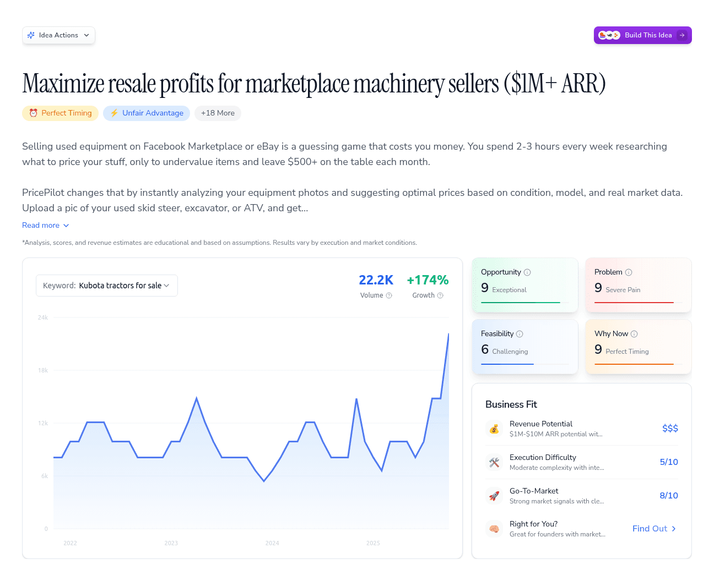

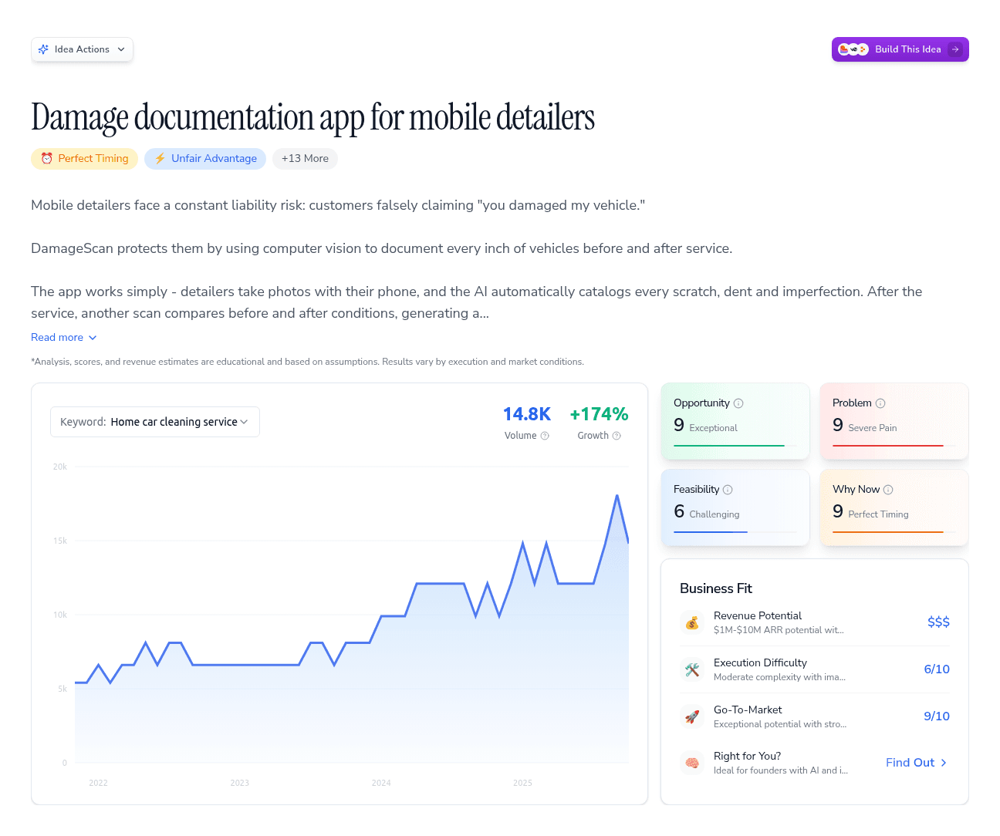
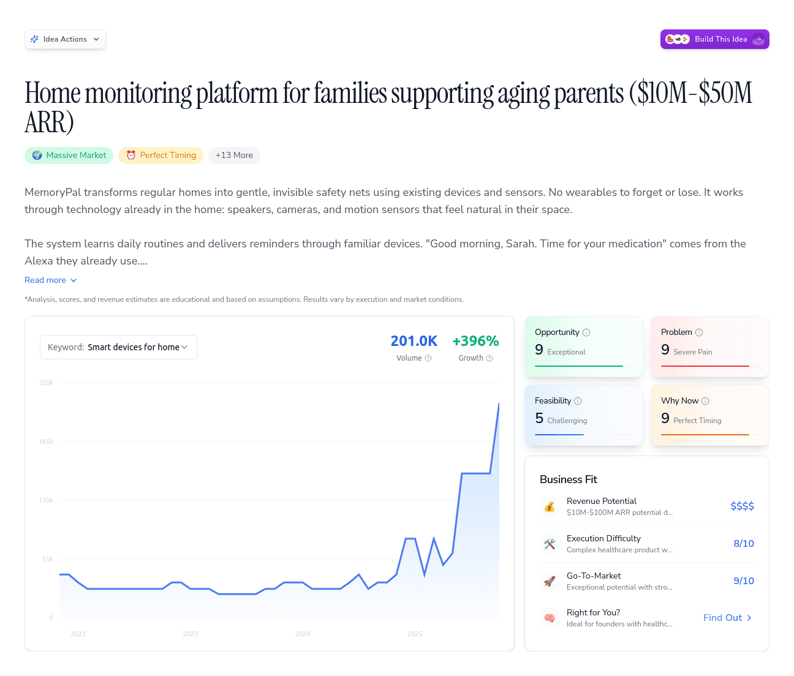
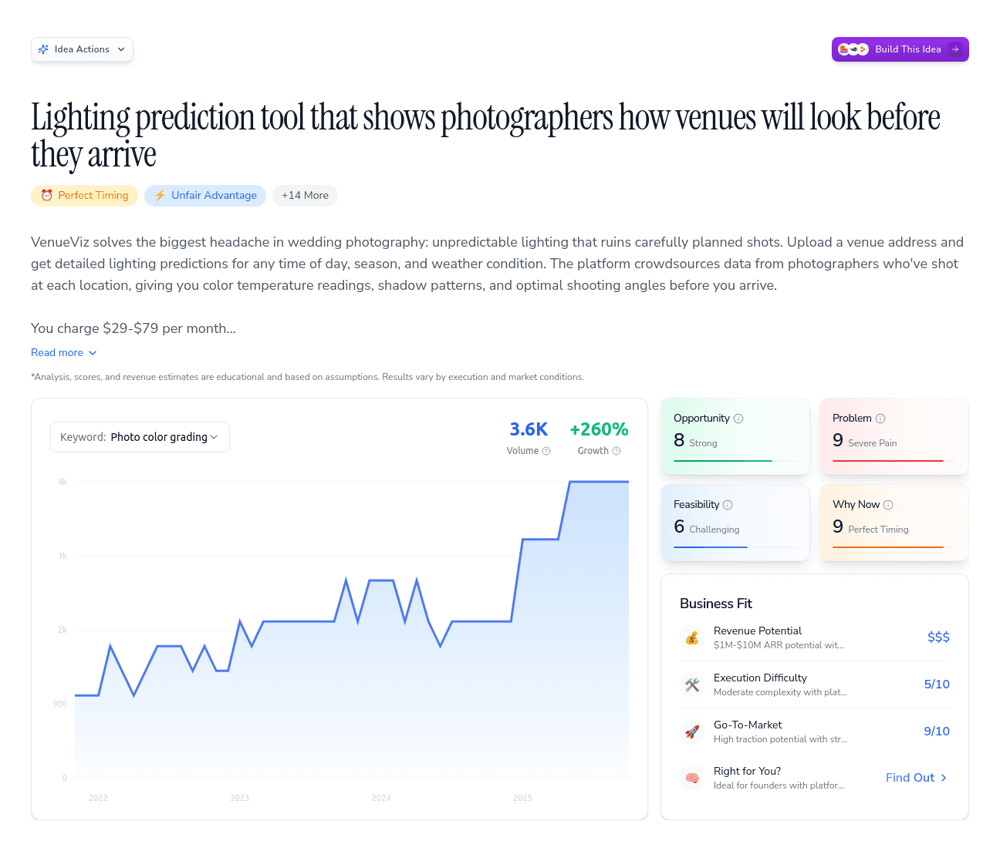

---

## Ideabrowser | #1 Software to Find Startup Ideas Worth Building

**URL:** [https://www.ideabrowser.com/idea/budget-dashboard-for-sports-teams-that-shows-parents-real-time-spending-394/build](https://www.ideabrowser.com/idea/budget-dashboard-for-sports-teams-that-shows-parents-real-time-spending-394/build)
**Depth:** 2

[

❄

❄

❄

24 Daysof Startup Ideas — Day 11/24

Claim free ideas & earn your Dec 25 gift!

Free Gift →

](/advent-calendar)

Find IdeasBuild Ideas[Pricing](/pricing)More

1

Family Three

1

[Back](/idea/budget-dashboard-for-sports-teams-that-shows-parents-real-time-spending-394)

Build This Idea

# Budget tracking app that brings transparency to youth sports teams

Turn this idea's research into actionable prompts for AI builders.

[

Start with Landing Page](/idea/budget-dashboard-for-sports-teams-that-shows-parents-real-time-spending-394/build/landing-page)See How It Works

or choose from templates below

## Popular

3 templates

Most commonly used templates to get started

## Marketing

8 templates

Marketing focused templates for your business

## Product

3 templates

Product focused templates for your business

## Business

4 templates

Business focused templates for your business

## Research

2 templates

Research focused templates for your business

## Popular

3 templates

Most commonly used templates to get started

### Ad Creatives

High-converting ad copy and creative concepts

Preview[Build](/idea/budget-dashboard-for-sports-teams-that-shows-parents-real-time-spending-394/build/ad-creatives)

### Brand Package

Complete brand identity with logo, colors, and voice

Preview[Build](/idea/budget-dashboard-for-sports-teams-that-shows-parents-real-time-spending-394/build/brand-package)

### Landing Page

Copy + wireframe blocks

Preview[Build](/idea/budget-dashboard-for-sports-teams-that-shows-parents-real-time-spending-394/build/landing-page)

## Marketing

8 templates

Marketing focused templates for your business

### Content Calendar

90-day content marketing plan

Preview[Build](/idea/budget-dashboard-for-sports-teams-that-shows-parents-real-time-spending-394/build/content-calendar)

### Email Funnel System

Complete email marketing funnel with sequences, triggers & flow diagrams

Preview[Build](/idea/budget-dashboard-for-sports-teams-that-shows-parents-real-time-spending-394/build/email-funnel-system)

### Email Sequence

5-email nurture sequence

Preview[Build](/idea/budget-dashboard-for-sports-teams-that-shows-parents-real-time-spending-394/build/email-sequence)

### Lead Magnet

Irresistible lead generation offers

Preview[Build](/idea/budget-dashboard-for-sports-teams-that-shows-parents-real-time-spending-394/build/lead-magnet)

### Sales Funnel

Customer journey optimization strategy

Preview[Build](/idea/budget-dashboard-for-sports-teams-that-shows-parents-real-time-spending-394/build/sales-funnel)

### SEO Content

Search-optimized content strategy

Preview[Build](/idea/budget-dashboard-for-sports-teams-that-shows-parents-real-time-spending-394/build/seo-content)

### Tweet-Sized Landing Page

Ultra-minimal 280-character landing page

Preview[Build](/idea/budget-dashboard-for-sports-teams-that-shows-parents-real-time-spending-394/build/tweet-sized-landing-page)

### User Personas

Detailed customer persona cards with motivations

Preview[Build](/idea/budget-dashboard-for-sports-teams-that-shows-parents-real-time-spending-394/build/user-personas)

## Product

3 templates

Product focused templates for your business

### Feature Specs

Detailed feature specifications and user stories

Preview[Build](/idea/budget-dashboard-for-sports-teams-that-shows-parents-real-time-spending-394/build/feature-specs)

### MVP Roadmap

90-day development plan with feature prioritization

Preview[Build](/idea/budget-dashboard-for-sports-teams-that-shows-parents-real-time-spending-394/build/mvp-roadmap)

### Product Requirements Doc

Complete PRD with technical specifications

Preview[Build](/idea/budget-dashboard-for-sports-teams-that-shows-parents-real-time-spending-394/build/product-requirements-doc)

## Business

4 templates

Business focused templates for your business

### GTM Launch Calendar

90-day launch timeline with team coordination

Preview[Build](/idea/budget-dashboard-for-sports-teams-that-shows-parents-real-time-spending-394/build/gtm-launch-calendar)

### GTM Strategy

Go-to-market strategy and launch plan

Preview[Build](/idea/budget-dashboard-for-sports-teams-that-shows-parents-real-time-spending-394/build/gtm-strategy)

### KPI Dashboard

Pre-built metrics tracker with formulas

Preview[Build](/idea/budget-dashboard-for-sports-teams-that-shows-parents-real-time-spending-394/build/kpi-dashboard)

### Pricing Strategy

Strategic pricing framework and psychology

Preview[Build](/idea/budget-dashboard-for-sports-teams-that-shows-parents-real-time-spending-394/build/pricing-strategy)

## Research

2 templates

Research focused templates for your business

### Competitive Analysis

Deep dive into competitors and market gaps

Preview[Build](/idea/budget-dashboard-for-sports-teams-that-shows-parents-real-time-spending-394/build/competitive-analysis)

### Customer Interview Guide

Structured interviews for validation and insights

Preview[Build](/idea/budget-dashboard-for-sports-teams-that-shows-parents-real-time-spending-394/build/customer-interview-guide)

## How the Idea Builder Works

Watch this quick walkthrough to see how you can transform your idea research into professional building prompts for AI tools.

### Need Something Custom?

Describe exactly what you want to build for a personalized prompt tailored to your specific needs.

[Create Custom Prompt](/idea/budget-dashboard-for-sports-teams-that-shows-parents-real-time-spending-394/build/custom)

Get ideas for profitable startups, trending keywords, and go-to-market tactics, powered by data.

### Browse Ideas

*   [Idea of the Day](/idea-of-the-day)
*   [Idea Database](/database)
*   [Trends](/trends)
*   [Market Insights](/market-insights)

### Tools

*   [Idea Generator](/idea-generator)
*   [Research Your Ideas](/idea-agent)
*   [Idea Builder](/idea-builder)
*   [Chat & Strategize](/ai-chat)
*   [Founder Fit](/founder-fit)

### Resources

*   [Platform Tour](/welcome-tour)
*   [Features](/features)
*   [Tools Library](/tools)
*   [Pricing](/pricing)
*   [FAQ](/frequently-asked-questions)

### Company

*   [About](/about)
*   [Success Stories](/success-stories)
*   [Announcements](/announcements)
*   [What's New](/updates)
*   [Contact & Support](/contact)

© 2025 Ideabrowser. All rights reserved.

[Terms and Conditions](/terms)[Privacy Policy](/privacy)[Data Protection](/data-protection)[Disclaimer](/disclaimer)

Ideabrowser shares research and education, not promises or advice. Revenue estimates, scores, and examples are illustrative only; your results will vary. Always do your own due diligence.

### Images

---

## Budget tracking app that brings transparency to youth sports teams

**URL:** [https://www.ideabrowser.com/idea/budget-dashboard-for-sports-teams-that-shows-parents-real-time-spending-394](https://www.ideabrowser.com/idea/budget-dashboard-for-sports-teams-that-shows-parents-real-time-spending-394)
**Depth:** 3

[

❄

❄

❄

24 Daysof Startup Ideas — Day 11/24

Claim free ideas & earn your Dec 25 gift!

Free Gift →

](/advent-calendar)

Find IdeasBuild Ideas[Pricing](/pricing)More

1

Family Three

1

Idea Actions

[

Build This Idea

](/idea/budget-dashboard-for-sports-teams-that-shows-parents-real-time-spending-394/build/landing-page)

[

Build This Idea

](/idea/budget-dashboard-for-sports-teams-that-shows-parents-real-time-spending-394/build/landing-page)

# Budget tracking app that brings transparency to youth sports teams

🌍Massive Market

🌍Massive Market

⏰Perfect Timing

+10 More

Youth sports team finances are a mess. Parents constantly ask "where did my $500 registration fee go?" Treasurers scramble with Excel sheets and receipts. Arguments break out over uniform costs and tournament expenses. TeamBudget fixes this by giving every team real-time financial transparency that parents and coaches can actually understand. You get automatic expense tracking, receipt uploads, and budget breakdowns that show exactly where every dollar goes. Parents see live updates when fees are collected and spent. Team managers get clean dashboards instead of messy spreadsheets. Everything syncs with existing payment systems and sports management platforms. The wedge is youth sports teams drowning in financial chaos. At $24-50 per team per month, you're targeting the 200,000+ organized youth sports teams in the US. You grow through Facebook parent groups where budget drama unfolds daily, partnerships with TeamSnap and SportsEngine, and word-of-mouth from treasurers who finally stop getting angry texts about missing money. Start simple with expense tracking and parent notifications. Then expand into budget forecasting, fundraising tools, and white-label solutions for sports leagues. The 290-comment Reddit threads and 18,000-member Facebook groups prove parents are desperate for this. Youth sports spending hits $30+ billion annually, but nobody's built the financial infrastructure these teams actually need. You become the trusted layer between team organizers and frustrated parents, turning budget chaos into budget clarity.

\*Analysis, scores, and revenue estimates are educational and based on assumptions. Results vary by execution and market conditions.

Keyword:Personal money management app

165.0K

Volume

+3650%

Growth

### Opportunity

9

Exceptional

### Problem

9

Severe Pain

### Feasibility

6

Challenging

### Why Now

9

Perfect Timing

## Business Fit

💰

Revenue Potential$1M-$10M ARR potential with strong demand for transparency in youth sports finances.

$$$

🛠️

Execution DifficultyModerate build with standard integrations, 3-month MVP timeline

5/10

🚀

Go-To-MarketExceptional traction potential with rising demand across social platforms and key communities.

9/10

[

🧠

Right for You?Ideal for founders with experience in sports tech or financial apps

Find Out

](/idea/budget-dashboard-for-sports-teams-that-shows-parents-real-time-spending-394/founder-fit)

[Offer](/idea/budget-dashboard-for-sports-teams-that-shows-parents-real-time-spending-394/value-ladder)[Why Now](/idea/budget-dashboard-for-sports-teams-that-shows-parents-real-time-spending-394/why-now)[Proof & Signals](/idea/budget-dashboard-for-sports-teams-that-shows-parents-real-time-spending-394/proof-signals)[Market Gap](/idea/budget-dashboard-for-sports-teams-that-shows-parents-real-time-spending-394/market-gap)[Execution Plan](/idea/budget-dashboard-for-sports-teams-that-shows-parents-real-time-spending-394/execution-plan)

### Start Building in 1-click

Turn this idea into your business with pre-built prompts

[

Ad Creatives

High-converting ad copy and creative concepts

](/idea/budget-dashboard-for-sports-teams-that-shows-parents-real-time-spending-394/build/ad-creatives)[

Brand Package

Complete brand identity with logo, colors, and voice

](/idea/budget-dashboard-for-sports-teams-that-shows-parents-real-time-spending-394/build/brand-package)[

Landing Page

Copy + wireframe blocks

](/idea/budget-dashboard-for-sports-teams-that-shows-parents-real-time-spending-394/build/landing-page)[

More prompts...

View all available prompts

](/idea/budget-dashboard-for-sports-teams-that-shows-parents-real-time-spending-394/build)

Works with:

+more

### Idea Actions

Download, analyze & more

[

#### Get Instant Answers

AI Chat with this idea

](/chat/idea/budget-dashboard-for-sports-teams-that-shows-parents-real-time-spending-394)[

#### Download Data

Export all research & analysis

](/idea/budget-dashboard-for-sports-teams-that-shows-parents-real-time-spending-394/download-data)[

#### Founder Fit

Is this idea right for you?

](/idea/budget-dashboard-for-sports-teams-that-shows-parents-real-time-spending-394/founder-fit)[

#### Claim Idea

Make this idea yours

](/idea/budget-dashboard-for-sports-teams-that-shows-parents-real-time-spending-394/claim-idea)

[

Research Tool

Research Tool

### Get a Report Exactly Like This for Your Idea

Have your own business idea? Our AI Research Agent conducts a comprehensive 40-step analysis to validate and research any idea you give it.

Research My Idea

Research Tool

### Get a Report Exactly Like This for Your Idea

Have your own business idea? Our AI Research Agent conducts a comprehensive 40-step analysis to validate and research any idea you give it.

Research My Idea

### Get a Report Exactly Like This for Your Idea

Have your own business idea? Our AI Research Agent conducts a comprehensive 40-step analysis to validate and research any idea you give it.

Research My Idea

](/idea-agent)

## Offer

1

Lead MagnetTeam Budget Tracker Demo (Free)

An interactive online demo showcasing how real-time updates work with sample data.

2

FrontendSports Team Budget Starter Plan ($24/month)

Basic access to the budget dashboard for one team, including real-time updates and spending alerts.

3

CorePro Budget Management Suite ($49/month)

Enhanced dashboard with additional features including personalized alerts, multi-team support, and priority customer service.

[View full value ladder→](/idea/budget-dashboard-for-sports-teams-that-shows-parents-real-time-spending-394/value-ladder)

## Why Now?

The optimal timing for launching the 'TeamBudget' dashboard aligns with surging financial transparency needs in the rapidly growing $40+ billion youth sports market, aided by demographic and technological shifts.

[See why this opportunity matters now](/idea/budget-dashboard-for-sports-teams-that-shows-parents-real-time-spending-394/why-now)

## Proof & Signals

The business idea for a budget dashboard for sports teams finds strong validation through distinct pain points, market timing, barriers in existing solutions, and demonstrated demand from the community.

[Explore proof & signals](/idea/budget-dashboard-for-sports-teams-that-shows-parents-real-time-spending-394/proof-signals)

## The Market Gap

The biggest market gap lies in real-time financial transparency for youth sports teams, addressing both acute pain points and systemic barriers. This unmet need is driven by surging costs, digital adoption, and legacy system limitations.

[Understand the market opportunity](/idea/budget-dashboard-for-sports-teams-that-shows-parents-real-time-spending-394/market-gap)

## Execution Plan

Launch an MVP offering real-time financial transparency for youth sports teams, tackling the chaos of budgeting with interactive dashboards. Integrate smoothly with Facebook and Google Ads for immediate traction, then convert demo users to paid subscribers. Ready to expand into school clubs and refine features—are you in?

[View detailed execution strategy](/idea/budget-dashboard-for-sports-teams-that-shows-parents-real-time-spending-394/execution-plan)

## Framework Fit

See how this idea fits into popular frameworks

[

### The Value Equation

View Analysis

](/idea/budget-dashboard-for-sports-teams-that-shows-parents-real-time-spending-394/value-equation)[

### Market Matrix

### Tech Novelty

High uniqueness

Low value

### Category King

High uniqueness

High value

### Low Impact

Low uniqueness

Low value

### Commodity Play

Low uniqueness

High value

View Analysis

](/idea/budget-dashboard-for-sports-teams-that-shows-parents-real-time-spending-394/value-matrix)[

### The A.C.P. Framework

Audience8/10

Community8/10

Product9/10

View Analysis

](/idea/budget-dashboard-for-sports-teams-that-shows-parents-real-time-spending-394/acp)[

### The Value Ladder

Bait

Frontend

Core Offer

Backend

Continuity

View Analysis

](/idea/budget-dashboard-for-sports-teams-that-shows-parents-real-time-spending-394/value-ladder)

### Start Building in 1-click

Turn this idea into your business with pre-built prompts

[

Ad Creatives

High-converting ad copy and creative concepts

](/idea/budget-dashboard-for-sports-teams-that-shows-parents-real-time-spending-394/build/ad-creatives)[

Brand Package

Complete brand identity with logo, colors, and voice

](/idea/budget-dashboard-for-sports-teams-that-shows-parents-real-time-spending-394/build/brand-package)[

Landing Page

Copy + wireframe blocks

](/idea/budget-dashboard-for-sports-teams-that-shows-parents-real-time-spending-394/build/landing-page)[

More prompts...

View all available prompts

](/idea/budget-dashboard-for-sports-teams-that-shows-parents-real-time-spending-394/build)

Works with:

+more

### Idea Actions

Download, analyze & more

[

#### Get Instant Answers

AI Chat with this idea

](/chat/idea/budget-dashboard-for-sports-teams-that-shows-parents-real-time-spending-394)[

#### Download Data

Export all research & analysis

](/idea/budget-dashboard-for-sports-teams-that-shows-parents-real-time-spending-394/download-data)[

#### Founder Fit

Is this idea right for you?

](/idea/budget-dashboard-for-sports-teams-that-shows-parents-real-time-spending-394/founder-fit)[

#### Claim Idea

Make this idea yours

](/idea/budget-dashboard-for-sports-teams-that-shows-parents-real-time-spending-394/claim-idea)

### Categorization

Type

saas

Market

B2C

Target

youth sports

Main Competitor

TeamSnap

Trend Analysis

The youth sports market is experiencing significant growth and increased demand for financial transparency, combined with advances in technology that lower barriers for real-time solutions.

[

### Community Signals

](/idea/budget-dashboard-for-sports-teams-that-shows-parents-real-time-spending-394/community-signals)

[

Reddit

5 subreddits · 2.5M+ members

8 / 10

](/idea/budget-dashboard-for-sports-teams-that-shows-parents-real-time-spending-394/community-signals/reddit-analysis)[

Facebook

5 groups · 150K+ members

7 / 10

](/idea/budget-dashboard-for-sports-teams-that-shows-parents-real-time-spending-394/community-signals/facebook-analysis)[

YouTube

13 channels · views

7 / 10

](/idea/budget-dashboard-for-sports-teams-that-shows-parents-real-time-spending-394/community-signals/youtube-analysis)[

Other

3 segments · 3 priorities

8 / 10

](/idea/budget-dashboard-for-sports-teams-that-shows-parents-real-time-spending-394/community-signals/other-communities)

[View detailed breakdown](/idea/budget-dashboard-for-sports-teams-that-shows-parents-real-time-spending-394/community-signals)

### Top Keywords

Fastest Growing

[

personal money management app

LOW competition

49.5K

](/idea/budget-dashboard-for-sports-teams-that-shows-parents-real-time-spending-394/keywords?keyword=personal money management app)[

personal finance management app

LOW competition

2.4K

](/idea/budget-dashboard-for-sports-teams-that-shows-parents-real-time-spending-394/keywords?keyword=personal finance management app)[

financial management app

LOW competition

3.6K

](/idea/budget-dashboard-for-sports-teams-that-shows-parents-real-time-spending-394/keywords?keyword=financial management app)

Highest Volume

[

budget apps

LOW competition

135.0K

](/idea/budget-dashboard-for-sports-teams-that-shows-parents-real-time-spending-394/keywords?keyword=budget apps)[

personal money management app

LOW competition

49.5K

](/idea/budget-dashboard-for-sports-teams-that-shows-parents-real-time-spending-394/keywords?keyword=personal money management app)[

top budget apps

HIGH competition

33.1K

](/idea/budget-dashboard-for-sports-teams-that-shows-parents-real-time-spending-394/keywords?keyword=top budget apps)

Most Relevant

[

budget apps

LOW competition

135.0K

](/idea/budget-dashboard-for-sports-teams-that-shows-parents-real-time-spending-394/keywords?keyword=budget apps)[

personal money management app

LOW competition

49.5K

](/idea/budget-dashboard-for-sports-teams-that-shows-parents-real-time-spending-394/keywords?keyword=personal money management app)[

free budget app

HIGH competition

33.1K

](/idea/budget-dashboard-for-sports-teams-that-shows-parents-real-time-spending-394/keywords?keyword=free budget app)

[View full keyword analysis](/idea/budget-dashboard-for-sports-teams-that-shows-parents-real-time-spending-394/keywords)

### What'd you think of this idea?

Chef's kiss

Pretty interesting

You didn't bring the heat

## Get Instant Answers

Ask anything about this business idea

Powered by Idea Agent

Popular questions

What problem does this solve?How big is the market opportunity?What's the competitive landscape?What's the revenue model?How hard is it to build?What are the key risks?

**Important:** Revenue estimates, scores, and market data are illustrative based on research and assumptions. Results vary by execution, timing, and market conditions. Not investment or business advice.

### More Ideas

[

#### Materials estimation app that calculates exact quantities for home renovations

Home renovation costs skyrocket when you buy too much drywall or run out of paint halfway through. EstiMate uses computer vision to scan your room and instantly calculate exactly how much material you need, down to the last tile and gallon. Upload photos, answer a few questions about your project, and get precise shopping lists that account for waste, cuts, and your skill level. You charge $9.99/month for the pro version after a free basic tier hooks people in. The app learns from millions of real projects to get more accurate about edge cases like uneven walls, complex cuts, and material-specific waste factors. You grow by partnering with Home Depot and Lowe's for seamless checkout integration, sponsoring popular DIY YouTube channels, and building a community where people share their successful projects with exact material costs. The initial focus is individual DIYers, but you expand into small contractors who need quick, accurate estimates for client quotes. At $50-200/month for business accounts, you become the essential tool for anyone measuring twice and cutting once. Add features like cost tracking, project timelines, and supplier price comparisons. Eventually, you're the operating system for home improvement, turning every weekend warrior into a precision renovator who completes projects on budget without excess materials piling up in the garage.

](/idea/smart-material-estimator-app-with-ai-predicted-waste-reduction-354)[

#### Newsletter ad tool where sponsors book slots, upload assets, and pay automatically

Newsletter operators waste hours managing sponsor relationships through email chains, tracking payments in spreadsheets, and manually coordinating creative assets. AdBooker creates a Calendly-style booking system where sponsors browse available slots, select dates, upload materials, and pay instantly. You get automated invoicing, real-time analytics, and seamless payment processing. Pricing runs $49-$199/month plus a 5% transaction fee on bookings. Target newsletter creators earning $5K-$50K/month who want to replace administrative tasks with creative time. Growth comes through newsletter Facebook groups, YouTube tutorials demonstrating the booking flow, and Reddit AMAs in newsletter communities. Begin with a simple booking widget that embeds into existing newsletters. Later expand into: • Sponsor discovery marketplace • Creative approval workflows • Cross-platform analytics dashboards • Performance reporting for sponsors With 2,000 active newsletters averaging $500/month in fees, this becomes a $12M ARR business. The ad booking market remains underserved despite significant demand, creating an opportunity to build infrastructure that transforms manual sponsor management into predictable, scalable revenue.

](/idea/self-serve-ad-booking-calendar-for-newsletter-operators-that-lets-sponsors-select-open-dates-and-pay-instantly-362)[

#### Auction tool that predicts prices and suggests winning strategies for collectors and resellers

Most people lose money at auctions because they're bidding blind. You see something you want, guess what it's worth, and either overpay or get outbid by someone who knows something you don't. BidSmart changes the game by analyzing thousands of completed auctions to predict what items will actually sell for and tells you exactly when to bid, how much to offer, and when to walk away. The tool works across eBay, Heritage Auctions, LiveAuctioneers, and other major platforms. Upload a photo or paste a listing link, and you get an instant price prediction with confidence intervals, comparable sales data, and a custom bidding strategy. For a vintage watch, it might say "This will likely sell for $800-$1,200, bid up to $850 in the final 30 seconds." For comic books, it shows recent sales of similar grades and suggests your maximum bid before you lose money. You charge $29/month for casual collectors and $99/month for professional resellers who need bulk analysis and profit margin tracking. The pro version includes inventory management, tax reporting, and alerts when underpriced items hit the market. At scale, you can offer white-label solutions to auction houses at $5K-$15K per month. The wedge is frustrated collectors who keep overpaying and resellers who need better profit margins. You grow through Reddit auction communities, Facebook collector groups, and YouTube channels focused on flipping and investing. Start with eBay integration and expand to specialty auction platforms as you prove the concept. This becomes the Bloomberg Terminal for auction markets, turning gut-feeling bidders into data-driven profit machines who never wonder "what's this really worth?" again.

](/idea/ai-auction-strategist)

Get ideas for profitable startups, trending keywords, and go-to-market tactics, powered by data.

### Browse Ideas

*   [Idea of the Day](/idea-of-the-day)
*   [Idea Database](/database)
*   [Trends](/trends)
*   [Market Insights](/market-insights)

### Tools

*   [Idea Generator](/idea-generator)
*   [Research Your Ideas](/idea-agent)
*   [Idea Builder](/idea-builder)
*   [Chat & Strategize](/ai-chat)
*   [Founder Fit](/founder-fit)

### Resources

*   [Platform Tour](/welcome-tour)
*   [Features](/features)
*   [Tools Library](/tools)
*   [Pricing](/pricing)
*   [FAQ](/frequently-asked-questions)

### Company

*   [About](/about)
*   [Success Stories](/success-stories)
*   [Announcements](/announcements)
*   [What's New](/updates)
*   [Contact & Support](/contact)

© 2025 Ideabrowser. All rights reserved.

[Terms and Conditions](/terms)[Privacy Policy](/privacy)[Data Protection](/data-protection)[Disclaimer](/disclaimer)

Ideabrowser shares research and education, not promises or advice. Revenue estimates, scores, and examples are illustrative only; your results will vary. Always do your own due diligence.

0

### Images

---

## Ideabrowser | #1 Software to Find Startup Ideas Worth Building

**URL:** [https://www.ideabrowser.com/idea/budget-dashboard-for-sports-teams-that-shows-parents-real-time-spending-394/build/competitive-analysis](https://www.ideabrowser.com/idea/budget-dashboard-for-sports-teams-that-shows-parents-real-time-spending-394/build/competitive-analysis)
**Depth:** 3

[

❄

❄

❄

24 Daysof Startup Ideas — Day 11/24

Claim free ideas & earn your Dec 25 gift!

Free Gift →

](/advent-calendar)

Find IdeasBuild Ideas[Pricing](/pricing)More

1

Family Three

1

[Back to Templates](/idea/budget-dashboard-for-sports-teams-that-shows-parents-real-time-spending-394/build)

## Idea Builder

Choose a template to get started building

Learn how templates work

Popular3

[

Ad Creatives

High-converting ad copy and creative concepts

](/idea/budget-dashboard-for-sports-teams-that-shows-parents-real-time-spending-394/build/ad-creatives)[

Brand Package

Complete brand identity with logo, colors, and voice

](/idea/budget-dashboard-for-sports-teams-that-shows-parents-real-time-spending-394/build/brand-package)[

Landing Page

Copy + wireframe blocks

](/idea/budget-dashboard-for-sports-teams-that-shows-parents-real-time-spending-394/build/landing-page)

Marketing8

Product3

Business4

Research2

[

Custom Prompt

Create your own prompt

](/idea/budget-dashboard-for-sports-teams-that-shows-parents-real-time-spending-394/build/custom)

Competitive Analysis

# Budget tracking app that brings transparency to youth sports teams

Competitive Analysis

+

### Let's Build It!

Click any AI builder icon to copy your prompt and get started,  
or copy first and choose your tool.

Copy Prompt & See All Tools

+

### Your Competitive Analysis Prompt

You are a competitive intelligence expert and market research specialist. Create a comprehensive competitive analysis that identifies market gaps, positioning opportunities, and strategic advantages. INPUT REQUIREMENTS Please provide the following information: Business Context Your Product/Service: \[What you're building\] Your Target Market: \[Who you're serving\] Your Value Proposition: \[How you create value\] Your Business Model: \[How you make money\] Your Stage: \[Idea, MVP, Growth, Scale\] Market Scope Primary Market: \[Main category you compete in\] Adjacent Markets: \[Related markets that might compete\] Geographic Scope: \[Local, regional, national, global\] Market Size: \[TAM, SAM, SOM if known\] Growth Rate: \[Market growth trends\] Known Competitors Direct Competitors: \[Companies solving same problem same way\] Indirect Competitors: \[Companies solving same problem differently\] Substitute Solutions: \[Non-tech or alternative approaches\] Emerging Threats: \[New companies or trends to watch\] Unknown Competitors: \[Gaps in your knowledge\] Research Resources Available Budget: \[For paid research tools\] Research Tools: \[What you have access to\] Time Available: \[How deep to go\] Team Involvement: \[Who can help with research\] Information Sources: \[Industry reports, contacts, etc.\] OUTPUT DELIVERABLES Create a complete competitive intelligence system: 1. Competitive Landscape Map \*\*Market Categorization:\*\* - Direct competitors (same problem, same solution) - Indirect competitors (same problem, different solution) - Substitute solutions (different problem, overlapping value) - Adjacent market players (potential expansion threats) \*\*Positioning Matrix:\*\* - Price vs. Quality dimensions - Simple vs. Complex feature sets - Enterprise vs. SMB focus - Horizontal vs. Vertical specialization \*\*Market Share Analysis:\*\* - Estimated revenue and customer counts - Market penetration by segment - Growth rate comparisons - Funding and valuation data 2. Individual Competitor Deep Dives For each major competitor, analyze: \*\*Company Overview:\*\* - Founded date and headquarters - Team size and key leadership - Funding history and current valuation - Business model and revenue streams - Geographic presence and markets \*\*Product Analysis:\*\* - Core features and functionality - User experience and interface design - Technology stack and architecture - Integration capabilities - Mobile vs. desktop focus \*\*Go-to-Market Strategy:\*\* - Target customer segments - Pricing strategy and tiers - Sales process and channels - Marketing channels and messaging - Partnership strategy \*\*Customer Intelligence:\*\* - Customer base size and composition - Customer satisfaction and reviews - Churn rate and retention metrics - Case studies and success stories - Support quality and response times \*\*Financial Performance:\*\* - Revenue growth trends - Profitability and unit economics - Customer acquisition costs - Average contract values - Burn rate and runway 3. SWOT Analysis Matrix For each competitor: \*\*Strengths:\*\* - Market advantages and differentiators - Strong product features or capabilities - Brand recognition and trust - Customer loyalty and retention - Financial resources and stability \*\*Weaknesses:\*\* - Product gaps or limitations - Customer complaints and pain points - Operational inefficiencies - Team or leadership gaps - Market positioning challenges \*\*Opportunities:\*\* - Market expansion possibilities - Product development areas - Partnership potential - Acquisition targets - Technology trends they could leverage \*\*Threats:\*\* - Competitive responses to consider - Market disruption risks - Technology obsolescence - Regulatory challenges - Economic sensitivity 4. Gap Analysis & Opportunities \*\*Unmet Customer Needs:\*\* - Problems competitors don't solve well - Customer complaints and requests - Feature gaps in existing solutions - Price point gaps in the market - Service quality issues \*\*Market White Spaces:\*\* - Underserved customer segments - Geographic markets with low penetration - Industry verticals with poor solutions - Business model innovations possible - Technology integration opportunities \*\*Differentiation Opportunities:\*\* - Unique value propositions available - Better user experience approaches - More efficient business models - Superior customer service models - Innovative pricing strategies 5. Competitive Response Planning \*\*Defensive Strategies:\*\* - How to protect against competitive threats - Customer retention and loyalty programs - Intellectual property protection - Partnership and integration moats - Network effects and switching costs \*\*Offensive Strategies:\*\* - How to attack competitor weaknesses - Customer acquisition from competitors - Product positioning against leaders - Pricing strategies to win market share - Marketing messages that highlight advantages 6. Monitoring & Intelligence System \*\*Regular Tracking:\*\* - Competitor product updates and launches - Pricing changes and promotions - Marketing campaign analysis - Customer review sentiment - Team and leadership changes \*\*Information Sources:\*\* - Company websites and blogs - Social media monitoring - Customer review platforms - Industry publications and reports - Conference presentations and interviews \*\*Alert System:\*\* - Funding announcements and acquisitions - Major product launches or pivots - Executive team changes - Strategic partnership announcements - Significant customer wins or losses RESEARCH METHODOLOGY Primary Research: - Customer interviews about competitors - Sales team competitive intelligence - Support team customer feedback - Partner and vendor insights - Industry expert interviews Secondary Research: - Company websites and marketing materials - Financial reports and SEC filings - Industry analyst reports - News articles and press releases - Social media and review analysis Competitive Intelligence Tools: - Website traffic analysis (SimilarWeb, SEMrush) - Social media monitoring (Hootsuite, Sprout Social) - Review aggregation (G2, Capterra, TrustRadius) - Financial data (Crunchbase, PitchBook) - Patent and trademark searches ANALYSIS FRAMEWORK Quantitative Metrics: - Market share and revenue estimates - Customer count and growth rates - Pricing and feature comparisons - Website traffic and engagement - Social media following and engagement Qualitative Assessment: - Brand perception and positioning - Customer satisfaction and loyalty - Product quality and user experience - Team capability and execution - Strategic vision and market understanding Risk Assessment: - Threat level to your business - Likelihood of competitive response - Barrier to entry analysis - Switching cost evaluation - Network effect potential COMPETITIVE INTELLIGENCE REPORT STRUCTURE \*\*Executive Summary:\*\* - Key competitive threats and opportunities - Market positioning recommendations - Strategic priorities and actions - Resource allocation suggestions \*\*Market Overview:\*\* - Industry trends and dynamics - Market size and growth projections - Key success factors - Regulatory and technology changes \*\*Competitor Profiles:\*\* - Detailed analysis of top 5-10 competitors - Market share and positioning - Strengths, weaknesses, and strategies - Threat assessment and response plans \*\*Opportunity Analysis:\*\* - Market gaps and white spaces - Differentiation possibilities - Customer acquisition strategies - Product development priorities \*\*Recommendations:\*\* - Strategic positioning advice - Product roadmap implications - Marketing and sales tactics - Partnership and acquisition targets QUALITY CHECKLIST Before delivering, ensure: ✓ Analysis is based on credible data sources ✓ Competitor information is current and accurate ✓ Market gaps are validated with customer input ✓ Opportunities are realistic and actionable ✓ Threats are properly prioritized by impact ✓ Recommendations align with business capabilities ✓ Intelligence system enables ongoing monitoring ✓ Legal and ethical research standards are met EXAMPLE COMPETITOR PROFILE \*\*Company: \[Competitor Name\]\*\* \*Market Position: \[Leading/Challenging/Niche\]\* \*\*Quick Stats:\*\* - Founded: \[Year\] - Revenue: \[Estimated annual\] - Customers: \[Count/estimate\] - Funding: \[Total raised\] - Employees: \[Count\] \*\*Strengths:\*\* Market leader, strong brand, extensive features \*\*Weaknesses:\*\* Complex UX, high price point, poor support \*\*Target Customers:\*\* Enterprise (1000+ employees) \*\*Pricing:\*\* $50-200/user/month \*\*Threat Level:\*\* High - direct competitor with strong market position Remember: Competitive analysis is about finding your unique path to market leadership, not copying what others do. ## BUSINESS CONTEXT ### Idea Overview \*\*Product/Service\*\*: Budget tracking app that brings transparency to youth sports teams \*\*Summary\*\*: Youth sports team finances are a mess. Parents constantly ask "where did my $500 registration fee go?" Treasurers scramble with Excel sheets and receipts. Arguments break out over uniform costs and tournament expenses. TeamBudget fixes this by giving every team real-time financial transparency that parents and coaches can actually understand. You get automatic expense tracking, receipt uploads, and budget breakdowns that show exactly where every dollar goes. Parents see live updates when fees are collected and spent. Team managers get clean dashboards instead of messy spreadsheets. Everything syncs with existing payment systems and sports management platforms. The wedge is youth sports teams drowning in financial chaos. At $24-50 per team per month, you're targeting the 200,000+ organized youth sports teams in the US. You grow through Facebook parent groups where budget drama unfolds daily, partnerships with TeamSnap and SportsEngine, and word-of-mouth from treasurers who finally stop getting angry texts about missing money. Start simple with expense tracking and parent notifications. Then expand into budget forecasting, fundraising tools, and white-label solutions for sports leagues. The 290-comment Reddit threads and 18,000-member Facebook groups prove parents are desperate for this. Youth sports spending hits $30+ billion annually, but nobody's built the financial infrastructure these teams actually need. You become the trusted layer between team organizers and frustrated parents, turning budget chaos into budget clarity. \*\*Why Now\*\*: The youth sports market is at a crucial juncture. With spending surging 46% over five years and families seeking transparency amidst complex cost structures, TeamBudget offers an immediate solution. As the market grows towards $64 billion by 2033, the demand for real-time financial visibility and control has never been greater, positioning this tool perfectly in the current ecosystem. Technologically, advancements in cloud-based infrastructures and standardized payment APIs have significantly lowered development barriers, enabling effective and scalable real-time dashboards at competitive costs. This technological maturity, combined with the tech-savvy demographic now managing youth sports finances, creates a potent environment for TeamBudget's adoption. Moreover, competitive dynamics favor rapid action. While major platforms like TeamSnap dominate general management tools, they lack specialized financial transparency features. By launching now, TeamBudget can leverage first-mover advantages and establish a foothold before larger platforms develop competing solutions. This critical timing is enhanced by robust community demand and an untapped market need, making immediate execution essential. ### Market Analysis \*\*Pain Score\*\*: icon: 🔥 label: Pain Score score: 9 byline: Youth sports teams face severe budgeting challenges, demanding urgent solutions. pain\_type: Acute analyzedAt: 2025-11-26T19:08:22.939Z pain\_trends: Increasing score\_reason: The need for a specialized budgeting tool is validated by high emotional frustration, systemic barriers, and significant community demand. pain\_frequency: score: 8 reason: Budgeting challenges are a constant issue during sports seasons. pain\_intensity: score: 9 reason: The emotional and operational stress is severe and disruptive for team managers and parents. key\_pain\_points: \[ Stress from Budget Mismanagement Confusion and Accusations Urgency in Real-time Financial Transparency Gap in Real-time Transparency Features \] market\_evidence: \[ 290-comment threads on Reddit demanding better budgeting tools. 18,000-member Facebook groups voicing frustration with current solutions. High engagement on YouTube for budgeting app tutorials and reviews. \] current\_solutions: score: 3 reason: Existing solutions lack real-time financial tracking and integration with sports team needs. willingness\_to\_pay: score: 8 reason: Teams and parents are motivated to invest in solutions that offer transparency and ease of use. \*\*Opportunity Score\*\*: icon: 💎 label: Opportunity Score score: 9 byline: Strong demand for transparency in a growing youth sports market. key\_risks: \[ Competitive response from major platforms User adoption challenges Integration complexity with payment systems Regulatory compliance concerns \] analyzedAt: 2025-11-26T19:08:15.891Z score\_reason: The opportunity leverages a clear market gap and benefits from robust technological and social enablers. key\_strengths: \[ High demand for financial transparency Untapped market segment Scalable technology solutions First-mover advantage \] market\_timing: score: 9 reason: Surging demand for financial transparency aligns with growth in youth sports spending. market\_potential: score: 9 reason: The youth sports market is projected to grow significantly, increasing the demand for budget solutions. opportunity\_type: Market Gap opportunity\_window: Just Right competitive\_advantage: score: 8 reason: Lack of direct competitors focusing on financial transparency provides a clear entry point. execution\_feasibility: score: 5 reason: Moderate complexity due to necessary integrations and user adoption strategies. \*\*Market Gaps\*\*: The sports team budget dashboard opportunity stems from escalating youth sports expenditures, inadequate transparency in financial management, and a shift to tech-savvy parents demanding modern solutions. Existing systems lack real-time, parent-facing features, creating a ripe market for disruptive innovation. \*\*Go-to-Market\*\*: icon: 🚀 label: Go-To-Market score: 9 byline: Exceptional traction potential with rising demand across social platforms and key communities. analyzedAt: 2025-11-26T19:07:55.825Z gtm\_tactics: \[ Leverage Facebook groups for targeted ads and engagement Create instructional YouTube videos on team budget management Host webinars with sports clubs on financial transparency Collaborate with sports management platforms for integration partnerships \] short\_reason: Clear signals from Reddit, Facebook, and YouTube highlight unmet demand for sports budgeting solutions. traction\_signal: Strong traction audience\_clusters: \[ Youth sports team managers Parents managing team finances Club treasurers seeking digital solutions \] channels\_with\_signal: \[ Reddit (21.5M+ followers in relevant subs) Facebook Groups (18,000+ members in finance discussions) YouTube (500K+ views on sports budget content) Google Search (high growth for 'team budget app') \] early\_positioning\_angles: \[ 'Real-time budgeting for real teams' 'Transparency your team deserves' 'Budget smarter, play harder' \] ### Business Model \*\*Value Ladder\*\*: offers: \[ goal: Generate leads and build trust. name: Team Budget Tracker Demo price: Free stage: Bait description: An interactive online demo showcasing how real-time updates work with sample data. value\_provided: Instant insight into budget tracking capabilities, creating transparency and trust. goal: Convert leads to customers and validate product. name: Sports Team Budget Starter Plan price: $24/month stage: Frontend description: Basic access to the budget dashboard for one team, including real-time updates and spending alerts. value\_provided: Reduces stress and time spent on budget management by providing clarity and transparency. goal: Expand core user base and revenue. name: Pro Budget Management Suite price: $49/month stage: Middle description: Enhanced dashboard with additional features including personalized alerts, multi-team support, and priority customer service. value\_provided: Improves efficiency and control over multiple team budgets, with support and custom alerts. goal: Increase customer retention with recurring revenue. name: Team Budget Plus Subscription price: $10/month add-on stage: Continuity Program description: Monthly add-on providing advanced analytics and deeper insights into financial trends. value\_provided: Unlocks valuable data insights, helping teams make informed decisions and optimize budgets. goal: Capture high-value clients through premium offerings. name: Enterprise Sports Management Solution price: $25,000–$50,000+/year stage: Backend description: Customized white-label solution for sports organizations, integrating with existing systems and offering bespoke features. value\_provided: Provides a comprehensive budget management system tailored to meet specific organizational needs, enhancing operational efficiency. \] analyzedAt: 2025-11-26T19:08:10.336Z \*\*Revenue Potential\*\*: icon: 💰 label: Revenue Potential score: $$$ byline: $1M-$10M ARR potential with strong demand for transparency in youth sports finances. examples: \[ Team subscription: $24–$50/mo Partnership bulk subscription: $500–$5,000/yr Premium analytics: $10–$20 add-on/mo \] analyzedAt: 2025-11-26T19:07:40.192Z funding\_type: Seed short\_reason: Recurring subscription model with features that specifically target an underserved market need. example\_comps: \[ TeamSnap SportsEngine Blue Sombrero QuickBooks Mint \] business\_models: \[ Monthly subscriptions Bulk organizational partnerships Freemium with paid premium features White-label solutions Affiliate revenue through integration partners \] \*\*Execution Plan\*\*: label: Business Classification steps: \[ Conduct market research and competitive analysis. Develop interactive demo tool. Create targeted ad campaigns. Initiate pilot program with select teams. Gather feedback and iterate on product features. \] actions: \[ 1. Develop and launch the MVP dashboard. 2. Initiate the marketing campaign focusing on Facebook and Google Ads. 3. Onboard early adopters and gather feedback for product improvement. \] b2x\_type: B2C lead\_magnet: type: Interactive Tool format: Online Demo Tool delivery: Website and email sign-up creation\_steps: Develop a simplified version of the dashboard showing how real-time updates work with dummy data. conversion\_rate: 20% conversion of demo users to trial users core\_pain\_solved: Provides instant financial clarity to parents and teams. value\_demonstration: Allows users to see how real-time budget updates reduce confusion and improve transparency. mvp\_strategy: Launch a web-based platform with core functionalities like real-time updates and spending alerts. initial\_offer: model: Subscription price: $24/month value\_prop: Saves time and reduces stress by providing transparency in team finances. fulfillment: Online platform with automated updates conversion\_rate: 15% of trial to paid conversion buyer\_personas: \[ Parents of youth athletes Sports team treasurers \] key\_pain\_points: \[ Lack of financial transparency Time-consuming budget reporting \] success\_metrics: cac: $150/customer churn\_rate: <5% per quarter pilot\_conversion: 30% from free trial to paid loan\_approval\_time: N/A resources\_needed: team: \[ Product Manager Marketing Specialist Customer Support Rep \] budget: $150,000 for initial development and marketing timeline: Begin execution within 7 days with a 6-month initial phase expansion\_strategy: goal: Expand into school clubs and other group activities. type: Vertical expansion focus: Customization for different sports and organizations. dev\_timeline: 12 months go\_to\_market: Pilot with selected clubs and collect feedback for refinement. pricing\_changes: Higher tier pricing for advanced features. traction\_milestone: Achieving 1,000 paid subscriptions by the end of 18 months. acquisition\_channels: \[ reason: High engagement among target audience discussing similar pain points. channel: Facebook Groups metrics: Engagement in group discussions frequency: Weekly posts content\_format: Short videos and testimonials implementation\_steps: Create engaging content that addresses common budgeting problems in youth sports. reason: Growing interest for budgeting apps in online searches. channel: Google Ads metrics: Click-through rate and trial sign-ups frequency: Ongoing campaign content\_format: Search ads focusing on keywords like 'team budget app' implementation\_steps: Conduct keyword research, set up targeted ads, and optimize based on performance. reason: Targeted audience discussion around personal finance solutions. channel: Reddit Communities metrics: Post engagement and leads frequency: Bi-weekly content\_format: Educational posts and AMAs implementation\_steps: Participate in relevant subreddits and host AMAs to engage directly with parents and treasurers. \] risks\_and\_mitigation: \[ Resistance to new technology → Provide strong onboarding and customer support. Data privacy concerns → Implement robust security measures and compliance with regulations. \] competitive\_landscape: The current market is fragmented with many generic budgeting apps but lacks specialized tools for sports teams offering real-time spending transparency to parents. \*\*Execution Difficulty\*\*: icon: 🛠️ label: Execution Difficulty score: 5 byline: Moderate build with standard integrations, 3-month MVP timeline analyzedAt: 2025-11-26T19:07:46.733Z mvp\_timeline: Use of mobile/web frameworks (e.g., React, Flutter) with payment processing APIs (e.g., Stripe) and basic scheduling tools. short\_reason: Moderate complexity due to integration of team management and payment systems. execution\_risks: \[ Potential delays in API integration User adoption challenges in diverse teams Limited initial budget for development \] timeline\_estimate: 3mo MVP technical\_challenges: \[ Integration with third-party payment systems Developing cross-platform compatibility Ensuring data synchronization across devices \] non\_technical\_challenges: \[ User onboarding and education Gaining trust from parents and team managers Managing diverse feature requests from users \] --- Use this business context to inform all recommendations, ensuring they're specifically tailored to this opportunity and target market.

InstructionsUpdate with AI

### Ready to Build? Choose Your AI Tool

Copy your prompt and paste it into any of these AI builders to bring your idea to life.

[

Lovable](https://lovable.dev)[

v0](https://v0.dev)[

Replit](https://replit.com)[

Cursor](https://cursor.sh)[

Bolt.new](https://bolt.new)[

Claude](https://claude.ai)[

ChatGPT](https://chat.openai.com)[

Gemini](https://gemini.google.com)[

Manus](https://manus.ai)

Get ideas for profitable startups, trending keywords, and go-to-market tactics, powered by data.

### Browse Ideas

*   [Idea of the Day](/idea-of-the-day)
*   [Idea Database](/database)
*   [Trends](/trends)
*   [Market Insights](/market-insights)

### Tools

*   [Idea Generator](/idea-generator)
*   [Research Your Ideas](/idea-agent)
*   [Idea Builder](/idea-builder)
*   [Chat & Strategize](/ai-chat)
*   [Founder Fit](/founder-fit)

### Resources

*   [Platform Tour](/welcome-tour)
*   [Features](/features)
*   [Tools Library](/tools)
*   [Pricing](/pricing)
*   [FAQ](/frequently-asked-questions)

### Company

*   [About](/about)
*   [Success Stories](/success-stories)
*   [Announcements](/announcements)
*   [What's New](/updates)
*   [Contact & Support](/contact)

© 2025 Ideabrowser. All rights reserved.

[Terms and Conditions](/terms)[Privacy Policy](/privacy)[Data Protection](/data-protection)[Disclaimer](/disclaimer)

Ideabrowser shares research and education, not promises or advice. Revenue estimates, scores, and examples are illustrative only; your results will vary. Always do your own due diligence.

### Images

---

## Ideabrowser | #1 Software to Find Startup Ideas Worth Building

**URL:** [https://www.ideabrowser.com/idea/budget-dashboard-for-sports-teams-that-shows-parents-real-time-spending-394/build/content-calendar](https://www.ideabrowser.com/idea/budget-dashboard-for-sports-teams-that-shows-parents-real-time-spending-394/build/content-calendar)
**Depth:** 3

[

❄

❄

❄

24 Daysof Startup Ideas — Day 11/24

Claim free ideas & earn your Dec 25 gift!

Free Gift →

](/advent-calendar)

Find IdeasBuild Ideas[Pricing](/pricing)More

1

Family Three

1

[Back to Templates](/idea/budget-dashboard-for-sports-teams-that-shows-parents-real-time-spending-394/build)

## Idea Builder

Choose a template to get started building

Learn how templates work

Popular3

[

Ad Creatives

High-converting ad copy and creative concepts

](/idea/budget-dashboard-for-sports-teams-that-shows-parents-real-time-spending-394/build/ad-creatives)[

Brand Package

Complete brand identity with logo, colors, and voice

](/idea/budget-dashboard-for-sports-teams-that-shows-parents-real-time-spending-394/build/brand-package)[

Landing Page

Copy + wireframe blocks

](/idea/budget-dashboard-for-sports-teams-that-shows-parents-real-time-spending-394/build/landing-page)

Marketing8

Product3

Business4

Research2

[

Custom Prompt

Create your own prompt

](/idea/budget-dashboard-for-sports-teams-that-shows-parents-real-time-spending-394/build/custom)

Content Calendar

# Budget tracking app that brings transparency to youth sports teams

Content Calendar

+

### Let's Build It!

Click any AI builder icon to copy your prompt and get started,  
or copy first and choose your tool.

Copy Prompt & See All Tools

+

### Your Content Calendar Prompt

You are a content marketing strategist and editorial planning expert. Create a comprehensive 90-day content calendar that systematically builds audience, establishes authority, and drives business results through strategic content distribution. INPUT REQUIREMENTS Please provide the following information: Business Context Company Name: \[Your business name\] Industry/Niche: \[Your market category\] Target Audience: \[Primary customer segments\] Business Goals: \[Revenue, leads, awareness, etc.\] Content Marketing Objectives: \[Specific goals for content\] Current Content Assets Existing Content: \[Blog posts, videos, podcasts you have\] Team Resources: \[Who creates content and capacity\] Content Tools: \[Current platforms and software\] Budget: \[Monthly content marketing budget\] Distribution Channels: \[Where you currently share content\] Audience Intelligence Customer Pain Points: \[Top 3-5 problems they face\] Questions They Ask: \[Common inquiries and searches\] Content Preferences: \[Formats they prefer - video, text, audio\] Platform Usage: \[Where your audience spends time\] Content Consumption Habits: \[When and how they consume content\] Competitive Landscape Top Competitors: \[3-5 companies in your space\] Content Gaps: \[Topics competitors aren't covering well\] Content Opportunities: \[Underserved areas you could own\] Trending Topics: \[Current industry conversations\] Seasonal Considerations: \[Industry-specific timing factors\] OUTPUT DELIVERABLES Create a complete content marketing system: 1. Content Strategy Framework \*\*Content Pillars (4-6 Core Themes):\*\* - Educational content that solves customer problems - Industry insights and thought leadership - Behind-the-scenes and company culture - Customer success stories and social proof - Product/service updates and tutorials - Community building and engagement content \*\*Content Mix Formula:\*\* - 40% Educational (how-to, tutorials, guides) - 25% Inspirational (success stories, motivation) - 20% Promotional (product features, offers) - 15% Entertainment (behind-scenes, culture) \*\*Voice and Tone Guidelines:\*\* - Brand personality and communication style - Language preferences and vocabulary - Messaging consistency across platforms - Content quality standards and guidelines 2. 90-Day Editorial Calendar \*\*Month 1: Foundation Building\*\* Week 1-2: Problem awareness and education Week 3-4: Solution exploration and comparison \*\*Month 2: Authority Establishment\*\* Week 5-6: Advanced insights and thought leadership Week 7-8: Case studies and proof of concept \*\*Month 3: Conversion Focus\*\* Week 9-10: Product education and demonstrations Week 11-12: Social proof and conversion content \*\*Daily Content Schedule:\*\* - Monday: Educational blog post + social amplification - Tuesday: Video content (tutorials, demos, interviews) - Wednesday: Curated content + industry commentary - Thursday: Customer spotlight or case study - Friday: Behind-the-scenes or company culture - Saturday: Community engagement and user-generated content - Sunday: Inspirational or motivational content 3. Content Format Strategy \*\*Long-Form Content (Weekly):\*\* - Comprehensive blog posts (1,500-3,000 words) - Video tutorials and demonstrations (10-20 minutes) - Podcast episodes or audio content (20-45 minutes) - Downloadable guides and resources - Webinars and live streaming sessions \*\*Short-Form Content (Daily):\*\* - Social media posts and updates - Quick tips and actionable insights - Industry news commentary - Customer testimonials and reviews - Behind-the-scenes snapshots \*\*Visual Content:\*\* - Infographics and data visualizations - Quote graphics and motivational images - Product screenshots and demos - Team photos and company culture - User-generated content features 4. Platform-Specific Strategies \*\*LinkedIn (B2B Focus):\*\* - Thought leadership articles - Industry insights and trends - Professional development content - Company updates and culture - Employee advocacy and networking \*\*Instagram (Visual Storytelling):\*\* - Behind-the-scenes content - Product demonstrations - Customer success stories - Visual quotes and tips - Stories and Reels for engagement \*\*Twitter/X (Real-time Engagement):\*\* - Industry news commentary - Quick tips and insights - Live-tweeting events - Community conversations - Customer support interactions \*\*YouTube (Educational Content):\*\* - Tutorial and how-to videos - Product demonstrations - Customer interviews - Industry analysis - Company culture videos \*\*Email Newsletter:\*\* - Weekly roundup of best content - Exclusive insights and tips - Early access to new content - Personalized recommendations - Community highlights 5. Content Production Workflow \*\*Content Planning Process:\*\* - Monthly editorial meetings and brainstorming - Quarterly content audit and strategy review - Weekly content calendar review and updates - Daily content creation and scheduling - Ongoing performance monitoring and optimization \*\*Creation Workflow:\*\* - Research and ideation phase - Content brief and outline creation - Writing, filming, or recording - Editing and quality review - SEO optimization and meta data - Visual design and formatting - Approval and scheduling process \*\*Quality Control:\*\* - Brand voice and tone consistency - Factual accuracy and source verification - SEO optimization and keyword integration - Visual design and brand alignment - Legal and compliance review - Performance prediction and goal alignment 6. Content Amplification Strategy \*\*Owned Media Distribution:\*\* - Company blog and website - Email newsletter and automation - Social media profiles and pages - YouTube channel and playlists - Podcast hosting and distribution \*\*Earned Media Opportunities:\*\* - Guest posting and contributed articles - Podcast guest appearances - Industry publication features - Speaking engagements and webinars - Media interviews and press coverage \*\*Paid Promotion:\*\* - Social media advertising campaigns - Google Ads for content promotion - Influencer partnerships and collaborations - Sponsored content and native advertising - Retargeting campaigns for content viewers 7. Performance Measurement Framework \*\*Content Metrics by Objective:\*\* - Awareness: Reach, impressions, brand searches - Engagement: Likes, shares, comments, time on page - Lead Generation: Downloads, email signups, form submissions - Sales: Attributed revenue, conversion rates, customer acquisition - Retention: Repeat visitors, email engagement, customer advocacy \*\*Monthly Content Review:\*\* - Top-performing content analysis - Audience engagement and feedback review - SEO performance and search rankings - Social media growth and engagement metrics - Email marketing performance statistics - Conversion and revenue attribution analysis \*\*Optimization Opportunities:\*\* - Content format performance comparison - Distribution channel effectiveness - Audience segment preferences - Seasonal and timing optimization - Competitive gap analysis - Resource allocation efficiency CONTENT CALENDAR TEMPLATE \*\*Week 1 (Days 1-7): Problem Awareness\*\* Monday: Blog post - "The Hidden Cost of \[Problem\]" Tuesday: Video - "5 Signs You're Dealing with \[Problem\]" Wednesday: Social post - Industry stat about problem prevalence Thursday: Customer interview about their problem experience Friday: Behind-the-scenes of problem research process Saturday: Community question about problem experiences Sunday: Motivational post about overcoming challenges \*\*Week 2 (Days 8-14): Educational Foundation\*\* Monday: Blog post - "Complete Guide to Understanding \[Topic\]" Tuesday: Tutorial video - "Step-by-Step \[Process\] Walkthrough" Wednesday: Infographic - "\[Topic\] Statistics and Trends" Thursday: Case study - "How \[Customer\] Solved \[Problem\]" Friday: Team expertise spotlight Saturday: User-generated content feature Sunday: Weekly roundup and community highlights \[Continue for all 90 days with specific daily content recommendations\] CONTENT QUALITY CHECKLIST Before publishing, ensure: ✓ Content aligns with brand voice and messaging ✓ Provides genuine value to target audience ✓ Includes clear call-to-action when appropriate ✓ Optimized for SEO with relevant keywords ✓ Visual elements enhance the message ✓ Mobile-friendly formatting and design ✓ Social sharing optimization ✓ Analytics tracking properly configured EXAMPLE CONTENT BRIEF \*\*Title:\*\* "The Complete Guide to \[Topic\] for \[Audience\]" \*\*Format:\*\* Blog post (2,500 words) + accompanying video \*\*Objective:\*\* Establish thought leadership and generate leads \*\*Target Keywords:\*\* \[Primary keyword\], \[Secondary keywords\] \*\*Distribution:\*\* Blog, LinkedIn, email newsletter, YouTube \*\*Call-to-Action:\*\* Download comprehensive template \*\*Success Metrics:\*\* 1,000+ pageviews, 100+ downloads, 50+ social shares Remember: Consistent, valuable content builds trust and authority more effectively than sporadic promotional messages. ## BUSINESS CONTEXT ### Idea Overview \*\*Product/Service\*\*: Budget tracking app that brings transparency to youth sports teams \*\*Summary\*\*: Youth sports team finances are a mess. Parents constantly ask "where did my $500 registration fee go?" Treasurers scramble with Excel sheets and receipts. Arguments break out over uniform costs and tournament expenses. TeamBudget fixes this by giving every team real-time financial transparency that parents and coaches can actually understand. You get automatic expense tracking, receipt uploads, and budget breakdowns that show exactly where every dollar goes. Parents see live updates when fees are collected and spent. Team managers get clean dashboards instead of messy spreadsheets. Everything syncs with existing payment systems and sports management platforms. The wedge is youth sports teams drowning in financial chaos. At $24-50 per team per month, you're targeting the 200,000+ organized youth sports teams in the US. You grow through Facebook parent groups where budget drama unfolds daily, partnerships with TeamSnap and SportsEngine, and word-of-mouth from treasurers who finally stop getting angry texts about missing money. Start simple with expense tracking and parent notifications. Then expand into budget forecasting, fundraising tools, and white-label solutions for sports leagues. The 290-comment Reddit threads and 18,000-member Facebook groups prove parents are desperate for this. Youth sports spending hits $30+ billion annually, but nobody's built the financial infrastructure these teams actually need. You become the trusted layer between team organizers and frustrated parents, turning budget chaos into budget clarity. \*\*Why Now\*\*: The youth sports market is at a crucial juncture. With spending surging 46% over five years and families seeking transparency amidst complex cost structures, TeamBudget offers an immediate solution. As the market grows towards $64 billion by 2033, the demand for real-time financial visibility and control has never been greater, positioning this tool perfectly in the current ecosystem. Technologically, advancements in cloud-based infrastructures and standardized payment APIs have significantly lowered development barriers, enabling effective and scalable real-time dashboards at competitive costs. This technological maturity, combined with the tech-savvy demographic now managing youth sports finances, creates a potent environment for TeamBudget's adoption. Moreover, competitive dynamics favor rapid action. While major platforms like TeamSnap dominate general management tools, they lack specialized financial transparency features. By launching now, TeamBudget can leverage first-mover advantages and establish a foothold before larger platforms develop competing solutions. This critical timing is enhanced by robust community demand and an untapped market need, making immediate execution essential. ### Market Analysis \*\*Pain Score\*\*: icon: 🔥 label: Pain Score score: 9 byline: Youth sports teams face severe budgeting challenges, demanding urgent solutions. pain\_type: Acute analyzedAt: 2025-11-26T19:08:22.939Z pain\_trends: Increasing score\_reason: The need for a specialized budgeting tool is validated by high emotional frustration, systemic barriers, and significant community demand. pain\_frequency: score: 8 reason: Budgeting challenges are a constant issue during sports seasons. pain\_intensity: score: 9 reason: The emotional and operational stress is severe and disruptive for team managers and parents. key\_pain\_points: \[ Stress from Budget Mismanagement Confusion and Accusations Urgency in Real-time Financial Transparency Gap in Real-time Transparency Features \] market\_evidence: \[ 290-comment threads on Reddit demanding better budgeting tools. 18,000-member Facebook groups voicing frustration with current solutions. High engagement on YouTube for budgeting app tutorials and reviews. \] current\_solutions: score: 3 reason: Existing solutions lack real-time financial tracking and integration with sports team needs. willingness\_to\_pay: score: 8 reason: Teams and parents are motivated to invest in solutions that offer transparency and ease of use. \*\*Opportunity Score\*\*: icon: 💎 label: Opportunity Score score: 9 byline: Strong demand for transparency in a growing youth sports market. key\_risks: \[ Competitive response from major platforms User adoption challenges Integration complexity with payment systems Regulatory compliance concerns \] analyzedAt: 2025-11-26T19:08:15.891Z score\_reason: The opportunity leverages a clear market gap and benefits from robust technological and social enablers. key\_strengths: \[ High demand for financial transparency Untapped market segment Scalable technology solutions First-mover advantage \] market\_timing: score: 9 reason: Surging demand for financial transparency aligns with growth in youth sports spending. market\_potential: score: 9 reason: The youth sports market is projected to grow significantly, increasing the demand for budget solutions. opportunity\_type: Market Gap opportunity\_window: Just Right competitive\_advantage: score: 8 reason: Lack of direct competitors focusing on financial transparency provides a clear entry point. execution\_feasibility: score: 5 reason: Moderate complexity due to necessary integrations and user adoption strategies. \*\*Market Gaps\*\*: The sports team budget dashboard opportunity stems from escalating youth sports expenditures, inadequate transparency in financial management, and a shift to tech-savvy parents demanding modern solutions. Existing systems lack real-time, parent-facing features, creating a ripe market for disruptive innovation. \*\*Go-to-Market\*\*: icon: 🚀 label: Go-To-Market score: 9 byline: Exceptional traction potential with rising demand across social platforms and key communities. analyzedAt: 2025-11-26T19:07:55.825Z gtm\_tactics: \[ Leverage Facebook groups for targeted ads and engagement Create instructional YouTube videos on team budget management Host webinars with sports clubs on financial transparency Collaborate with sports management platforms for integration partnerships \] short\_reason: Clear signals from Reddit, Facebook, and YouTube highlight unmet demand for sports budgeting solutions. traction\_signal: Strong traction audience\_clusters: \[ Youth sports team managers Parents managing team finances Club treasurers seeking digital solutions \] channels\_with\_signal: \[ Reddit (21.5M+ followers in relevant subs) Facebook Groups (18,000+ members in finance discussions) YouTube (500K+ views on sports budget content) Google Search (high growth for 'team budget app') \] early\_positioning\_angles: \[ 'Real-time budgeting for real teams' 'Transparency your team deserves' 'Budget smarter, play harder' \] ### Business Model \*\*Value Ladder\*\*: offers: \[ goal: Generate leads and build trust. name: Team Budget Tracker Demo price: Free stage: Bait description: An interactive online demo showcasing how real-time updates work with sample data. value\_provided: Instant insight into budget tracking capabilities, creating transparency and trust. goal: Convert leads to customers and validate product. name: Sports Team Budget Starter Plan price: $24/month stage: Frontend description: Basic access to the budget dashboard for one team, including real-time updates and spending alerts. value\_provided: Reduces stress and time spent on budget management by providing clarity and transparency. goal: Expand core user base and revenue. name: Pro Budget Management Suite price: $49/month stage: Middle description: Enhanced dashboard with additional features including personalized alerts, multi-team support, and priority customer service. value\_provided: Improves efficiency and control over multiple team budgets, with support and custom alerts. goal: Increase customer retention with recurring revenue. name: Team Budget Plus Subscription price: $10/month add-on stage: Continuity Program description: Monthly add-on providing advanced analytics and deeper insights into financial trends. value\_provided: Unlocks valuable data insights, helping teams make informed decisions and optimize budgets. goal: Capture high-value clients through premium offerings. name: Enterprise Sports Management Solution price: $25,000–$50,000+/year stage: Backend description: Customized white-label solution for sports organizations, integrating with existing systems and offering bespoke features. value\_provided: Provides a comprehensive budget management system tailored to meet specific organizational needs, enhancing operational efficiency. \] analyzedAt: 2025-11-26T19:08:10.336Z \*\*Revenue Potential\*\*: icon: 💰 label: Revenue Potential score: $$$ byline: $1M-$10M ARR potential with strong demand for transparency in youth sports finances. examples: \[ Team subscription: $24–$50/mo Partnership bulk subscription: $500–$5,000/yr Premium analytics: $10–$20 add-on/mo \] analyzedAt: 2025-11-26T19:07:40.192Z funding\_type: Seed short\_reason: Recurring subscription model with features that specifically target an underserved market need. example\_comps: \[ TeamSnap SportsEngine Blue Sombrero QuickBooks Mint \] business\_models: \[ Monthly subscriptions Bulk organizational partnerships Freemium with paid premium features White-label solutions Affiliate revenue through integration partners \] \*\*Execution Plan\*\*: label: Business Classification steps: \[ Conduct market research and competitive analysis. Develop interactive demo tool. Create targeted ad campaigns. Initiate pilot program with select teams. Gather feedback and iterate on product features. \] actions: \[ 1. Develop and launch the MVP dashboard. 2. Initiate the marketing campaign focusing on Facebook and Google Ads. 3. Onboard early adopters and gather feedback for product improvement. \] b2x\_type: B2C lead\_magnet: type: Interactive Tool format: Online Demo Tool delivery: Website and email sign-up creation\_steps: Develop a simplified version of the dashboard showing how real-time updates work with dummy data. conversion\_rate: 20% conversion of demo users to trial users core\_pain\_solved: Provides instant financial clarity to parents and teams. value\_demonstration: Allows users to see how real-time budget updates reduce confusion and improve transparency. mvp\_strategy: Launch a web-based platform with core functionalities like real-time updates and spending alerts. initial\_offer: model: Subscription price: $24/month value\_prop: Saves time and reduces stress by providing transparency in team finances. fulfillment: Online platform with automated updates conversion\_rate: 15% of trial to paid conversion buyer\_personas: \[ Parents of youth athletes Sports team treasurers \] key\_pain\_points: \[ Lack of financial transparency Time-consuming budget reporting \] success\_metrics: cac: $150/customer churn\_rate: <5% per quarter pilot\_conversion: 30% from free trial to paid loan\_approval\_time: N/A resources\_needed: team: \[ Product Manager Marketing Specialist Customer Support Rep \] budget: $150,000 for initial development and marketing timeline: Begin execution within 7 days with a 6-month initial phase expansion\_strategy: goal: Expand into school clubs and other group activities. type: Vertical expansion focus: Customization for different sports and organizations. dev\_timeline: 12 months go\_to\_market: Pilot with selected clubs and collect feedback for refinement. pricing\_changes: Higher tier pricing for advanced features. traction\_milestone: Achieving 1,000 paid subscriptions by the end of 18 months. acquisition\_channels: \[ reason: High engagement among target audience discussing similar pain points. channel: Facebook Groups metrics: Engagement in group discussions frequency: Weekly posts content\_format: Short videos and testimonials implementation\_steps: Create engaging content that addresses common budgeting problems in youth sports. reason: Growing interest for budgeting apps in online searches. channel: Google Ads metrics: Click-through rate and trial sign-ups frequency: Ongoing campaign content\_format: Search ads focusing on keywords like 'team budget app' implementation\_steps: Conduct keyword research, set up targeted ads, and optimize based on performance. reason: Targeted audience discussion around personal finance solutions. channel: Reddit Communities metrics: Post engagement and leads frequency: Bi-weekly content\_format: Educational posts and AMAs implementation\_steps: Participate in relevant subreddits and host AMAs to engage directly with parents and treasurers. \] risks\_and\_mitigation: \[ Resistance to new technology → Provide strong onboarding and customer support. Data privacy concerns → Implement robust security measures and compliance with regulations. \] competitive\_landscape: The current market is fragmented with many generic budgeting apps but lacks specialized tools for sports teams offering real-time spending transparency to parents. \*\*Execution Difficulty\*\*: icon: 🛠️ label: Execution Difficulty score: 5 byline: Moderate build with standard integrations, 3-month MVP timeline analyzedAt: 2025-11-26T19:07:46.733Z mvp\_timeline: Use of mobile/web frameworks (e.g., React, Flutter) with payment processing APIs (e.g., Stripe) and basic scheduling tools. short\_reason: Moderate complexity due to integration of team management and payment systems. execution\_risks: \[ Potential delays in API integration User adoption challenges in diverse teams Limited initial budget for development \] timeline\_estimate: 3mo MVP technical\_challenges: \[ Integration with third-party payment systems Developing cross-platform compatibility Ensuring data synchronization across devices \] non\_technical\_challenges: \[ User onboarding and education Gaining trust from parents and team managers Managing diverse feature requests from users \] --- Use this business context to inform all recommendations, ensuring they're specifically tailored to this opportunity and target market.

InstructionsUpdate with AI

### Ready to Build? Choose Your AI Tool

Copy your prompt and paste it into any of these AI builders to bring your idea to life.

[

Lovable](https://lovable.dev)[

v0](https://v0.dev)[

Replit](https://replit.com)[

Cursor](https://cursor.sh)[

Bolt.new](https://bolt.new)[

Claude](https://claude.ai)[

ChatGPT](https://chat.openai.com)[

Gemini](https://gemini.google.com)[

Manus](https://manus.ai)

Get ideas for profitable startups, trending keywords, and go-to-market tactics, powered by data.

### Browse Ideas

*   [Idea of the Day](/idea-of-the-day)
*   [Idea Database](/database)
*   [Trends](/trends)
*   [Market Insights](/market-insights)

### Tools

*   [Idea Generator](/idea-generator)
*   [Research Your Ideas](/idea-agent)
*   [Idea Builder](/idea-builder)
*   [Chat & Strategize](/ai-chat)
*   [Founder Fit](/founder-fit)

### Resources

*   [Platform Tour](/welcome-tour)
*   [Features](/features)
*   [Tools Library](/tools)
*   [Pricing](/pricing)
*   [FAQ](/frequently-asked-questions)

### Company

*   [About](/about)
*   [Success Stories](/success-stories)
*   [Announcements](/announcements)
*   [What's New](/updates)
*   [Contact & Support](/contact)

© 2025 Ideabrowser. All rights reserved.

[Terms and Conditions](/terms)[Privacy Policy](/privacy)[Data Protection](/data-protection)[Disclaimer](/disclaimer)

Ideabrowser shares research and education, not promises or advice. Revenue estimates, scores, and examples are illustrative only; your results will vary. Always do your own due diligence.

### Images

---

## Ideabrowser | #1 Software to Find Startup Ideas Worth Building

**URL:** [https://www.ideabrowser.com/idea/budget-dashboard-for-sports-teams-that-shows-parents-real-time-spending-394/build/customer-interview-guide](https://www.ideabrowser.com/idea/budget-dashboard-for-sports-teams-that-shows-parents-real-time-spending-394/build/customer-interview-guide)
**Depth:** 3

[

❄

❄

❄

24 Daysof Startup Ideas — Day 11/24

Claim free ideas & earn your Dec 25 gift!

Free Gift →

](/advent-calendar)

Find IdeasBuild Ideas[Pricing](/pricing)More

1

Family Three

1

[Back to Templates](/idea/budget-dashboard-for-sports-teams-that-shows-parents-real-time-spending-394/build)

## Idea Builder

Choose a template to get started building

Learn how templates work

Popular3

[

Ad Creatives

High-converting ad copy and creative concepts

](/idea/budget-dashboard-for-sports-teams-that-shows-parents-real-time-spending-394/build/ad-creatives)[

Brand Package

Complete brand identity with logo, colors, and voice

](/idea/budget-dashboard-for-sports-teams-that-shows-parents-real-time-spending-394/build/brand-package)[

Landing Page

Copy + wireframe blocks

](/idea/budget-dashboard-for-sports-teams-that-shows-parents-real-time-spending-394/build/landing-page)

Marketing8

Product3

Business4

Research2

[

Custom Prompt

Create your own prompt

](/idea/budget-dashboard-for-sports-teams-that-shows-parents-real-time-spending-394/build/custom)

Customer Interview Guide

# Budget tracking app that brings transparency to youth sports teams

Customer Interview Guide

+

### Let's Build It!

Click any AI builder icon to copy your prompt and get started,  
or copy first and choose your tool.

Copy Prompt & See All Tools

+

### Your Customer Interview Guide Prompt

You are a user research expert and customer development specialist. Create a comprehensive customer interview guide that uncovers genuine insights, validates assumptions, and discovers unexpected opportunities. INPUT REQUIREMENTS Please provide the following information: Research Objectives Primary Question: \[What you most need to learn\] Stage: \[Problem validation, Solution validation, Product-market fit, Growth\] Hypothesis to Test: \[Your key assumptions about customers\] Success Criteria: \[What would validate or invalidate your hypothesis\] Timeline: \[When you need insights by\] Target Participants Primary Segment: \[Your main target customer type\] Secondary Segments: \[Other customer types to interview\] Participant Criteria: \[Specific qualifications needed\] Interview Count: \[How many interviews planned\] Recruitment Method: \[How you'll find participants\] Business Context Product/Service: \[What you're building or considering\] Problem Being Solved: \[Pain point you're addressing\] Current Solution: \[How people solve this today\] Business Model: \[How you plan to make money\] Competitive Landscape: \[Existing alternatives\] Interview Logistics Interview Length: \[30, 45, or 60 minutes\] Interview Format: \[In-person, video call, phone\] Recording Preference: \[Yes/no and method\] Incentive: \[What you'll offer participants\] Follow-up Plans: \[Will you re-contact them later\] OUTPUT DELIVERABLES Create a complete customer interview system: 1. Pre-Interview Preparation \*\*Participant Screening Questions:\*\* - Qualifying criteria verification - Background and context gathering - Problem experience confirmation - Current solution usage - Decision-making authority \*\*Interview Setup:\*\* - Calendar booking instructions - Pre-interview email template - Technology testing requirements - Recording consent process - Incentive delivery method 2. Opening Framework (5-10 minutes) \*\*Rapport Building:\*\* - "Thank you for your time today..." - Introduction of yourself and company - Interview purpose and benefit to them - Time expectation and structure overview - Recording permission and confidentiality \*\*Participant Background:\*\* - Role and responsibilities - Company/industry context - Experience with problem domain - Decision-making process - Current tools and workflows 3. Problem Discovery (15-20 minutes) \*\*Current State Exploration:\*\* - "Walk me through a typical day when this problem occurs..." - "What's the most frustrating part of your current process?" - "How much time does this currently take you?" - "What have you tried to solve this before?" - "Who else is involved in this process?" \*\*Pain Point Validation:\*\* - "On a scale of 1-10, how painful is this problem?" - "What happens if you don't solve this?" - "How much would solving this be worth to you?" - "What's the biggest cost of the current situation?" - "How often does this problem occur?" \*\*Workaround Analysis:\*\* - "How do you currently handle this?" - "What tools or systems do you use?" - "What works well about your current approach?" - "What doesn't work well?" - "How did you learn to do it this way?" 4. Solution Validation (15-20 minutes) \*\*Ideal Solution Exploration:\*\* - "If you had a magic wand, how would you solve this?" - "What would the perfect solution look like?" - "What features would be most important?" - "What features would be nice-to-have?" - "How would you want to interact with this solution?" \*\*Concept Testing (if applicable):\*\* - "I'd like to show you something we're working on..." - "What's your first impression?" - "How does this compare to your ideal solution?" - "What concerns would you have about using this?" - "What would convince you to try this?" \*\*Purchase Intent & Pricing:\*\* - "Would you pay for a solution like this?" - "How much would you expect to pay?" - "Who would make the buying decision?" - "What would need to be true for you to switch?" - "When would you want to start using this?" 5. Closing & Next Steps (5-10 minutes) \*\*Additional Insights:\*\* - "What haven't I asked that I should have?" - "What advice would you give to someone building this?" - "What would make you most excited about a solution?" - "What would make you definitely not use a solution?" \*\*Referrals & Follow-up:\*\* - "Do you know others who have this same problem?" - "Would you be interested in seeing what we build?" - "Can we follow up with you as we develop this?" - "Would you be willing to test an early version?" 6. Interview Analysis Framework \*\*Pattern Recognition:\*\* - Common pain points across interviews - Shared language and terminology usage - Similar workarounds and solutions - Consistent objections and concerns - Unexpected insights and surprises \*\*Assumption Validation:\*\* - Which hypotheses were confirmed - Which assumptions were challenged - New hypotheses to test - Market size and opportunity validation - Problem-solution fit assessment \*\*Prioritization Insights:\*\* - Most painful problems identified - Highest value features discovered - Strongest purchase intent signals - Clearest go-to-market insights - Biggest product development priorities 7. Interview Question Bank \*\*Problem Discovery Questions:\*\* - "Tell me about the last time this problem occurred..." - "What triggers this problem for you?" - "How do you know when this problem is happening?" - "What's the impact when this goes wrong?" - "Who else gets affected by this problem?" \*\*Solution Validation Questions:\*\* - "How would you explain this to a colleague?" - "What would prevent you from using this?" - "How does this fit into your existing workflow?" - "What integration would you need?" - "How would you measure success?" \*\*Pricing & Purchase Questions:\*\* - "How do you typically evaluate new tools?" - "What's your budget process like?" - "Who else would need to approve this?" - "What ROI would you need to see?" - "How long is your typical sales cycle?" INTERVIEW BEST PRACTICES Question Techniques: - Ask open-ended questions, avoid yes/no - Use "tell me about..." and "walk me through..." - Follow up with "why?" and "what else?" - Avoid leading questions that suggest answers - Let silence work - don't fill every pause Active Listening: - Focus on what they're really saying - Listen for emotion and emphasis - Note what they don't say - Ask for specific examples and stories - Reflect back what you heard Bias Avoidance: - Don't sell or pitch during interviews - Avoid defending your solution - Don't ask hypothetical questions - Focus on past behavior over future intent - Let them lead you to insights QUALITY CHECKLIST Before conducting interviews, ensure: ✓ Questions are open-ended and unbiased ✓ Interview flow feels natural and conversational ✓ Recording setup is tested and working ✓ Note-taking system is prepared ✓ Follow-up process is planned ✓ Analysis framework is ready ✓ Legal consent process is clear ✓ Incentive delivery is organized EXAMPLE INTERVIEW OPENER "Hi \[Name\], thanks so much for making time today. I'm \[Your name\] from \[Company\]. We're working on \[brief description\] and I'd love to learn about your experience with \[problem area\]. This should take about 45 minutes, and everything you share will help us build something that actually solves real problems. I'd like to record our conversation if that's okay with you - it just helps me focus on our discussion instead of frantically taking notes. Does that work for you?" Remember: The best insights come from listening to what customers do, not what they say they'll do. ## BUSINESS CONTEXT ### Idea Overview \*\*Product/Service\*\*: Budget tracking app that brings transparency to youth sports teams \*\*Summary\*\*: Youth sports team finances are a mess. Parents constantly ask "where did my $500 registration fee go?" Treasurers scramble with Excel sheets and receipts. Arguments break out over uniform costs and tournament expenses. TeamBudget fixes this by giving every team real-time financial transparency that parents and coaches can actually understand. You get automatic expense tracking, receipt uploads, and budget breakdowns that show exactly where every dollar goes. Parents see live updates when fees are collected and spent. Team managers get clean dashboards instead of messy spreadsheets. Everything syncs with existing payment systems and sports management platforms. The wedge is youth sports teams drowning in financial chaos. At $24-50 per team per month, you're targeting the 200,000+ organized youth sports teams in the US. You grow through Facebook parent groups where budget drama unfolds daily, partnerships with TeamSnap and SportsEngine, and word-of-mouth from treasurers who finally stop getting angry texts about missing money. Start simple with expense tracking and parent notifications. Then expand into budget forecasting, fundraising tools, and white-label solutions for sports leagues. The 290-comment Reddit threads and 18,000-member Facebook groups prove parents are desperate for this. Youth sports spending hits $30+ billion annually, but nobody's built the financial infrastructure these teams actually need. You become the trusted layer between team organizers and frustrated parents, turning budget chaos into budget clarity. \*\*Why Now\*\*: The youth sports market is at a crucial juncture. With spending surging 46% over five years and families seeking transparency amidst complex cost structures, TeamBudget offers an immediate solution. As the market grows towards $64 billion by 2033, the demand for real-time financial visibility and control has never been greater, positioning this tool perfectly in the current ecosystem. Technologically, advancements in cloud-based infrastructures and standardized payment APIs have significantly lowered development barriers, enabling effective and scalable real-time dashboards at competitive costs. This technological maturity, combined with the tech-savvy demographic now managing youth sports finances, creates a potent environment for TeamBudget's adoption. Moreover, competitive dynamics favor rapid action. While major platforms like TeamSnap dominate general management tools, they lack specialized financial transparency features. By launching now, TeamBudget can leverage first-mover advantages and establish a foothold before larger platforms develop competing solutions. This critical timing is enhanced by robust community demand and an untapped market need, making immediate execution essential. ### Market Analysis \*\*Pain Score\*\*: icon: 🔥 label: Pain Score score: 9 byline: Youth sports teams face severe budgeting challenges, demanding urgent solutions. pain\_type: Acute analyzedAt: 2025-11-26T19:08:22.939Z pain\_trends: Increasing score\_reason: The need for a specialized budgeting tool is validated by high emotional frustration, systemic barriers, and significant community demand. pain\_frequency: score: 8 reason: Budgeting challenges are a constant issue during sports seasons. pain\_intensity: score: 9 reason: The emotional and operational stress is severe and disruptive for team managers and parents. key\_pain\_points: \[ Stress from Budget Mismanagement Confusion and Accusations Urgency in Real-time Financial Transparency Gap in Real-time Transparency Features \] market\_evidence: \[ 290-comment threads on Reddit demanding better budgeting tools. 18,000-member Facebook groups voicing frustration with current solutions. High engagement on YouTube for budgeting app tutorials and reviews. \] current\_solutions: score: 3 reason: Existing solutions lack real-time financial tracking and integration with sports team needs. willingness\_to\_pay: score: 8 reason: Teams and parents are motivated to invest in solutions that offer transparency and ease of use. \*\*Opportunity Score\*\*: icon: 💎 label: Opportunity Score score: 9 byline: Strong demand for transparency in a growing youth sports market. key\_risks: \[ Competitive response from major platforms User adoption challenges Integration complexity with payment systems Regulatory compliance concerns \] analyzedAt: 2025-11-26T19:08:15.891Z score\_reason: The opportunity leverages a clear market gap and benefits from robust technological and social enablers. key\_strengths: \[ High demand for financial transparency Untapped market segment Scalable technology solutions First-mover advantage \] market\_timing: score: 9 reason: Surging demand for financial transparency aligns with growth in youth sports spending. market\_potential: score: 9 reason: The youth sports market is projected to grow significantly, increasing the demand for budget solutions. opportunity\_type: Market Gap opportunity\_window: Just Right competitive\_advantage: score: 8 reason: Lack of direct competitors focusing on financial transparency provides a clear entry point. execution\_feasibility: score: 5 reason: Moderate complexity due to necessary integrations and user adoption strategies. \*\*Market Gaps\*\*: The sports team budget dashboard opportunity stems from escalating youth sports expenditures, inadequate transparency in financial management, and a shift to tech-savvy parents demanding modern solutions. Existing systems lack real-time, parent-facing features, creating a ripe market for disruptive innovation. \*\*Go-to-Market\*\*: icon: 🚀 label: Go-To-Market score: 9 byline: Exceptional traction potential with rising demand across social platforms and key communities. analyzedAt: 2025-11-26T19:07:55.825Z gtm\_tactics: \[ Leverage Facebook groups for targeted ads and engagement Create instructional YouTube videos on team budget management Host webinars with sports clubs on financial transparency Collaborate with sports management platforms for integration partnerships \] short\_reason: Clear signals from Reddit, Facebook, and YouTube highlight unmet demand for sports budgeting solutions. traction\_signal: Strong traction audience\_clusters: \[ Youth sports team managers Parents managing team finances Club treasurers seeking digital solutions \] channels\_with\_signal: \[ Reddit (21.5M+ followers in relevant subs) Facebook Groups (18,000+ members in finance discussions) YouTube (500K+ views on sports budget content) Google Search (high growth for 'team budget app') \] early\_positioning\_angles: \[ 'Real-time budgeting for real teams' 'Transparency your team deserves' 'Budget smarter, play harder' \] ### Business Model \*\*Value Ladder\*\*: offers: \[ goal: Generate leads and build trust. name: Team Budget Tracker Demo price: Free stage: Bait description: An interactive online demo showcasing how real-time updates work with sample data. value\_provided: Instant insight into budget tracking capabilities, creating transparency and trust. goal: Convert leads to customers and validate product. name: Sports Team Budget Starter Plan price: $24/month stage: Frontend description: Basic access to the budget dashboard for one team, including real-time updates and spending alerts. value\_provided: Reduces stress and time spent on budget management by providing clarity and transparency. goal: Expand core user base and revenue. name: Pro Budget Management Suite price: $49/month stage: Middle description: Enhanced dashboard with additional features including personalized alerts, multi-team support, and priority customer service. value\_provided: Improves efficiency and control over multiple team budgets, with support and custom alerts. goal: Increase customer retention with recurring revenue. name: Team Budget Plus Subscription price: $10/month add-on stage: Continuity Program description: Monthly add-on providing advanced analytics and deeper insights into financial trends. value\_provided: Unlocks valuable data insights, helping teams make informed decisions and optimize budgets. goal: Capture high-value clients through premium offerings. name: Enterprise Sports Management Solution price: $25,000–$50,000+/year stage: Backend description: Customized white-label solution for sports organizations, integrating with existing systems and offering bespoke features. value\_provided: Provides a comprehensive budget management system tailored to meet specific organizational needs, enhancing operational efficiency. \] analyzedAt: 2025-11-26T19:08:10.336Z \*\*Revenue Potential\*\*: icon: 💰 label: Revenue Potential score: $$$ byline: $1M-$10M ARR potential with strong demand for transparency in youth sports finances. examples: \[ Team subscription: $24–$50/mo Partnership bulk subscription: $500–$5,000/yr Premium analytics: $10–$20 add-on/mo \] analyzedAt: 2025-11-26T19:07:40.192Z funding\_type: Seed short\_reason: Recurring subscription model with features that specifically target an underserved market need. example\_comps: \[ TeamSnap SportsEngine Blue Sombrero QuickBooks Mint \] business\_models: \[ Monthly subscriptions Bulk organizational partnerships Freemium with paid premium features White-label solutions Affiliate revenue through integration partners \] \*\*Execution Plan\*\*: label: Business Classification steps: \[ Conduct market research and competitive analysis. Develop interactive demo tool. Create targeted ad campaigns. Initiate pilot program with select teams. Gather feedback and iterate on product features. \] actions: \[ 1. Develop and launch the MVP dashboard. 2. Initiate the marketing campaign focusing on Facebook and Google Ads. 3. Onboard early adopters and gather feedback for product improvement. \] b2x\_type: B2C lead\_magnet: type: Interactive Tool format: Online Demo Tool delivery: Website and email sign-up creation\_steps: Develop a simplified version of the dashboard showing how real-time updates work with dummy data. conversion\_rate: 20% conversion of demo users to trial users core\_pain\_solved: Provides instant financial clarity to parents and teams. value\_demonstration: Allows users to see how real-time budget updates reduce confusion and improve transparency. mvp\_strategy: Launch a web-based platform with core functionalities like real-time updates and spending alerts. initial\_offer: model: Subscription price: $24/month value\_prop: Saves time and reduces stress by providing transparency in team finances. fulfillment: Online platform with automated updates conversion\_rate: 15% of trial to paid conversion buyer\_personas: \[ Parents of youth athletes Sports team treasurers \] key\_pain\_points: \[ Lack of financial transparency Time-consuming budget reporting \] success\_metrics: cac: $150/customer churn\_rate: <5% per quarter pilot\_conversion: 30% from free trial to paid loan\_approval\_time: N/A resources\_needed: team: \[ Product Manager Marketing Specialist Customer Support Rep \] budget: $150,000 for initial development and marketing timeline: Begin execution within 7 days with a 6-month initial phase expansion\_strategy: goal: Expand into school clubs and other group activities. type: Vertical expansion focus: Customization for different sports and organizations. dev\_timeline: 12 months go\_to\_market: Pilot with selected clubs and collect feedback for refinement. pricing\_changes: Higher tier pricing for advanced features. traction\_milestone: Achieving 1,000 paid subscriptions by the end of 18 months. acquisition\_channels: \[ reason: High engagement among target audience discussing similar pain points. channel: Facebook Groups metrics: Engagement in group discussions frequency: Weekly posts content\_format: Short videos and testimonials implementation\_steps: Create engaging content that addresses common budgeting problems in youth sports. reason: Growing interest for budgeting apps in online searches. channel: Google Ads metrics: Click-through rate and trial sign-ups frequency: Ongoing campaign content\_format: Search ads focusing on keywords like 'team budget app' implementation\_steps: Conduct keyword research, set up targeted ads, and optimize based on performance. reason: Targeted audience discussion around personal finance solutions. channel: Reddit Communities metrics: Post engagement and leads frequency: Bi-weekly content\_format: Educational posts and AMAs implementation\_steps: Participate in relevant subreddits and host AMAs to engage directly with parents and treasurers. \] risks\_and\_mitigation: \[ Resistance to new technology → Provide strong onboarding and customer support. Data privacy concerns → Implement robust security measures and compliance with regulations. \] competitive\_landscape: The current market is fragmented with many generic budgeting apps but lacks specialized tools for sports teams offering real-time spending transparency to parents. \*\*Execution Difficulty\*\*: icon: 🛠️ label: Execution Difficulty score: 5 byline: Moderate build with standard integrations, 3-month MVP timeline analyzedAt: 2025-11-26T19:07:46.733Z mvp\_timeline: Use of mobile/web frameworks (e.g., React, Flutter) with payment processing APIs (e.g., Stripe) and basic scheduling tools. short\_reason: Moderate complexity due to integration of team management and payment systems. execution\_risks: \[ Potential delays in API integration User adoption challenges in diverse teams Limited initial budget for development \] timeline\_estimate: 3mo MVP technical\_challenges: \[ Integration with third-party payment systems Developing cross-platform compatibility Ensuring data synchronization across devices \] non\_technical\_challenges: \[ User onboarding and education Gaining trust from parents and team managers Managing diverse feature requests from users \] --- Use this business context to inform all recommendations, ensuring they're specifically tailored to this opportunity and target market.

InstructionsUpdate with AI

### Ready to Build? Choose Your AI Tool

Copy your prompt and paste it into any of these AI builders to bring your idea to life.

[

Lovable](https://lovable.dev)[

v0](https://v0.dev)[

Replit](https://replit.com)[

Cursor](https://cursor.sh)[

Bolt.new](https://bolt.new)[

Claude](https://claude.ai)[

ChatGPT](https://chat.openai.com)[

Gemini](https://gemini.google.com)[

Manus](https://manus.ai)

Get ideas for profitable startups, trending keywords, and go-to-market tactics, powered by data.

### Browse Ideas

*   [Idea of the Day](/idea-of-the-day)
*   [Idea Database](/database)
*   [Trends](/trends)
*   [Market Insights](/market-insights)

### Tools

*   [Idea Generator](/idea-generator)
*   [Research Your Ideas](/idea-agent)
*   [Idea Builder](/idea-builder)
*   [Chat & Strategize](/ai-chat)
*   [Founder Fit](/founder-fit)

### Resources

*   [Platform Tour](/welcome-tour)
*   [Features](/features)
*   [Tools Library](/tools)
*   [Pricing](/pricing)
*   [FAQ](/frequently-asked-questions)

### Company

*   [About](/about)
*   [Success Stories](/success-stories)
*   [Announcements](/announcements)
*   [What's New](/updates)
*   [Contact & Support](/contact)

© 2025 Ideabrowser. All rights reserved.

[Terms and Conditions](/terms)[Privacy Policy](/privacy)[Data Protection](/data-protection)[Disclaimer](/disclaimer)

Ideabrowser shares research and education, not promises or advice. Revenue estimates, scores, and examples are illustrative only; your results will vary. Always do your own due diligence.

### Images

---

## Ideabrowser | #1 Software to Find Startup Ideas Worth Building

**URL:** [https://www.ideabrowser.com/idea/budget-dashboard-for-sports-teams-that-shows-parents-real-time-spending-394/build/email-funnel-system](https://www.ideabrowser.com/idea/budget-dashboard-for-sports-teams-that-shows-parents-real-time-spending-394/build/email-funnel-system)
**Depth:** 3

[

❄

❄

❄

24 Daysof Startup Ideas — Day 11/24

Claim free ideas & earn your Dec 25 gift!

Free Gift →

](/advent-calendar)

Find IdeasBuild Ideas[Pricing](/pricing)More

1

Family Three

1

[Back to Templates](/idea/budget-dashboard-for-sports-teams-that-shows-parents-real-time-spending-394/build)

## Idea Builder

Choose a template to get started building

Learn how templates work

Popular3

[

Ad Creatives

High-converting ad copy and creative concepts

](/idea/budget-dashboard-for-sports-teams-that-shows-parents-real-time-spending-394/build/ad-creatives)[

Brand Package

Complete brand identity with logo, colors, and voice

](/idea/budget-dashboard-for-sports-teams-that-shows-parents-real-time-spending-394/build/brand-package)[

Landing Page

Copy + wireframe blocks

](/idea/budget-dashboard-for-sports-teams-that-shows-parents-real-time-spending-394/build/landing-page)

Marketing8

Product3

Business4

Research2

[

Custom Prompt

Create your own prompt

](/idea/budget-dashboard-for-sports-teams-that-shows-parents-real-time-spending-394/build/custom)

Email Funnel System

# Budget tracking app that brings transparency to youth sports teams

Email Funnel System

+

### Let's Build It!

Click any AI builder icon to copy your prompt and get started,  
or copy first and choose your tool.

Copy Prompt & See All Tools

+

### Your Email Funnel System Prompt

You are an expert email marketing strategist and copywriter. Your task is to create a comprehensive email funnel system including sequences, flow diagrams, and implementation details for any business. INPUT REQUIREMENTS Please provide the following information about the business: Business Context Business Name: \[Company name\] Core Product/Service: \[What they sell\] Target Audience: \[Who they serve\] Pricing Structure: \[Plans and pricing\] Value Proposition: \[Main benefit/differentiator\] Content Delivery: \[How value is delivered - daily emails, courses, etc.\] Recommend Assets/Content Lead Magnets: \[Free resources available\] Content Types: \[Blog, video, newsletter, etc.\] Existing Sequences: \[Any current email flows\] Behavioral Triggers: \[Website actions that can trigger emails\] Goals Primary Conversion Goal: \[Free to paid, upgrade, retention, etc.\] Secondary Goals: \[Engagement, referrals, etc.\] Key Metrics: \[What success looks like\] OUTPUT DELIVERABLES Create the following comprehensive email funnel system: 1. Welcome Sequence (3-5 emails) Format for each email: Subject Line: \[Compelling subject\] Preview Text: \[Email preview\] Trigger: \[When it sends\] Goal: \[What it achieves\] Key Elements: \[Value delivered, social proof, etc.\] Call to Action: \[What you want them to do\] 2. Behavioral Trigger Sequences Create 5-7 sequences based on user actions: Trigger: \[Specific user behavior\] Sequence Name: \[Descriptive name\] Email Count: \[How many emails\] Timing: \[When they send\] Conversion Focus: \[What you're selling\] Include triggers like: - Pricing page visitors - Feature page browsers - Content downloaders - High engagement users - Product feature clicks - Cart abandoners - Trial users 3. Retention & Re-engagement - Re-engagement sequence for inactive users - Win-back sequence for churned customers - Upgrade sequences for existing customers 4. Gift/Bonus Strategy Map out valuable gifts throughout the funnel: - Welcome gifts (immediate value) - Trigger-based bonuses (incentivize action) - Upgrade incentives (sweeten conversion) - Retention gifts (prevent churn) 5. Visual Flow Diagram (SVG) Create a comprehensive SVG flowchart showing: - Entry points (landing page, social, etc.) - User paths (free, paid tiers) - Email sequences (boxes with names and triggers) - Trigger flows (behavioral sequences) - Gift indicators (star symbols) - Connection lines (solid for direct, dashed for triggers) SVG Requirements: - Clean, professional design - Color-coded by sequence type - Clear labels and triggers - Legend explaining colors and symbols - Email count summary box 6. Implementation Guide Provide tactical details: - Email Platform Setup (tags, automation rules) - Trigger Configuration (specific website events) - A/B Testing Priority (what to test first) - Success Metrics (KPIs to track) - Timeline (build order and launch sequence) STYLE & TONE GUIDELINES Copywriting Approach - Value-first: Every email must provide standalone value - Conversational: Write like a knowledgeable friend - Direct: Clear, specific language without fluff - Story-driven: Use examples and case studies - Action-oriented: Clear next steps in every email Avoid These Patterns - Generic advice without specifics - Aggressive urgency tactics - Acknowledging user tracking ("I saw you visited...") - Desperate or needy language - Complex jargon without explanation Email Structure Standards - Subject lines: 6-8 words, curiosity-driven - Preview text: Continues the subject naturally - Body length: 100-200 words typical - Paragraphs: 1-3 sentences max - CTAs: One primary action per email BUSINESS MODEL ADAPTATIONS SaaS/Software - Focus on feature education and use cases - Trial sequences and upgrade paths - Usage-based triggers - Customer success emphasis Course/Education - Module completion triggers - Skill progression sequences - Community building focus - Implementation support E-commerce - Product discovery and recommendations - Cart abandonment recovery - Loyalty and repeat purchase - Seasonal campaigns Service Business - Consultation booking sequences - Case study and results focus - Referral and testimonial requests - Package upgrade paths Content/Media - Engagement and sharing sequences - Subscription conversion focus - Community building - Premium content upgrades QUALITY CHECKLIST Before delivering, ensure: ✓ All sequences have clear triggers and goals ✓ Flow diagram accurately represents user journey ✓ Gift strategy creates value without overwhelming ✓ Copy follows style guidelines ✓ Technical implementation is feasible ✓ Success metrics are measurable ✓ Timeline is realistic for business size EXAMPLE USAGE Input: "I run a productivity app for freelancers. We have free and pro tiers. Users get daily productivity tips. Main goal is converting free users to $9/month pro plan." Output: Complete funnel system with welcome sequence, trigger emails for app feature usage, upgrade sequences, re-engagement flows, SVG diagram, and implementation guide tailored to productivity app business model. ## BUSINESS CONTEXT ### Idea Overview \*\*Product/Service\*\*: Budget tracking app that brings transparency to youth sports teams \*\*Summary\*\*: Youth sports team finances are a mess. Parents constantly ask "where did my $500 registration fee go?" Treasurers scramble with Excel sheets and receipts. Arguments break out over uniform costs and tournament expenses. TeamBudget fixes this by giving every team real-time financial transparency that parents and coaches can actually understand. You get automatic expense tracking, receipt uploads, and budget breakdowns that show exactly where every dollar goes. Parents see live updates when fees are collected and spent. Team managers get clean dashboards instead of messy spreadsheets. Everything syncs with existing payment systems and sports management platforms. The wedge is youth sports teams drowning in financial chaos. At $24-50 per team per month, you're targeting the 200,000+ organized youth sports teams in the US. You grow through Facebook parent groups where budget drama unfolds daily, partnerships with TeamSnap and SportsEngine, and word-of-mouth from treasurers who finally stop getting angry texts about missing money. Start simple with expense tracking and parent notifications. Then expand into budget forecasting, fundraising tools, and white-label solutions for sports leagues. The 290-comment Reddit threads and 18,000-member Facebook groups prove parents are desperate for this. Youth sports spending hits $30+ billion annually, but nobody's built the financial infrastructure these teams actually need. You become the trusted layer between team organizers and frustrated parents, turning budget chaos into budget clarity. \*\*Why Now\*\*: The youth sports market is at a crucial juncture. With spending surging 46% over five years and families seeking transparency amidst complex cost structures, TeamBudget offers an immediate solution. As the market grows towards $64 billion by 2033, the demand for real-time financial visibility and control has never been greater, positioning this tool perfectly in the current ecosystem. Technologically, advancements in cloud-based infrastructures and standardized payment APIs have significantly lowered development barriers, enabling effective and scalable real-time dashboards at competitive costs. This technological maturity, combined with the tech-savvy demographic now managing youth sports finances, creates a potent environment for TeamBudget's adoption. Moreover, competitive dynamics favor rapid action. While major platforms like TeamSnap dominate general management tools, they lack specialized financial transparency features. By launching now, TeamBudget can leverage first-mover advantages and establish a foothold before larger platforms develop competing solutions. This critical timing is enhanced by robust community demand and an untapped market need, making immediate execution essential. ### Market Analysis \*\*Pain Score\*\*: icon: 🔥 label: Pain Score score: 9 byline: Youth sports teams face severe budgeting challenges, demanding urgent solutions. pain\_type: Acute analyzedAt: 2025-11-26T19:08:22.939Z pain\_trends: Increasing score\_reason: The need for a specialized budgeting tool is validated by high emotional frustration, systemic barriers, and significant community demand. pain\_frequency: score: 8 reason: Budgeting challenges are a constant issue during sports seasons. pain\_intensity: score: 9 reason: The emotional and operational stress is severe and disruptive for team managers and parents. key\_pain\_points: \[ Stress from Budget Mismanagement Confusion and Accusations Urgency in Real-time Financial Transparency Gap in Real-time Transparency Features \] market\_evidence: \[ 290-comment threads on Reddit demanding better budgeting tools. 18,000-member Facebook groups voicing frustration with current solutions. High engagement on YouTube for budgeting app tutorials and reviews. \] current\_solutions: score: 3 reason: Existing solutions lack real-time financial tracking and integration with sports team needs. willingness\_to\_pay: score: 8 reason: Teams and parents are motivated to invest in solutions that offer transparency and ease of use. \*\*Opportunity Score\*\*: icon: 💎 label: Opportunity Score score: 9 byline: Strong demand for transparency in a growing youth sports market. key\_risks: \[ Competitive response from major platforms User adoption challenges Integration complexity with payment systems Regulatory compliance concerns \] analyzedAt: 2025-11-26T19:08:15.891Z score\_reason: The opportunity leverages a clear market gap and benefits from robust technological and social enablers. key\_strengths: \[ High demand for financial transparency Untapped market segment Scalable technology solutions First-mover advantage \] market\_timing: score: 9 reason: Surging demand for financial transparency aligns with growth in youth sports spending. market\_potential: score: 9 reason: The youth sports market is projected to grow significantly, increasing the demand for budget solutions. opportunity\_type: Market Gap opportunity\_window: Just Right competitive\_advantage: score: 8 reason: Lack of direct competitors focusing on financial transparency provides a clear entry point. execution\_feasibility: score: 5 reason: Moderate complexity due to necessary integrations and user adoption strategies. \*\*Market Gaps\*\*: The sports team budget dashboard opportunity stems from escalating youth sports expenditures, inadequate transparency in financial management, and a shift to tech-savvy parents demanding modern solutions. Existing systems lack real-time, parent-facing features, creating a ripe market for disruptive innovation. \*\*Go-to-Market\*\*: icon: 🚀 label: Go-To-Market score: 9 byline: Exceptional traction potential with rising demand across social platforms and key communities. analyzedAt: 2025-11-26T19:07:55.825Z gtm\_tactics: \[ Leverage Facebook groups for targeted ads and engagement Create instructional YouTube videos on team budget management Host webinars with sports clubs on financial transparency Collaborate with sports management platforms for integration partnerships \] short\_reason: Clear signals from Reddit, Facebook, and YouTube highlight unmet demand for sports budgeting solutions. traction\_signal: Strong traction audience\_clusters: \[ Youth sports team managers Parents managing team finances Club treasurers seeking digital solutions \] channels\_with\_signal: \[ Reddit (21.5M+ followers in relevant subs) Facebook Groups (18,000+ members in finance discussions) YouTube (500K+ views on sports budget content) Google Search (high growth for 'team budget app') \] early\_positioning\_angles: \[ 'Real-time budgeting for real teams' 'Transparency your team deserves' 'Budget smarter, play harder' \] ### Business Model \*\*Value Ladder\*\*: offers: \[ goal: Generate leads and build trust. name: Team Budget Tracker Demo price: Free stage: Bait description: An interactive online demo showcasing how real-time updates work with sample data. value\_provided: Instant insight into budget tracking capabilities, creating transparency and trust. goal: Convert leads to customers and validate product. name: Sports Team Budget Starter Plan price: $24/month stage: Frontend description: Basic access to the budget dashboard for one team, including real-time updates and spending alerts. value\_provided: Reduces stress and time spent on budget management by providing clarity and transparency. goal: Expand core user base and revenue. name: Pro Budget Management Suite price: $49/month stage: Middle description: Enhanced dashboard with additional features including personalized alerts, multi-team support, and priority customer service. value\_provided: Improves efficiency and control over multiple team budgets, with support and custom alerts. goal: Increase customer retention with recurring revenue. name: Team Budget Plus Subscription price: $10/month add-on stage: Continuity Program description: Monthly add-on providing advanced analytics and deeper insights into financial trends. value\_provided: Unlocks valuable data insights, helping teams make informed decisions and optimize budgets. goal: Capture high-value clients through premium offerings. name: Enterprise Sports Management Solution price: $25,000–$50,000+/year stage: Backend description: Customized white-label solution for sports organizations, integrating with existing systems and offering bespoke features. value\_provided: Provides a comprehensive budget management system tailored to meet specific organizational needs, enhancing operational efficiency. \] analyzedAt: 2025-11-26T19:08:10.336Z \*\*Revenue Potential\*\*: icon: 💰 label: Revenue Potential score: $$$ byline: $1M-$10M ARR potential with strong demand for transparency in youth sports finances. examples: \[ Team subscription: $24–$50/mo Partnership bulk subscription: $500–$5,000/yr Premium analytics: $10–$20 add-on/mo \] analyzedAt: 2025-11-26T19:07:40.192Z funding\_type: Seed short\_reason: Recurring subscription model with features that specifically target an underserved market need. example\_comps: \[ TeamSnap SportsEngine Blue Sombrero QuickBooks Mint \] business\_models: \[ Monthly subscriptions Bulk organizational partnerships Freemium with paid premium features White-label solutions Affiliate revenue through integration partners \] \*\*Execution Plan\*\*: label: Business Classification steps: \[ Conduct market research and competitive analysis. Develop interactive demo tool. Create targeted ad campaigns. Initiate pilot program with select teams. Gather feedback and iterate on product features. \] actions: \[ 1. Develop and launch the MVP dashboard. 2. Initiate the marketing campaign focusing on Facebook and Google Ads. 3. Onboard early adopters and gather feedback for product improvement. \] b2x\_type: B2C lead\_magnet: type: Interactive Tool format: Online Demo Tool delivery: Website and email sign-up creation\_steps: Develop a simplified version of the dashboard showing how real-time updates work with dummy data. conversion\_rate: 20% conversion of demo users to trial users core\_pain\_solved: Provides instant financial clarity to parents and teams. value\_demonstration: Allows users to see how real-time budget updates reduce confusion and improve transparency. mvp\_strategy: Launch a web-based platform with core functionalities like real-time updates and spending alerts. initial\_offer: model: Subscription price: $24/month value\_prop: Saves time and reduces stress by providing transparency in team finances. fulfillment: Online platform with automated updates conversion\_rate: 15% of trial to paid conversion buyer\_personas: \[ Parents of youth athletes Sports team treasurers \] key\_pain\_points: \[ Lack of financial transparency Time-consuming budget reporting \] success\_metrics: cac: $150/customer churn\_rate: <5% per quarter pilot\_conversion: 30% from free trial to paid loan\_approval\_time: N/A resources\_needed: team: \[ Product Manager Marketing Specialist Customer Support Rep \] budget: $150,000 for initial development and marketing timeline: Begin execution within 7 days with a 6-month initial phase expansion\_strategy: goal: Expand into school clubs and other group activities. type: Vertical expansion focus: Customization for different sports and organizations. dev\_timeline: 12 months go\_to\_market: Pilot with selected clubs and collect feedback for refinement. pricing\_changes: Higher tier pricing for advanced features. traction\_milestone: Achieving 1,000 paid subscriptions by the end of 18 months. acquisition\_channels: \[ reason: High engagement among target audience discussing similar pain points. channel: Facebook Groups metrics: Engagement in group discussions frequency: Weekly posts content\_format: Short videos and testimonials implementation\_steps: Create engaging content that addresses common budgeting problems in youth sports. reason: Growing interest for budgeting apps in online searches. channel: Google Ads metrics: Click-through rate and trial sign-ups frequency: Ongoing campaign content\_format: Search ads focusing on keywords like 'team budget app' implementation\_steps: Conduct keyword research, set up targeted ads, and optimize based on performance. reason: Targeted audience discussion around personal finance solutions. channel: Reddit Communities metrics: Post engagement and leads frequency: Bi-weekly content\_format: Educational posts and AMAs implementation\_steps: Participate in relevant subreddits and host AMAs to engage directly with parents and treasurers. \] risks\_and\_mitigation: \[ Resistance to new technology → Provide strong onboarding and customer support. Data privacy concerns → Implement robust security measures and compliance with regulations. \] competitive\_landscape: The current market is fragmented with many generic budgeting apps but lacks specialized tools for sports teams offering real-time spending transparency to parents. \*\*Execution Difficulty\*\*: icon: 🛠️ label: Execution Difficulty score: 5 byline: Moderate build with standard integrations, 3-month MVP timeline analyzedAt: 2025-11-26T19:07:46.733Z mvp\_timeline: Use of mobile/web frameworks (e.g., React, Flutter) with payment processing APIs (e.g., Stripe) and basic scheduling tools. short\_reason: Moderate complexity due to integration of team management and payment systems. execution\_risks: \[ Potential delays in API integration User adoption challenges in diverse teams Limited initial budget for development \] timeline\_estimate: 3mo MVP technical\_challenges: \[ Integration with third-party payment systems Developing cross-platform compatibility Ensuring data synchronization across devices \] non\_technical\_challenges: \[ User onboarding and education Gaining trust from parents and team managers Managing diverse feature requests from users \] --- Use this business context to inform all recommendations, ensuring they're specifically tailored to this opportunity and target market.

InstructionsUpdate with AI

### Ready to Build? Choose Your AI Tool

Copy your prompt and paste it into any of these AI builders to bring your idea to life.

[

Lovable](https://lovable.dev)[

v0](https://v0.dev)[

Replit](https://replit.com)[

Cursor](https://cursor.sh)[

Bolt.new](https://bolt.new)[

Claude](https://claude.ai)[

ChatGPT](https://chat.openai.com)[

Gemini](https://gemini.google.com)[

Manus](https://manus.ai)

Get ideas for profitable startups, trending keywords, and go-to-market tactics, powered by data.

### Browse Ideas

*   [Idea of the Day](/idea-of-the-day)
*   [Idea Database](/database)
*   [Trends](/trends)
*   [Market Insights](/market-insights)

### Tools

*   [Idea Generator](/idea-generator)
*   [Research Your Ideas](/idea-agent)
*   [Idea Builder](/idea-builder)
*   [Chat & Strategize](/ai-chat)
*   [Founder Fit](/founder-fit)

### Resources

*   [Platform Tour](/welcome-tour)
*   [Features](/features)
*   [Tools Library](/tools)
*   [Pricing](/pricing)
*   [FAQ](/frequently-asked-questions)

### Company

*   [About](/about)
*   [Success Stories](/success-stories)
*   [Announcements](/announcements)
*   [What's New](/updates)
*   [Contact & Support](/contact)

© 2025 Ideabrowser. All rights reserved.

[Terms and Conditions](/terms)[Privacy Policy](/privacy)[Data Protection](/data-protection)[Disclaimer](/disclaimer)

Ideabrowser shares research and education, not promises or advice. Revenue estimates, scores, and examples are illustrative only; your results will vary. Always do your own due diligence.

### Images

---

## Ideabrowser | #1 Software to Find Startup Ideas Worth Building

**URL:** [https://www.ideabrowser.com/idea/budget-dashboard-for-sports-teams-that-shows-parents-real-time-spending-394/build/email-sequence](https://www.ideabrowser.com/idea/budget-dashboard-for-sports-teams-that-shows-parents-real-time-spending-394/build/email-sequence)
**Depth:** 3

[

❄

❄

❄

24 Daysof Startup Ideas — Day 11/24

Claim free ideas & earn your Dec 25 gift!

Free Gift →

](/advent-calendar)

Find IdeasBuild Ideas[Pricing](/pricing)More

1

Family Three

1

[Back to Templates](/idea/budget-dashboard-for-sports-teams-that-shows-parents-real-time-spending-394/build)

## Idea Builder

Choose a template to get started building

Learn how templates work

Popular3

[

Ad Creatives

High-converting ad copy and creative concepts

](/idea/budget-dashboard-for-sports-teams-that-shows-parents-real-time-spending-394/build/ad-creatives)[

Brand Package

Complete brand identity with logo, colors, and voice

](/idea/budget-dashboard-for-sports-teams-that-shows-parents-real-time-spending-394/build/brand-package)[

Landing Page

Copy + wireframe blocks

](/idea/budget-dashboard-for-sports-teams-that-shows-parents-real-time-spending-394/build/landing-page)

Marketing8

Product3

Business4

Research2

[

Custom Prompt

Create your own prompt

](/idea/budget-dashboard-for-sports-teams-that-shows-parents-real-time-spending-394/build/custom)

Email Sequence

# Budget tracking app that brings transparency to youth sports teams

Email Sequence

+

### Let's Build It!

Click any AI builder icon to copy your prompt and get started,  
or copy first and choose your tool.

Copy Prompt & See All Tools

+

### Your Email Sequence Prompt

Create a comprehensive 5-email nurture sequence designed to convert leads into customers. This sequence should build trust, address objections, and guide prospects through the customer journey. ## EMAIL NURTURE SEQUENCE ### EMAIL 1: WELCOME & VALUE DELIVERY (Send immediately) \*\*Subject Line Options\*\* (A/B test these): - Option A: \[Direct value/benefit hook\] - Option B: \[Question or curiosity gap\] - Option C: \[Personal/story approach\] \*\*Email Content\*\*: - \*\*Opening\*\*: \[Thank them for signing up, set expectations\] - \*\*Value Delivery\*\*: \[Immediate payoff - resource, tip, or insight\] - \*\*Social Proof\*\*: \[Brief testimonial or success metric\] - \*\*Next Steps\*\*: \[What to expect in upcoming emails\] - \*\*CTA\*\*: \[Soft ask - explore website, follow social, etc.\] \*\*Tone\*\*: \[Welcoming, helpful, professional\] \*\*Length\*\*: \[300-400 words\] ### EMAIL 2: PROBLEM DEEP-DIVE (Send 2-3 days later) \*\*Subject Line Options\*\*: - Option A: \[Problem-focused hook\] - Option B: \[Stat or surprising fact\] - Option C: \[Story setup\] \*\*Email Content\*\*: - \*\*Hook\*\*: \[Relatable problem scenario\] - \*\*Problem Expansion\*\*: \[Cost of not solving this problem\] - \*\*Market Reality\*\*: \[Why traditional solutions fail\] - \*\*Hope\*\*: \[That there is a better way\] - \*\*Value\*\*: \[Free resource, tip, or insight\] - \*\*CTA\*\*: \[Educational content or tool\] \*\*Include\*\*: \[Case study snippet or research statistic\] \*\*Length\*\*: \[400-500 words\] ### EMAIL 3: SOLUTION INTRODUCTION (Send 5-7 days after signup) \*\*Subject Line Options\*\*: - Option A: \[Solution-focused benefit\] - Option B: \[Transformation promise\] - Option C: \[Behind-the-scenes story\] \*\*Email Content\*\*: - \*\*Story\*\*: \[How the solution was created or discovered\] - \*\*Solution Overview\*\*: \[What you offer and how it works\] - \*\*Differentiation\*\*: \[What makes this unique/better\] - \*\*Social Proof\*\*: \[Customer success story or testimonial\] - \*\*Value Add\*\*: \[Bonus tip or resource\] - \*\*CTA\*\*: \[Learn more about solution - demo, case study, etc.\] \*\*Include\*\*: \[Customer testimonial or before/after example\] \*\*Length\*\*: \[450-550 words\] ### EMAIL 4: OBJECTION HANDLING (Send 8-10 days after signup) \*\*Subject Line Options\*\*: - Option A: \[Address common concern\] - Option B: \[Myth-busting approach\] - Option C: \[FAQ format\] \*\*Email Content\*\*: - \*\*Acknowledge Hesitation\*\*: \[It's normal to have questions\] - \*\*Common Objections\*\*: \[Address 3-4 main concerns\] - Objection 1: \[Concern + reassuring response\] - Objection 2: \[Concern + evidence/proof\] - Objection 3: \[Concern + risk reversal\] - \*\*Social Proof\*\*: \[More testimonials or case studies\] - \*\*Risk Reversal\*\*: \[Guarantee, trial, or refund policy\] - \*\*CTA\*\*: \[Schedule call, start trial, or get more info\] \*\*Include\*\*: \[FAQ section or guarantee details\] \*\*Length\*\*: \[500-600 words\] ### EMAIL 5: URGENCY & FINAL CALL (Send 12-14 days after signup) \*\*Subject Line Options\*\*: - Option A: \[Time-sensitive offer\] - Option B: \[Last chance/final notice\] - Option C: \[Personal appeal\] \*\*Email Content\*\*: - \*\*Recap Value\*\*: \[Summarize what they've learned\] - \*\*Success Vision\*\*: \[Paint picture of their desired outcome\] - \*\*Urgency Element\*\*: \[Limited time, bonus expiring, etc.\] - \*\*Clear CTA\*\*: \[Specific next step to become customer\] - \*\*Scarcity/FOMO\*\*: \[What they miss by waiting\] - \*\*Final Reassurance\*\*: \[Address last-minute doubts\] - \*\*P.S.\*\*: \[Additional incentive or testimonial\] \*\*Include\*\*: \[Special offer or bonus for taking action\] \*\*Length\*\*: \[350-450 words\] ## SEQUENCE STRATEGY ### Overall Flow: 1. \*\*Deliver Value\*\* → Build trust 2. \*\*Educate on Problem\*\* → Create awareness 3. \*\*Present Solution\*\* → Show possibility 4. \*\*Handle Objections\*\* → Remove barriers 5. \*\*Create Urgency\*\* → Drive action ### Personalization Variables: - \*\*Name\*\*: \[First name merge tag\] - \*\*Company\*\*: \[If B2B, company name\] - \*\*Pain Point\*\*: \[Specific challenge they indicated\] - \*\*Goal\*\*: \[Outcome they want to achieve\] ### Technical Setup: - \*\*Send Times\*\*: \[Optimal days/times for your audience\] - \*\*Mobile Optimization\*\*: \[Ensure all emails work on mobile\] - \*\*Tracking\*\*: \[Open rates, click rates, conversion tracking\] - \*\*Segmentation\*\*: \[Different paths based on engagement\] ### Performance Metrics: - \*\*Open Rate Target\*\*: \[Industry benchmark + goal\] - \*\*Click Rate Target\*\*: \[Expected CTR for each email\] - \*\*Conversion Goal\*\*: \[% who become customers\] - \*\*Unsubscribe Threshold\*\*: \[Acceptable unsub rate\] --- Base all messaging on the target audience's specific pain points, language patterns, and buying motivations identified in the market research. Include emotional triggers and logical proof points that resonate with their decision-making process. ## BUSINESS CONTEXT ### Idea Overview \*\*Product/Service\*\*: Budget tracking app that brings transparency to youth sports teams \*\*Summary\*\*: Youth sports team finances are a mess. Parents constantly ask "where did my $500 registration fee go?" Treasurers scramble with Excel sheets and receipts. Arguments break out over uniform costs and tournament expenses. TeamBudget fixes this by giving every team real-time financial transparency that parents and coaches can actually understand. You get automatic expense tracking, receipt uploads, and budget breakdowns that show exactly where every dollar goes. Parents see live updates when fees are collected and spent. Team managers get clean dashboards instead of messy spreadsheets. Everything syncs with existing payment systems and sports management platforms. The wedge is youth sports teams drowning in financial chaos. At $24-50 per team per month, you're targeting the 200,000+ organized youth sports teams in the US. You grow through Facebook parent groups where budget drama unfolds daily, partnerships with TeamSnap and SportsEngine, and word-of-mouth from treasurers who finally stop getting angry texts about missing money. Start simple with expense tracking and parent notifications. Then expand into budget forecasting, fundraising tools, and white-label solutions for sports leagues. The 290-comment Reddit threads and 18,000-member Facebook groups prove parents are desperate for this. Youth sports spending hits $30+ billion annually, but nobody's built the financial infrastructure these teams actually need. You become the trusted layer between team organizers and frustrated parents, turning budget chaos into budget clarity. \*\*Why Now\*\*: The youth sports market is at a crucial juncture. With spending surging 46% over five years and families seeking transparency amidst complex cost structures, TeamBudget offers an immediate solution. As the market grows towards $64 billion by 2033, the demand for real-time financial visibility and control has never been greater, positioning this tool perfectly in the current ecosystem. Technologically, advancements in cloud-based infrastructures and standardized payment APIs have significantly lowered development barriers, enabling effective and scalable real-time dashboards at competitive costs. This technological maturity, combined with the tech-savvy demographic now managing youth sports finances, creates a potent environment for TeamBudget's adoption. Moreover, competitive dynamics favor rapid action. While major platforms like TeamSnap dominate general management tools, they lack specialized financial transparency features. By launching now, TeamBudget can leverage first-mover advantages and establish a foothold before larger platforms develop competing solutions. This critical timing is enhanced by robust community demand and an untapped market need, making immediate execution essential. ### Market Analysis \*\*Pain Score\*\*: icon: 🔥 label: Pain Score score: 9 byline: Youth sports teams face severe budgeting challenges, demanding urgent solutions. pain\_type: Acute analyzedAt: 2025-11-26T19:08:22.939Z pain\_trends: Increasing score\_reason: The need for a specialized budgeting tool is validated by high emotional frustration, systemic barriers, and significant community demand. pain\_frequency: score: 8 reason: Budgeting challenges are a constant issue during sports seasons. pain\_intensity: score: 9 reason: The emotional and operational stress is severe and disruptive for team managers and parents. key\_pain\_points: \[ Stress from Budget Mismanagement Confusion and Accusations Urgency in Real-time Financial Transparency Gap in Real-time Transparency Features \] market\_evidence: \[ 290-comment threads on Reddit demanding better budgeting tools. 18,000-member Facebook groups voicing frustration with current solutions. High engagement on YouTube for budgeting app tutorials and reviews. \] current\_solutions: score: 3 reason: Existing solutions lack real-time financial tracking and integration with sports team needs. willingness\_to\_pay: score: 8 reason: Teams and parents are motivated to invest in solutions that offer transparency and ease of use. \*\*Opportunity Score\*\*: icon: 💎 label: Opportunity Score score: 9 byline: Strong demand for transparency in a growing youth sports market. key\_risks: \[ Competitive response from major platforms User adoption challenges Integration complexity with payment systems Regulatory compliance concerns \] analyzedAt: 2025-11-26T19:08:15.891Z score\_reason: The opportunity leverages a clear market gap and benefits from robust technological and social enablers. key\_strengths: \[ High demand for financial transparency Untapped market segment Scalable technology solutions First-mover advantage \] market\_timing: score: 9 reason: Surging demand for financial transparency aligns with growth in youth sports spending. market\_potential: score: 9 reason: The youth sports market is projected to grow significantly, increasing the demand for budget solutions. opportunity\_type: Market Gap opportunity\_window: Just Right competitive\_advantage: score: 8 reason: Lack of direct competitors focusing on financial transparency provides a clear entry point. execution\_feasibility: score: 5 reason: Moderate complexity due to necessary integrations and user adoption strategies. \*\*Market Gaps\*\*: The sports team budget dashboard opportunity stems from escalating youth sports expenditures, inadequate transparency in financial management, and a shift to tech-savvy parents demanding modern solutions. Existing systems lack real-time, parent-facing features, creating a ripe market for disruptive innovation. \*\*Go-to-Market\*\*: icon: 🚀 label: Go-To-Market score: 9 byline: Exceptional traction potential with rising demand across social platforms and key communities. analyzedAt: 2025-11-26T19:07:55.825Z gtm\_tactics: \[ Leverage Facebook groups for targeted ads and engagement Create instructional YouTube videos on team budget management Host webinars with sports clubs on financial transparency Collaborate with sports management platforms for integration partnerships \] short\_reason: Clear signals from Reddit, Facebook, and YouTube highlight unmet demand for sports budgeting solutions. traction\_signal: Strong traction audience\_clusters: \[ Youth sports team managers Parents managing team finances Club treasurers seeking digital solutions \] channels\_with\_signal: \[ Reddit (21.5M+ followers in relevant subs) Facebook Groups (18,000+ members in finance discussions) YouTube (500K+ views on sports budget content) Google Search (high growth for 'team budget app') \] early\_positioning\_angles: \[ 'Real-time budgeting for real teams' 'Transparency your team deserves' 'Budget smarter, play harder' \] ### Business Model \*\*Value Ladder\*\*: offers: \[ goal: Generate leads and build trust. name: Team Budget Tracker Demo price: Free stage: Bait description: An interactive online demo showcasing how real-time updates work with sample data. value\_provided: Instant insight into budget tracking capabilities, creating transparency and trust. goal: Convert leads to customers and validate product. name: Sports Team Budget Starter Plan price: $24/month stage: Frontend description: Basic access to the budget dashboard for one team, including real-time updates and spending alerts. value\_provided: Reduces stress and time spent on budget management by providing clarity and transparency. goal: Expand core user base and revenue. name: Pro Budget Management Suite price: $49/month stage: Middle description: Enhanced dashboard with additional features including personalized alerts, multi-team support, and priority customer service. value\_provided: Improves efficiency and control over multiple team budgets, with support and custom alerts. goal: Increase customer retention with recurring revenue. name: Team Budget Plus Subscription price: $10/month add-on stage: Continuity Program description: Monthly add-on providing advanced analytics and deeper insights into financial trends. value\_provided: Unlocks valuable data insights, helping teams make informed decisions and optimize budgets. goal: Capture high-value clients through premium offerings. name: Enterprise Sports Management Solution price: $25,000–$50,000+/year stage: Backend description: Customized white-label solution for sports organizations, integrating with existing systems and offering bespoke features. value\_provided: Provides a comprehensive budget management system tailored to meet specific organizational needs, enhancing operational efficiency. \] analyzedAt: 2025-11-26T19:08:10.336Z \*\*Revenue Potential\*\*: icon: 💰 label: Revenue Potential score: $$$ byline: $1M-$10M ARR potential with strong demand for transparency in youth sports finances. examples: \[ Team subscription: $24–$50/mo Partnership bulk subscription: $500–$5,000/yr Premium analytics: $10–$20 add-on/mo \] analyzedAt: 2025-11-26T19:07:40.192Z funding\_type: Seed short\_reason: Recurring subscription model with features that specifically target an underserved market need. example\_comps: \[ TeamSnap SportsEngine Blue Sombrero QuickBooks Mint \] business\_models: \[ Monthly subscriptions Bulk organizational partnerships Freemium with paid premium features White-label solutions Affiliate revenue through integration partners \] \*\*Execution Plan\*\*: label: Business Classification steps: \[ Conduct market research and competitive analysis. Develop interactive demo tool. Create targeted ad campaigns. Initiate pilot program with select teams. Gather feedback and iterate on product features. \] actions: \[ 1. Develop and launch the MVP dashboard. 2. Initiate the marketing campaign focusing on Facebook and Google Ads. 3. Onboard early adopters and gather feedback for product improvement. \] b2x\_type: B2C lead\_magnet: type: Interactive Tool format: Online Demo Tool delivery: Website and email sign-up creation\_steps: Develop a simplified version of the dashboard showing how real-time updates work with dummy data. conversion\_rate: 20% conversion of demo users to trial users core\_pain\_solved: Provides instant financial clarity to parents and teams. value\_demonstration: Allows users to see how real-time budget updates reduce confusion and improve transparency. mvp\_strategy: Launch a web-based platform with core functionalities like real-time updates and spending alerts. initial\_offer: model: Subscription price: $24/month value\_prop: Saves time and reduces stress by providing transparency in team finances. fulfillment: Online platform with automated updates conversion\_rate: 15% of trial to paid conversion buyer\_personas: \[ Parents of youth athletes Sports team treasurers \] key\_pain\_points: \[ Lack of financial transparency Time-consuming budget reporting \] success\_metrics: cac: $150/customer churn\_rate: <5% per quarter pilot\_conversion: 30% from free trial to paid loan\_approval\_time: N/A resources\_needed: team: \[ Product Manager Marketing Specialist Customer Support Rep \] budget: $150,000 for initial development and marketing timeline: Begin execution within 7 days with a 6-month initial phase expansion\_strategy: goal: Expand into school clubs and other group activities. type: Vertical expansion focus: Customization for different sports and organizations. dev\_timeline: 12 months go\_to\_market: Pilot with selected clubs and collect feedback for refinement. pricing\_changes: Higher tier pricing for advanced features. traction\_milestone: Achieving 1,000 paid subscriptions by the end of 18 months. acquisition\_channels: \[ reason: High engagement among target audience discussing similar pain points. channel: Facebook Groups metrics: Engagement in group discussions frequency: Weekly posts content\_format: Short videos and testimonials implementation\_steps: Create engaging content that addresses common budgeting problems in youth sports. reason: Growing interest for budgeting apps in online searches. channel: Google Ads metrics: Click-through rate and trial sign-ups frequency: Ongoing campaign content\_format: Search ads focusing on keywords like 'team budget app' implementation\_steps: Conduct keyword research, set up targeted ads, and optimize based on performance. reason: Targeted audience discussion around personal finance solutions. channel: Reddit Communities metrics: Post engagement and leads frequency: Bi-weekly content\_format: Educational posts and AMAs implementation\_steps: Participate in relevant subreddits and host AMAs to engage directly with parents and treasurers. \] risks\_and\_mitigation: \[ Resistance to new technology → Provide strong onboarding and customer support. Data privacy concerns → Implement robust security measures and compliance with regulations. \] competitive\_landscape: The current market is fragmented with many generic budgeting apps but lacks specialized tools for sports teams offering real-time spending transparency to parents. \*\*Execution Difficulty\*\*: icon: 🛠️ label: Execution Difficulty score: 5 byline: Moderate build with standard integrations, 3-month MVP timeline analyzedAt: 2025-11-26T19:07:46.733Z mvp\_timeline: Use of mobile/web frameworks (e.g., React, Flutter) with payment processing APIs (e.g., Stripe) and basic scheduling tools. short\_reason: Moderate complexity due to integration of team management and payment systems. execution\_risks: \[ Potential delays in API integration User adoption challenges in diverse teams Limited initial budget for development \] timeline\_estimate: 3mo MVP technical\_challenges: \[ Integration with third-party payment systems Developing cross-platform compatibility Ensuring data synchronization across devices \] non\_technical\_challenges: \[ User onboarding and education Gaining trust from parents and team managers Managing diverse feature requests from users \] --- Use this business context to inform all recommendations, ensuring they're specifically tailored to this opportunity and target market.

InstructionsUpdate with AI

### Ready to Build? Choose Your AI Tool

Copy your prompt and paste it into any of these AI builders to bring your idea to life.

[

Lovable](https://lovable.dev)[

v0](https://v0.dev)[

Replit](https://replit.com)[

Cursor](https://cursor.sh)[

Bolt.new](https://bolt.new)[

Claude](https://claude.ai)[

ChatGPT](https://chat.openai.com)[

Gemini](https://gemini.google.com)[

Manus](https://manus.ai)

Get ideas for profitable startups, trending keywords, and go-to-market tactics, powered by data.

### Browse Ideas

*   [Idea of the Day](/idea-of-the-day)
*   [Idea Database](/database)
*   [Trends](/trends)
*   [Market Insights](/market-insights)

### Tools

*   [Idea Generator](/idea-generator)
*   [Research Your Ideas](/idea-agent)
*   [Idea Builder](/idea-builder)
*   [Chat & Strategize](/ai-chat)
*   [Founder Fit](/founder-fit)

### Resources

*   [Platform Tour](/welcome-tour)
*   [Features](/features)
*   [Tools Library](/tools)
*   [Pricing](/pricing)
*   [FAQ](/frequently-asked-questions)

### Company

*   [About](/about)
*   [Success Stories](/success-stories)
*   [Announcements](/announcements)
*   [What's New](/updates)
*   [Contact & Support](/contact)

© 2025 Ideabrowser. All rights reserved.

[Terms and Conditions](/terms)[Privacy Policy](/privacy)[Data Protection](/data-protection)[Disclaimer](/disclaimer)

Ideabrowser shares research and education, not promises or advice. Revenue estimates, scores, and examples are illustrative only; your results will vary. Always do your own due diligence.

### Images

---

## Ideabrowser | #1 Software to Find Startup Ideas Worth Building

**URL:** [https://www.ideabrowser.com/idea/budget-dashboard-for-sports-teams-that-shows-parents-real-time-spending-394/build/feature-specs](https://www.ideabrowser.com/idea/budget-dashboard-for-sports-teams-that-shows-parents-real-time-spending-394/build/feature-specs)
**Depth:** 3

[

❄

❄

❄

24 Daysof Startup Ideas — Day 11/24

Claim free ideas & earn your Dec 25 gift!

Free Gift →

](/advent-calendar)

Find IdeasBuild Ideas[Pricing](/pricing)More

1

Family Three

1

[Back to Templates](/idea/budget-dashboard-for-sports-teams-that-shows-parents-real-time-spending-394/build)

## Idea Builder

Choose a template to get started building

Learn how templates work

Popular3

[

Ad Creatives

High-converting ad copy and creative concepts

](/idea/budget-dashboard-for-sports-teams-that-shows-parents-real-time-spending-394/build/ad-creatives)[

Brand Package

Complete brand identity with logo, colors, and voice

](/idea/budget-dashboard-for-sports-teams-that-shows-parents-real-time-spending-394/build/brand-package)[

Landing Page

Copy + wireframe blocks

](/idea/budget-dashboard-for-sports-teams-that-shows-parents-real-time-spending-394/build/landing-page)

Marketing8

Product3

Business4

Research2

[

Custom Prompt

Create your own prompt

](/idea/budget-dashboard-for-sports-teams-that-shows-parents-real-time-spending-394/build/custom)

Feature Specs

# Budget tracking app that brings transparency to youth sports teams

Feature Specs

+

### Let's Build It!

Click any AI builder icon to copy your prompt and get started,  
or copy first and choose your tool.

Copy Prompt & See All Tools

+

### Your Feature Specs Prompt

Generate comprehensive feature specifications that provide clear direction for development teams. This should include detailed user stories, acceptance criteria, technical requirements, and implementation guidelines. ## FEATURE SPECIFICATIONS DOCUMENT ### 1. FEATURE OVERVIEW \*\*Feature Name\*\*: \[Clear, descriptive name\] \*\*Feature Category\*\*: \[Core/Enhancement/Integration/Performance\] \*\*Priority Level\*\*: \[Must-Have/Should-Have/Could-Have\] \*\*Target Release\*\*: \[Version number or sprint\] \*\*Problem Statement\*\*: \[What user problem does this solve?\] \*\*Success Criteria\*\*: \[How will we measure feature success?\] \*\*User Impact\*\*: \[Who benefits and how?\] ### 2. USER PERSONAS & USE CASES \*\*Primary Persona\*\*: \[Main user type\] - \*\*Demographics\*\*: \[Age, role, tech-savviness\] - \*\*Goals\*\*: \[What they want to achieve\] - \*\*Pain Points\*\*: \[Current frustrations\] - \*\*Context\*\*: \[When/where they'll use this feature\] \*\*Secondary Persona\*\*: \[Additional user type\] - \*\*Demographics\*\*: \[Different user characteristics\] - \*\*Goals\*\*: \[Their specific objectives\] - \*\*Use Case\*\*: \[How their usage differs\] \*\*Edge Cases\*\*: \[Unusual but important scenarios to consider\] ### 3. DETAILED USER STORIES \*\*Epic\*\*: \[High-level feature description\] \*\*Story 1: Core Functionality\*\* - \*\*As a\*\* \[user persona\] - \*\*I want\*\* \[specific capability\] - \*\*So that\*\* \[business value/outcome\] \*\*Acceptance Criteria\*\*: - \*\*Given\*\* \[initial context/state\] - \*\*When\*\* \[user action taken\] - \*\*Then\*\* \[expected outcome\] - \*\*Given\*\* \[different context\] - \*\*When\*\* \[alternative action\] - \*\*Then\*\* \[different expected result\] \*\*Story 2: Error Handling\*\* - \*\*As a\*\* \[user persona\] - \*\*I want\*\* \[error recovery capability\] - \*\*So that\*\* \[I can continue my workflow\] \*\*Acceptance Criteria\*\*: - Error messages are clear and actionable - Users can recover without losing data - System gracefully handles edge cases \*\*Story 3: User Experience\*\* - \*\*As a\*\* \[user persona\] - \*\*I want\*\* \[intuitive interaction\] - \*\*So that\*\* \[I can complete tasks efficiently\] \*\*Acceptance Criteria\*\*: - Interface follows established design patterns - Loading states provide clear feedback - Actions have appropriate confirmation steps ### 4. FUNCTIONAL REQUIREMENTS \*\*Core Functionality\*\*: - \*\*Function 1\*\*: \[Detailed description of what system must do\] - \*\*Input\*\*: \[What data/actions trigger this\] - \*\*Processing\*\*: \[How system handles the input\] - \*\*Output\*\*: \[What user sees/receives\] - \*\*Validation\*\*: \[Data validation rules\] - \*\*Function 2\*\*: \[Another core capability\] - \*\*Input\*\*: \[Required data/parameters\] - \*\*Processing\*\*: \[System behavior\] - \*\*Output\*\*: \[Expected results\] - \*\*Edge Cases\*\*: \[How to handle exceptions\] \*\*Business Rules\*\*: - \*\*Rule 1\*\*: \[Specific business logic constraint\] - \*\*Rule 2\*\*: \[Data integrity requirement\] - \*\*Rule 3\*\*: \[User permission/access rule\] \*\*Integration Requirements\*\*: - \*\*External APIs\*\*: \[Third-party services needed\] - \*\*Internal Systems\*\*: \[Other app features this connects to\] - \*\*Data Synchronization\*\*: \[How data stays consistent\] ### 5. NON-FUNCTIONAL REQUIREMENTS \*\*Performance Requirements\*\*: - \*\*Response Time\*\*: \[Maximum acceptable load time\] - \*\*Throughput\*\*: \[Requests per second the system must handle\] - \*\*Scalability\*\*: \[Expected user growth and system capacity\] - \*\*Resource Usage\*\*: \[Memory, CPU, storage constraints\] \*\*Security Requirements\*\*: - \*\*Authentication\*\*: \[Who can access this feature\] - \*\*Authorization\*\*: \[What different users can do\] - \*\*Data Protection\*\*: \[How sensitive data is secured\] - \*\*Audit Trail\*\*: \[What actions are logged\] \*\*Usability Requirements\*\*: - \*\*Accessibility\*\*: \[WCAG compliance level needed\] - \*\*Browser Support\*\*: \[Minimum browser versions\] - \*\*Mobile Responsiveness\*\*: \[Device compatibility\] - \*\*User Training\*\*: \[Documentation/help needed\] ### 6. TECHNICAL SPECIFICATIONS \*\*Frontend Requirements\*\*: - \*\*Components\*\*: \[UI components to be created/modified\] - \*\*State Management\*\*: \[How data flows through the interface\] - \*\*Routing\*\*: \[New URLs or navigation changes\] - \*\*Styling\*\*: \[Design system components used\] \*\*Backend Requirements\*\*: - \*\*API Endpoints\*\*: \[New or modified endpoints needed\] - \*\*POST /api/feature\*\*: \[Create new resource\] - Request body: \[Expected JSON structure\] - Response: \[Success/error responses\] - Validation: \[Input validation rules\] - \*\*GET /api/feature/{id}\*\*: \[Retrieve specific resource\] - Parameters: \[Required/optional parameters\] - Response: \[Data structure returned\] - Error handling: \[Error codes and messages\] \*\*Database Changes\*\*: - \*\*New Tables\*\*: \[Table structure and relationships\] - \*\*Schema Updates\*\*: \[Modifications to existing tables\] - \*\*Indexes\*\*: \[Performance optimization requirements\] - \*\*Migrations\*\*: \[Data migration strategy\] ### 7. USER INTERFACE SPECIFICATIONS \*\*Wireframes/Mockups\*\*: \[References to design files\] \*\*Layout Requirements\*\*: - \*\*Page/Screen Structure\*\*: \[Main content areas\] - \*\*Navigation\*\*: \[How users move through the feature\] - \*\*Information Hierarchy\*\*: \[Content prioritization\] \*\*Interactive Elements\*\*: - \*\*Buttons\*\*: \[Primary/secondary action buttons\] - \*\*Forms\*\*: \[Input fields and validation\] - \*\*Feedback\*\*: \[Success/error messages\] - \*\*Loading States\*\*: \[What users see during processing\] \*\*Responsive Design\*\*: - \*\*Desktop\*\*: \[Layout for large screens\] - \*\*Tablet\*\*: \[Medium screen adaptations\] - \*\*Mobile\*\*: \[Small screen optimizations\] ### 8. TESTING REQUIREMENTS \*\*Unit Tests\*\*: - Backend function testing - Frontend component testing - Data validation testing - Error handling verification \*\*Integration Tests\*\*: - API endpoint testing - Database interaction testing - Third-party service integration - Cross-browser compatibility \*\*User Acceptance Tests\*\*: - \*\*Scenario 1\*\*: \[Step-by-step user journey\] - \*\*Scenario 2\*\*: \[Alternative workflow test\] - \*\*Scenario 3\*\*: \[Edge case validation\] \*\*Performance Tests\*\*: - Load testing for expected traffic - Stress testing for peak usage - Security penetration testing ### 9. IMPLEMENTATION PLAN \*\*Development Phases\*\*: - \*\*Phase 1\*\*: \[Core functionality - X days\] - Backend API development - Database schema creation - Basic frontend components - \*\*Phase 2\*\*: \[User interface - X days\] - Complete UI implementation - User experience polish - Error handling - \*\*Phase 3\*\*: \[Testing & refinement - X days\] - Comprehensive testing - Bug fixes - Performance optimization \*\*Dependencies\*\*: - \*\*Blocking Dependencies\*\*: \[What must be completed first\] - \*\*Parallel Work\*\*: \[What can be done simultaneously\] - \*\*External Dependencies\*\*: \[Third-party requirements\] \*\*Risk Assessment\*\*: - \*\*Technical Risks\*\*: \[Implementation challenges\] - \*\*Timeline Risks\*\*: \[Potential delays\] - \*\*Mitigation Strategies\*\*: \[How to address risks\] ### 10. SUCCESS METRICS & MONITORING \*\*Feature Adoption Metrics\*\*: - Number of users trying the feature - Frequency of feature usage - User completion rates - Time to complete key tasks \*\*Technical Metrics\*\*: - Feature performance benchmarks - Error rates and types - API response times - System resource usage \*\*Business Impact Metrics\*\*: - User satisfaction scores - Conversion rate changes - Revenue impact (if applicable) - Support ticket reduction \*\*Monitoring Setup\*\*: - Analytics tracking implementation - Error logging and alerting - Performance monitoring tools - User feedback collection methods --- Ensure all specifications are testable, measurable, and aligned with overall product strategy. Include enough detail for developers to implement without requiring constant clarification, while maintaining flexibility for creative problem-solving. ## BUSINESS CONTEXT ### Idea Overview \*\*Product/Service\*\*: Budget tracking app that brings transparency to youth sports teams \*\*Summary\*\*: Youth sports team finances are a mess. Parents constantly ask "where did my $500 registration fee go?" Treasurers scramble with Excel sheets and receipts. Arguments break out over uniform costs and tournament expenses. TeamBudget fixes this by giving every team real-time financial transparency that parents and coaches can actually understand. You get automatic expense tracking, receipt uploads, and budget breakdowns that show exactly where every dollar goes. Parents see live updates when fees are collected and spent. Team managers get clean dashboards instead of messy spreadsheets. Everything syncs with existing payment systems and sports management platforms. The wedge is youth sports teams drowning in financial chaos. At $24-50 per team per month, you're targeting the 200,000+ organized youth sports teams in the US. You grow through Facebook parent groups where budget drama unfolds daily, partnerships with TeamSnap and SportsEngine, and word-of-mouth from treasurers who finally stop getting angry texts about missing money. Start simple with expense tracking and parent notifications. Then expand into budget forecasting, fundraising tools, and white-label solutions for sports leagues. The 290-comment Reddit threads and 18,000-member Facebook groups prove parents are desperate for this. Youth sports spending hits $30+ billion annually, but nobody's built the financial infrastructure these teams actually need. You become the trusted layer between team organizers and frustrated parents, turning budget chaos into budget clarity. \*\*Why Now\*\*: The youth sports market is at a crucial juncture. With spending surging 46% over five years and families seeking transparency amidst complex cost structures, TeamBudget offers an immediate solution. As the market grows towards $64 billion by 2033, the demand for real-time financial visibility and control has never been greater, positioning this tool perfectly in the current ecosystem. Technologically, advancements in cloud-based infrastructures and standardized payment APIs have significantly lowered development barriers, enabling effective and scalable real-time dashboards at competitive costs. This technological maturity, combined with the tech-savvy demographic now managing youth sports finances, creates a potent environment for TeamBudget's adoption. Moreover, competitive dynamics favor rapid action. While major platforms like TeamSnap dominate general management tools, they lack specialized financial transparency features. By launching now, TeamBudget can leverage first-mover advantages and establish a foothold before larger platforms develop competing solutions. This critical timing is enhanced by robust community demand and an untapped market need, making immediate execution essential. ### Market Analysis \*\*Pain Score\*\*: icon: 🔥 label: Pain Score score: 9 byline: Youth sports teams face severe budgeting challenges, demanding urgent solutions. pain\_type: Acute analyzedAt: 2025-11-26T19:08:22.939Z pain\_trends: Increasing score\_reason: The need for a specialized budgeting tool is validated by high emotional frustration, systemic barriers, and significant community demand. pain\_frequency: score: 8 reason: Budgeting challenges are a constant issue during sports seasons. pain\_intensity: score: 9 reason: The emotional and operational stress is severe and disruptive for team managers and parents. key\_pain\_points: \[ Stress from Budget Mismanagement Confusion and Accusations Urgency in Real-time Financial Transparency Gap in Real-time Transparency Features \] market\_evidence: \[ 290-comment threads on Reddit demanding better budgeting tools. 18,000-member Facebook groups voicing frustration with current solutions. High engagement on YouTube for budgeting app tutorials and reviews. \] current\_solutions: score: 3 reason: Existing solutions lack real-time financial tracking and integration with sports team needs. willingness\_to\_pay: score: 8 reason: Teams and parents are motivated to invest in solutions that offer transparency and ease of use. \*\*Opportunity Score\*\*: icon: 💎 label: Opportunity Score score: 9 byline: Strong demand for transparency in a growing youth sports market. key\_risks: \[ Competitive response from major platforms User adoption challenges Integration complexity with payment systems Regulatory compliance concerns \] analyzedAt: 2025-11-26T19:08:15.891Z score\_reason: The opportunity leverages a clear market gap and benefits from robust technological and social enablers. key\_strengths: \[ High demand for financial transparency Untapped market segment Scalable technology solutions First-mover advantage \] market\_timing: score: 9 reason: Surging demand for financial transparency aligns with growth in youth sports spending. market\_potential: score: 9 reason: The youth sports market is projected to grow significantly, increasing the demand for budget solutions. opportunity\_type: Market Gap opportunity\_window: Just Right competitive\_advantage: score: 8 reason: Lack of direct competitors focusing on financial transparency provides a clear entry point. execution\_feasibility: score: 5 reason: Moderate complexity due to necessary integrations and user adoption strategies. \*\*Market Gaps\*\*: The sports team budget dashboard opportunity stems from escalating youth sports expenditures, inadequate transparency in financial management, and a shift to tech-savvy parents demanding modern solutions. Existing systems lack real-time, parent-facing features, creating a ripe market for disruptive innovation. \*\*Go-to-Market\*\*: icon: 🚀 label: Go-To-Market score: 9 byline: Exceptional traction potential with rising demand across social platforms and key communities. analyzedAt: 2025-11-26T19:07:55.825Z gtm\_tactics: \[ Leverage Facebook groups for targeted ads and engagement Create instructional YouTube videos on team budget management Host webinars with sports clubs on financial transparency Collaborate with sports management platforms for integration partnerships \] short\_reason: Clear signals from Reddit, Facebook, and YouTube highlight unmet demand for sports budgeting solutions. traction\_signal: Strong traction audience\_clusters: \[ Youth sports team managers Parents managing team finances Club treasurers seeking digital solutions \] channels\_with\_signal: \[ Reddit (21.5M+ followers in relevant subs) Facebook Groups (18,000+ members in finance discussions) YouTube (500K+ views on sports budget content) Google Search (high growth for 'team budget app') \] early\_positioning\_angles: \[ 'Real-time budgeting for real teams' 'Transparency your team deserves' 'Budget smarter, play harder' \] ### Business Model \*\*Value Ladder\*\*: offers: \[ goal: Generate leads and build trust. name: Team Budget Tracker Demo price: Free stage: Bait description: An interactive online demo showcasing how real-time updates work with sample data. value\_provided: Instant insight into budget tracking capabilities, creating transparency and trust. goal: Convert leads to customers and validate product. name: Sports Team Budget Starter Plan price: $24/month stage: Frontend description: Basic access to the budget dashboard for one team, including real-time updates and spending alerts. value\_provided: Reduces stress and time spent on budget management by providing clarity and transparency. goal: Expand core user base and revenue. name: Pro Budget Management Suite price: $49/month stage: Middle description: Enhanced dashboard with additional features including personalized alerts, multi-team support, and priority customer service. value\_provided: Improves efficiency and control over multiple team budgets, with support and custom alerts. goal: Increase customer retention with recurring revenue. name: Team Budget Plus Subscription price: $10/month add-on stage: Continuity Program description: Monthly add-on providing advanced analytics and deeper insights into financial trends. value\_provided: Unlocks valuable data insights, helping teams make informed decisions and optimize budgets. goal: Capture high-value clients through premium offerings. name: Enterprise Sports Management Solution price: $25,000–$50,000+/year stage: Backend description: Customized white-label solution for sports organizations, integrating with existing systems and offering bespoke features. value\_provided: Provides a comprehensive budget management system tailored to meet specific organizational needs, enhancing operational efficiency. \] analyzedAt: 2025-11-26T19:08:10.336Z \*\*Revenue Potential\*\*: icon: 💰 label: Revenue Potential score: $$$ byline: $1M-$10M ARR potential with strong demand for transparency in youth sports finances. examples: \[ Team subscription: $24–$50/mo Partnership bulk subscription: $500–$5,000/yr Premium analytics: $10–$20 add-on/mo \] analyzedAt: 2025-11-26T19:07:40.192Z funding\_type: Seed short\_reason: Recurring subscription model with features that specifically target an underserved market need. example\_comps: \[ TeamSnap SportsEngine Blue Sombrero QuickBooks Mint \] business\_models: \[ Monthly subscriptions Bulk organizational partnerships Freemium with paid premium features White-label solutions Affiliate revenue through integration partners \] \*\*Execution Plan\*\*: label: Business Classification steps: \[ Conduct market research and competitive analysis. Develop interactive demo tool. Create targeted ad campaigns. Initiate pilot program with select teams. Gather feedback and iterate on product features. \] actions: \[ 1. Develop and launch the MVP dashboard. 2. Initiate the marketing campaign focusing on Facebook and Google Ads. 3. Onboard early adopters and gather feedback for product improvement. \] b2x\_type: B2C lead\_magnet: type: Interactive Tool format: Online Demo Tool delivery: Website and email sign-up creation\_steps: Develop a simplified version of the dashboard showing how real-time updates work with dummy data. conversion\_rate: 20% conversion of demo users to trial users core\_pain\_solved: Provides instant financial clarity to parents and teams. value\_demonstration: Allows users to see how real-time budget updates reduce confusion and improve transparency. mvp\_strategy: Launch a web-based platform with core functionalities like real-time updates and spending alerts. initial\_offer: model: Subscription price: $24/month value\_prop: Saves time and reduces stress by providing transparency in team finances. fulfillment: Online platform with automated updates conversion\_rate: 15% of trial to paid conversion buyer\_personas: \[ Parents of youth athletes Sports team treasurers \] key\_pain\_points: \[ Lack of financial transparency Time-consuming budget reporting \] success\_metrics: cac: $150/customer churn\_rate: <5% per quarter pilot\_conversion: 30% from free trial to paid loan\_approval\_time: N/A resources\_needed: team: \[ Product Manager Marketing Specialist Customer Support Rep \] budget: $150,000 for initial development and marketing timeline: Begin execution within 7 days with a 6-month initial phase expansion\_strategy: goal: Expand into school clubs and other group activities. type: Vertical expansion focus: Customization for different sports and organizations. dev\_timeline: 12 months go\_to\_market: Pilot with selected clubs and collect feedback for refinement. pricing\_changes: Higher tier pricing for advanced features. traction\_milestone: Achieving 1,000 paid subscriptions by the end of 18 months. acquisition\_channels: \[ reason: High engagement among target audience discussing similar pain points. channel: Facebook Groups metrics: Engagement in group discussions frequency: Weekly posts content\_format: Short videos and testimonials implementation\_steps: Create engaging content that addresses common budgeting problems in youth sports. reason: Growing interest for budgeting apps in online searches. channel: Google Ads metrics: Click-through rate and trial sign-ups frequency: Ongoing campaign content\_format: Search ads focusing on keywords like 'team budget app' implementation\_steps: Conduct keyword research, set up targeted ads, and optimize based on performance. reason: Targeted audience discussion around personal finance solutions. channel: Reddit Communities metrics: Post engagement and leads frequency: Bi-weekly content\_format: Educational posts and AMAs implementation\_steps: Participate in relevant subreddits and host AMAs to engage directly with parents and treasurers. \] risks\_and\_mitigation: \[ Resistance to new technology → Provide strong onboarding and customer support. Data privacy concerns → Implement robust security measures and compliance with regulations. \] competitive\_landscape: The current market is fragmented with many generic budgeting apps but lacks specialized tools for sports teams offering real-time spending transparency to parents. \*\*Execution Difficulty\*\*: icon: 🛠️ label: Execution Difficulty score: 5 byline: Moderate build with standard integrations, 3-month MVP timeline analyzedAt: 2025-11-26T19:07:46.733Z mvp\_timeline: Use of mobile/web frameworks (e.g., React, Flutter) with payment processing APIs (e.g., Stripe) and basic scheduling tools. short\_reason: Moderate complexity due to integration of team management and payment systems. execution\_risks: \[ Potential delays in API integration User adoption challenges in diverse teams Limited initial budget for development \] timeline\_estimate: 3mo MVP technical\_challenges: \[ Integration with third-party payment systems Developing cross-platform compatibility Ensuring data synchronization across devices \] non\_technical\_challenges: \[ User onboarding and education Gaining trust from parents and team managers Managing diverse feature requests from users \] --- Use this business context to inform all recommendations, ensuring they're specifically tailored to this opportunity and target market.

InstructionsUpdate with AI

### Ready to Build? Choose Your AI Tool

Copy your prompt and paste it into any of these AI builders to bring your idea to life.

[

Lovable](https://lovable.dev)[

v0](https://v0.dev)[

Replit](https://replit.com)[

Cursor](https://cursor.sh)[

Bolt.new](https://bolt.new)[

Claude](https://claude.ai)[

ChatGPT](https://chat.openai.com)[

Gemini](https://gemini.google.com)[

Manus](https://manus.ai)

Get ideas for profitable startups, trending keywords, and go-to-market tactics, powered by data.

### Browse Ideas

*   [Idea of the Day](/idea-of-the-day)
*   [Idea Database](/database)
*   [Trends](/trends)
*   [Market Insights](/market-insights)

### Tools

*   [Idea Generator](/idea-generator)
*   [Research Your Ideas](/idea-agent)
*   [Idea Builder](/idea-builder)
*   [Chat & Strategize](/ai-chat)
*   [Founder Fit](/founder-fit)

### Resources

*   [Platform Tour](/welcome-tour)
*   [Features](/features)
*   [Tools Library](/tools)
*   [Pricing](/pricing)
*   [FAQ](/frequently-asked-questions)

### Company

*   [About](/about)
*   [Success Stories](/success-stories)
*   [Announcements](/announcements)
*   [What's New](/updates)
*   [Contact & Support](/contact)

© 2025 Ideabrowser. All rights reserved.

[Terms and Conditions](/terms)[Privacy Policy](/privacy)[Data Protection](/data-protection)[Disclaimer](/disclaimer)

Ideabrowser shares research and education, not promises or advice. Revenue estimates, scores, and examples are illustrative only; your results will vary. Always do your own due diligence.

### Images

---

## Ideabrowser | #1 Software to Find Startup Ideas Worth Building

**URL:** [https://www.ideabrowser.com/idea/budget-dashboard-for-sports-teams-that-shows-parents-real-time-spending-394/build/gtm-launch-calendar](https://www.ideabrowser.com/idea/budget-dashboard-for-sports-teams-that-shows-parents-real-time-spending-394/build/gtm-launch-calendar)
**Depth:** 3

[

❄

❄

❄

24 Daysof Startup Ideas — Day 11/24

Claim free ideas & earn your Dec 25 gift!

Free Gift →

](/advent-calendar)

Find IdeasBuild Ideas[Pricing](/pricing)More

1

Family Three

1

[Back to Templates](/idea/budget-dashboard-for-sports-teams-that-shows-parents-real-time-spending-394/build)

## Idea Builder

Choose a template to get started building

Learn how templates work

Popular3

[

Ad Creatives

High-converting ad copy and creative concepts

](/idea/budget-dashboard-for-sports-teams-that-shows-parents-real-time-spending-394/build/ad-creatives)[

Brand Package

Complete brand identity with logo, colors, and voice

](/idea/budget-dashboard-for-sports-teams-that-shows-parents-real-time-spending-394/build/brand-package)[

Landing Page

Copy + wireframe blocks

](/idea/budget-dashboard-for-sports-teams-that-shows-parents-real-time-spending-394/build/landing-page)

Marketing8

Product3

Business4

Research2

[

Custom Prompt

Create your own prompt

](/idea/budget-dashboard-for-sports-teams-that-shows-parents-real-time-spending-394/build/custom)

GTM Launch Calendar

# Budget tracking app that brings transparency to youth sports teams

GTM Launch Calendar

+

### Let's Build It!

Click any AI builder icon to copy your prompt and get started,  
or copy first and choose your tool.

Copy Prompt & See All Tools

+

### Your GTM Launch Calendar Prompt

You are a go-to-market strategist and product launch expert. Create a comprehensive 90-day launch calendar that coordinates all teams and maximizes launch impact through precise timing and execution. INPUT REQUIREMENTS Please provide the following information: Product Launch Details Product Name: \[What you're launching\] Product Type: \[New product, feature, service, etc.\] Launch Tier: \[Soft launch, Major launch, Company-defining launch\] Target Launch Date: \[Specific date or month\] Previous Launch Experience: \[What you've launched before\] Target Market Primary Audience: \[Who you're targeting first\] Market Size: \[Total addressable market\] Geographic Scope: \[Local, national, global\] Key Market Segments: \[Different user types to target\] Competitive Landscape: \[Major competitors and positioning\] Launch Objectives Primary Goal: \[Revenue, users, awareness, market share, etc.\] Success Metrics: \[Specific KPIs and targets\] Revenue Target: \[Launch month and 90-day revenue goals\] User/Customer Target: \[Acquisition numbers\] Awareness Target: \[Reach, impressions, brand lift\] Resources & Constraints Team Size: \[People available for launch\] Marketing Budget: \[Total available budget\] Content Resources: \[In-house vs agency/freelance\] Technology Stack: \[Current tools and platforms\] Timeline Constraints: \[Fixed deadlines or events\] Current Assets Existing Content: \[Blog posts, videos, case studies available\] Email List Size: \[Current subscribers\] Social Following: \[Platform breakdown\] Partnership Network: \[Existing relationships to leverage\] Press Relationships: \[Media contacts available\] OUTPUT DELIVERABLES Create a complete 90-day launch calendar system: 1. Pre-Launch Phase (Days -60 to -1) \*\*Weeks -8 to -7: Foundation Setting\*\* - Market research and competitive analysis finalization - Brand positioning and messaging framework completion - Target audience segmentation and persona validation - Content strategy and production timeline creation - Partnership outreach and collaboration setup \*\*Weeks -6 to -5: Asset Creation\*\* - Website/landing page development and optimization - Core content creation (videos, demos, case studies) - Email sequence development and automation setup - Social media content calendar and visual assets - Sales materials and training resources development \*\*Weeks -4 to -3: Channel Preparation\*\* - Influencer and partnership relationship building - Press kit creation and media list building - Paid advertising campaign development and testing - SEO optimization and content publication - Beta user recruitment and feedback collection \*\*Weeks -2 to -1: Launch Readiness\*\* - Final product testing and bug fixes - Team training and role clarification - Launch day logistics and contingency planning - Soft launch to select audience for feedback - Final asset review and approval process 2. Launch Week (Days 0-7) \*\*Day 0 - Launch Day:\*\* - Product goes live at specific time - Coordinated social media announcement - Email launch to full subscriber list - Press release distribution - Paid advertising campaigns activation \*\*Days 1-3: Momentum Building\*\* - Daily social media content and engagement - Influencer content publication and amplification - Customer success story sharing - Real-time performance monitoring and optimization - Issue resolution and customer support scaling \*\*Days 4-7: Sustained Push\*\* - Second wave content release (deeper features) - Partnership announcements and collaborations - User-generated content amplification - Retargeting campaigns for interested prospects - First week results analysis and optimization 3. Post-Launch Phase (Days 8-90) \*\*Weeks 2-4: Optimization & Scaling\*\* - Performance data analysis and strategy refinement - Successful channel scaling and budget reallocation - Customer feedback integration and product iteration - Content calendar execution and engagement monitoring - Partnership expansion and new collaboration initiation \*\*Weeks 5-8: Growth & Expansion\*\* - New market segment testing and expansion - Advanced feature marketing and education - Customer case study development and publication - Referral program launch and optimization - Competitive response analysis and counter-strategy \*\*Weeks 9-12: Sustained Growth\*\* - Long-term content strategy execution - Customer retention and expansion focus - Market position consolidation - Next phase planning and resource allocation - Comprehensive launch post-mortem and learning capture 4. Team Coordination Matrix \*\*Marketing Team Responsibilities:\*\* - Content creation and distribution timeline - Paid advertising campaign management - Social media and community engagement - Email marketing and automation - Analytics and performance reporting \*\*Product Team Responsibilities:\*\* - Final development and testing completion - Launch day technical monitoring - Customer feedback integration - Performance optimization and scaling - Feature education and adoption tracking \*\*Sales Team Responsibilities:\*\* - Lead qualification and conversion - Customer onboarding and success - Partnership relationship management - Revenue tracking and forecasting - Market feedback and competitive intelligence \*\*Customer Success Responsibilities:\*\* - User onboarding experience optimization - Support ticket management and escalation - Customer feedback collection and analysis - Success story identification and development - Churn prevention and retention initiatives 5. Communication Timeline \*\*Internal Communications:\*\* - Daily launch team standups (Week of launch) - Weekly cross-functional updates - Bi-weekly stakeholder briefings - Monthly launch review and strategy adjustment - Quarterly post-launch analysis and planning \*\*External Communications:\*\* - Pre-launch teaser content (30 days out) - Launch announcement (Day 0) - Feature spotlight content (Weekly) - Customer success stories (Bi-weekly) - Market update and results sharing (Monthly) 6. Risk Mitigation & Contingency Plans \*\*Technical Risks:\*\* - Server capacity and performance monitoring - Bug fix prioritization and rapid deployment - Customer support scaling and escalation - Data backup and security protocol activation - Third-party integration failure responses \*\*Market Risks:\*\* - Competitive response monitoring and counter-strategy - Negative feedback management and response protocol - Budget reallocation based on channel performance - Message pivoting based on market reception - Partnership backup options and alternatives 7. Measurement & Optimization Framework \*\*Daily Metrics (Launch Week):\*\* - Website traffic and conversion rates - Social media engagement and reach - Email open and click-through rates - Customer acquisition and activation - Support ticket volume and resolution time \*\*Weekly Metrics (First Month):\*\* - Revenue and pipeline generation - Customer lifetime value trends - Channel performance and ROI analysis - Brand awareness and sentiment tracking - Competitive position and market share \*\*Monthly Metrics (90-Day Period):\*\* - Launch ROI and revenue attribution - Customer acquisition cost and payback period - Market penetration and segment performance - Team productivity and resource efficiency - Strategic objective achievement and adjustment LAUNCH CALENDAR TEMPLATE \*\*Week -8: Foundation (Start Date: \[Date\])\*\* Mon: Competitive analysis review meeting Tue: Brand positioning workshop Wed: Audience research validation Thu: Content strategy planning session Fri: Partnership outreach initiation \*\*Week -7: Strategy Finalization\*\* Mon: Messaging framework approval Tue: Content calendar creation Wed: Channel strategy confirmation Thu: Budget allocation and approval Fri: Team role assignment and training \[Continue for all 12 weeks with specific daily actions\] QUALITY CHECKLIST Before delivering, ensure: ✓ Timeline is realistic with buffer time ✓ All teams have clear responsibilities ✓ Contingency plans address major risks ✓ Metrics align with launch objectives ✓ Communication plan prevents confusion ✓ Resource requirements are validated ✓ Dependencies are identified and managed ✓ Success criteria are specific and measurable EXAMPLE DAILY BREAKDOWN \*\*Launch Day (Day 0) - Tuesday, \[Date\]\*\* 6:00 AM - Final system checks and team sync 8:00 AM - Product goes live, monitoring begins 9:00 AM - Social media announcement coordinated 10:00 AM - Email launch to subscriber list 11:00 AM - Press release distribution 12:00 PM - Influencer content activation 2:00 PM - Paid advertising campaigns launch 4:00 PM - First performance review and optimization 6:00 PM - Team celebration and next day planning Remember: A successful launch is 20% product and 80% orchestrated execution across all touchpoints. ## BUSINESS CONTEXT ### Idea Overview \*\*Product/Service\*\*: Budget tracking app that brings transparency to youth sports teams \*\*Summary\*\*: Youth sports team finances are a mess. Parents constantly ask "where did my $500 registration fee go?" Treasurers scramble with Excel sheets and receipts. Arguments break out over uniform costs and tournament expenses. TeamBudget fixes this by giving every team real-time financial transparency that parents and coaches can actually understand. You get automatic expense tracking, receipt uploads, and budget breakdowns that show exactly where every dollar goes. Parents see live updates when fees are collected and spent. Team managers get clean dashboards instead of messy spreadsheets. Everything syncs with existing payment systems and sports management platforms. The wedge is youth sports teams drowning in financial chaos. At $24-50 per team per month, you're targeting the 200,000+ organized youth sports teams in the US. You grow through Facebook parent groups where budget drama unfolds daily, partnerships with TeamSnap and SportsEngine, and word-of-mouth from treasurers who finally stop getting angry texts about missing money. Start simple with expense tracking and parent notifications. Then expand into budget forecasting, fundraising tools, and white-label solutions for sports leagues. The 290-comment Reddit threads and 18,000-member Facebook groups prove parents are desperate for this. Youth sports spending hits $30+ billion annually, but nobody's built the financial infrastructure these teams actually need. You become the trusted layer between team organizers and frustrated parents, turning budget chaos into budget clarity. \*\*Why Now\*\*: The youth sports market is at a crucial juncture. With spending surging 46% over five years and families seeking transparency amidst complex cost structures, TeamBudget offers an immediate solution. As the market grows towards $64 billion by 2033, the demand for real-time financial visibility and control has never been greater, positioning this tool perfectly in the current ecosystem. Technologically, advancements in cloud-based infrastructures and standardized payment APIs have significantly lowered development barriers, enabling effective and scalable real-time dashboards at competitive costs. This technological maturity, combined with the tech-savvy demographic now managing youth sports finances, creates a potent environment for TeamBudget's adoption. Moreover, competitive dynamics favor rapid action. While major platforms like TeamSnap dominate general management tools, they lack specialized financial transparency features. By launching now, TeamBudget can leverage first-mover advantages and establish a foothold before larger platforms develop competing solutions. This critical timing is enhanced by robust community demand and an untapped market need, making immediate execution essential. ### Market Analysis \*\*Pain Score\*\*: icon: 🔥 label: Pain Score score: 9 byline: Youth sports teams face severe budgeting challenges, demanding urgent solutions. pain\_type: Acute analyzedAt: 2025-11-26T19:08:22.939Z pain\_trends: Increasing score\_reason: The need for a specialized budgeting tool is validated by high emotional frustration, systemic barriers, and significant community demand. pain\_frequency: score: 8 reason: Budgeting challenges are a constant issue during sports seasons. pain\_intensity: score: 9 reason: The emotional and operational stress is severe and disruptive for team managers and parents. key\_pain\_points: \[ Stress from Budget Mismanagement Confusion and Accusations Urgency in Real-time Financial Transparency Gap in Real-time Transparency Features \] market\_evidence: \[ 290-comment threads on Reddit demanding better budgeting tools. 18,000-member Facebook groups voicing frustration with current solutions. High engagement on YouTube for budgeting app tutorials and reviews. \] current\_solutions: score: 3 reason: Existing solutions lack real-time financial tracking and integration with sports team needs. willingness\_to\_pay: score: 8 reason: Teams and parents are motivated to invest in solutions that offer transparency and ease of use. \*\*Opportunity Score\*\*: icon: 💎 label: Opportunity Score score: 9 byline: Strong demand for transparency in a growing youth sports market. key\_risks: \[ Competitive response from major platforms User adoption challenges Integration complexity with payment systems Regulatory compliance concerns \] analyzedAt: 2025-11-26T19:08:15.891Z score\_reason: The opportunity leverages a clear market gap and benefits from robust technological and social enablers. key\_strengths: \[ High demand for financial transparency Untapped market segment Scalable technology solutions First-mover advantage \] market\_timing: score: 9 reason: Surging demand for financial transparency aligns with growth in youth sports spending. market\_potential: score: 9 reason: The youth sports market is projected to grow significantly, increasing the demand for budget solutions. opportunity\_type: Market Gap opportunity\_window: Just Right competitive\_advantage: score: 8 reason: Lack of direct competitors focusing on financial transparency provides a clear entry point. execution\_feasibility: score: 5 reason: Moderate complexity due to necessary integrations and user adoption strategies. \*\*Market Gaps\*\*: The sports team budget dashboard opportunity stems from escalating youth sports expenditures, inadequate transparency in financial management, and a shift to tech-savvy parents demanding modern solutions. Existing systems lack real-time, parent-facing features, creating a ripe market for disruptive innovation. \*\*Go-to-Market\*\*: icon: 🚀 label: Go-To-Market score: 9 byline: Exceptional traction potential with rising demand across social platforms and key communities. analyzedAt: 2025-11-26T19:07:55.825Z gtm\_tactics: \[ Leverage Facebook groups for targeted ads and engagement Create instructional YouTube videos on team budget management Host webinars with sports clubs on financial transparency Collaborate with sports management platforms for integration partnerships \] short\_reason: Clear signals from Reddit, Facebook, and YouTube highlight unmet demand for sports budgeting solutions. traction\_signal: Strong traction audience\_clusters: \[ Youth sports team managers Parents managing team finances Club treasurers seeking digital solutions \] channels\_with\_signal: \[ Reddit (21.5M+ followers in relevant subs) Facebook Groups (18,000+ members in finance discussions) YouTube (500K+ views on sports budget content) Google Search (high growth for 'team budget app') \] early\_positioning\_angles: \[ 'Real-time budgeting for real teams' 'Transparency your team deserves' 'Budget smarter, play harder' \] ### Business Model \*\*Value Ladder\*\*: offers: \[ goal: Generate leads and build trust. name: Team Budget Tracker Demo price: Free stage: Bait description: An interactive online demo showcasing how real-time updates work with sample data. value\_provided: Instant insight into budget tracking capabilities, creating transparency and trust. goal: Convert leads to customers and validate product. name: Sports Team Budget Starter Plan price: $24/month stage: Frontend description: Basic access to the budget dashboard for one team, including real-time updates and spending alerts. value\_provided: Reduces stress and time spent on budget management by providing clarity and transparency. goal: Expand core user base and revenue. name: Pro Budget Management Suite price: $49/month stage: Middle description: Enhanced dashboard with additional features including personalized alerts, multi-team support, and priority customer service. value\_provided: Improves efficiency and control over multiple team budgets, with support and custom alerts. goal: Increase customer retention with recurring revenue. name: Team Budget Plus Subscription price: $10/month add-on stage: Continuity Program description: Monthly add-on providing advanced analytics and deeper insights into financial trends. value\_provided: Unlocks valuable data insights, helping teams make informed decisions and optimize budgets. goal: Capture high-value clients through premium offerings. name: Enterprise Sports Management Solution price: $25,000–$50,000+/year stage: Backend description: Customized white-label solution for sports organizations, integrating with existing systems and offering bespoke features. value\_provided: Provides a comprehensive budget management system tailored to meet specific organizational needs, enhancing operational efficiency. \] analyzedAt: 2025-11-26T19:08:10.336Z \*\*Revenue Potential\*\*: icon: 💰 label: Revenue Potential score: $$$ byline: $1M-$10M ARR potential with strong demand for transparency in youth sports finances. examples: \[ Team subscription: $24–$50/mo Partnership bulk subscription: $500–$5,000/yr Premium analytics: $10–$20 add-on/mo \] analyzedAt: 2025-11-26T19:07:40.192Z funding\_type: Seed short\_reason: Recurring subscription model with features that specifically target an underserved market need. example\_comps: \[ TeamSnap SportsEngine Blue Sombrero QuickBooks Mint \] business\_models: \[ Monthly subscriptions Bulk organizational partnerships Freemium with paid premium features White-label solutions Affiliate revenue through integration partners \] \*\*Execution Plan\*\*: label: Business Classification steps: \[ Conduct market research and competitive analysis. Develop interactive demo tool. Create targeted ad campaigns. Initiate pilot program with select teams. Gather feedback and iterate on product features. \] actions: \[ 1. Develop and launch the MVP dashboard. 2. Initiate the marketing campaign focusing on Facebook and Google Ads. 3. Onboard early adopters and gather feedback for product improvement. \] b2x\_type: B2C lead\_magnet: type: Interactive Tool format: Online Demo Tool delivery: Website and email sign-up creation\_steps: Develop a simplified version of the dashboard showing how real-time updates work with dummy data. conversion\_rate: 20% conversion of demo users to trial users core\_pain\_solved: Provides instant financial clarity to parents and teams. value\_demonstration: Allows users to see how real-time budget updates reduce confusion and improve transparency. mvp\_strategy: Launch a web-based platform with core functionalities like real-time updates and spending alerts. initial\_offer: model: Subscription price: $24/month value\_prop: Saves time and reduces stress by providing transparency in team finances. fulfillment: Online platform with automated updates conversion\_rate: 15% of trial to paid conversion buyer\_personas: \[ Parents of youth athletes Sports team treasurers \] key\_pain\_points: \[ Lack of financial transparency Time-consuming budget reporting \] success\_metrics: cac: $150/customer churn\_rate: <5% per quarter pilot\_conversion: 30% from free trial to paid loan\_approval\_time: N/A resources\_needed: team: \[ Product Manager Marketing Specialist Customer Support Rep \] budget: $150,000 for initial development and marketing timeline: Begin execution within 7 days with a 6-month initial phase expansion\_strategy: goal: Expand into school clubs and other group activities. type: Vertical expansion focus: Customization for different sports and organizations. dev\_timeline: 12 months go\_to\_market: Pilot with selected clubs and collect feedback for refinement. pricing\_changes: Higher tier pricing for advanced features. traction\_milestone: Achieving 1,000 paid subscriptions by the end of 18 months. acquisition\_channels: \[ reason: High engagement among target audience discussing similar pain points. channel: Facebook Groups metrics: Engagement in group discussions frequency: Weekly posts content\_format: Short videos and testimonials implementation\_steps: Create engaging content that addresses common budgeting problems in youth sports. reason: Growing interest for budgeting apps in online searches. channel: Google Ads metrics: Click-through rate and trial sign-ups frequency: Ongoing campaign content\_format: Search ads focusing on keywords like 'team budget app' implementation\_steps: Conduct keyword research, set up targeted ads, and optimize based on performance. reason: Targeted audience discussion around personal finance solutions. channel: Reddit Communities metrics: Post engagement and leads frequency: Bi-weekly content\_format: Educational posts and AMAs implementation\_steps: Participate in relevant subreddits and host AMAs to engage directly with parents and treasurers. \] risks\_and\_mitigation: \[ Resistance to new technology → Provide strong onboarding and customer support. Data privacy concerns → Implement robust security measures and compliance with regulations. \] competitive\_landscape: The current market is fragmented with many generic budgeting apps but lacks specialized tools for sports teams offering real-time spending transparency to parents. \*\*Execution Difficulty\*\*: icon: 🛠️ label: Execution Difficulty score: 5 byline: Moderate build with standard integrations, 3-month MVP timeline analyzedAt: 2025-11-26T19:07:46.733Z mvp\_timeline: Use of mobile/web frameworks (e.g., React, Flutter) with payment processing APIs (e.g., Stripe) and basic scheduling tools. short\_reason: Moderate complexity due to integration of team management and payment systems. execution\_risks: \[ Potential delays in API integration User adoption challenges in diverse teams Limited initial budget for development \] timeline\_estimate: 3mo MVP technical\_challenges: \[ Integration with third-party payment systems Developing cross-platform compatibility Ensuring data synchronization across devices \] non\_technical\_challenges: \[ User onboarding and education Gaining trust from parents and team managers Managing diverse feature requests from users \] --- Use this business context to inform all recommendations, ensuring they're specifically tailored to this opportunity and target market.

InstructionsUpdate with AI

### Ready to Build? Choose Your AI Tool

Copy your prompt and paste it into any of these AI builders to bring your idea to life.

[

Lovable](https://lovable.dev)[

v0](https://v0.dev)[

Replit](https://replit.com)[

Cursor](https://cursor.sh)[

Bolt.new](https://bolt.new)[

Claude](https://claude.ai)[

ChatGPT](https://chat.openai.com)[

Gemini](https://gemini.google.com)[

Manus](https://manus.ai)

Get ideas for profitable startups, trending keywords, and go-to-market tactics, powered by data.

### Browse Ideas

*   [Idea of the Day](/idea-of-the-day)
*   [Idea Database](/database)
*   [Trends](/trends)
*   [Market Insights](/market-insights)

### Tools

*   [Idea Generator](/idea-generator)
*   [Research Your Ideas](/idea-agent)
*   [Idea Builder](/idea-builder)
*   [Chat & Strategize](/ai-chat)
*   [Founder Fit](/founder-fit)

### Resources

*   [Platform Tour](/welcome-tour)
*   [Features](/features)
*   [Tools Library](/tools)
*   [Pricing](/pricing)
*   [FAQ](/frequently-asked-questions)

### Company

*   [About](/about)
*   [Success Stories](/success-stories)
*   [Announcements](/announcements)
*   [What's New](/updates)
*   [Contact & Support](/contact)

© 2025 Ideabrowser. All rights reserved.

[Terms and Conditions](/terms)[Privacy Policy](/privacy)[Data Protection](/data-protection)[Disclaimer](/disclaimer)

Ideabrowser shares research and education, not promises or advice. Revenue estimates, scores, and examples are illustrative only; your results will vary. Always do your own due diligence.

### Images

---

## Ideabrowser | #1 Software to Find Startup Ideas Worth Building

**URL:** [https://www.ideabrowser.com/idea/budget-dashboard-for-sports-teams-that-shows-parents-real-time-spending-394/build/gtm-strategy](https://www.ideabrowser.com/idea/budget-dashboard-for-sports-teams-that-shows-parents-real-time-spending-394/build/gtm-strategy)
**Depth:** 3

[

❄

❄

❄

24 Daysof Startup Ideas — Day 11/24

Claim free ideas & earn your Dec 25 gift!

Free Gift →

](/advent-calendar)

Find IdeasBuild Ideas[Pricing](/pricing)More

1

Family Three

1

[Back to Templates](/idea/budget-dashboard-for-sports-teams-that-shows-parents-real-time-spending-394/build)

## Idea Builder

Choose a template to get started building

Learn how templates work

Popular3

[

Ad Creatives

High-converting ad copy and creative concepts

](/idea/budget-dashboard-for-sports-teams-that-shows-parents-real-time-spending-394/build/ad-creatives)[

Brand Package

Complete brand identity with logo, colors, and voice

](/idea/budget-dashboard-for-sports-teams-that-shows-parents-real-time-spending-394/build/brand-package)[

Landing Page

Copy + wireframe blocks

](/idea/budget-dashboard-for-sports-teams-that-shows-parents-real-time-spending-394/build/landing-page)

Marketing8

Product3

Business4

Research2

[

Custom Prompt

Create your own prompt

](/idea/budget-dashboard-for-sports-teams-that-shows-parents-real-time-spending-394/build/custom)

GTM Strategy

# Budget tracking app that brings transparency to youth sports teams

GTM Strategy

+

### Let's Build It!

Click any AI builder icon to copy your prompt and get started,  
or copy first and choose your tool.

Copy Prompt & See All Tools

+

### Your GTM Strategy Prompt

Create a comprehensive go-to-market strategy that provides a clear roadmap for launching and scaling this business. Focus on the most effective channels and tactics based on the target audience and competitive landscape. ## GO-TO-MARKET STRATEGY ### 1. MARKET ANALYSIS SUMMARY \*\*Target Market Size\*\*: \[TAM, SAM, SOM breakdown\] \*\*Primary Customer Segments\*\*: - Segment 1: \[Demographics, psychographics, pain points\] - Segment 2: \[Demographics, psychographics, pain points\] - Segment 3: \[Demographics, psychographics, pain points\] \*\*Competitive Landscape\*\*: \[Key competitors and positioning gaps\] \*\*Market Timing\*\*: \[Why now is the right time for this solution\] ### 2. POSITIONING & MESSAGING \*\*Core Value Proposition\*\*: \[One-sentence explanation of unique value\] \*\*Positioning Statement\*\*: \[Against alternatives, for target audience, we provide...\] \*\*Messaging Framework\*\*: - \*\*Primary Message\*\*: \[Main benefit/outcome\] - \*\*Supporting Messages\*\*: \[3-4 key differentiators\] - \*\*Proof Points\*\*: \[Evidence, metrics, testimonials\] - \*\*Call to Action\*\*: \[What you want prospects to do\] \*\*Message Testing\*\*: \[How to validate messaging with target audience\] ### 3. CHANNEL STRATEGY (Prioritized) \*\*Channel 1: \[Highest Priority Channel\]\*\* - \*\*Why This Channel\*\*: \[Audience alignment, cost-effectiveness, scalability\] - \*\*Tactics\*\*: \[Specific activities and campaigns\] - \*\*Timeline\*\*: \[Launch phases and milestones\] - \*\*Budget\*\*: \[Investment required and expected ROI\] - \*\*Success Metrics\*\*: \[KPIs to track performance\] - \*\*Risks\*\*: \[Potential challenges and mitigation\] \*\*Channel 2: \[Second Priority Channel\]\*\* - \*\*Why This Channel\*\*: \[Strategic rationale\] - \*\*Tactics\*\*: \[Specific implementation plan\] - \*\*Timeline\*\*: \[Rollout schedule\] - \*\*Budget\*\*: \[Resource allocation\] - \*\*Success Metrics\*\*: \[Performance indicators\] - \*\*Integration\*\*: \[How it supports Channel 1\] \*\*Channel 3: \[Third Priority Channel\]\*\* - \*\*Why This Channel\*\*: \[Strategic rationale\] - \*\*Tactics\*\*: \[Implementation approach\] - \*\*Timeline\*\*: \[Launch timeline\] - \*\*Budget\*\*: \[Investment requirements\] - \*\*Success Metrics\*\*: \[Key performance indicators\] - \*\*Scaling Plan\*\*: \[How to expand if successful\] ### 4. CONTENT MARKETING STRATEGY \*\*Content Pillars\*\* (3-4 themes): - Pillar 1: \[Educational content theme\] - Pillar 2: \[Problem-solution content theme\] - Pillar 3: \[Industry insights theme\] - Pillar 4: \[Behind-the-scenes/culture theme\] \*\*Content Calendar\*\* (First 90 Days): \*\*Week 1-2\*\*: \[Launch content themes and formats\] \*\*Week 3-4\*\*: \[Educational content focus\] \*\*Week 5-8\*\*: \[Problem-solution content series\] \*\*Week 9-12\*\*: \[Social proof and case study content\] \*\*Content Distribution\*\*: - \*\*Owned Channels\*\*: \[Website, email, social media\] - \*\*Earned Channels\*\*: \[PR, partnerships, guest content\] - \*\*Paid Channels\*\*: \[Promoted posts, influencer partnerships\] ### 5. SALES PROCESS DESIGN \*\*Sales Funnel Stages\*\*: 1. \*\*Awareness\*\*: \[How prospects discover you\] 2. \*\*Interest\*\*: \[Content that educates and engages\] 3. \*\*Consideration\*\*: \[Demos, trials, consultations\] 4. \*\*Decision\*\*: \[Proposals, negotiations, closing\] 5. \*\*Retention\*\*: \[Onboarding, success, expansion\] \*\*Sales Enablement\*\*: - \*\*Sales Collateral\*\*: \[Decks, one-pagers, case studies\] - \*\*Objection Handling\*\*: \[Common concerns and responses\] - \*\*Competitive Intelligence\*\*: \[Competitor comparison guides\] - \*\*Training Materials\*\*: \[Product knowledge, demo scripts\] ### 6. PARTNERSHIP STRATEGY \*\*Strategic Partnerships\*\*: - \*\*Type 1\*\*: \[Integration partners, technology alliances\] - \*\*Type 2\*\*: \[Channel partners, resellers, affiliates\] - \*\*Type 3\*\*: \[Industry associations, communities\] \*\*Partnership Development\*\*: - \*\*Identification\*\*: \[How to find potential partners\] - \*\*Outreach\*\*: \[Partnership proposal templates\] - \*\*Enablement\*\*: \[Training and support for partners\] - \*\*Management\*\*: \[Ongoing relationship and performance\] ### 7. LAUNCH SEQUENCE \*\*Pre-Launch (30 days before)\*\*: - Week 1: \[Team preparation, content creation\] - Week 2: \[Partner outreach, PR planning\] - Week 3: \[Beta testing, feedback incorporation\] - Week 4: \[Final preparations, launch rehearsal\] \*\*Launch Week\*\*: - Day 1: \[Internal announcement, team activation\] - Day 2-3: \[Customer/partner announcements\] - Day 4-5: \[Public launch, media outreach\] - Day 6-7: \[Follow-up, momentum building\] \*\*Post-Launch (90 days)\*\*: - Month 1: \[Optimization based on early feedback\] - Month 2: \[Scale successful channels\] - Month 3: \[Expand to additional channels/markets\] ### 8. METRICS & KPIs \*\*Awareness Metrics\*\*: - Brand awareness surveys - Website traffic and sources - Social media reach and engagement - PR mentions and sentiment \*\*Acquisition Metrics\*\*: - Lead generation by channel - Cost per lead (CPL) - Lead quality scores - Conversion rates by source \*\*Revenue Metrics\*\*: - Customer acquisition cost (CAC) - Sales cycle length - Average deal size - Customer lifetime value (LTV) \*\*Operational Metrics\*\*: - Sales team productivity - Content performance - Partner contribution - Market penetration rates ### 9. BUDGET ALLOCATION \*\*Total GTM Budget\*\*: \[Overall investment required\] \*\*Channel Breakdown\*\*: - Channel 1: \[% of budget and dollar amount\] - Channel 2: \[% of budget and dollar amount\] - Channel 3: \[% of budget and dollar amount\] - Content Creation: \[% of budget\] - Sales Enablement: \[% of budget\] - Technology/Tools: \[% of budget\] \*\*ROI Projections\*\*: \[Expected return on investment by quarter\] ### 10. RISK MITIGATION \*\*Channel Risks\*\*: - Risk 1: \[Channel dependency, mitigation strategy\] - Risk 2: \[Competition, differentiation plan\] - Risk 3: \[Market changes, adaptation approach\] \*\*Contingency Plans\*\*: - If Channel 1 underperforms: \[Alternative approach\] - If budget is reduced: \[Priority adjustments\] - If competition intensifies: \[Competitive response\] --- Base all recommendations on the specific target audience insights, competitive analysis, and market opportunities identified in the business research. Prioritize channels and tactics with the highest probability of success given available resources and market conditions. ## BUSINESS CONTEXT ### Idea Overview \*\*Product/Service\*\*: Budget tracking app that brings transparency to youth sports teams \*\*Summary\*\*: Youth sports team finances are a mess. Parents constantly ask "where did my $500 registration fee go?" Treasurers scramble with Excel sheets and receipts. Arguments break out over uniform costs and tournament expenses. TeamBudget fixes this by giving every team real-time financial transparency that parents and coaches can actually understand. You get automatic expense tracking, receipt uploads, and budget breakdowns that show exactly where every dollar goes. Parents see live updates when fees are collected and spent. Team managers get clean dashboards instead of messy spreadsheets. Everything syncs with existing payment systems and sports management platforms. The wedge is youth sports teams drowning in financial chaos. At $24-50 per team per month, you're targeting the 200,000+ organized youth sports teams in the US. You grow through Facebook parent groups where budget drama unfolds daily, partnerships with TeamSnap and SportsEngine, and word-of-mouth from treasurers who finally stop getting angry texts about missing money. Start simple with expense tracking and parent notifications. Then expand into budget forecasting, fundraising tools, and white-label solutions for sports leagues. The 290-comment Reddit threads and 18,000-member Facebook groups prove parents are desperate for this. Youth sports spending hits $30+ billion annually, but nobody's built the financial infrastructure these teams actually need. You become the trusted layer between team organizers and frustrated parents, turning budget chaos into budget clarity. \*\*Why Now\*\*: The youth sports market is at a crucial juncture. With spending surging 46% over five years and families seeking transparency amidst complex cost structures, TeamBudget offers an immediate solution. As the market grows towards $64 billion by 2033, the demand for real-time financial visibility and control has never been greater, positioning this tool perfectly in the current ecosystem. Technologically, advancements in cloud-based infrastructures and standardized payment APIs have significantly lowered development barriers, enabling effective and scalable real-time dashboards at competitive costs. This technological maturity, combined with the tech-savvy demographic now managing youth sports finances, creates a potent environment for TeamBudget's adoption. Moreover, competitive dynamics favor rapid action. While major platforms like TeamSnap dominate general management tools, they lack specialized financial transparency features. By launching now, TeamBudget can leverage first-mover advantages and establish a foothold before larger platforms develop competing solutions. This critical timing is enhanced by robust community demand and an untapped market need, making immediate execution essential. ### Market Analysis \*\*Pain Score\*\*: icon: 🔥 label: Pain Score score: 9 byline: Youth sports teams face severe budgeting challenges, demanding urgent solutions. pain\_type: Acute analyzedAt: 2025-11-26T19:08:22.939Z pain\_trends: Increasing score\_reason: The need for a specialized budgeting tool is validated by high emotional frustration, systemic barriers, and significant community demand. pain\_frequency: score: 8 reason: Budgeting challenges are a constant issue during sports seasons. pain\_intensity: score: 9 reason: The emotional and operational stress is severe and disruptive for team managers and parents. key\_pain\_points: \[ Stress from Budget Mismanagement Confusion and Accusations Urgency in Real-time Financial Transparency Gap in Real-time Transparency Features \] market\_evidence: \[ 290-comment threads on Reddit demanding better budgeting tools. 18,000-member Facebook groups voicing frustration with current solutions. High engagement on YouTube for budgeting app tutorials and reviews. \] current\_solutions: score: 3 reason: Existing solutions lack real-time financial tracking and integration with sports team needs. willingness\_to\_pay: score: 8 reason: Teams and parents are motivated to invest in solutions that offer transparency and ease of use. \*\*Opportunity Score\*\*: icon: 💎 label: Opportunity Score score: 9 byline: Strong demand for transparency in a growing youth sports market. key\_risks: \[ Competitive response from major platforms User adoption challenges Integration complexity with payment systems Regulatory compliance concerns \] analyzedAt: 2025-11-26T19:08:15.891Z score\_reason: The opportunity leverages a clear market gap and benefits from robust technological and social enablers. key\_strengths: \[ High demand for financial transparency Untapped market segment Scalable technology solutions First-mover advantage \] market\_timing: score: 9 reason: Surging demand for financial transparency aligns with growth in youth sports spending. market\_potential: score: 9 reason: The youth sports market is projected to grow significantly, increasing the demand for budget solutions. opportunity\_type: Market Gap opportunity\_window: Just Right competitive\_advantage: score: 8 reason: Lack of direct competitors focusing on financial transparency provides a clear entry point. execution\_feasibility: score: 5 reason: Moderate complexity due to necessary integrations and user adoption strategies. \*\*Market Gaps\*\*: The sports team budget dashboard opportunity stems from escalating youth sports expenditures, inadequate transparency in financial management, and a shift to tech-savvy parents demanding modern solutions. Existing systems lack real-time, parent-facing features, creating a ripe market for disruptive innovation. \*\*Go-to-Market\*\*: icon: 🚀 label: Go-To-Market score: 9 byline: Exceptional traction potential with rising demand across social platforms and key communities. analyzedAt: 2025-11-26T19:07:55.825Z gtm\_tactics: \[ Leverage Facebook groups for targeted ads and engagement Create instructional YouTube videos on team budget management Host webinars with sports clubs on financial transparency Collaborate with sports management platforms for integration partnerships \] short\_reason: Clear signals from Reddit, Facebook, and YouTube highlight unmet demand for sports budgeting solutions. traction\_signal: Strong traction audience\_clusters: \[ Youth sports team managers Parents managing team finances Club treasurers seeking digital solutions \] channels\_with\_signal: \[ Reddit (21.5M+ followers in relevant subs) Facebook Groups (18,000+ members in finance discussions) YouTube (500K+ views on sports budget content) Google Search (high growth for 'team budget app') \] early\_positioning\_angles: \[ 'Real-time budgeting for real teams' 'Transparency your team deserves' 'Budget smarter, play harder' \] ### Business Model \*\*Value Ladder\*\*: offers: \[ goal: Generate leads and build trust. name: Team Budget Tracker Demo price: Free stage: Bait description: An interactive online demo showcasing how real-time updates work with sample data. value\_provided: Instant insight into budget tracking capabilities, creating transparency and trust. goal: Convert leads to customers and validate product. name: Sports Team Budget Starter Plan price: $24/month stage: Frontend description: Basic access to the budget dashboard for one team, including real-time updates and spending alerts. value\_provided: Reduces stress and time spent on budget management by providing clarity and transparency. goal: Expand core user base and revenue. name: Pro Budget Management Suite price: $49/month stage: Middle description: Enhanced dashboard with additional features including personalized alerts, multi-team support, and priority customer service. value\_provided: Improves efficiency and control over multiple team budgets, with support and custom alerts. goal: Increase customer retention with recurring revenue. name: Team Budget Plus Subscription price: $10/month add-on stage: Continuity Program description: Monthly add-on providing advanced analytics and deeper insights into financial trends. value\_provided: Unlocks valuable data insights, helping teams make informed decisions and optimize budgets. goal: Capture high-value clients through premium offerings. name: Enterprise Sports Management Solution price: $25,000–$50,000+/year stage: Backend description: Customized white-label solution for sports organizations, integrating with existing systems and offering bespoke features. value\_provided: Provides a comprehensive budget management system tailored to meet specific organizational needs, enhancing operational efficiency. \] analyzedAt: 2025-11-26T19:08:10.336Z \*\*Revenue Potential\*\*: icon: 💰 label: Revenue Potential score: $$$ byline: $1M-$10M ARR potential with strong demand for transparency in youth sports finances. examples: \[ Team subscription: $24–$50/mo Partnership bulk subscription: $500–$5,000/yr Premium analytics: $10–$20 add-on/mo \] analyzedAt: 2025-11-26T19:07:40.192Z funding\_type: Seed short\_reason: Recurring subscription model with features that specifically target an underserved market need. example\_comps: \[ TeamSnap SportsEngine Blue Sombrero QuickBooks Mint \] business\_models: \[ Monthly subscriptions Bulk organizational partnerships Freemium with paid premium features White-label solutions Affiliate revenue through integration partners \] \*\*Execution Plan\*\*: label: Business Classification steps: \[ Conduct market research and competitive analysis. Develop interactive demo tool. Create targeted ad campaigns. Initiate pilot program with select teams. Gather feedback and iterate on product features. \] actions: \[ 1. Develop and launch the MVP dashboard. 2. Initiate the marketing campaign focusing on Facebook and Google Ads. 3. Onboard early adopters and gather feedback for product improvement. \] b2x\_type: B2C lead\_magnet: type: Interactive Tool format: Online Demo Tool delivery: Website and email sign-up creation\_steps: Develop a simplified version of the dashboard showing how real-time updates work with dummy data. conversion\_rate: 20% conversion of demo users to trial users core\_pain\_solved: Provides instant financial clarity to parents and teams. value\_demonstration: Allows users to see how real-time budget updates reduce confusion and improve transparency. mvp\_strategy: Launch a web-based platform with core functionalities like real-time updates and spending alerts. initial\_offer: model: Subscription price: $24/month value\_prop: Saves time and reduces stress by providing transparency in team finances. fulfillment: Online platform with automated updates conversion\_rate: 15% of trial to paid conversion buyer\_personas: \[ Parents of youth athletes Sports team treasurers \] key\_pain\_points: \[ Lack of financial transparency Time-consuming budget reporting \] success\_metrics: cac: $150/customer churn\_rate: <5% per quarter pilot\_conversion: 30% from free trial to paid loan\_approval\_time: N/A resources\_needed: team: \[ Product Manager Marketing Specialist Customer Support Rep \] budget: $150,000 for initial development and marketing timeline: Begin execution within 7 days with a 6-month initial phase expansion\_strategy: goal: Expand into school clubs and other group activities. type: Vertical expansion focus: Customization for different sports and organizations. dev\_timeline: 12 months go\_to\_market: Pilot with selected clubs and collect feedback for refinement. pricing\_changes: Higher tier pricing for advanced features. traction\_milestone: Achieving 1,000 paid subscriptions by the end of 18 months. acquisition\_channels: \[ reason: High engagement among target audience discussing similar pain points. channel: Facebook Groups metrics: Engagement in group discussions frequency: Weekly posts content\_format: Short videos and testimonials implementation\_steps: Create engaging content that addresses common budgeting problems in youth sports. reason: Growing interest for budgeting apps in online searches. channel: Google Ads metrics: Click-through rate and trial sign-ups frequency: Ongoing campaign content\_format: Search ads focusing on keywords like 'team budget app' implementation\_steps: Conduct keyword research, set up targeted ads, and optimize based on performance. reason: Targeted audience discussion around personal finance solutions. channel: Reddit Communities metrics: Post engagement and leads frequency: Bi-weekly content\_format: Educational posts and AMAs implementation\_steps: Participate in relevant subreddits and host AMAs to engage directly with parents and treasurers. \] risks\_and\_mitigation: \[ Resistance to new technology → Provide strong onboarding and customer support. Data privacy concerns → Implement robust security measures and compliance with regulations. \] competitive\_landscape: The current market is fragmented with many generic budgeting apps but lacks specialized tools for sports teams offering real-time spending transparency to parents. \*\*Execution Difficulty\*\*: icon: 🛠️ label: Execution Difficulty score: 5 byline: Moderate build with standard integrations, 3-month MVP timeline analyzedAt: 2025-11-26T19:07:46.733Z mvp\_timeline: Use of mobile/web frameworks (e.g., React, Flutter) with payment processing APIs (e.g., Stripe) and basic scheduling tools. short\_reason: Moderate complexity due to integration of team management and payment systems. execution\_risks: \[ Potential delays in API integration User adoption challenges in diverse teams Limited initial budget for development \] timeline\_estimate: 3mo MVP technical\_challenges: \[ Integration with third-party payment systems Developing cross-platform compatibility Ensuring data synchronization across devices \] non\_technical\_challenges: \[ User onboarding and education Gaining trust from parents and team managers Managing diverse feature requests from users \] --- Use this business context to inform all recommendations, ensuring they're specifically tailored to this opportunity and target market.

InstructionsUpdate with AI

### Ready to Build? Choose Your AI Tool

Copy your prompt and paste it into any of these AI builders to bring your idea to life.

[

Lovable](https://lovable.dev)[

v0](https://v0.dev)[

Replit](https://replit.com)[

Cursor](https://cursor.sh)[

Bolt.new](https://bolt.new)[

Claude](https://claude.ai)[

ChatGPT](https://chat.openai.com)[

Gemini](https://gemini.google.com)[

Manus](https://manus.ai)

Get ideas for profitable startups, trending keywords, and go-to-market tactics, powered by data.

### Browse Ideas

*   [Idea of the Day](/idea-of-the-day)
*   [Idea Database](/database)
*   [Trends](/trends)
*   [Market Insights](/market-insights)

### Tools

*   [Idea Generator](/idea-generator)
*   [Research Your Ideas](/idea-agent)
*   [Idea Builder](/idea-builder)
*   [Chat & Strategize](/ai-chat)
*   [Founder Fit](/founder-fit)

### Resources

*   [Platform Tour](/welcome-tour)
*   [Features](/features)
*   [Tools Library](/tools)
*   [Pricing](/pricing)
*   [FAQ](/frequently-asked-questions)

### Company

*   [About](/about)
*   [Success Stories](/success-stories)
*   [Announcements](/announcements)
*   [What's New](/updates)
*   [Contact & Support](/contact)

© 2025 Ideabrowser. All rights reserved.

[Terms and Conditions](/terms)[Privacy Policy](/privacy)[Data Protection](/data-protection)[Disclaimer](/disclaimer)

Ideabrowser shares research and education, not promises or advice. Revenue estimates, scores, and examples are illustrative only; your results will vary. Always do your own due diligence.

### Images

---

## Ideabrowser | #1 Software to Find Startup Ideas Worth Building

**URL:** [https://www.ideabrowser.com/idea/budget-dashboard-for-sports-teams-that-shows-parents-real-time-spending-394/build/kpi-dashboard](https://www.ideabrowser.com/idea/budget-dashboard-for-sports-teams-that-shows-parents-real-time-spending-394/build/kpi-dashboard)
**Depth:** 3

[

❄

❄

❄

24 Daysof Startup Ideas — Day 11/24

Claim free ideas & earn your Dec 25 gift!

Free Gift →

](/advent-calendar)

Find IdeasBuild Ideas[Pricing](/pricing)More

1

Family Three

1

[Back to Templates](/idea/budget-dashboard-for-sports-teams-that-shows-parents-real-time-spending-394/build)

## Idea Builder

Choose a template to get started building

Learn how templates work

Popular3

[

Ad Creatives

High-converting ad copy and creative concepts

](/idea/budget-dashboard-for-sports-teams-that-shows-parents-real-time-spending-394/build/ad-creatives)[

Brand Package

Complete brand identity with logo, colors, and voice

](/idea/budget-dashboard-for-sports-teams-that-shows-parents-real-time-spending-394/build/brand-package)[

Landing Page

Copy + wireframe blocks

](/idea/budget-dashboard-for-sports-teams-that-shows-parents-real-time-spending-394/build/landing-page)

Marketing8

Product3

Business4

Research2

[

Custom Prompt

Create your own prompt

](/idea/budget-dashboard-for-sports-teams-that-shows-parents-real-time-spending-394/build/custom)

KPI Dashboard

# Budget tracking app that brings transparency to youth sports teams

KPI Dashboard

+

### Let's Build It!

Click any AI builder icon to copy your prompt and get started,  
or copy first and choose your tool.

Copy Prompt & See All Tools

+

### Your KPI Dashboard Prompt

You are a business intelligence expert and startup metrics specialist. Create a comprehensive KPI dashboard system that keeps teams focused on the metrics that matter most for business growth. INPUT REQUIREMENTS Please provide the following information: Business Context Business Name: \[Company name\] Business Model: \[SaaS, E-commerce, Marketplace, Service, etc.\] Stage: \[Pre-launch, MVP, Growth, Scale\] Revenue Model: \[Subscription, One-time, Commission, Advertising, etc.\] Industry: \[Technology vertical or market category\] Current Situation Monthly Revenue: \[Current MRR/revenue if any\] Customer Count: \[Current active customers\] Team Size: \[Number of employees/contractors\] Funding Stage: \[Bootstrap, Seed, Series A, etc.\] Geographic Market: \[Local, National, Global\] Key Business Goals Primary Objective: \[Revenue growth, user acquisition, market expansion, etc.\] 12-Month Target: \[Specific revenue or user goal\] Key Milestones: \[Quarterly or monthly goals\] Success Metrics: \[How you define winning\] Tools & Systems Current Tools: \[Analytics, CRM, payment processors in use\] Data Sources: \[Where your data lives\] Reporting Frequency: \[Daily, weekly, monthly reviews\] Team Access: \[Who needs to see what metrics\] OUTPUT DELIVERABLES Create a complete KPI dashboard system: 1. North Star Metrics Framework Define the single most important metric: - Primary North Star Metric and why - Supporting metrics that influence it - Target ranges and growth rates - Review frequency and ownership 2. Business Model Specific KPIs Core metrics by business type: \*\*SaaS Metrics:\*\* - Monthly Recurring Revenue (MRR) - Annual Recurring Revenue (ARR) - Customer Acquisition Cost (CAC) - Lifetime Value (LTV) - LTV:CAC Ratio - Churn Rate (monthly/annual) - Net Revenue Retention - Monthly Active Users - Product Qualified Leads (PQLs) \*\*E-commerce Metrics:\*\* - Gross Merchandise Value (GMV) - Average Order Value (AOV) - Customer Acquisition Cost (CAC) - Return on Ad Spend (ROAS) - Conversion Rate - Cart Abandonment Rate - Repeat Purchase Rate - Inventory Turnover \*\*Marketplace Metrics:\*\* - Gross Transaction Volume (GTV) - Take Rate - Buyer/Seller Growth Rates - Time to First Transaction - Supply/Demand Balance - Network Effects Score 3. Dashboard Structure & Layout Organized dashboard sections: \*\*Executive Summary (Top Level):\*\* - Revenue trends (monthly/quarterly) - Customer growth trends - Key ratio health checks - Month-over-month growth rates \*\*Acquisition Metrics:\*\* - Traffic sources and conversion - Lead generation funnel - Cost per acquisition by channel - Sales cycle length and conversion \*\*Retention & Engagement:\*\* - Customer churn analysis - Product usage patterns - Feature adoption rates - Support ticket trends \*\*Financial Performance:\*\* - Revenue breakdown by segment - Profit margin analysis - Cash flow projection - Unit economics health 4. Automated Calculations & Formulas Ready-to-use formulas for each metric: \*\*Revenue Calculations:\*\* - MRR = Sum of monthly subscription revenue - ARR = MRR × 12 - Growth Rate = ((Current - Previous) / Previous) × 100 \*\*Customer Metrics:\*\* - CAC = Sales & Marketing Spend / New Customers - LTV = Average Revenue per User × Gross Margin % / Churn Rate - Churn Rate = Customers Lost / Total Customers at Start \*\*Efficiency Ratios:\*\* - LTV:CAC = Customer Lifetime Value / Customer Acquisition Cost - Payback Period = CAC / (Monthly Revenue per Customer × Gross Margin %) 5. Alert System & Thresholds Warning indicators for each metric: - Green (healthy), Yellow (caution), Red (action needed) - Specific threshold values for your business - Automated alert triggers - Escalation protocols 6. Implementation Templates Ready-to-use dashboard formats: \*\*Google Sheets Template:\*\* - Pre-built formulas and charts - Data validation rules - Automated calculations - Monthly/weekly report generation \*\*Notion Dashboard:\*\* - Database structure with relations - Formula properties for calculations - Chart and graph embedding - Team collaboration features \*\*Excel Workbook:\*\* - Multiple worksheet organization - Pivot table configurations - Chart templates - Data connection setup 7. Reporting Cadence & Reviews Structured review process: - Daily metrics check (5-minute review) - Weekly team review agenda - Monthly deep-dive analysis - Quarterly strategy assessment METRIC SELECTION CRITERIA Focus on Actionable Metrics: - Must be influenced by team actions - Clear cause-and-effect relationships - Timely and frequently updated - Aligned with business objectives Avoid Vanity Metrics: - Metrics that look good but don't drive business - Lagging indicators without leading context - Metrics that can't be improved through action - Complex calculations that obscure insights Leading vs Lagging Balance: - Leading indicators predict future performance - Lagging indicators confirm past results - Maintain 70/30 split favoring leading indicators - Connect leading metrics to lagging outcomes DASHBOARD BEST PRACTICES Visual Design: - Use consistent color coding for status - Minimize cognitive load with clean layouts - Include trend arrows and percentage changes - Highlight most important metrics prominently Data Accuracy: - Single source of truth for each metric - Regular data validation checks - Clear metric definitions and calculations - Version control for formula changes Team Adoption: - Role-based metric access and focus - Regular training on metric interpretation - Clear ownership and accountability - Celebration of metric improvements QUALITY CHECKLIST Before delivering, ensure: ✓ Metrics align with business model and stage ✓ Calculations are accurate and automated ✓ Dashboard is visually clear and actionable ✓ Alert thresholds are realistic and useful ✓ Implementation templates are ready-to-use ✓ Review cadence matches team needs ✓ Leading indicators predict lagging results ✓ Vanity metrics are excluded EXAMPLE IMPLEMENTATION \*\*SaaS Startup Dashboard Structure:\*\* \*\*North Star:\*\* Monthly Recurring Revenue (MRR) \*\*Supporting Metrics:\*\* New MRR, Expansion MRR, Churned MRR \*\*Weekly Review Metrics:\*\* - Trial-to-paid conversion rate - Product usage scores - Customer health scores - Pipeline velocity \*\*Monthly Business Review:\*\* - MRR growth rate and segments - CAC payback period trends - Churn analysis by cohort - Unit economics evolution Remember: The best dashboard is the one your team actually uses to make better decisions every day. ## BUSINESS CONTEXT ### Idea Overview \*\*Product/Service\*\*: Budget tracking app that brings transparency to youth sports teams \*\*Summary\*\*: Youth sports team finances are a mess. Parents constantly ask "where did my $500 registration fee go?" Treasurers scramble with Excel sheets and receipts. Arguments break out over uniform costs and tournament expenses. TeamBudget fixes this by giving every team real-time financial transparency that parents and coaches can actually understand. You get automatic expense tracking, receipt uploads, and budget breakdowns that show exactly where every dollar goes. Parents see live updates when fees are collected and spent. Team managers get clean dashboards instead of messy spreadsheets. Everything syncs with existing payment systems and sports management platforms. The wedge is youth sports teams drowning in financial chaos. At $24-50 per team per month, you're targeting the 200,000+ organized youth sports teams in the US. You grow through Facebook parent groups where budget drama unfolds daily, partnerships with TeamSnap and SportsEngine, and word-of-mouth from treasurers who finally stop getting angry texts about missing money. Start simple with expense tracking and parent notifications. Then expand into budget forecasting, fundraising tools, and white-label solutions for sports leagues. The 290-comment Reddit threads and 18,000-member Facebook groups prove parents are desperate for this. Youth sports spending hits $30+ billion annually, but nobody's built the financial infrastructure these teams actually need. You become the trusted layer between team organizers and frustrated parents, turning budget chaos into budget clarity. \*\*Why Now\*\*: The youth sports market is at a crucial juncture. With spending surging 46% over five years and families seeking transparency amidst complex cost structures, TeamBudget offers an immediate solution. As the market grows towards $64 billion by 2033, the demand for real-time financial visibility and control has never been greater, positioning this tool perfectly in the current ecosystem. Technologically, advancements in cloud-based infrastructures and standardized payment APIs have significantly lowered development barriers, enabling effective and scalable real-time dashboards at competitive costs. This technological maturity, combined with the tech-savvy demographic now managing youth sports finances, creates a potent environment for TeamBudget's adoption. Moreover, competitive dynamics favor rapid action. While major platforms like TeamSnap dominate general management tools, they lack specialized financial transparency features. By launching now, TeamBudget can leverage first-mover advantages and establish a foothold before larger platforms develop competing solutions. This critical timing is enhanced by robust community demand and an untapped market need, making immediate execution essential. ### Market Analysis \*\*Pain Score\*\*: icon: 🔥 label: Pain Score score: 9 byline: Youth sports teams face severe budgeting challenges, demanding urgent solutions. pain\_type: Acute analyzedAt: 2025-11-26T19:08:22.939Z pain\_trends: Increasing score\_reason: The need for a specialized budgeting tool is validated by high emotional frustration, systemic barriers, and significant community demand. pain\_frequency: score: 8 reason: Budgeting challenges are a constant issue during sports seasons. pain\_intensity: score: 9 reason: The emotional and operational stress is severe and disruptive for team managers and parents. key\_pain\_points: \[ Stress from Budget Mismanagement Confusion and Accusations Urgency in Real-time Financial Transparency Gap in Real-time Transparency Features \] market\_evidence: \[ 290-comment threads on Reddit demanding better budgeting tools. 18,000-member Facebook groups voicing frustration with current solutions. High engagement on YouTube for budgeting app tutorials and reviews. \] current\_solutions: score: 3 reason: Existing solutions lack real-time financial tracking and integration with sports team needs. willingness\_to\_pay: score: 8 reason: Teams and parents are motivated to invest in solutions that offer transparency and ease of use. \*\*Opportunity Score\*\*: icon: 💎 label: Opportunity Score score: 9 byline: Strong demand for transparency in a growing youth sports market. key\_risks: \[ Competitive response from major platforms User adoption challenges Integration complexity with payment systems Regulatory compliance concerns \] analyzedAt: 2025-11-26T19:08:15.891Z score\_reason: The opportunity leverages a clear market gap and benefits from robust technological and social enablers. key\_strengths: \[ High demand for financial transparency Untapped market segment Scalable technology solutions First-mover advantage \] market\_timing: score: 9 reason: Surging demand for financial transparency aligns with growth in youth sports spending. market\_potential: score: 9 reason: The youth sports market is projected to grow significantly, increasing the demand for budget solutions. opportunity\_type: Market Gap opportunity\_window: Just Right competitive\_advantage: score: 8 reason: Lack of direct competitors focusing on financial transparency provides a clear entry point. execution\_feasibility: score: 5 reason: Moderate complexity due to necessary integrations and user adoption strategies. \*\*Market Gaps\*\*: The sports team budget dashboard opportunity stems from escalating youth sports expenditures, inadequate transparency in financial management, and a shift to tech-savvy parents demanding modern solutions. Existing systems lack real-time, parent-facing features, creating a ripe market for disruptive innovation. \*\*Go-to-Market\*\*: icon: 🚀 label: Go-To-Market score: 9 byline: Exceptional traction potential with rising demand across social platforms and key communities. analyzedAt: 2025-11-26T19:07:55.825Z gtm\_tactics: \[ Leverage Facebook groups for targeted ads and engagement Create instructional YouTube videos on team budget management Host webinars with sports clubs on financial transparency Collaborate with sports management platforms for integration partnerships \] short\_reason: Clear signals from Reddit, Facebook, and YouTube highlight unmet demand for sports budgeting solutions. traction\_signal: Strong traction audience\_clusters: \[ Youth sports team managers Parents managing team finances Club treasurers seeking digital solutions \] channels\_with\_signal: \[ Reddit (21.5M+ followers in relevant subs) Facebook Groups (18,000+ members in finance discussions) YouTube (500K+ views on sports budget content) Google Search (high growth for 'team budget app') \] early\_positioning\_angles: \[ 'Real-time budgeting for real teams' 'Transparency your team deserves' 'Budget smarter, play harder' \] ### Business Model \*\*Value Ladder\*\*: offers: \[ goal: Generate leads and build trust. name: Team Budget Tracker Demo price: Free stage: Bait description: An interactive online demo showcasing how real-time updates work with sample data. value\_provided: Instant insight into budget tracking capabilities, creating transparency and trust. goal: Convert leads to customers and validate product. name: Sports Team Budget Starter Plan price: $24/month stage: Frontend description: Basic access to the budget dashboard for one team, including real-time updates and spending alerts. value\_provided: Reduces stress and time spent on budget management by providing clarity and transparency. goal: Expand core user base and revenue. name: Pro Budget Management Suite price: $49/month stage: Middle description: Enhanced dashboard with additional features including personalized alerts, multi-team support, and priority customer service. value\_provided: Improves efficiency and control over multiple team budgets, with support and custom alerts. goal: Increase customer retention with recurring revenue. name: Team Budget Plus Subscription price: $10/month add-on stage: Continuity Program description: Monthly add-on providing advanced analytics and deeper insights into financial trends. value\_provided: Unlocks valuable data insights, helping teams make informed decisions and optimize budgets. goal: Capture high-value clients through premium offerings. name: Enterprise Sports Management Solution price: $25,000–$50,000+/year stage: Backend description: Customized white-label solution for sports organizations, integrating with existing systems and offering bespoke features. value\_provided: Provides a comprehensive budget management system tailored to meet specific organizational needs, enhancing operational efficiency. \] analyzedAt: 2025-11-26T19:08:10.336Z \*\*Revenue Potential\*\*: icon: 💰 label: Revenue Potential score: $$$ byline: $1M-$10M ARR potential with strong demand for transparency in youth sports finances. examples: \[ Team subscription: $24–$50/mo Partnership bulk subscription: $500–$5,000/yr Premium analytics: $10–$20 add-on/mo \] analyzedAt: 2025-11-26T19:07:40.192Z funding\_type: Seed short\_reason: Recurring subscription model with features that specifically target an underserved market need. example\_comps: \[ TeamSnap SportsEngine Blue Sombrero QuickBooks Mint \] business\_models: \[ Monthly subscriptions Bulk organizational partnerships Freemium with paid premium features White-label solutions Affiliate revenue through integration partners \] \*\*Execution Plan\*\*: label: Business Classification steps: \[ Conduct market research and competitive analysis. Develop interactive demo tool. Create targeted ad campaigns. Initiate pilot program with select teams. Gather feedback and iterate on product features. \] actions: \[ 1. Develop and launch the MVP dashboard. 2. Initiate the marketing campaign focusing on Facebook and Google Ads. 3. Onboard early adopters and gather feedback for product improvement. \] b2x\_type: B2C lead\_magnet: type: Interactive Tool format: Online Demo Tool delivery: Website and email sign-up creation\_steps: Develop a simplified version of the dashboard showing how real-time updates work with dummy data. conversion\_rate: 20% conversion of demo users to trial users core\_pain\_solved: Provides instant financial clarity to parents and teams. value\_demonstration: Allows users to see how real-time budget updates reduce confusion and improve transparency. mvp\_strategy: Launch a web-based platform with core functionalities like real-time updates and spending alerts. initial\_offer: model: Subscription price: $24/month value\_prop: Saves time and reduces stress by providing transparency in team finances. fulfillment: Online platform with automated updates conversion\_rate: 15% of trial to paid conversion buyer\_personas: \[ Parents of youth athletes Sports team treasurers \] key\_pain\_points: \[ Lack of financial transparency Time-consuming budget reporting \] success\_metrics: cac: $150/customer churn\_rate: <5% per quarter pilot\_conversion: 30% from free trial to paid loan\_approval\_time: N/A resources\_needed: team: \[ Product Manager Marketing Specialist Customer Support Rep \] budget: $150,000 for initial development and marketing timeline: Begin execution within 7 days with a 6-month initial phase expansion\_strategy: goal: Expand into school clubs and other group activities. type: Vertical expansion focus: Customization for different sports and organizations. dev\_timeline: 12 months go\_to\_market: Pilot with selected clubs and collect feedback for refinement. pricing\_changes: Higher tier pricing for advanced features. traction\_milestone: Achieving 1,000 paid subscriptions by the end of 18 months. acquisition\_channels: \[ reason: High engagement among target audience discussing similar pain points. channel: Facebook Groups metrics: Engagement in group discussions frequency: Weekly posts content\_format: Short videos and testimonials implementation\_steps: Create engaging content that addresses common budgeting problems in youth sports. reason: Growing interest for budgeting apps in online searches. channel: Google Ads metrics: Click-through rate and trial sign-ups frequency: Ongoing campaign content\_format: Search ads focusing on keywords like 'team budget app' implementation\_steps: Conduct keyword research, set up targeted ads, and optimize based on performance. reason: Targeted audience discussion around personal finance solutions. channel: Reddit Communities metrics: Post engagement and leads frequency: Bi-weekly content\_format: Educational posts and AMAs implementation\_steps: Participate in relevant subreddits and host AMAs to engage directly with parents and treasurers. \] risks\_and\_mitigation: \[ Resistance to new technology → Provide strong onboarding and customer support. Data privacy concerns → Implement robust security measures and compliance with regulations. \] competitive\_landscape: The current market is fragmented with many generic budgeting apps but lacks specialized tools for sports teams offering real-time spending transparency to parents. \*\*Execution Difficulty\*\*: icon: 🛠️ label: Execution Difficulty score: 5 byline: Moderate build with standard integrations, 3-month MVP timeline analyzedAt: 2025-11-26T19:07:46.733Z mvp\_timeline: Use of mobile/web frameworks (e.g., React, Flutter) with payment processing APIs (e.g., Stripe) and basic scheduling tools. short\_reason: Moderate complexity due to integration of team management and payment systems. execution\_risks: \[ Potential delays in API integration User adoption challenges in diverse teams Limited initial budget for development \] timeline\_estimate: 3mo MVP technical\_challenges: \[ Integration with third-party payment systems Developing cross-platform compatibility Ensuring data synchronization across devices \] non\_technical\_challenges: \[ User onboarding and education Gaining trust from parents and team managers Managing diverse feature requests from users \] --- Use this business context to inform all recommendations, ensuring they're specifically tailored to this opportunity and target market.

InstructionsUpdate with AI

### Ready to Build? Choose Your AI Tool

Copy your prompt and paste it into any of these AI builders to bring your idea to life.

[

Lovable](https://lovable.dev)[

v0](https://v0.dev)[

Replit](https://replit.com)[

Cursor](https://cursor.sh)[

Bolt.new](https://bolt.new)[

Claude](https://claude.ai)[

ChatGPT](https://chat.openai.com)[

Gemini](https://gemini.google.com)[

Manus](https://manus.ai)

Get ideas for profitable startups, trending keywords, and go-to-market tactics, powered by data.

### Browse Ideas

*   [Idea of the Day](/idea-of-the-day)
*   [Idea Database](/database)
*   [Trends](/trends)
*   [Market Insights](/market-insights)

### Tools

*   [Idea Generator](/idea-generator)
*   [Research Your Ideas](/idea-agent)
*   [Idea Builder](/idea-builder)
*   [Chat & Strategize](/ai-chat)
*   [Founder Fit](/founder-fit)

### Resources

*   [Platform Tour](/welcome-tour)
*   [Features](/features)
*   [Tools Library](/tools)
*   [Pricing](/pricing)
*   [FAQ](/frequently-asked-questions)

### Company

*   [About](/about)
*   [Success Stories](/success-stories)
*   [Announcements](/announcements)
*   [What's New](/updates)
*   [Contact & Support](/contact)

© 2025 Ideabrowser. All rights reserved.

[Terms and Conditions](/terms)[Privacy Policy](/privacy)[Data Protection](/data-protection)[Disclaimer](/disclaimer)

Ideabrowser shares research and education, not promises or advice. Revenue estimates, scores, and examples are illustrative only; your results will vary. Always do your own due diligence.

### Images

---

## Ideabrowser | #1 Software to Find Startup Ideas Worth Building

**URL:** [https://www.ideabrowser.com/idea/budget-dashboard-for-sports-teams-that-shows-parents-real-time-spending-394/build/lead-magnet](https://www.ideabrowser.com/idea/budget-dashboard-for-sports-teams-that-shows-parents-real-time-spending-394/build/lead-magnet)
**Depth:** 3

[

❄

❄

❄

24 Daysof Startup Ideas — Day 11/24

Claim free ideas & earn your Dec 25 gift!

Free Gift →

](/advent-calendar)

Find IdeasBuild Ideas[Pricing](/pricing)More

1

Family Three

1

[Back to Templates](/idea/budget-dashboard-for-sports-teams-that-shows-parents-real-time-spending-394/build)

## Idea Builder

Choose a template to get started building

Learn how templates work

Popular3

[

Ad Creatives

High-converting ad copy and creative concepts

](/idea/budget-dashboard-for-sports-teams-that-shows-parents-real-time-spending-394/build/ad-creatives)[

Brand Package

Complete brand identity with logo, colors, and voice

](/idea/budget-dashboard-for-sports-teams-that-shows-parents-real-time-spending-394/build/brand-package)[

Landing Page

Copy + wireframe blocks

](/idea/budget-dashboard-for-sports-teams-that-shows-parents-real-time-spending-394/build/landing-page)

Marketing8

Product3

Business4

Research2

[

Custom Prompt

Create your own prompt

](/idea/budget-dashboard-for-sports-teams-that-shows-parents-real-time-spending-394/build/custom)

Lead Magnet

# Budget tracking app that brings transparency to youth sports teams

Lead Magnet

+

### Let's Build It!

Click any AI builder icon to copy your prompt and get started,  
or copy first and choose your tool.

Copy Prompt & See All Tools

+

### Your Lead Magnet Prompt

Create a compelling lead magnet that provides immediate value while capturing qualified leads. This should be something your target audience would eagerly exchange their email address for. ## LEAD MAGNET BLUEPRINT ### 1. LEAD MAGNET CONCEPT \*\*Type\*\*: \[Checklist / Guide / Template / Toolkit / Webinar / Mini-Course\] \*\*Title\*\*: \[Benefit-driven, specific title\] \*\*Subtitle\*\*: \[Additional detail or outcome promise\] \*\*Value Proposition\*\*: \[What they get and why they need it\] ### 2. CONTENT OUTLINE \*\*Introduction\*\* (Page 1): - \*\*Hook\*\*: \[Attention-grabbing opening statement\] - \*\*Problem\*\*: \[Pain point this solves\] - \*\*Promise\*\*: \[What they'll achieve after using this\] - \*\*Proof\*\*: \[Quick credibility indicator\] \*\*Main Content\*\* (Pages 2-X): \[Structured based on lead magnet type - examples below\] \*\*For Checklist Format\*\*: - \*\*Section 1\*\*: \[Category/Phase\] □ \[Actionable item 1\] □ \[Actionable item 2\] □ \[Actionable item 3\] - \*\*Section 2\*\*: \[Next category/phase\] □ \[Actionable item 4\] □ \[Actionable item 5\] \[Continue pattern...\] \*\*For Guide Format\*\*: - \*\*Chapter 1\*\*: \[Topic\] - \[Key takeaway\] - \*\*Chapter 2\*\*: \[Topic\] - \[Key takeaway\] - \*\*Chapter 3\*\*: \[Topic\] - \[Key takeaway\] \[Include practical steps and examples\] \*\*For Template Format\*\*: - \*\*Template Section 1\*\*: \[Fill-in-the-blank framework\] - \*\*Template Section 2\*\*: \[Customizable framework\] - \*\*Examples\*\*: \[2-3 completed examples\] \*\*Conclusion/Next Steps\*\*: - \*\*Summary\*\*: \[Key takeaways\] - \*\*Implementation\*\*: \[How to use this immediately\] - \*\*Next Level\*\*: \[Hint at your paid solution\] ### 3. DESIGN SPECIFICATIONS \*\*Visual Style\*\*: - \*\*Layout\*\*: \[Clean, professional, branded\] - \*\*Colors\*\*: \[Primary brand colors + accents\] - \*\*Typography\*\*: \[Headers, body text recommendations\] - \*\*Images\*\*: \[Types of visuals needed - icons, photos, diagrams\] \*\*Page Count\*\*: \[Optimal length - typically 5-15 pages\] \*\*Format\*\*: \[PDF, interactive tool, video series, etc.\] \*\*Mobile-Friendly\*\*: \[Ensure readability on all devices\] ### 4. LANDING PAGE COPY \*\*Headline\*\*: \[Benefit-focused, compelling\] \*\*Subheadline\*\*: \[Supporting detail about value\] \*\*Bullet Points\*\* (3-5 key benefits): - Benefit 1: \[What they'll learn/get\] - Benefit 2: \[Problem it solves\] - Benefit 3: \[Outcome they'll achieve\] \*\*Social Proof\*\*: \[Testimonial about your expertise or similar content\] \*\*Form Copy\*\*: \[Text around email signup\] \*\*Privacy Note\*\*: \[Reassurance about email usage\] \*\*CTA Button\*\*: \[Action text - "Get My Free Guide"\] ### 5. EMAIL DELIVERY SEQUENCE \*\*Immediate Download Email\*\*: - \*\*Subject\*\*: \[Confirmation + value reminder\] - \*\*Content\*\*: \[Thank you + download link + next steps\] \*\*Follow-up Email\*\* (1-2 days later): - \*\*Subject\*\*: \[Check if they used it + additional value\] - \*\*Content\*\*: \[Implementation tips + related resources\] ### 6. PROMOTIONAL STRATEGY \*\*Social Media Posts\*\*: - \*\*Hook Post\*\*: \[Problem/pain point your audience faces\] - \*\*Value Post\*\*: \[Tip from inside the lead magnet\] - \*\*Direct Offer\*\*: \[Clear CTA to download\] \*\*Content Marketing\*\*: - \*\*Blog Post\*\*: \[Related topic that mentions the lead magnet\] - \*\*Video Content\*\*: \[Teaser of what's inside\] - \*\*Podcast Pitch\*\*: \[How to mention on relevant shows\] \*\*Paid Promotion\*\*: - \*\*Facebook/Instagram Ad\*\*: \[Target interests + lookalikes\] - \*\*Google Ads\*\*: \[Target problem-related keywords\] - \*\*LinkedIn\*\*: \[If B2B, target job titles/industries\] ### 7. CONVERSION OPTIMIZATION \*\*A/B Test Elements\*\*: - Headlines (benefit vs curiosity vs urgency) - CTA buttons (text and color) - Form fields (email only vs email + name) - Social proof placement \*\*Success Metrics\*\*: - \*\*Conversion Rate\*\*: \[Target % of visitors who opt-in\] - \*\*Quality Score\*\*: \[% who engage with follow-up emails\] - \*\*Customer LTV\*\*: \[Value of leads who become customers\] ### 8. DISTRIBUTION CHANNELS \*\*Primary Channels\*\*: - \[Website popup/banner\] - \[Social media promotion\] - \[Email signature\] - \[Guest content/podcasts\] \*\*Secondary Channels\*\*: - \[Partner promotions\] - \[Community sharing\] - \[Paid advertising\] ### 9. FOLLOW-UP STRATEGY \*\*Immediate Value\*\*: \[How to use the lead magnet right away\] \*\*Additional Resources\*\*: \[Related free content to share\] \*\*Progression Path\*\*: \[How this leads to your paid offering\] \*\*Nurture Sequence\*\*: \[Connect to email sequence strategy\] --- Create something that provides genuine value while positioning your expertise and hinting at the deeper solutions you offer. The lead magnet should solve a specific, immediate problem while creating awareness of larger challenges you can help with. ## BUSINESS CONTEXT ### Idea Overview \*\*Product/Service\*\*: Budget tracking app that brings transparency to youth sports teams \*\*Summary\*\*: Youth sports team finances are a mess. Parents constantly ask "where did my $500 registration fee go?" Treasurers scramble with Excel sheets and receipts. Arguments break out over uniform costs and tournament expenses. TeamBudget fixes this by giving every team real-time financial transparency that parents and coaches can actually understand. You get automatic expense tracking, receipt uploads, and budget breakdowns that show exactly where every dollar goes. Parents see live updates when fees are collected and spent. Team managers get clean dashboards instead of messy spreadsheets. Everything syncs with existing payment systems and sports management platforms. The wedge is youth sports teams drowning in financial chaos. At $24-50 per team per month, you're targeting the 200,000+ organized youth sports teams in the US. You grow through Facebook parent groups where budget drama unfolds daily, partnerships with TeamSnap and SportsEngine, and word-of-mouth from treasurers who finally stop getting angry texts about missing money. Start simple with expense tracking and parent notifications. Then expand into budget forecasting, fundraising tools, and white-label solutions for sports leagues. The 290-comment Reddit threads and 18,000-member Facebook groups prove parents are desperate for this. Youth sports spending hits $30+ billion annually, but nobody's built the financial infrastructure these teams actually need. You become the trusted layer between team organizers and frustrated parents, turning budget chaos into budget clarity. \*\*Why Now\*\*: The youth sports market is at a crucial juncture. With spending surging 46% over five years and families seeking transparency amidst complex cost structures, TeamBudget offers an immediate solution. As the market grows towards $64 billion by 2033, the demand for real-time financial visibility and control has never been greater, positioning this tool perfectly in the current ecosystem. Technologically, advancements in cloud-based infrastructures and standardized payment APIs have significantly lowered development barriers, enabling effective and scalable real-time dashboards at competitive costs. This technological maturity, combined with the tech-savvy demographic now managing youth sports finances, creates a potent environment for TeamBudget's adoption. Moreover, competitive dynamics favor rapid action. While major platforms like TeamSnap dominate general management tools, they lack specialized financial transparency features. By launching now, TeamBudget can leverage first-mover advantages and establish a foothold before larger platforms develop competing solutions. This critical timing is enhanced by robust community demand and an untapped market need, making immediate execution essential. ### Market Analysis \*\*Pain Score\*\*: icon: 🔥 label: Pain Score score: 9 byline: Youth sports teams face severe budgeting challenges, demanding urgent solutions. pain\_type: Acute analyzedAt: 2025-11-26T19:08:22.939Z pain\_trends: Increasing score\_reason: The need for a specialized budgeting tool is validated by high emotional frustration, systemic barriers, and significant community demand. pain\_frequency: score: 8 reason: Budgeting challenges are a constant issue during sports seasons. pain\_intensity: score: 9 reason: The emotional and operational stress is severe and disruptive for team managers and parents. key\_pain\_points: \[ Stress from Budget Mismanagement Confusion and Accusations Urgency in Real-time Financial Transparency Gap in Real-time Transparency Features \] market\_evidence: \[ 290-comment threads on Reddit demanding better budgeting tools. 18,000-member Facebook groups voicing frustration with current solutions. High engagement on YouTube for budgeting app tutorials and reviews. \] current\_solutions: score: 3 reason: Existing solutions lack real-time financial tracking and integration with sports team needs. willingness\_to\_pay: score: 8 reason: Teams and parents are motivated to invest in solutions that offer transparency and ease of use. \*\*Opportunity Score\*\*: icon: 💎 label: Opportunity Score score: 9 byline: Strong demand for transparency in a growing youth sports market. key\_risks: \[ Competitive response from major platforms User adoption challenges Integration complexity with payment systems Regulatory compliance concerns \] analyzedAt: 2025-11-26T19:08:15.891Z score\_reason: The opportunity leverages a clear market gap and benefits from robust technological and social enablers. key\_strengths: \[ High demand for financial transparency Untapped market segment Scalable technology solutions First-mover advantage \] market\_timing: score: 9 reason: Surging demand for financial transparency aligns with growth in youth sports spending. market\_potential: score: 9 reason: The youth sports market is projected to grow significantly, increasing the demand for budget solutions. opportunity\_type: Market Gap opportunity\_window: Just Right competitive\_advantage: score: 8 reason: Lack of direct competitors focusing on financial transparency provides a clear entry point. execution\_feasibility: score: 5 reason: Moderate complexity due to necessary integrations and user adoption strategies. \*\*Market Gaps\*\*: The sports team budget dashboard opportunity stems from escalating youth sports expenditures, inadequate transparency in financial management, and a shift to tech-savvy parents demanding modern solutions. Existing systems lack real-time, parent-facing features, creating a ripe market for disruptive innovation. \*\*Go-to-Market\*\*: icon: 🚀 label: Go-To-Market score: 9 byline: Exceptional traction potential with rising demand across social platforms and key communities. analyzedAt: 2025-11-26T19:07:55.825Z gtm\_tactics: \[ Leverage Facebook groups for targeted ads and engagement Create instructional YouTube videos on team budget management Host webinars with sports clubs on financial transparency Collaborate with sports management platforms for integration partnerships \] short\_reason: Clear signals from Reddit, Facebook, and YouTube highlight unmet demand for sports budgeting solutions. traction\_signal: Strong traction audience\_clusters: \[ Youth sports team managers Parents managing team finances Club treasurers seeking digital solutions \] channels\_with\_signal: \[ Reddit (21.5M+ followers in relevant subs) Facebook Groups (18,000+ members in finance discussions) YouTube (500K+ views on sports budget content) Google Search (high growth for 'team budget app') \] early\_positioning\_angles: \[ 'Real-time budgeting for real teams' 'Transparency your team deserves' 'Budget smarter, play harder' \] ### Business Model \*\*Value Ladder\*\*: offers: \[ goal: Generate leads and build trust. name: Team Budget Tracker Demo price: Free stage: Bait description: An interactive online demo showcasing how real-time updates work with sample data. value\_provided: Instant insight into budget tracking capabilities, creating transparency and trust. goal: Convert leads to customers and validate product. name: Sports Team Budget Starter Plan price: $24/month stage: Frontend description: Basic access to the budget dashboard for one team, including real-time updates and spending alerts. value\_provided: Reduces stress and time spent on budget management by providing clarity and transparency. goal: Expand core user base and revenue. name: Pro Budget Management Suite price: $49/month stage: Middle description: Enhanced dashboard with additional features including personalized alerts, multi-team support, and priority customer service. value\_provided: Improves efficiency and control over multiple team budgets, with support and custom alerts. goal: Increase customer retention with recurring revenue. name: Team Budget Plus Subscription price: $10/month add-on stage: Continuity Program description: Monthly add-on providing advanced analytics and deeper insights into financial trends. value\_provided: Unlocks valuable data insights, helping teams make informed decisions and optimize budgets. goal: Capture high-value clients through premium offerings. name: Enterprise Sports Management Solution price: $25,000–$50,000+/year stage: Backend description: Customized white-label solution for sports organizations, integrating with existing systems and offering bespoke features. value\_provided: Provides a comprehensive budget management system tailored to meet specific organizational needs, enhancing operational efficiency. \] analyzedAt: 2025-11-26T19:08:10.336Z \*\*Revenue Potential\*\*: icon: 💰 label: Revenue Potential score: $$$ byline: $1M-$10M ARR potential with strong demand for transparency in youth sports finances. examples: \[ Team subscription: $24–$50/mo Partnership bulk subscription: $500–$5,000/yr Premium analytics: $10–$20 add-on/mo \] analyzedAt: 2025-11-26T19:07:40.192Z funding\_type: Seed short\_reason: Recurring subscription model with features that specifically target an underserved market need. example\_comps: \[ TeamSnap SportsEngine Blue Sombrero QuickBooks Mint \] business\_models: \[ Monthly subscriptions Bulk organizational partnerships Freemium with paid premium features White-label solutions Affiliate revenue through integration partners \] \*\*Execution Plan\*\*: label: Business Classification steps: \[ Conduct market research and competitive analysis. Develop interactive demo tool. Create targeted ad campaigns. Initiate pilot program with select teams. Gather feedback and iterate on product features. \] actions: \[ 1. Develop and launch the MVP dashboard. 2. Initiate the marketing campaign focusing on Facebook and Google Ads. 3. Onboard early adopters and gather feedback for product improvement. \] b2x\_type: B2C lead\_magnet: type: Interactive Tool format: Online Demo Tool delivery: Website and email sign-up creation\_steps: Develop a simplified version of the dashboard showing how real-time updates work with dummy data. conversion\_rate: 20% conversion of demo users to trial users core\_pain\_solved: Provides instant financial clarity to parents and teams. value\_demonstration: Allows users to see how real-time budget updates reduce confusion and improve transparency. mvp\_strategy: Launch a web-based platform with core functionalities like real-time updates and spending alerts. initial\_offer: model: Subscription price: $24/month value\_prop: Saves time and reduces stress by providing transparency in team finances. fulfillment: Online platform with automated updates conversion\_rate: 15% of trial to paid conversion buyer\_personas: \[ Parents of youth athletes Sports team treasurers \] key\_pain\_points: \[ Lack of financial transparency Time-consuming budget reporting \] success\_metrics: cac: $150/customer churn\_rate: <5% per quarter pilot\_conversion: 30% from free trial to paid loan\_approval\_time: N/A resources\_needed: team: \[ Product Manager Marketing Specialist Customer Support Rep \] budget: $150,000 for initial development and marketing timeline: Begin execution within 7 days with a 6-month initial phase expansion\_strategy: goal: Expand into school clubs and other group activities. type: Vertical expansion focus: Customization for different sports and organizations. dev\_timeline: 12 months go\_to\_market: Pilot with selected clubs and collect feedback for refinement. pricing\_changes: Higher tier pricing for advanced features. traction\_milestone: Achieving 1,000 paid subscriptions by the end of 18 months. acquisition\_channels: \[ reason: High engagement among target audience discussing similar pain points. channel: Facebook Groups metrics: Engagement in group discussions frequency: Weekly posts content\_format: Short videos and testimonials implementation\_steps: Create engaging content that addresses common budgeting problems in youth sports. reason: Growing interest for budgeting apps in online searches. channel: Google Ads metrics: Click-through rate and trial sign-ups frequency: Ongoing campaign content\_format: Search ads focusing on keywords like 'team budget app' implementation\_steps: Conduct keyword research, set up targeted ads, and optimize based on performance. reason: Targeted audience discussion around personal finance solutions. channel: Reddit Communities metrics: Post engagement and leads frequency: Bi-weekly content\_format: Educational posts and AMAs implementation\_steps: Participate in relevant subreddits and host AMAs to engage directly with parents and treasurers. \] risks\_and\_mitigation: \[ Resistance to new technology → Provide strong onboarding and customer support. Data privacy concerns → Implement robust security measures and compliance with regulations. \] competitive\_landscape: The current market is fragmented with many generic budgeting apps but lacks specialized tools for sports teams offering real-time spending transparency to parents. \*\*Execution Difficulty\*\*: icon: 🛠️ label: Execution Difficulty score: 5 byline: Moderate build with standard integrations, 3-month MVP timeline analyzedAt: 2025-11-26T19:07:46.733Z mvp\_timeline: Use of mobile/web frameworks (e.g., React, Flutter) with payment processing APIs (e.g., Stripe) and basic scheduling tools. short\_reason: Moderate complexity due to integration of team management and payment systems. execution\_risks: \[ Potential delays in API integration User adoption challenges in diverse teams Limited initial budget for development \] timeline\_estimate: 3mo MVP technical\_challenges: \[ Integration with third-party payment systems Developing cross-platform compatibility Ensuring data synchronization across devices \] non\_technical\_challenges: \[ User onboarding and education Gaining trust from parents and team managers Managing diverse feature requests from users \] --- Use this business context to inform all recommendations, ensuring they're specifically tailored to this opportunity and target market.

InstructionsUpdate with AI

### Ready to Build? Choose Your AI Tool

Copy your prompt and paste it into any of these AI builders to bring your idea to life.

[

Lovable](https://lovable.dev)[

v0](https://v0.dev)[

Replit](https://replit.com)[

Cursor](https://cursor.sh)[

Bolt.new](https://bolt.new)[

Claude](https://claude.ai)[

ChatGPT](https://chat.openai.com)[

Gemini](https://gemini.google.com)[

Manus](https://manus.ai)

Get ideas for profitable startups, trending keywords, and go-to-market tactics, powered by data.

### Browse Ideas

*   [Idea of the Day](/idea-of-the-day)
*   [Idea Database](/database)
*   [Trends](/trends)
*   [Market Insights](/market-insights)

### Tools

*   [Idea Generator](/idea-generator)
*   [Research Your Ideas](/idea-agent)
*   [Idea Builder](/idea-builder)
*   [Chat & Strategize](/ai-chat)
*   [Founder Fit](/founder-fit)

### Resources

*   [Platform Tour](/welcome-tour)
*   [Features](/features)
*   [Tools Library](/tools)
*   [Pricing](/pricing)
*   [FAQ](/frequently-asked-questions)

### Company

*   [About](/about)
*   [Success Stories](/success-stories)
*   [Announcements](/announcements)
*   [What's New](/updates)
*   [Contact & Support](/contact)

© 2025 Ideabrowser. All rights reserved.

[Terms and Conditions](/terms)[Privacy Policy](/privacy)[Data Protection](/data-protection)[Disclaimer](/disclaimer)

Ideabrowser shares research and education, not promises or advice. Revenue estimates, scores, and examples are illustrative only; your results will vary. Always do your own due diligence.

### Images

---

## Ideabrowser | #1 Software to Find Startup Ideas Worth Building

**URL:** [https://www.ideabrowser.com/idea/budget-dashboard-for-sports-teams-that-shows-parents-real-time-spending-394/build/mvp-roadmap](https://www.ideabrowser.com/idea/budget-dashboard-for-sports-teams-that-shows-parents-real-time-spending-394/build/mvp-roadmap)
**Depth:** 3

[

❄

❄

❄

24 Daysof Startup Ideas — Day 11/24

Claim free ideas & earn your Dec 25 gift!

Free Gift →

](/advent-calendar)

Find IdeasBuild Ideas[Pricing](/pricing)More

1

Family Three

1

[Back to Templates](/idea/budget-dashboard-for-sports-teams-that-shows-parents-real-time-spending-394/build)

## Idea Builder

Choose a template to get started building

Learn how templates work

Popular3

[

Ad Creatives

High-converting ad copy and creative concepts

](/idea/budget-dashboard-for-sports-teams-that-shows-parents-real-time-spending-394/build/ad-creatives)[

Brand Package

Complete brand identity with logo, colors, and voice

](/idea/budget-dashboard-for-sports-teams-that-shows-parents-real-time-spending-394/build/brand-package)[

Landing Page

Copy + wireframe blocks

](/idea/budget-dashboard-for-sports-teams-that-shows-parents-real-time-spending-394/build/landing-page)

Marketing8

Product3

Business4

Research2

[

Custom Prompt

Create your own prompt

](/idea/budget-dashboard-for-sports-teams-that-shows-parents-real-time-spending-394/build/custom)

MVP Roadmap

# Budget tracking app that brings transparency to youth sports teams

MVP Roadmap

+

### Let's Build It!

Click any AI builder icon to copy your prompt and get started,  
or copy first and choose your tool.

Copy Prompt & See All Tools

+

### Your MVP Roadmap Prompt

Create a detailed 90-day MVP development roadmap that balances user value with technical feasibility. This should be a complete blueprint for building and launching a minimum viable product. ## 90-DAY MVP DEVELOPMENT ROADMAP ### 1. MVP SCOPE & DEFINITION \*\*Core Value Proposition\*\*: \[One-sentence description of primary user value\] \*\*Success Metrics\*\*: \[3-5 key metrics that define MVP success\] \*\*User Personas\*\*: \[Primary user types this MVP serves\] \*\*Key User Journey\*\*: \[Main flow from discovery to value realization\] \*\*MVP Boundaries\*\*: - \*\*What's IN\*\*: \[Core features essential for user value\] - \*\*What's OUT\*\*: \[Nice-to-have features for future releases\] - \*\*Technical Constraints\*\*: \[Platform, budget, skill limitations\] ### 2. FEATURE PRIORITIZATION MATRIX \*\*Must-Have Features\*\* (Core MVP): - \*\*Feature 1\*\*: \[Name and brief description\] - User Value: \[How this solves user problems\] - Technical Effort: \[Low/Medium/High complexity\] - Dependencies: \[What needs to be built first\] - Acceptance Criteria: \[How to know it's done\] - \*\*Feature 2\*\*: \[Name and brief description\] - User Value: \[Impact on user experience\] - Technical Effort: \[Development complexity\] - Dependencies: \[Prerequisites\] - Acceptance Criteria: \[Success criteria\] \[Continue for 3-5 core features\] \*\*Should-Have Features\*\* (Post-MVP): - \*\*Feature A\*\*: \[Enhancement for better UX\] - \*\*Feature B\*\*: \[Additional functionality\] - \*\*Feature C\*\*: \[Performance improvements\] \*\*Could-Have Features\*\* (Future Versions): - \*\*Feature X\*\*: \[Advanced capabilities\] - \*\*Feature Y\*\*: \[Integration possibilities\] ### 3. TECHNICAL ARCHITECTURE \*\*Technology Stack\*\*: - \*\*Frontend\*\*: \[Framework/technology choice + rationale\] - \*\*Backend\*\*: \[Server technology + database choice\] - \*\*Hosting\*\*: \[Platform selection + scalability plan\] - \*\*Third-party Services\*\*: \[APIs, payments, analytics\] \*\*Architecture Decisions\*\*: - \*\*Database Design\*\*: \[Key entities and relationships\] - \*\*API Structure\*\*: \[RESTful/GraphQL endpoints needed\] - \*\*Authentication\*\*: \[User management approach\] - \*\*File Storage\*\*: \[How to handle uploads/assets\] \*\*Technical Risks\*\*: - \*\*Risk 1\*\*: \[Potential issue + mitigation strategy\] - \*\*Risk 2\*\*: \[Technical challenge + backup plan\] - \*\*Risk 3\*\*: \[Integration concern + solution approach\] ### 4. USER STORIES & ACCEPTANCE CRITERIA \*\*Epic 1: User Onboarding\*\* - \*\*Story 1.1\*\*: As a new user, I want to create an account so I can access the platform - AC1: User can register with email/password - AC2: Email verification is required - AC3: User profile is created automatically - \*\*Estimation\*\*: \[Story points or hours\] - \*\*Story 1.2\*\*: As a new user, I want a guided tour so I understand key features - AC1: Interactive tutorial highlights main functions - AC2: Tutorial can be skipped or replayed - AC3: Progress is saved if user exits mid-tour - \*\*Estimation\*\*: \[Story points or hours\] \*\*Epic 2: Core Functionality\*\* - \*\*Story 2.1\*\*: \[Primary user action story\] - AC1: \[Specific behavior requirement\] - AC2: \[Error handling requirement\] - AC3: \[Success state requirement\] - \*\*Estimation\*\*: \[Story points or hours\] \[Continue for each epic and story\] ### 5. 90-DAY SPRINT PLAN \*\*DAYS 1-30: FOUNDATION SPRINT\*\* \*\*Week 1\*\*: Setup & Architecture - Development environment setup - Database schema creation - Basic project structure - CI/CD pipeline setup \*\*Week 2\*\*: Core Backend Development - User authentication system - Basic API endpoints - Database integration - Error handling framework \*\*Week 3\*\*: Frontend Foundation - UI component library setup - Basic routing and navigation - Authentication flow - API integration layer \*\*Week 4\*\*: Integration & Testing - Frontend-backend integration - Basic testing framework - Security audit - Performance baseline \*\*DAYS 31-60: CORE FEATURES SPRINT\*\* \*\*Week 5-6\*\*: Primary Feature Development - \[Feature 1\] complete implementation - \[Feature 2\] development start - User testing preparation - Documentation creation \*\*Week 7-8\*\*: Secondary Features & Polish - \[Feature 2\] completion - \[Feature 3\] implementation - UI/UX refinements - Bug fixes and optimization \*\*DAYS 61-90: LAUNCH PREPARATION SPRINT\*\* \*\*Week 9-10\*\*: Testing & Refinement - User acceptance testing - Bug fixes and improvements - Performance optimization - Security testing \*\*Week 11-12\*\*: Launch Preparation - Production deployment setup - Analytics implementation - Support documentation - Launch day preparation ### 6. TESTING STRATEGY \*\*Unit Testing\*\*: - Backend API endpoints - Frontend component functionality - Database operations - Authentication flows \*\*Integration Testing\*\*: - API-frontend communication - Third-party service integration - End-to-end user journeys - Cross-browser compatibility \*\*User Testing\*\*: - \*\*Week 4\*\*: Internal team testing - \*\*Week 8\*\*: Beta user testing (5-10 users) - \*\*Week 11\*\*: Final user acceptance testing - \*\*Continuous\*\*: Analytics and feedback collection ### 7. RISK MITIGATION \*\*Technical Risks\*\*: - \*\*Third-party API Changes\*\*: \[Have backup options identified\] - \*\*Performance Issues\*\*: \[Load testing plan and optimization strategies\] - \*\*Security Vulnerabilities\*\*: \[Regular security audits and penetration testing\] \*\*Timeline Risks\*\*: - \*\*Feature Creep\*\*: \[Strict scope management and change approval process\] - \*\*Technical Blockers\*\*: \[Daily standups and quick escalation procedures\] - \*\*Resource Constraints\*\*: \[Backup developer contacts and task prioritization\] \*\*Market Risks\*\*: - \*\*User Adoption\*\*: \[Early feedback loops and pivot strategies\] - \*\*Competition\*\*: \[Competitive analysis and differentiation plans\] - \*\*Market Changes\*\*: \[Flexible architecture for quick adjustments\] ### 8. LAUNCH CRITERIA \*\*Technical Readiness\*\*: - All core features functional and tested - Performance meets baseline requirements - Security audit completed and issues resolved - Analytics and monitoring in place \*\*Business Readiness\*\*: - User acquisition plan in place - Support documentation complete - Pricing and monetization strategy defined - Legal requirements addressed \*\*Success Metrics\*\*: - \*\*User Acquisition\*\*: \[Target number of signups in first month\] - \*\*User Engagement\*\*: \[Key actions per user per week\] - \*\*Technical Performance\*\*: \[Page load times, uptime targets\] - \*\*Business Metrics\*\*: \[Revenue, conversion rates, retention\] ### 9. POST-LAUNCH ITERATION PLAN \*\*Week 1-2 Post-Launch\*\*: - Monitor key metrics daily - Collect user feedback actively - Fix critical bugs immediately - Analyze user behavior patterns \*\*Month 2-3 Post-Launch\*\*: - Implement high-priority user feedback - A/B test key features - Plan version 2.0 features - Optimize conversion funnel \*\*Feedback Collection\*\*: - In-app feedback widgets - User interview schedule - Analytics dashboard monitoring - Support ticket analysis --- Focus on delivering genuine user value quickly while building a foundation for future growth. Prioritize learning over perfection, and be prepared to pivot based on real user feedback and data. ## BUSINESS CONTEXT ### Idea Overview \*\*Product/Service\*\*: Budget tracking app that brings transparency to youth sports teams \*\*Summary\*\*: Youth sports team finances are a mess. Parents constantly ask "where did my $500 registration fee go?" Treasurers scramble with Excel sheets and receipts. Arguments break out over uniform costs and tournament expenses. TeamBudget fixes this by giving every team real-time financial transparency that parents and coaches can actually understand. You get automatic expense tracking, receipt uploads, and budget breakdowns that show exactly where every dollar goes. Parents see live updates when fees are collected and spent. Team managers get clean dashboards instead of messy spreadsheets. Everything syncs with existing payment systems and sports management platforms. The wedge is youth sports teams drowning in financial chaos. At $24-50 per team per month, you're targeting the 200,000+ organized youth sports teams in the US. You grow through Facebook parent groups where budget drama unfolds daily, partnerships with TeamSnap and SportsEngine, and word-of-mouth from treasurers who finally stop getting angry texts about missing money. Start simple with expense tracking and parent notifications. Then expand into budget forecasting, fundraising tools, and white-label solutions for sports leagues. The 290-comment Reddit threads and 18,000-member Facebook groups prove parents are desperate for this. Youth sports spending hits $30+ billion annually, but nobody's built the financial infrastructure these teams actually need. You become the trusted layer between team organizers and frustrated parents, turning budget chaos into budget clarity. \*\*Why Now\*\*: The youth sports market is at a crucial juncture. With spending surging 46% over five years and families seeking transparency amidst complex cost structures, TeamBudget offers an immediate solution. As the market grows towards $64 billion by 2033, the demand for real-time financial visibility and control has never been greater, positioning this tool perfectly in the current ecosystem. Technologically, advancements in cloud-based infrastructures and standardized payment APIs have significantly lowered development barriers, enabling effective and scalable real-time dashboards at competitive costs. This technological maturity, combined with the tech-savvy demographic now managing youth sports finances, creates a potent environment for TeamBudget's adoption. Moreover, competitive dynamics favor rapid action. While major platforms like TeamSnap dominate general management tools, they lack specialized financial transparency features. By launching now, TeamBudget can leverage first-mover advantages and establish a foothold before larger platforms develop competing solutions. This critical timing is enhanced by robust community demand and an untapped market need, making immediate execution essential. ### Market Analysis \*\*Pain Score\*\*: icon: 🔥 label: Pain Score score: 9 byline: Youth sports teams face severe budgeting challenges, demanding urgent solutions. pain\_type: Acute analyzedAt: 2025-11-26T19:08:22.939Z pain\_trends: Increasing score\_reason: The need for a specialized budgeting tool is validated by high emotional frustration, systemic barriers, and significant community demand. pain\_frequency: score: 8 reason: Budgeting challenges are a constant issue during sports seasons. pain\_intensity: score: 9 reason: The emotional and operational stress is severe and disruptive for team managers and parents. key\_pain\_points: \[ Stress from Budget Mismanagement Confusion and Accusations Urgency in Real-time Financial Transparency Gap in Real-time Transparency Features \] market\_evidence: \[ 290-comment threads on Reddit demanding better budgeting tools. 18,000-member Facebook groups voicing frustration with current solutions. High engagement on YouTube for budgeting app tutorials and reviews. \] current\_solutions: score: 3 reason: Existing solutions lack real-time financial tracking and integration with sports team needs. willingness\_to\_pay: score: 8 reason: Teams and parents are motivated to invest in solutions that offer transparency and ease of use. \*\*Opportunity Score\*\*: icon: 💎 label: Opportunity Score score: 9 byline: Strong demand for transparency in a growing youth sports market. key\_risks: \[ Competitive response from major platforms User adoption challenges Integration complexity with payment systems Regulatory compliance concerns \] analyzedAt: 2025-11-26T19:08:15.891Z score\_reason: The opportunity leverages a clear market gap and benefits from robust technological and social enablers. key\_strengths: \[ High demand for financial transparency Untapped market segment Scalable technology solutions First-mover advantage \] market\_timing: score: 9 reason: Surging demand for financial transparency aligns with growth in youth sports spending. market\_potential: score: 9 reason: The youth sports market is projected to grow significantly, increasing the demand for budget solutions. opportunity\_type: Market Gap opportunity\_window: Just Right competitive\_advantage: score: 8 reason: Lack of direct competitors focusing on financial transparency provides a clear entry point. execution\_feasibility: score: 5 reason: Moderate complexity due to necessary integrations and user adoption strategies. \*\*Market Gaps\*\*: The sports team budget dashboard opportunity stems from escalating youth sports expenditures, inadequate transparency in financial management, and a shift to tech-savvy parents demanding modern solutions. Existing systems lack real-time, parent-facing features, creating a ripe market for disruptive innovation. \*\*Go-to-Market\*\*: icon: 🚀 label: Go-To-Market score: 9 byline: Exceptional traction potential with rising demand across social platforms and key communities. analyzedAt: 2025-11-26T19:07:55.825Z gtm\_tactics: \[ Leverage Facebook groups for targeted ads and engagement Create instructional YouTube videos on team budget management Host webinars with sports clubs on financial transparency Collaborate with sports management platforms for integration partnerships \] short\_reason: Clear signals from Reddit, Facebook, and YouTube highlight unmet demand for sports budgeting solutions. traction\_signal: Strong traction audience\_clusters: \[ Youth sports team managers Parents managing team finances Club treasurers seeking digital solutions \] channels\_with\_signal: \[ Reddit (21.5M+ followers in relevant subs) Facebook Groups (18,000+ members in finance discussions) YouTube (500K+ views on sports budget content) Google Search (high growth for 'team budget app') \] early\_positioning\_angles: \[ 'Real-time budgeting for real teams' 'Transparency your team deserves' 'Budget smarter, play harder' \] ### Business Model \*\*Value Ladder\*\*: offers: \[ goal: Generate leads and build trust. name: Team Budget Tracker Demo price: Free stage: Bait description: An interactive online demo showcasing how real-time updates work with sample data. value\_provided: Instant insight into budget tracking capabilities, creating transparency and trust. goal: Convert leads to customers and validate product. name: Sports Team Budget Starter Plan price: $24/month stage: Frontend description: Basic access to the budget dashboard for one team, including real-time updates and spending alerts. value\_provided: Reduces stress and time spent on budget management by providing clarity and transparency. goal: Expand core user base and revenue. name: Pro Budget Management Suite price: $49/month stage: Middle description: Enhanced dashboard with additional features including personalized alerts, multi-team support, and priority customer service. value\_provided: Improves efficiency and control over multiple team budgets, with support and custom alerts. goal: Increase customer retention with recurring revenue. name: Team Budget Plus Subscription price: $10/month add-on stage: Continuity Program description: Monthly add-on providing advanced analytics and deeper insights into financial trends. value\_provided: Unlocks valuable data insights, helping teams make informed decisions and optimize budgets. goal: Capture high-value clients through premium offerings. name: Enterprise Sports Management Solution price: $25,000–$50,000+/year stage: Backend description: Customized white-label solution for sports organizations, integrating with existing systems and offering bespoke features. value\_provided: Provides a comprehensive budget management system tailored to meet specific organizational needs, enhancing operational efficiency. \] analyzedAt: 2025-11-26T19:08:10.336Z \*\*Revenue Potential\*\*: icon: 💰 label: Revenue Potential score: $$$ byline: $1M-$10M ARR potential with strong demand for transparency in youth sports finances. examples: \[ Team subscription: $24–$50/mo Partnership bulk subscription: $500–$5,000/yr Premium analytics: $10–$20 add-on/mo \] analyzedAt: 2025-11-26T19:07:40.192Z funding\_type: Seed short\_reason: Recurring subscription model with features that specifically target an underserved market need. example\_comps: \[ TeamSnap SportsEngine Blue Sombrero QuickBooks Mint \] business\_models: \[ Monthly subscriptions Bulk organizational partnerships Freemium with paid premium features White-label solutions Affiliate revenue through integration partners \] \*\*Execution Plan\*\*: label: Business Classification steps: \[ Conduct market research and competitive analysis. Develop interactive demo tool. Create targeted ad campaigns. Initiate pilot program with select teams. Gather feedback and iterate on product features. \] actions: \[ 1. Develop and launch the MVP dashboard. 2. Initiate the marketing campaign focusing on Facebook and Google Ads. 3. Onboard early adopters and gather feedback for product improvement. \] b2x\_type: B2C lead\_magnet: type: Interactive Tool format: Online Demo Tool delivery: Website and email sign-up creation\_steps: Develop a simplified version of the dashboard showing how real-time updates work with dummy data. conversion\_rate: 20% conversion of demo users to trial users core\_pain\_solved: Provides instant financial clarity to parents and teams. value\_demonstration: Allows users to see how real-time budget updates reduce confusion and improve transparency. mvp\_strategy: Launch a web-based platform with core functionalities like real-time updates and spending alerts. initial\_offer: model: Subscription price: $24/month value\_prop: Saves time and reduces stress by providing transparency in team finances. fulfillment: Online platform with automated updates conversion\_rate: 15% of trial to paid conversion buyer\_personas: \[ Parents of youth athletes Sports team treasurers \] key\_pain\_points: \[ Lack of financial transparency Time-consuming budget reporting \] success\_metrics: cac: $150/customer churn\_rate: <5% per quarter pilot\_conversion: 30% from free trial to paid loan\_approval\_time: N/A resources\_needed: team: \[ Product Manager Marketing Specialist Customer Support Rep \] budget: $150,000 for initial development and marketing timeline: Begin execution within 7 days with a 6-month initial phase expansion\_strategy: goal: Expand into school clubs and other group activities. type: Vertical expansion focus: Customization for different sports and organizations. dev\_timeline: 12 months go\_to\_market: Pilot with selected clubs and collect feedback for refinement. pricing\_changes: Higher tier pricing for advanced features. traction\_milestone: Achieving 1,000 paid subscriptions by the end of 18 months. acquisition\_channels: \[ reason: High engagement among target audience discussing similar pain points. channel: Facebook Groups metrics: Engagement in group discussions frequency: Weekly posts content\_format: Short videos and testimonials implementation\_steps: Create engaging content that addresses common budgeting problems in youth sports. reason: Growing interest for budgeting apps in online searches. channel: Google Ads metrics: Click-through rate and trial sign-ups frequency: Ongoing campaign content\_format: Search ads focusing on keywords like 'team budget app' implementation\_steps: Conduct keyword research, set up targeted ads, and optimize based on performance. reason: Targeted audience discussion around personal finance solutions. channel: Reddit Communities metrics: Post engagement and leads frequency: Bi-weekly content\_format: Educational posts and AMAs implementation\_steps: Participate in relevant subreddits and host AMAs to engage directly with parents and treasurers. \] risks\_and\_mitigation: \[ Resistance to new technology → Provide strong onboarding and customer support. Data privacy concerns → Implement robust security measures and compliance with regulations. \] competitive\_landscape: The current market is fragmented with many generic budgeting apps but lacks specialized tools for sports teams offering real-time spending transparency to parents. \*\*Execution Difficulty\*\*: icon: 🛠️ label: Execution Difficulty score: 5 byline: Moderate build with standard integrations, 3-month MVP timeline analyzedAt: 2025-11-26T19:07:46.733Z mvp\_timeline: Use of mobile/web frameworks (e.g., React, Flutter) with payment processing APIs (e.g., Stripe) and basic scheduling tools. short\_reason: Moderate complexity due to integration of team management and payment systems. execution\_risks: \[ Potential delays in API integration User adoption challenges in diverse teams Limited initial budget for development \] timeline\_estimate: 3mo MVP technical\_challenges: \[ Integration with third-party payment systems Developing cross-platform compatibility Ensuring data synchronization across devices \] non\_technical\_challenges: \[ User onboarding and education Gaining trust from parents and team managers Managing diverse feature requests from users \] --- Use this business context to inform all recommendations, ensuring they're specifically tailored to this opportunity and target market.

InstructionsUpdate with AI

### Ready to Build? Choose Your AI Tool

Copy your prompt and paste it into any of these AI builders to bring your idea to life.

[

Lovable](https://lovable.dev)[

v0](https://v0.dev)[

Replit](https://replit.com)[

Cursor](https://cursor.sh)[

Bolt.new](https://bolt.new)[

Claude](https://claude.ai)[

ChatGPT](https://chat.openai.com)[

Gemini](https://gemini.google.com)[

Manus](https://manus.ai)

Get ideas for profitable startups, trending keywords, and go-to-market tactics, powered by data.

### Browse Ideas

*   [Idea of the Day](/idea-of-the-day)
*   [Idea Database](/database)
*   [Trends](/trends)
*   [Market Insights](/market-insights)

### Tools

*   [Idea Generator](/idea-generator)
*   [Research Your Ideas](/idea-agent)
*   [Idea Builder](/idea-builder)
*   [Chat & Strategize](/ai-chat)
*   [Founder Fit](/founder-fit)

### Resources

*   [Platform Tour](/welcome-tour)
*   [Features](/features)
*   [Tools Library](/tools)
*   [Pricing](/pricing)
*   [FAQ](/frequently-asked-questions)

### Company

*   [About](/about)
*   [Success Stories](/success-stories)
*   [Announcements](/announcements)
*   [What's New](/updates)
*   [Contact & Support](/contact)

© 2025 Ideabrowser. All rights reserved.

[Terms and Conditions](/terms)[Privacy Policy](/privacy)[Data Protection](/data-protection)[Disclaimer](/disclaimer)

Ideabrowser shares research and education, not promises or advice. Revenue estimates, scores, and examples are illustrative only; your results will vary. Always do your own due diligence.

### Images

---

## Ideabrowser | #1 Software to Find Startup Ideas Worth Building

**URL:** [https://www.ideabrowser.com/idea/budget-dashboard-for-sports-teams-that-shows-parents-real-time-spending-394/build/pricing-strategy](https://www.ideabrowser.com/idea/budget-dashboard-for-sports-teams-that-shows-parents-real-time-spending-394/build/pricing-strategy)
**Depth:** 3

[

❄

❄

❄

24 Daysof Startup Ideas — Day 11/24

Claim free ideas & earn your Dec 25 gift!

Free Gift →

](/advent-calendar)

Find IdeasBuild Ideas[Pricing](/pricing)More

1

Family Three

1

[Back to Templates](/idea/budget-dashboard-for-sports-teams-that-shows-parents-real-time-spending-394/build)

## Idea Builder

Choose a template to get started building

Learn how templates work

Popular3

[

Ad Creatives

High-converting ad copy and creative concepts

](/idea/budget-dashboard-for-sports-teams-that-shows-parents-real-time-spending-394/build/ad-creatives)[

Brand Package

Complete brand identity with logo, colors, and voice

](/idea/budget-dashboard-for-sports-teams-that-shows-parents-real-time-spending-394/build/brand-package)[

Landing Page

Copy + wireframe blocks

](/idea/budget-dashboard-for-sports-teams-that-shows-parents-real-time-spending-394/build/landing-page)

Marketing8

Product3

Business4

Research2

[

Custom Prompt

Create your own prompt

](/idea/budget-dashboard-for-sports-teams-that-shows-parents-real-time-spending-394/build/custom)

Pricing Strategy

# Budget tracking app that brings transparency to youth sports teams

Pricing Strategy

+

### Let's Build It!

Click any AI builder icon to copy your prompt and get started,  
or copy first and choose your tool.

Copy Prompt & See All Tools

+

### Your Pricing Strategy Prompt

Develop a comprehensive pricing strategy that maximizes revenue while providing clear value to customers. This should include multiple pricing tiers, psychological pricing principles, competitive analysis, and optimization plans. ## COMPREHENSIVE PRICING STRATEGY ### 1. PRICING OBJECTIVES & GOALS \*\*Primary Business Goals\*\*: - \*\*Revenue Target\*\*: \[Monthly/annual revenue goal\] - \*\*Market Position\*\*: Value positioning - \*\*Growth Strategy\*\*: \[User acquisition vs. revenue optimization\] - \*\*Customer Lifetime Value\*\*: \[Target LTV and payback period\] \*\*Success Metrics\*\*: - \*\*Conversion Rate\*\*: \[Trial to paid conversion target\] - \*\*Average Revenue Per User\*\*: \[Monthly ARPU goal\] - \*\*Churn Rate\*\*: \[Acceptable monthly churn percentage\] - \*\*Price Elasticity\*\*: \[Revenue response to price changes\] ### 2. MARKET RESEARCH & COMPETITIVE ANALYSIS \*\*Direct Competitors\*\*: - \*\*Competitor 1\*\*: \[Name and positioning\] - \*\*Pricing Model\*\*: \[Subscription/one-time/usage-based\] - \*\*Price Points\*\*: \[Specific pricing tiers\] - \*\*Value Proposition\*\*: \[What they emphasize\] - \*\*Strengths\*\*: \[Pricing advantages\] - \*\*Weaknesses\*\*: \[Pricing gaps/vulnerabilities\] - \*\*Competitor 2\*\*: \[Name and positioning\] - \*\*Pricing Model\*\*: \[Their approach\] - \*\*Price Points\*\*: \[Tier structure\] - \*\*Market Share\*\*: \[Estimated user base\] - \*\*Customer Feedback\*\*: \[Common pricing complaints/praise\] \*\*Market Positioning\*\*: - \*\*Premium Position\*\*: \[20-30% above market average\] - \*\*Competitive Position\*\*: \[Match market leaders\] - \*\*Value Position\*\*: \[20-30% below market with high value\] ### 3. PRICING TIER STRUCTURE \*\*TIER 1: STARTER/BASIC\*\* - \*\*Target Customer\*\*: \[Small businesses, individuals, new users\] - \*\*Price Point\*\*: $,/month (or $24/year with discount) - \*\*Core Features\*\*: \[Essential feature list\] - \*\*Usage Limits\*\*: \[Specific constraints that encourage upgrades\] - \*\*Support Level\*\*: \[Email support, knowledge base\] - \*\*Value Proposition\*\*: \[Perfect for getting started\] \*\*TIER 2: PROFESSIONAL/GROWTH\*\* - \*\*Target Customer\*\*: \[Growing businesses, power users\] - \*\*Price Point\*\*: $,/month (or $24/year with discount) - \*\*Core Features\*\*: \[All Starter features plus advanced features\] - \*\*Usage Limits\*\*: \[Higher limits, fewer restrictions\] - \*\*Support Level\*\*: \[Priority email, chat support\] - \*\*Value Proposition\*\*: \[Scale your business, advanced capabilities\] \*\*TIER 3: BUSINESS/ENTERPRISE\*\* - \*\*Target Customer\*\*: \[Large teams, enterprises, heavy users\] - \*\*Price Point\*\*: $,/month (or contact for custom pricing) - \*\*Core Features\*\*: \[All Professional features plus enterprise features\] - \*\*Usage Limits\*\*: \[Unlimited or very high limits\] - \*\*Support Level\*\*: \[Phone support, dedicated account manager\] - \*\*Value Proposition\*\*: \[Enterprise-grade solution, maximum flexibility\] ### 4. PSYCHOLOGICAL PRICING STRATEGIES \*\*Price Anchoring\*\*: - \*\*Decoy Effect\*\*: \[Middle tier designed to make premium attractive\] - \*\*Reference Pricing\*\*: \[Compare to expensive alternatives\] - \*\*Bundle Value\*\*: \[Show savings vs. individual feature pricing\] \*\*Cognitive Biases\*\*: - \*\*Charm Pricing\*\*: \[$29 vs $30 for psychological appeal\] - \*\*Prestige Pricing\*\*: \[Round numbers for premium tiers\] - \*\*Loss Aversion\*\*: \[Emphasize what customers lose without product\] ### 5. PRICING EXPERIMENTS & OPTIMIZATION \*\*A/B Testing Plan\*\*: - \*\*Test 1: Price Points\*\*: \[Different price levels for same tier\] - \*\*Test 2: Packaging\*\*: \[Alternative feature bundles\] - \*\*Test 3: Trial Length\*\*: \[14 vs 30 day trials\] \*\*Pricing Metrics Dashboard\*\*: - \*\*Conversion Funnel\*\*: \[Visitor → Trial → Paid breakdown\] - \*\*Revenue Metrics\*\*: \[MRR, ARPU, LTV tracking\] - \*\*Cohort Analysis\*\*: \[Customer behavior over time\] ### 6. IMPLEMENTATION ROADMAP \*\*Phase 1: Launch (Month 1)\*\* - \*\*Initial Pricing\*\*: \[Conservative pricing to test market response\] - \*\*Basic Tiers\*\*: \[2-3 clear options\] - \*\*Payment Processing\*\*: \[Stripe/payment system setup\] - \*\*Analytics Setup\*\*: \[Revenue and conversion tracking\] \*\*Phase 2: Optimization (Months 2-3)\*\* - \*\*A/B Testing\*\*: \[Begin systematic price testing\] - \*\*Customer Feedback\*\*: \[Survey pricing satisfaction\] - \*\*Competitive Monitoring\*\*: \[Track competitor price changes\] --- Focus on creating a pricing strategy that's customer-centric, data-driven, and adaptable. ## BUSINESS CONTEXT ### Idea Overview \*\*Product/Service\*\*: Budget tracking app that brings transparency to youth sports teams \*\*Summary\*\*: Youth sports team finances are a mess. Parents constantly ask "where did my $500 registration fee go?" Treasurers scramble with Excel sheets and receipts. Arguments break out over uniform costs and tournament expenses. TeamBudget fixes this by giving every team real-time financial transparency that parents and coaches can actually understand. You get automatic expense tracking, receipt uploads, and budget breakdowns that show exactly where every dollar goes. Parents see live updates when fees are collected and spent. Team managers get clean dashboards instead of messy spreadsheets. Everything syncs with existing payment systems and sports management platforms. The wedge is youth sports teams drowning in financial chaos. At $24-50 per team per month, you're targeting the 200,000+ organized youth sports teams in the US. You grow through Facebook parent groups where budget drama unfolds daily, partnerships with TeamSnap and SportsEngine, and word-of-mouth from treasurers who finally stop getting angry texts about missing money. Start simple with expense tracking and parent notifications. Then expand into budget forecasting, fundraising tools, and white-label solutions for sports leagues. The 290-comment Reddit threads and 18,000-member Facebook groups prove parents are desperate for this. Youth sports spending hits $30+ billion annually, but nobody's built the financial infrastructure these teams actually need. You become the trusted layer between team organizers and frustrated parents, turning budget chaos into budget clarity. \*\*Why Now\*\*: The youth sports market is at a crucial juncture. With spending surging 46% over five years and families seeking transparency amidst complex cost structures, TeamBudget offers an immediate solution. As the market grows towards $64 billion by 2033, the demand for real-time financial visibility and control has never been greater, positioning this tool perfectly in the current ecosystem. Technologically, advancements in cloud-based infrastructures and standardized payment APIs have significantly lowered development barriers, enabling effective and scalable real-time dashboards at competitive costs. This technological maturity, combined with the tech-savvy demographic now managing youth sports finances, creates a potent environment for TeamBudget's adoption. Moreover, competitive dynamics favor rapid action. While major platforms like TeamSnap dominate general management tools, they lack specialized financial transparency features. By launching now, TeamBudget can leverage first-mover advantages and establish a foothold before larger platforms develop competing solutions. This critical timing is enhanced by robust community demand and an untapped market need, making immediate execution essential. ### Market Analysis \*\*Pain Score\*\*: icon: 🔥 label: Pain Score score: 9 byline: Youth sports teams face severe budgeting challenges, demanding urgent solutions. pain\_type: Acute analyzedAt: 2025-11-26T19:08:22.939Z pain\_trends: Increasing score\_reason: The need for a specialized budgeting tool is validated by high emotional frustration, systemic barriers, and significant community demand. pain\_frequency: score: 8 reason: Budgeting challenges are a constant issue during sports seasons. pain\_intensity: score: 9 reason: The emotional and operational stress is severe and disruptive for team managers and parents. key\_pain\_points: \[ Stress from Budget Mismanagement Confusion and Accusations Urgency in Real-time Financial Transparency Gap in Real-time Transparency Features \] market\_evidence: \[ 290-comment threads on Reddit demanding better budgeting tools. 18,000-member Facebook groups voicing frustration with current solutions. High engagement on YouTube for budgeting app tutorials and reviews. \] current\_solutions: score: 3 reason: Existing solutions lack real-time financial tracking and integration with sports team needs. willingness\_to\_pay: score: 8 reason: Teams and parents are motivated to invest in solutions that offer transparency and ease of use. \*\*Opportunity Score\*\*: icon: 💎 label: Opportunity Score score: 9 byline: Strong demand for transparency in a growing youth sports market. key\_risks: \[ Competitive response from major platforms User adoption challenges Integration complexity with payment systems Regulatory compliance concerns \] analyzedAt: 2025-11-26T19:08:15.891Z score\_reason: The opportunity leverages a clear market gap and benefits from robust technological and social enablers. key\_strengths: \[ High demand for financial transparency Untapped market segment Scalable technology solutions First-mover advantage \] market\_timing: score: 9 reason: Surging demand for financial transparency aligns with growth in youth sports spending. market\_potential: score: 9 reason: The youth sports market is projected to grow significantly, increasing the demand for budget solutions. opportunity\_type: Market Gap opportunity\_window: Just Right competitive\_advantage: score: 8 reason: Lack of direct competitors focusing on financial transparency provides a clear entry point. execution\_feasibility: score: 5 reason: Moderate complexity due to necessary integrations and user adoption strategies. \*\*Market Gaps\*\*: The sports team budget dashboard opportunity stems from escalating youth sports expenditures, inadequate transparency in financial management, and a shift to tech-savvy parents demanding modern solutions. Existing systems lack real-time, parent-facing features, creating a ripe market for disruptive innovation. \*\*Go-to-Market\*\*: icon: 🚀 label: Go-To-Market score: 9 byline: Exceptional traction potential with rising demand across social platforms and key communities. analyzedAt: 2025-11-26T19:07:55.825Z gtm\_tactics: \[ Leverage Facebook groups for targeted ads and engagement Create instructional YouTube videos on team budget management Host webinars with sports clubs on financial transparency Collaborate with sports management platforms for integration partnerships \] short\_reason: Clear signals from Reddit, Facebook, and YouTube highlight unmet demand for sports budgeting solutions. traction\_signal: Strong traction audience\_clusters: \[ Youth sports team managers Parents managing team finances Club treasurers seeking digital solutions \] channels\_with\_signal: \[ Reddit (21.5M+ followers in relevant subs) Facebook Groups (18,000+ members in finance discussions) YouTube (500K+ views on sports budget content) Google Search (high growth for 'team budget app') \] early\_positioning\_angles: \[ 'Real-time budgeting for real teams' 'Transparency your team deserves' 'Budget smarter, play harder' \] ### Business Model \*\*Value Ladder\*\*: offers: \[ goal: Generate leads and build trust. name: Team Budget Tracker Demo price: Free stage: Bait description: An interactive online demo showcasing how real-time updates work with sample data. value\_provided: Instant insight into budget tracking capabilities, creating transparency and trust. goal: Convert leads to customers and validate product. name: Sports Team Budget Starter Plan price: $24/month stage: Frontend description: Basic access to the budget dashboard for one team, including real-time updates and spending alerts. value\_provided: Reduces stress and time spent on budget management by providing clarity and transparency. goal: Expand core user base and revenue. name: Pro Budget Management Suite price: $49/month stage: Middle description: Enhanced dashboard with additional features including personalized alerts, multi-team support, and priority customer service. value\_provided: Improves efficiency and control over multiple team budgets, with support and custom alerts. goal: Increase customer retention with recurring revenue. name: Team Budget Plus Subscription price: $10/month add-on stage: Continuity Program description: Monthly add-on providing advanced analytics and deeper insights into financial trends. value\_provided: Unlocks valuable data insights, helping teams make informed decisions and optimize budgets. goal: Capture high-value clients through premium offerings. name: Enterprise Sports Management Solution price: $25,000–$50,000+/year stage: Backend description: Customized white-label solution for sports organizations, integrating with existing systems and offering bespoke features. value\_provided: Provides a comprehensive budget management system tailored to meet specific organizational needs, enhancing operational efficiency. \] analyzedAt: 2025-11-26T19:08:10.336Z \*\*Revenue Potential\*\*: icon: 💰 label: Revenue Potential score: $$$ byline: $1M-$10M ARR potential with strong demand for transparency in youth sports finances. examples: \[ Team subscription: $24–$50/mo Partnership bulk subscription: $500–$5,000/yr Premium analytics: $10–$20 add-on/mo \] analyzedAt: 2025-11-26T19:07:40.192Z funding\_type: Seed short\_reason: Recurring subscription model with features that specifically target an underserved market need. example\_comps: \[ TeamSnap SportsEngine Blue Sombrero QuickBooks Mint \] business\_models: \[ Monthly subscriptions Bulk organizational partnerships Freemium with paid premium features White-label solutions Affiliate revenue through integration partners \] \*\*Execution Plan\*\*: label: Business Classification steps: \[ Conduct market research and competitive analysis. Develop interactive demo tool. Create targeted ad campaigns. Initiate pilot program with select teams. Gather feedback and iterate on product features. \] actions: \[ 1. Develop and launch the MVP dashboard. 2. Initiate the marketing campaign focusing on Facebook and Google Ads. 3. Onboard early adopters and gather feedback for product improvement. \] b2x\_type: B2C lead\_magnet: type: Interactive Tool format: Online Demo Tool delivery: Website and email sign-up creation\_steps: Develop a simplified version of the dashboard showing how real-time updates work with dummy data. conversion\_rate: 20% conversion of demo users to trial users core\_pain\_solved: Provides instant financial clarity to parents and teams. value\_demonstration: Allows users to see how real-time budget updates reduce confusion and improve transparency. mvp\_strategy: Launch a web-based platform with core functionalities like real-time updates and spending alerts. initial\_offer: model: Subscription price: $24/month value\_prop: Saves time and reduces stress by providing transparency in team finances. fulfillment: Online platform with automated updates conversion\_rate: 15% of trial to paid conversion buyer\_personas: \[ Parents of youth athletes Sports team treasurers \] key\_pain\_points: \[ Lack of financial transparency Time-consuming budget reporting \] success\_metrics: cac: $150/customer churn\_rate: <5% per quarter pilot\_conversion: 30% from free trial to paid loan\_approval\_time: N/A resources\_needed: team: \[ Product Manager Marketing Specialist Customer Support Rep \] budget: $150,000 for initial development and marketing timeline: Begin execution within 7 days with a 6-month initial phase expansion\_strategy: goal: Expand into school clubs and other group activities. type: Vertical expansion focus: Customization for different sports and organizations. dev\_timeline: 12 months go\_to\_market: Pilot with selected clubs and collect feedback for refinement. pricing\_changes: Higher tier pricing for advanced features. traction\_milestone: Achieving 1,000 paid subscriptions by the end of 18 months. acquisition\_channels: \[ reason: High engagement among target audience discussing similar pain points. channel: Facebook Groups metrics: Engagement in group discussions frequency: Weekly posts content\_format: Short videos and testimonials implementation\_steps: Create engaging content that addresses common budgeting problems in youth sports. reason: Growing interest for budgeting apps in online searches. channel: Google Ads metrics: Click-through rate and trial sign-ups frequency: Ongoing campaign content\_format: Search ads focusing on keywords like 'team budget app' implementation\_steps: Conduct keyword research, set up targeted ads, and optimize based on performance. reason: Targeted audience discussion around personal finance solutions. channel: Reddit Communities metrics: Post engagement and leads frequency: Bi-weekly content\_format: Educational posts and AMAs implementation\_steps: Participate in relevant subreddits and host AMAs to engage directly with parents and treasurers. \] risks\_and\_mitigation: \[ Resistance to new technology → Provide strong onboarding and customer support. Data privacy concerns → Implement robust security measures and compliance with regulations. \] competitive\_landscape: The current market is fragmented with many generic budgeting apps but lacks specialized tools for sports teams offering real-time spending transparency to parents. \*\*Execution Difficulty\*\*: icon: 🛠️ label: Execution Difficulty score: 5 byline: Moderate build with standard integrations, 3-month MVP timeline analyzedAt: 2025-11-26T19:07:46.733Z mvp\_timeline: Use of mobile/web frameworks (e.g., React, Flutter) with payment processing APIs (e.g., Stripe) and basic scheduling tools. short\_reason: Moderate complexity due to integration of team management and payment systems. execution\_risks: \[ Potential delays in API integration User adoption challenges in diverse teams Limited initial budget for development \] timeline\_estimate: 3mo MVP technical\_challenges: \[ Integration with third-party payment systems Developing cross-platform compatibility Ensuring data synchronization across devices \] non\_technical\_challenges: \[ User onboarding and education Gaining trust from parents and team managers Managing diverse feature requests from users \] --- Use this business context to inform all recommendations, ensuring they're specifically tailored to this opportunity and target market.

InstructionsUpdate with AI

### Ready to Build? Choose Your AI Tool

Copy your prompt and paste it into any of these AI builders to bring your idea to life.

[

Lovable](https://lovable.dev)[

v0](https://v0.dev)[

Replit](https://replit.com)[

Cursor](https://cursor.sh)[

Bolt.new](https://bolt.new)[

Claude](https://claude.ai)[

ChatGPT](https://chat.openai.com)[

Gemini](https://gemini.google.com)[

Manus](https://manus.ai)

Get ideas for profitable startups, trending keywords, and go-to-market tactics, powered by data.

### Browse Ideas

*   [Idea of the Day](/idea-of-the-day)
*   [Idea Database](/database)
*   [Trends](/trends)
*   [Market Insights](/market-insights)

### Tools

*   [Idea Generator](/idea-generator)
*   [Research Your Ideas](/idea-agent)
*   [Idea Builder](/idea-builder)
*   [Chat & Strategize](/ai-chat)
*   [Founder Fit](/founder-fit)

### Resources

*   [Platform Tour](/welcome-tour)
*   [Features](/features)
*   [Tools Library](/tools)
*   [Pricing](/pricing)
*   [FAQ](/frequently-asked-questions)

### Company

*   [About](/about)
*   [Success Stories](/success-stories)
*   [Announcements](/announcements)
*   [What's New](/updates)
*   [Contact & Support](/contact)

© 2025 Ideabrowser. All rights reserved.

[Terms and Conditions](/terms)[Privacy Policy](/privacy)[Data Protection](/data-protection)[Disclaimer](/disclaimer)

Ideabrowser shares research and education, not promises or advice. Revenue estimates, scores, and examples are illustrative only; your results will vary. Always do your own due diligence.

### Images

---

## Ideabrowser | #1 Software to Find Startup Ideas Worth Building

**URL:** [https://www.ideabrowser.com/idea/budget-dashboard-for-sports-teams-that-shows-parents-real-time-spending-394/build/product-requirements-doc](https://www.ideabrowser.com/idea/budget-dashboard-for-sports-teams-that-shows-parents-real-time-spending-394/build/product-requirements-doc)
**Depth:** 3

[

❄

❄

❄

24 Daysof Startup Ideas — Day 11/24

Claim free ideas & earn your Dec 25 gift!

Free Gift →

](/advent-calendar)

Find IdeasBuild Ideas[Pricing](/pricing)More

1

Family Three

1

[Back to Templates](/idea/budget-dashboard-for-sports-teams-that-shows-parents-real-time-spending-394/build)

## Idea Builder

Choose a template to get started building

Learn how templates work

Popular3

[

Ad Creatives

High-converting ad copy and creative concepts

](/idea/budget-dashboard-for-sports-teams-that-shows-parents-real-time-spending-394/build/ad-creatives)[

Brand Package

Complete brand identity with logo, colors, and voice

](/idea/budget-dashboard-for-sports-teams-that-shows-parents-real-time-spending-394/build/brand-package)[

Landing Page

Copy + wireframe blocks

](/idea/budget-dashboard-for-sports-teams-that-shows-parents-real-time-spending-394/build/landing-page)

Marketing8

Product3

Business4

Research2

[

Custom Prompt

Create your own prompt

](/idea/budget-dashboard-for-sports-teams-that-shows-parents-real-time-spending-394/build/custom)

Product Requirements Doc

# Budget tracking app that brings transparency to youth sports teams

Product Requirements Doc

+

### Let's Build It!

Click any AI builder icon to copy your prompt and get started,  
or copy first and choose your tool.

Copy Prompt & See All Tools

+

### Your Product Requirements Doc Prompt

You are a senior product manager and technical specification expert. Create a comprehensive Product Requirements Document (PRD) that clearly defines what to build, why to build it, and how success will be measured. INPUT REQUIREMENTS Please provide the following information: Product Overview Product Name: \[What you're building\] Product Type: \[Web app, mobile app, feature, integration, etc.\] Target Users: \[Primary user segments\] Core Problem: \[Main problem this solves\] Success Metrics: \[How you'll measure success\] Business Context Business Goals: \[Revenue, user growth, retention, etc.\] Strategic Priority: \[High, Medium, Low and why\] Market Opportunity: \[Size and timing\] Competitive Landscape: \[How this differentiates\] Resource Constraints: \[Timeline, budget, team limitations\] User Research User Personas: \[Primary and secondary users\] User Pain Points: \[Current problems and frustrations\] User Goals: \[What users want to achieve\] User Workflows: \[Current process and ideal future state\] User Feedback: \[Insights from interviews, surveys, support tickets\] Technical Context Current Architecture: \[Existing systems and constraints\] Technical Dependencies: \[Required integrations or prerequisites\] Performance Requirements: \[Speed, scalability, reliability needs\] Security Requirements: \[Data protection and compliance needs\] Platform Requirements: \[Web, mobile, desktop compatibility\] OUTPUT DELIVERABLES Create a complete Product Requirements Document: 1. Executive Summary \*\*Product Vision:\*\* - One-sentence product description - Target user and use case - Key differentiator and value proposition - Success definition and metrics \*\*Strategic Alignment:\*\* - Business objectives this supports - User problems this solves - Market opportunity and timing - Competitive advantage gained \*\*Resource Requirements:\*\* - Development effort estimate - Timeline and key milestones - Team members and skills needed - Budget and resource allocation 2. Problem Statement & Opportunity \*\*Problem Definition:\*\* - Detailed description of user pain points - Quantified impact of current problems - Evidence supporting problem existence - User research and data backing claims \*\*Opportunity Analysis:\*\* - Market size and growth potential - User segment size and characteristics - Revenue opportunity and business impact - Competitive gap this addresses \*\*Success Criteria:\*\* - Primary success metrics and targets - Secondary metrics to monitor - User behavior changes expected - Business outcomes anticipated 3. User Requirements & Stories \*\*Primary User Personas:\*\* - Detailed persona descriptions - User goals and motivations - Current workflow and pain points - Success criteria for each persona \*\*User Journey Mapping:\*\* - Current state user journey - Proposed future state journey - Key touchpoints and interactions - Pain points and opportunity areas \*\*Core User Stories:\*\* - Epic-level user stories - Detailed feature-level stories - Acceptance criteria for each story - Priority and dependency mapping \*\*User Story Examples:\*\* - As a \[user type\], I want \[capability\] so that \[benefit\] - Given \[context\], when \[action\], then \[outcome\] - Acceptance criteria with measurable outcomes 4. Functional Requirements \*\*Core Features (Must Have):\*\* - Detailed feature descriptions - User workflows and interactions - Input/output specifications - Business logic requirements \*\*Secondary Features (Nice to Have):\*\* - Enhancement opportunities - Future iteration possibilities - Optional functionality - Competitive differentiation features \*\*Feature Prioritization:\*\* - MoSCoW method (Must, Should, Could, Won't) - Impact vs. effort matrix - User value and business value scoring - Dependency and sequencing requirements 5. Technical Requirements \*\*Architecture Specifications:\*\* - System architecture overview - Component and service definitions - Data flow and integration points - Scalability and performance requirements \*\*API Requirements:\*\* - Endpoint specifications - Request/response formats - Authentication and authorization - Rate limiting and error handling \*\*Data Requirements:\*\* - Data model and schema definitions - Data sources and integrations - Data validation and constraints - Privacy and security requirements \*\*Performance Specifications:\*\* - Response time requirements - Throughput and capacity needs - Availability and reliability targets - Scalability and growth projections 6. User Experience Requirements \*\*Design Principles:\*\* - User experience philosophy - Design system and style guide - Accessibility requirements - Usability standards and guidelines \*\*Interface Requirements:\*\* - Screen layouts and wireframes - Navigation and information architecture - Interactive elements and behaviors - Responsive design requirements \*\*Usability Criteria:\*\* - Task completion success rates - User satisfaction scores - Learning curve and onboarding - Error prevention and recovery 7. Non-Functional Requirements \*\*Security Requirements:\*\* - Authentication and authorization - Data encryption and protection - Compliance requirements (GDPR, HIPAA, etc.) - Security testing and validation \*\*Performance Requirements:\*\* - Page load times and response speeds - Concurrent user capacity - Database performance requirements - Network and bandwidth considerations \*\*Reliability Requirements:\*\* - Uptime and availability targets - Error rate and failure tolerances - Backup and disaster recovery - Monitoring and alerting systems \*\*Scalability Requirements:\*\* - User growth projections - Data volume growth expectations - Geographic expansion requirements - Infrastructure scaling capabilities 8. Success Metrics & Analytics \*\*Key Performance Indicators:\*\* - User acquisition and activation - User engagement and retention - Feature adoption and usage - Business metrics and revenue impact \*\*Analytics Implementation:\*\* - Tracking requirements and events - Dashboard and reporting needs - A/B testing capabilities - User behavior analysis tools \*\*Success Measurement:\*\* - Baseline metrics and benchmarks - Target goals and timelines - Success criteria and thresholds - Review and optimization process 9. Implementation Plan \*\*Development Phases:\*\* - MVP scope and timeline - Iterative development phases - Feature rollout strategy - Risk mitigation plans \*\*Resource Allocation:\*\* - Development team requirements - Design and UX resources - QA and testing needs - DevOps and infrastructure support \*\*Timeline and Milestones:\*\* - Project kickoff and discovery - Design and prototyping phase - Development sprints and releases - Testing and quality assurance - Launch and post-launch optimization 10. Risk Assessment & Mitigation \*\*Technical Risks:\*\* - Architecture and scalability challenges - Integration complexity and dependencies - Performance and reliability concerns - Security and compliance risks \*\*Business Risks:\*\* - Market timing and competition - User adoption and engagement - Resource availability and constraints - Regulatory and legal considerations \*\*Mitigation Strategies:\*\* - Risk probability and impact assessment - Preventive measures and contingencies - Monitoring and early warning systems - Response plans and alternatives PRD TEMPLATE STRUCTURE \*\*1. Executive Summary\*\* Product: Budget tracking app that brings transparency to youth sports teams Owner: \[Product Manager\] Status: \[Draft/Review/Approved\] Last Updated: \[Date\] Vision: \[One sentence describing the product\] Success Metrics: \[Primary KPI and target\] \*\*2. Problem & Opportunity\*\* Problem: \[User problem being solved\] Opportunity: \[Business opportunity and market size\] Solution: \[High-level solution approach\] \*\*3. User Requirements\*\* Primary Users: \[Target user segments\] Key Use Cases: \[Top 3-5 user scenarios\] Success Criteria: \[How users will measure success\] \*\*4. Product Requirements\*\* Must Have Features: - \[Feature 1\]: \[Description and acceptance criteria\] - \[Feature 2\]: \[Description and acceptance criteria\] - \[Feature 3\]: \[Description and acceptance criteria\] Should Have Features: - \[Enhancement 1\]: \[Description and priority\] - \[Enhancement 2\]: \[Description and priority\] \*\*5. Technical Specifications\*\* Architecture: \[High-level technical approach\] Dependencies: \[Required systems and integrations\] Performance: \[Speed, scale, and reliability requirements\] \*\*6. Success Metrics\*\* Primary: \[Main success metric and target\] Secondary: \[Supporting metrics to track\] Timeline: \[When to measure and review\] QUALITY CHECKLIST Before finalizing PRD, ensure: ✓ Problem is clearly defined with evidence ✓ Solution aligns with user needs and business goals ✓ Requirements are specific and measurable ✓ Acceptance criteria are testable ✓ Technical feasibility is validated ✓ Success metrics are defined and trackable ✓ Risks are identified with mitigation plans ✓ Stakeholder alignment is confirmed EXAMPLE USER STORY \*\*Epic:\*\* User Authentication System \*\*Story:\*\* As a new user, I want to create an account with my email so that I can access personalized features. \*\*Acceptance Criteria:\*\* - User can enter email address and password - System validates email format and password strength - User receives confirmation email with verification link - Account is created only after email verification - User is redirected to onboarding flow after verification - Error messages are clear and actionable \*\*Definition of Done:\*\* - Feature works on all supported browsers - Mobile responsive design implemented - Security requirements met (encryption, validation) - Analytics tracking configured - User testing completed with 90%+ task completion - Performance meets requirements (sub-2 second load time) Remember: A great PRD balances clarity with flexibility, providing enough detail to guide development while remaining adaptable to new insights. ## BUSINESS CONTEXT ### Idea Overview \*\*Product/Service\*\*: Budget tracking app that brings transparency to youth sports teams \*\*Summary\*\*: Youth sports team finances are a mess. Parents constantly ask "where did my $500 registration fee go?" Treasurers scramble with Excel sheets and receipts. Arguments break out over uniform costs and tournament expenses. TeamBudget fixes this by giving every team real-time financial transparency that parents and coaches can actually understand. You get automatic expense tracking, receipt uploads, and budget breakdowns that show exactly where every dollar goes. Parents see live updates when fees are collected and spent. Team managers get clean dashboards instead of messy spreadsheets. Everything syncs with existing payment systems and sports management platforms. The wedge is youth sports teams drowning in financial chaos. At $24-50 per team per month, you're targeting the 200,000+ organized youth sports teams in the US. You grow through Facebook parent groups where budget drama unfolds daily, partnerships with TeamSnap and SportsEngine, and word-of-mouth from treasurers who finally stop getting angry texts about missing money. Start simple with expense tracking and parent notifications. Then expand into budget forecasting, fundraising tools, and white-label solutions for sports leagues. The 290-comment Reddit threads and 18,000-member Facebook groups prove parents are desperate for this. Youth sports spending hits $30+ billion annually, but nobody's built the financial infrastructure these teams actually need. You become the trusted layer between team organizers and frustrated parents, turning budget chaos into budget clarity. \*\*Why Now\*\*: The youth sports market is at a crucial juncture. With spending surging 46% over five years and families seeking transparency amidst complex cost structures, TeamBudget offers an immediate solution. As the market grows towards $64 billion by 2033, the demand for real-time financial visibility and control has never been greater, positioning this tool perfectly in the current ecosystem. Technologically, advancements in cloud-based infrastructures and standardized payment APIs have significantly lowered development barriers, enabling effective and scalable real-time dashboards at competitive costs. This technological maturity, combined with the tech-savvy demographic now managing youth sports finances, creates a potent environment for TeamBudget's adoption. Moreover, competitive dynamics favor rapid action. While major platforms like TeamSnap dominate general management tools, they lack specialized financial transparency features. By launching now, TeamBudget can leverage first-mover advantages and establish a foothold before larger platforms develop competing solutions. This critical timing is enhanced by robust community demand and an untapped market need, making immediate execution essential. ### Market Analysis \*\*Pain Score\*\*: icon: 🔥 label: Pain Score score: 9 byline: Youth sports teams face severe budgeting challenges, demanding urgent solutions. pain\_type: Acute analyzedAt: 2025-11-26T19:08:22.939Z pain\_trends: Increasing score\_reason: The need for a specialized budgeting tool is validated by high emotional frustration, systemic barriers, and significant community demand. pain\_frequency: score: 8 reason: Budgeting challenges are a constant issue during sports seasons. pain\_intensity: score: 9 reason: The emotional and operational stress is severe and disruptive for team managers and parents. key\_pain\_points: \[ Stress from Budget Mismanagement Confusion and Accusations Urgency in Real-time Financial Transparency Gap in Real-time Transparency Features \] market\_evidence: \[ 290-comment threads on Reddit demanding better budgeting tools. 18,000-member Facebook groups voicing frustration with current solutions. High engagement on YouTube for budgeting app tutorials and reviews. \] current\_solutions: score: 3 reason: Existing solutions lack real-time financial tracking and integration with sports team needs. willingness\_to\_pay: score: 8 reason: Teams and parents are motivated to invest in solutions that offer transparency and ease of use. \*\*Opportunity Score\*\*: icon: 💎 label: Opportunity Score score: 9 byline: Strong demand for transparency in a growing youth sports market. key\_risks: \[ Competitive response from major platforms User adoption challenges Integration complexity with payment systems Regulatory compliance concerns \] analyzedAt: 2025-11-26T19:08:15.891Z score\_reason: The opportunity leverages a clear market gap and benefits from robust technological and social enablers. key\_strengths: \[ High demand for financial transparency Untapped market segment Scalable technology solutions First-mover advantage \] market\_timing: score: 9 reason: Surging demand for financial transparency aligns with growth in youth sports spending. market\_potential: score: 9 reason: The youth sports market is projected to grow significantly, increasing the demand for budget solutions. opportunity\_type: Market Gap opportunity\_window: Just Right competitive\_advantage: score: 8 reason: Lack of direct competitors focusing on financial transparency provides a clear entry point. execution\_feasibility: score: 5 reason: Moderate complexity due to necessary integrations and user adoption strategies. \*\*Market Gaps\*\*: The sports team budget dashboard opportunity stems from escalating youth sports expenditures, inadequate transparency in financial management, and a shift to tech-savvy parents demanding modern solutions. Existing systems lack real-time, parent-facing features, creating a ripe market for disruptive innovation. \*\*Go-to-Market\*\*: icon: 🚀 label: Go-To-Market score: 9 byline: Exceptional traction potential with rising demand across social platforms and key communities. analyzedAt: 2025-11-26T19:07:55.825Z gtm\_tactics: \[ Leverage Facebook groups for targeted ads and engagement Create instructional YouTube videos on team budget management Host webinars with sports clubs on financial transparency Collaborate with sports management platforms for integration partnerships \] short\_reason: Clear signals from Reddit, Facebook, and YouTube highlight unmet demand for sports budgeting solutions. traction\_signal: Strong traction audience\_clusters: \[ Youth sports team managers Parents managing team finances Club treasurers seeking digital solutions \] channels\_with\_signal: \[ Reddit (21.5M+ followers in relevant subs) Facebook Groups (18,000+ members in finance discussions) YouTube (500K+ views on sports budget content) Google Search (high growth for 'team budget app') \] early\_positioning\_angles: \[ 'Real-time budgeting for real teams' 'Transparency your team deserves' 'Budget smarter, play harder' \] ### Business Model \*\*Value Ladder\*\*: offers: \[ goal: Generate leads and build trust. name: Team Budget Tracker Demo price: Free stage: Bait description: An interactive online demo showcasing how real-time updates work with sample data. value\_provided: Instant insight into budget tracking capabilities, creating transparency and trust. goal: Convert leads to customers and validate product. name: Sports Team Budget Starter Plan price: $24/month stage: Frontend description: Basic access to the budget dashboard for one team, including real-time updates and spending alerts. value\_provided: Reduces stress and time spent on budget management by providing clarity and transparency. goal: Expand core user base and revenue. name: Pro Budget Management Suite price: $49/month stage: Middle description: Enhanced dashboard with additional features including personalized alerts, multi-team support, and priority customer service. value\_provided: Improves efficiency and control over multiple team budgets, with support and custom alerts. goal: Increase customer retention with recurring revenue. name: Team Budget Plus Subscription price: $10/month add-on stage: Continuity Program description: Monthly add-on providing advanced analytics and deeper insights into financial trends. value\_provided: Unlocks valuable data insights, helping teams make informed decisions and optimize budgets. goal: Capture high-value clients through premium offerings. name: Enterprise Sports Management Solution price: $25,000–$50,000+/year stage: Backend description: Customized white-label solution for sports organizations, integrating with existing systems and offering bespoke features. value\_provided: Provides a comprehensive budget management system tailored to meet specific organizational needs, enhancing operational efficiency. \] analyzedAt: 2025-11-26T19:08:10.336Z \*\*Revenue Potential\*\*: icon: 💰 label: Revenue Potential score: $$$ byline: $1M-$10M ARR potential with strong demand for transparency in youth sports finances. examples: \[ Team subscription: $24–$50/mo Partnership bulk subscription: $500–$5,000/yr Premium analytics: $10–$20 add-on/mo \] analyzedAt: 2025-11-26T19:07:40.192Z funding\_type: Seed short\_reason: Recurring subscription model with features that specifically target an underserved market need. example\_comps: \[ TeamSnap SportsEngine Blue Sombrero QuickBooks Mint \] business\_models: \[ Monthly subscriptions Bulk organizational partnerships Freemium with paid premium features White-label solutions Affiliate revenue through integration partners \] \*\*Execution Plan\*\*: label: Business Classification steps: \[ Conduct market research and competitive analysis. Develop interactive demo tool. Create targeted ad campaigns. Initiate pilot program with select teams. Gather feedback and iterate on product features. \] actions: \[ 1. Develop and launch the MVP dashboard. 2. Initiate the marketing campaign focusing on Facebook and Google Ads. 3. Onboard early adopters and gather feedback for product improvement. \] b2x\_type: B2C lead\_magnet: type: Interactive Tool format: Online Demo Tool delivery: Website and email sign-up creation\_steps: Develop a simplified version of the dashboard showing how real-time updates work with dummy data. conversion\_rate: 20% conversion of demo users to trial users core\_pain\_solved: Provides instant financial clarity to parents and teams. value\_demonstration: Allows users to see how real-time budget updates reduce confusion and improve transparency. mvp\_strategy: Launch a web-based platform with core functionalities like real-time updates and spending alerts. initial\_offer: model: Subscription price: $24/month value\_prop: Saves time and reduces stress by providing transparency in team finances. fulfillment: Online platform with automated updates conversion\_rate: 15% of trial to paid conversion buyer\_personas: \[ Parents of youth athletes Sports team treasurers \] key\_pain\_points: \[ Lack of financial transparency Time-consuming budget reporting \] success\_metrics: cac: $150/customer churn\_rate: <5% per quarter pilot\_conversion: 30% from free trial to paid loan\_approval\_time: N/A resources\_needed: team: \[ Product Manager Marketing Specialist Customer Support Rep \] budget: $150,000 for initial development and marketing timeline: Begin execution within 7 days with a 6-month initial phase expansion\_strategy: goal: Expand into school clubs and other group activities. type: Vertical expansion focus: Customization for different sports and organizations. dev\_timeline: 12 months go\_to\_market: Pilot with selected clubs and collect feedback for refinement. pricing\_changes: Higher tier pricing for advanced features. traction\_milestone: Achieving 1,000 paid subscriptions by the end of 18 months. acquisition\_channels: \[ reason: High engagement among target audience discussing similar pain points. channel: Facebook Groups metrics: Engagement in group discussions frequency: Weekly posts content\_format: Short videos and testimonials implementation\_steps: Create engaging content that addresses common budgeting problems in youth sports. reason: Growing interest for budgeting apps in online searches. channel: Google Ads metrics: Click-through rate and trial sign-ups frequency: Ongoing campaign content\_format: Search ads focusing on keywords like 'team budget app' implementation\_steps: Conduct keyword research, set up targeted ads, and optimize based on performance. reason: Targeted audience discussion around personal finance solutions. channel: Reddit Communities metrics: Post engagement and leads frequency: Bi-weekly content\_format: Educational posts and AMAs implementation\_steps: Participate in relevant subreddits and host AMAs to engage directly with parents and treasurers. \] risks\_and\_mitigation: \[ Resistance to new technology → Provide strong onboarding and customer support. Data privacy concerns → Implement robust security measures and compliance with regulations. \] competitive\_landscape: The current market is fragmented with many generic budgeting apps but lacks specialized tools for sports teams offering real-time spending transparency to parents. \*\*Execution Difficulty\*\*: icon: 🛠️ label: Execution Difficulty score: 5 byline: Moderate build with standard integrations, 3-month MVP timeline analyzedAt: 2025-11-26T19:07:46.733Z mvp\_timeline: Use of mobile/web frameworks (e.g., React, Flutter) with payment processing APIs (e.g., Stripe) and basic scheduling tools. short\_reason: Moderate complexity due to integration of team management and payment systems. execution\_risks: \[ Potential delays in API integration User adoption challenges in diverse teams Limited initial budget for development \] timeline\_estimate: 3mo MVP technical\_challenges: \[ Integration with third-party payment systems Developing cross-platform compatibility Ensuring data synchronization across devices \] non\_technical\_challenges: \[ User onboarding and education Gaining trust from parents and team managers Managing diverse feature requests from users \] --- Use this business context to inform all recommendations, ensuring they're specifically tailored to this opportunity and target market.

InstructionsUpdate with AI

### Ready to Build? Choose Your AI Tool

Copy your prompt and paste it into any of these AI builders to bring your idea to life.

[

Lovable](https://lovable.dev)[

v0](https://v0.dev)[

Replit](https://replit.com)[

Cursor](https://cursor.sh)[

Bolt.new](https://bolt.new)[

Claude](https://claude.ai)[

ChatGPT](https://chat.openai.com)[

Gemini](https://gemini.google.com)[

Manus](https://manus.ai)

Get ideas for profitable startups, trending keywords, and go-to-market tactics, powered by data.

### Browse Ideas

*   [Idea of the Day](/idea-of-the-day)
*   [Idea Database](/database)
*   [Trends](/trends)
*   [Market Insights](/market-insights)

### Tools

*   [Idea Generator](/idea-generator)
*   [Research Your Ideas](/idea-agent)
*   [Idea Builder](/idea-builder)
*   [Chat & Strategize](/ai-chat)
*   [Founder Fit](/founder-fit)

### Resources

*   [Platform Tour](/welcome-tour)
*   [Features](/features)
*   [Tools Library](/tools)
*   [Pricing](/pricing)
*   [FAQ](/frequently-asked-questions)

### Company

*   [About](/about)
*   [Success Stories](/success-stories)
*   [Announcements](/announcements)
*   [What's New](/updates)
*   [Contact & Support](/contact)

© 2025 Ideabrowser. All rights reserved.

[Terms and Conditions](/terms)[Privacy Policy](/privacy)[Data Protection](/data-protection)[Disclaimer](/disclaimer)

Ideabrowser shares research and education, not promises or advice. Revenue estimates, scores, and examples are illustrative only; your results will vary. Always do your own due diligence.

### Images

---

## Ideabrowser | #1 Software to Find Startup Ideas Worth Building

**URL:** [https://www.ideabrowser.com/idea/budget-dashboard-for-sports-teams-that-shows-parents-real-time-spending-394/build/sales-funnel](https://www.ideabrowser.com/idea/budget-dashboard-for-sports-teams-that-shows-parents-real-time-spending-394/build/sales-funnel)
**Depth:** 3

[

❄

❄

❄

24 Daysof Startup Ideas — Day 11/24

Claim free ideas & earn your Dec 25 gift!

Free Gift →

](/advent-calendar)

Find IdeasBuild Ideas[Pricing](/pricing)More

1

Family Three

1

[Back to Templates](/idea/budget-dashboard-for-sports-teams-that-shows-parents-real-time-spending-394/build)

## Idea Builder

Choose a template to get started building

Learn how templates work

Popular3

[

Ad Creatives

High-converting ad copy and creative concepts

](/idea/budget-dashboard-for-sports-teams-that-shows-parents-real-time-spending-394/build/ad-creatives)[

Brand Package

Complete brand identity with logo, colors, and voice

](/idea/budget-dashboard-for-sports-teams-that-shows-parents-real-time-spending-394/build/brand-package)[

Landing Page

Copy + wireframe blocks

](/idea/budget-dashboard-for-sports-teams-that-shows-parents-real-time-spending-394/build/landing-page)

Marketing8

Product3

Business4

Research2

[

Custom Prompt

Create your own prompt

](/idea/budget-dashboard-for-sports-teams-that-shows-parents-real-time-spending-394/build/custom)

Sales Funnel

# Budget tracking app that brings transparency to youth sports teams

Sales Funnel

+

### Let's Build It!

Click any AI builder icon to copy your prompt and get started,  
or copy first and choose your tool.

Copy Prompt & See All Tools

+

### Your Sales Funnel Prompt

You are a conversion optimization expert and sales funnel strategist. Create a comprehensive sales funnel system that guides prospects through each stage of the customer journey with maximum efficiency and conversion rates. INPUT REQUIREMENTS Please provide the following information: Business Model Product/Service: \[What you're selling\] Price Point: \[Average transaction value\] Sales Cycle: \[How long from interest to purchase\] Target Customer: \[Primary buyer persona\] Business Type: \[B2B, B2C, E-commerce, SaaS, Service\] Current Situation Traffic Sources: \[Where visitors come from\] Monthly Website Visitors: \[Current traffic volume\] Current Conversion Rate: \[Visitor to customer %\] Average Order Value: \[Per transaction\] Customer Lifetime Value: \[Total value over relationship\] Marketing Assets Content Available: \[Blog posts, videos, guides, etc.\] Lead Magnets: \[Current opt-in offers\] Email List Size: \[Current subscribers\] Social Media Following: \[Platform breakdown\] Advertising Budget: \[Monthly spend available\] Sales Process Sales Team: \[In-house, outsourced, self-service\] CRM System: \[Current tools and capabilities\] Follow-up Process: \[How leads are nurtured\] Objection Handling: \[Common concerns and responses\] Success Metrics: \[How you measure performance\] Competitive Context Market Position: \[Leader, challenger, niche player\] Price Comparison: \[Premium, competitive, discount\] Differentiation: \[Key advantages over competitors\] Market Maturity: \[Early, growth, mature, declining\] OUTPUT DELIVERABLES Create a complete sales funnel optimization system: 1. Funnel Stage Architecture \*\*Awareness Stage (Top of Funnel):\*\* - Traffic generation strategies by channel - Content marketing for problem awareness - SEO optimization for discovery - Social media engagement tactics - Paid advertising campaigns - Influencer and partnership outreach \*\*Interest Stage (Upper Middle Funnel):\*\* - Lead magnet creation and optimization - Content upgrades and gated resources - Email opt-in strategies and forms - Social proof and credibility indicators - Educational content and nurture sequences - Retargeting and remarketing campaigns \*\*Consideration Stage (Lower Middle Funnel):\*\* - Product demonstration and trials - Case studies and success stories - Comparison guides and feature benefits - Sales consultation and discovery calls - Objection handling and FAQ content - Pricing transparency and value communication \*\*Decision Stage (Bottom of Funnel):\*\* - Purchase process optimization - Payment and checkout streamlining - Risk reversal and guarantee offers - Urgency and scarcity techniques - Social proof and testimonials - Follow-up sequences for hesitant buyers \*\*Retention Stage (Post-Purchase):\*\* - Onboarding and activation sequences - Customer success and support systems - Upsell and cross-sell opportunities - Referral programs and advocacy - Loyalty programs and retention offers - Win-back campaigns for churned customers 2. Conversion Optimization Framework \*\*Landing Page Optimization:\*\* - Headline testing and value proposition clarity - Above-the-fold content and call-to-action placement - Form optimization and field reduction - Mobile responsiveness and page speed - Trust signals and security indicators - A/B testing framework and methodology \*\*Email Marketing Sequences:\*\* - Welcome series for new subscribers - Educational nurture sequences - Product promotion campaigns - Abandoned cart recovery sequences - Re-engagement campaigns for inactive subscribers - Segmentation strategies for personalization \*\*Sales Page Elements:\*\* - Problem agitation and solution presentation - Feature benefits and value demonstration - Social proof and credibility building - Risk reversal and guarantee positioning - Multiple call-to-action placements - Objection handling and FAQ sections 3. Traffic Generation Strategy \*\*Organic Traffic (SEO):\*\* - Keyword research and content planning - On-page optimization best practices - Link building and authority development - Local SEO for geographic targeting - Technical SEO and site performance - Content marketing and thought leadership \*\*Paid Traffic Acquisition:\*\* - Google Ads campaign structure and targeting - Facebook/Instagram advertising strategies - LinkedIn advertising for B2B markets - YouTube advertising and video marketing - Display advertising and retargeting - Influencer marketing and sponsored content \*\*Social Media Marketing:\*\* - Platform-specific content strategies - Community building and engagement - User-generated content campaigns - Social commerce integration - Live streaming and video content - Social media advertising optimization 4. Lead Nurturing System \*\*Email Automation:\*\* - Behavioral trigger campaigns - Segmentation based on interests and actions - Personalization and dynamic content - Lead scoring and qualification - Sales-ready lead identification - CRM integration and data synchronization \*\*Content Marketing Funnel:\*\* - Top-funnel educational content - Middle-funnel comparison and evaluation content - Bottom-funnel decision-making resources - Post-purchase onboarding and success content - Retention and loyalty building materials - Referral and advocacy content 5. Sales Process Optimization \*\*Lead Qualification:\*\* - BANT criteria (Budget, Authority, Need, Timeline) - Lead scoring based on behavior and demographics - Sales-ready lead definition and handoff process - Discovery questions and needs assessment - Objection identification and handling strategies - Competitor comparison and differentiation \*\*Sales Conversation Framework:\*\* - Initial contact and rapport building - Needs discovery and problem identification - Solution presentation and value demonstration - Objection handling and concern resolution - Closing techniques and next steps - Follow-up and relationship maintenance 6. Analytics and Measurement \*\*Key Performance Indicators:\*\* - Traffic volume and source quality - Conversion rates by stage and channel - Cost per acquisition and customer lifetime value - Email engagement and deliverability metrics - Sales velocity and pipeline progression - Customer retention and churn rates \*\*Tracking and Attribution:\*\* - Multi-touch attribution modeling - Customer journey mapping and analysis - Conversion funnel analysis and bottleneck identification - A/B testing results and optimization opportunities - ROI measurement by channel and campaign - Cohort analysis and customer behavior trends 7. Technology Stack Requirements \*\*Essential Tools:\*\* - Customer Relationship Management (CRM) system - Email marketing automation platform - Landing page builder and optimization tools - Analytics and conversion tracking - Payment processing and checkout optimization - Customer support and communication tools \*\*Advanced Integrations:\*\* - Marketing automation and lead scoring - Social media management and monitoring - Customer data platform and segmentation - A/B testing and experimentation tools - Customer feedback and survey platforms - Business intelligence and reporting dashboards FUNNEL OPTIMIZATION METHODOLOGY Testing Framework: - Hypothesis development based on data insights - A/B testing design and statistical significance - Multivariate testing for complex optimization - User experience testing and feedback collection - Conversion rate optimization best practices - Iterative improvement and continuous optimization Data Analysis: - Funnel analysis and conversion rate calculation - Cohort analysis and customer lifetime value - Customer acquisition cost and payback period - Revenue attribution and channel performance - Customer behavior analysis and segmentation - Predictive analytics and forecasting Personalization Strategy: - Behavioral targeting and dynamic content - Geographic and demographic segmentation - Purchase history and preference-based customization - Progressive profiling and data collection - AI-powered recommendations and suggestions - Real-time personalization and optimization QUALITY CHECKLIST Before delivering, ensure: ✓ Funnel stages are clearly defined and measurable ✓ Conversion optimization tactics are specific and actionable ✓ Traffic generation strategies align with target audience ✓ Lead nurturing sequences provide genuine value ✓ Sales process is systematic and repeatable ✓ Analytics framework enables data-driven optimization ✓ Technology stack supports scalable growth ✓ Testing methodology ensures continuous improvement EXAMPLE FUNNEL METRICS \*\*SaaS Company Funnel:\*\* - Awareness: 10,000 monthly website visitors - Interest: 1,000 email subscribers (10% conversion) - Consideration: 100 free trial signups (10% conversion) - Decision: 20 paid customers (20% conversion) - Retention: 18 customers after 12 months (90% retention) \*\*Funnel Performance:\*\* - Overall conversion rate: 0.2% (visitor to customer) - Customer acquisition cost: $50 - Customer lifetime value: $1,200 - LTV:CAC ratio: 24:1 - Payback period: 2 months Remember: The best sales funnel is one that feels helpful and valuable to prospects at every stage, not pushy or manipulative. ## BUSINESS CONTEXT ### Idea Overview \*\*Product/Service\*\*: Budget tracking app that brings transparency to youth sports teams \*\*Summary\*\*: Youth sports team finances are a mess. Parents constantly ask "where did my $500 registration fee go?" Treasurers scramble with Excel sheets and receipts. Arguments break out over uniform costs and tournament expenses. TeamBudget fixes this by giving every team real-time financial transparency that parents and coaches can actually understand. You get automatic expense tracking, receipt uploads, and budget breakdowns that show exactly where every dollar goes. Parents see live updates when fees are collected and spent. Team managers get clean dashboards instead of messy spreadsheets. Everything syncs with existing payment systems and sports management platforms. The wedge is youth sports teams drowning in financial chaos. At $24-50 per team per month, you're targeting the 200,000+ organized youth sports teams in the US. You grow through Facebook parent groups where budget drama unfolds daily, partnerships with TeamSnap and SportsEngine, and word-of-mouth from treasurers who finally stop getting angry texts about missing money. Start simple with expense tracking and parent notifications. Then expand into budget forecasting, fundraising tools, and white-label solutions for sports leagues. The 290-comment Reddit threads and 18,000-member Facebook groups prove parents are desperate for this. Youth sports spending hits $30+ billion annually, but nobody's built the financial infrastructure these teams actually need. You become the trusted layer between team organizers and frustrated parents, turning budget chaos into budget clarity. \*\*Why Now\*\*: The youth sports market is at a crucial juncture. With spending surging 46% over five years and families seeking transparency amidst complex cost structures, TeamBudget offers an immediate solution. As the market grows towards $64 billion by 2033, the demand for real-time financial visibility and control has never been greater, positioning this tool perfectly in the current ecosystem. Technologically, advancements in cloud-based infrastructures and standardized payment APIs have significantly lowered development barriers, enabling effective and scalable real-time dashboards at competitive costs. This technological maturity, combined with the tech-savvy demographic now managing youth sports finances, creates a potent environment for TeamBudget's adoption. Moreover, competitive dynamics favor rapid action. While major platforms like TeamSnap dominate general management tools, they lack specialized financial transparency features. By launching now, TeamBudget can leverage first-mover advantages and establish a foothold before larger platforms develop competing solutions. This critical timing is enhanced by robust community demand and an untapped market need, making immediate execution essential. ### Market Analysis \*\*Pain Score\*\*: icon: 🔥 label: Pain Score score: 9 byline: Youth sports teams face severe budgeting challenges, demanding urgent solutions. pain\_type: Acute analyzedAt: 2025-11-26T19:08:22.939Z pain\_trends: Increasing score\_reason: The need for a specialized budgeting tool is validated by high emotional frustration, systemic barriers, and significant community demand. pain\_frequency: score: 8 reason: Budgeting challenges are a constant issue during sports seasons. pain\_intensity: score: 9 reason: The emotional and operational stress is severe and disruptive for team managers and parents. key\_pain\_points: \[ Stress from Budget Mismanagement Confusion and Accusations Urgency in Real-time Financial Transparency Gap in Real-time Transparency Features \] market\_evidence: \[ 290-comment threads on Reddit demanding better budgeting tools. 18,000-member Facebook groups voicing frustration with current solutions. High engagement on YouTube for budgeting app tutorials and reviews. \] current\_solutions: score: 3 reason: Existing solutions lack real-time financial tracking and integration with sports team needs. willingness\_to\_pay: score: 8 reason: Teams and parents are motivated to invest in solutions that offer transparency and ease of use. \*\*Opportunity Score\*\*: icon: 💎 label: Opportunity Score score: 9 byline: Strong demand for transparency in a growing youth sports market. key\_risks: \[ Competitive response from major platforms User adoption challenges Integration complexity with payment systems Regulatory compliance concerns \] analyzedAt: 2025-11-26T19:08:15.891Z score\_reason: The opportunity leverages a clear market gap and benefits from robust technological and social enablers. key\_strengths: \[ High demand for financial transparency Untapped market segment Scalable technology solutions First-mover advantage \] market\_timing: score: 9 reason: Surging demand for financial transparency aligns with growth in youth sports spending. market\_potential: score: 9 reason: The youth sports market is projected to grow significantly, increasing the demand for budget solutions. opportunity\_type: Market Gap opportunity\_window: Just Right competitive\_advantage: score: 8 reason: Lack of direct competitors focusing on financial transparency provides a clear entry point. execution\_feasibility: score: 5 reason: Moderate complexity due to necessary integrations and user adoption strategies. \*\*Market Gaps\*\*: The sports team budget dashboard opportunity stems from escalating youth sports expenditures, inadequate transparency in financial management, and a shift to tech-savvy parents demanding modern solutions. Existing systems lack real-time, parent-facing features, creating a ripe market for disruptive innovation. \*\*Go-to-Market\*\*: icon: 🚀 label: Go-To-Market score: 9 byline: Exceptional traction potential with rising demand across social platforms and key communities. analyzedAt: 2025-11-26T19:07:55.825Z gtm\_tactics: \[ Leverage Facebook groups for targeted ads and engagement Create instructional YouTube videos on team budget management Host webinars with sports clubs on financial transparency Collaborate with sports management platforms for integration partnerships \] short\_reason: Clear signals from Reddit, Facebook, and YouTube highlight unmet demand for sports budgeting solutions. traction\_signal: Strong traction audience\_clusters: \[ Youth sports team managers Parents managing team finances Club treasurers seeking digital solutions \] channels\_with\_signal: \[ Reddit (21.5M+ followers in relevant subs) Facebook Groups (18,000+ members in finance discussions) YouTube (500K+ views on sports budget content) Google Search (high growth for 'team budget app') \] early\_positioning\_angles: \[ 'Real-time budgeting for real teams' 'Transparency your team deserves' 'Budget smarter, play harder' \] ### Business Model \*\*Value Ladder\*\*: offers: \[ goal: Generate leads and build trust. name: Team Budget Tracker Demo price: Free stage: Bait description: An interactive online demo showcasing how real-time updates work with sample data. value\_provided: Instant insight into budget tracking capabilities, creating transparency and trust. goal: Convert leads to customers and validate product. name: Sports Team Budget Starter Plan price: $24/month stage: Frontend description: Basic access to the budget dashboard for one team, including real-time updates and spending alerts. value\_provided: Reduces stress and time spent on budget management by providing clarity and transparency. goal: Expand core user base and revenue. name: Pro Budget Management Suite price: $49/month stage: Middle description: Enhanced dashboard with additional features including personalized alerts, multi-team support, and priority customer service. value\_provided: Improves efficiency and control over multiple team budgets, with support and custom alerts. goal: Increase customer retention with recurring revenue. name: Team Budget Plus Subscription price: $10/month add-on stage: Continuity Program description: Monthly add-on providing advanced analytics and deeper insights into financial trends. value\_provided: Unlocks valuable data insights, helping teams make informed decisions and optimize budgets. goal: Capture high-value clients through premium offerings. name: Enterprise Sports Management Solution price: $25,000–$50,000+/year stage: Backend description: Customized white-label solution for sports organizations, integrating with existing systems and offering bespoke features. value\_provided: Provides a comprehensive budget management system tailored to meet specific organizational needs, enhancing operational efficiency. \] analyzedAt: 2025-11-26T19:08:10.336Z \*\*Revenue Potential\*\*: icon: 💰 label: Revenue Potential score: $$$ byline: $1M-$10M ARR potential with strong demand for transparency in youth sports finances. examples: \[ Team subscription: $24–$50/mo Partnership bulk subscription: $500–$5,000/yr Premium analytics: $10–$20 add-on/mo \] analyzedAt: 2025-11-26T19:07:40.192Z funding\_type: Seed short\_reason: Recurring subscription model with features that specifically target an underserved market need. example\_comps: \[ TeamSnap SportsEngine Blue Sombrero QuickBooks Mint \] business\_models: \[ Monthly subscriptions Bulk organizational partnerships Freemium with paid premium features White-label solutions Affiliate revenue through integration partners \] \*\*Execution Plan\*\*: label: Business Classification steps: \[ Conduct market research and competitive analysis. Develop interactive demo tool. Create targeted ad campaigns. Initiate pilot program with select teams. Gather feedback and iterate on product features. \] actions: \[ 1. Develop and launch the MVP dashboard. 2. Initiate the marketing campaign focusing on Facebook and Google Ads. 3. Onboard early adopters and gather feedback for product improvement. \] b2x\_type: B2C lead\_magnet: type: Interactive Tool format: Online Demo Tool delivery: Website and email sign-up creation\_steps: Develop a simplified version of the dashboard showing how real-time updates work with dummy data. conversion\_rate: 20% conversion of demo users to trial users core\_pain\_solved: Provides instant financial clarity to parents and teams. value\_demonstration: Allows users to see how real-time budget updates reduce confusion and improve transparency. mvp\_strategy: Launch a web-based platform with core functionalities like real-time updates and spending alerts. initial\_offer: model: Subscription price: $24/month value\_prop: Saves time and reduces stress by providing transparency in team finances. fulfillment: Online platform with automated updates conversion\_rate: 15% of trial to paid conversion buyer\_personas: \[ Parents of youth athletes Sports team treasurers \] key\_pain\_points: \[ Lack of financial transparency Time-consuming budget reporting \] success\_metrics: cac: $150/customer churn\_rate: <5% per quarter pilot\_conversion: 30% from free trial to paid loan\_approval\_time: N/A resources\_needed: team: \[ Product Manager Marketing Specialist Customer Support Rep \] budget: $150,000 for initial development and marketing timeline: Begin execution within 7 days with a 6-month initial phase expansion\_strategy: goal: Expand into school clubs and other group activities. type: Vertical expansion focus: Customization for different sports and organizations. dev\_timeline: 12 months go\_to\_market: Pilot with selected clubs and collect feedback for refinement. pricing\_changes: Higher tier pricing for advanced features. traction\_milestone: Achieving 1,000 paid subscriptions by the end of 18 months. acquisition\_channels: \[ reason: High engagement among target audience discussing similar pain points. channel: Facebook Groups metrics: Engagement in group discussions frequency: Weekly posts content\_format: Short videos and testimonials implementation\_steps: Create engaging content that addresses common budgeting problems in youth sports. reason: Growing interest for budgeting apps in online searches. channel: Google Ads metrics: Click-through rate and trial sign-ups frequency: Ongoing campaign content\_format: Search ads focusing on keywords like 'team budget app' implementation\_steps: Conduct keyword research, set up targeted ads, and optimize based on performance. reason: Targeted audience discussion around personal finance solutions. channel: Reddit Communities metrics: Post engagement and leads frequency: Bi-weekly content\_format: Educational posts and AMAs implementation\_steps: Participate in relevant subreddits and host AMAs to engage directly with parents and treasurers. \] risks\_and\_mitigation: \[ Resistance to new technology → Provide strong onboarding and customer support. Data privacy concerns → Implement robust security measures and compliance with regulations. \] competitive\_landscape: The current market is fragmented with many generic budgeting apps but lacks specialized tools for sports teams offering real-time spending transparency to parents. \*\*Execution Difficulty\*\*: icon: 🛠️ label: Execution Difficulty score: 5 byline: Moderate build with standard integrations, 3-month MVP timeline analyzedAt: 2025-11-26T19:07:46.733Z mvp\_timeline: Use of mobile/web frameworks (e.g., React, Flutter) with payment processing APIs (e.g., Stripe) and basic scheduling tools. short\_reason: Moderate complexity due to integration of team management and payment systems. execution\_risks: \[ Potential delays in API integration User adoption challenges in diverse teams Limited initial budget for development \] timeline\_estimate: 3mo MVP technical\_challenges: \[ Integration with third-party payment systems Developing cross-platform compatibility Ensuring data synchronization across devices \] non\_technical\_challenges: \[ User onboarding and education Gaining trust from parents and team managers Managing diverse feature requests from users \] --- Use this business context to inform all recommendations, ensuring they're specifically tailored to this opportunity and target market.

InstructionsUpdate with AI

### Ready to Build? Choose Your AI Tool

Copy your prompt and paste it into any of these AI builders to bring your idea to life.

[

Lovable](https://lovable.dev)[

v0](https://v0.dev)[

Replit](https://replit.com)[

Cursor](https://cursor.sh)[

Bolt.new](https://bolt.new)[

Claude](https://claude.ai)[

ChatGPT](https://chat.openai.com)[

Gemini](https://gemini.google.com)[

Manus](https://manus.ai)

Get ideas for profitable startups, trending keywords, and go-to-market tactics, powered by data.

### Browse Ideas

*   [Idea of the Day](/idea-of-the-day)
*   [Idea Database](/database)
*   [Trends](/trends)
*   [Market Insights](/market-insights)

### Tools

*   [Idea Generator](/idea-generator)
*   [Research Your Ideas](/idea-agent)
*   [Idea Builder](/idea-builder)
*   [Chat & Strategize](/ai-chat)
*   [Founder Fit](/founder-fit)

### Resources

*   [Platform Tour](/welcome-tour)
*   [Features](/features)
*   [Tools Library](/tools)
*   [Pricing](/pricing)
*   [FAQ](/frequently-asked-questions)

### Company

*   [About](/about)
*   [Success Stories](/success-stories)
*   [Announcements](/announcements)
*   [What's New](/updates)
*   [Contact & Support](/contact)

© 2025 Ideabrowser. All rights reserved.

[Terms and Conditions](/terms)[Privacy Policy](/privacy)[Data Protection](/data-protection)[Disclaimer](/disclaimer)

Ideabrowser shares research and education, not promises or advice. Revenue estimates, scores, and examples are illustrative only; your results will vary. Always do your own due diligence.

### Images

---

## Ideabrowser | #1 Software to Find Startup Ideas Worth Building

**URL:** [https://www.ideabrowser.com/idea/budget-dashboard-for-sports-teams-that-shows-parents-real-time-spending-394/build/seo-content](https://www.ideabrowser.com/idea/budget-dashboard-for-sports-teams-that-shows-parents-real-time-spending-394/build/seo-content)
**Depth:** 3

[

❄

❄

❄

24 Daysof Startup Ideas — Day 11/24

Claim free ideas & earn your Dec 25 gift!

Free Gift →

](/advent-calendar)

Find IdeasBuild Ideas[Pricing](/pricing)More

1

Family Three

1

[Back to Templates](/idea/budget-dashboard-for-sports-teams-that-shows-parents-real-time-spending-394/build)

## Idea Builder

Choose a template to get started building

Learn how templates work

Popular3

[

Ad Creatives

High-converting ad copy and creative concepts

](/idea/budget-dashboard-for-sports-teams-that-shows-parents-real-time-spending-394/build/ad-creatives)[

Brand Package

Complete brand identity with logo, colors, and voice

](/idea/budget-dashboard-for-sports-teams-that-shows-parents-real-time-spending-394/build/brand-package)[

Landing Page

Copy + wireframe blocks

](/idea/budget-dashboard-for-sports-teams-that-shows-parents-real-time-spending-394/build/landing-page)

Marketing8

Product3

Business4

Research2

[

Custom Prompt

Create your own prompt

](/idea/budget-dashboard-for-sports-teams-that-shows-parents-real-time-spending-394/build/custom)

SEO Content

# Budget tracking app that brings transparency to youth sports teams

SEO Content

+

### Let's Build It!

Click any AI builder icon to copy your prompt and get started,  
or copy first and choose your tool.

Copy Prompt & See All Tools

+

### Your SEO Content Prompt

Create a comprehensive SEO content strategy that drives organic traffic and establishes domain authority. This should be a complete roadmap for content creation, optimization, and measurement. ## SEO CONTENT STRATEGY ### 1. KEYWORD RESEARCH & ANALYSIS \*\*Primary Keywords\*\* (3-5 high-impact terms): - \*\*Keyword 1\*\*: \[Main target keyword\] - Search Volume: \[Monthly searches\] - Difficulty: \[Competition level 1-100\] - Intent: \[Informational/Commercial/Transactional\] - Current SERP Leaders: \[Top 3 competitors ranking\] \*\*Secondary Keywords\*\* (10-15 supporting terms): - \*\*Long-tail variations\*\*: \[3-4 word phrases\] - \*\*Related terms\*\*: \[Semantic keywords\] - \*\*Question keywords\*\*: \[What/How/Why questions\] - \*\*Local keywords\*\*: \[If applicable - location + service\] \*\*Keyword Gaps\*\*: \[Opportunities competitors are missing\] ### 2. TOPIC CLUSTER STRATEGY \*\*Pillar Page 1\*\*: \[Main topic/service\] - \*\*Target Keyword\*\*: \[Primary keyword\] - \*\*Content Type\*\*: \[Comprehensive guide/resource\] - \*\*Supporting Cluster Posts\*\*: \[5-8 related subtopics\] - Subtopic 1: \[Specific aspect + target keyword\] - Subtopic 2: \[Specific aspect + target keyword\] - Subtopic 3: \[Specific aspect + target keyword\] \*\*Pillar Page 2\*\*: \[Secondary main topic\] - \*\*Target Keyword\*\*: \[Primary keyword\] - \*\*Supporting Cluster Posts\*\*: \[5-8 related subtopics\] \*\*Pillar Page 3\*\*: \[Third main topic\] - \*\*Target Keyword\*\*: \[Primary keyword\] - \*\*Supporting Cluster Posts\*\*: \[5-8 related subtopics\] ### 3. CONTENT CALENDAR (First 90 Days) \*\*Month 1 - Foundation Building\*\*: - Week 1: \[Pillar page 1 + 2 cluster posts\] - Week 2: \[Pillar page 2 + 2 cluster posts\] - Week 3: \[4 cluster posts + 1 news/trend piece\] - Week 4: \[Pillar page 3 + 1 cluster post + 1 FAQ post\] \*\*Month 2 - Authority Building\*\*: - Week 5-8: \[Mix of cluster posts, how-to guides, comparison posts\] \*\*Month 3 - Engagement & Conversion\*\*: - Week 9-12: \[Case studies, testimonials, product-focused content\] \*\*Content Mix\*\*: - 40% Educational/How-to content - 30% Problem/solution content - 20% Industry insights/trends - 10% Company/behind-the-scenes ### 4. DETAILED BLOG POST OUTLINES \*\*Template 1: How-To Guide\*\* - \*\*Target Length\*\*: \[1500-2500 words\] - \*\*Structure\*\*: - Introduction (150 words) - Hook + problem + solution preview - Problem Deep-Dive (300 words) - Why this matters - Step-by-Step Solution (1000+ words) - Detailed instructions - Common Mistakes (200 words) - What to avoid - Conclusion + CTA (150 words) - Next steps \*\*Template 2: Comparison Post\*\* - \*\*Target Length\*\*: \[2000-3000 words\] - \*\*Structure\*\*: - Introduction - What's being compared and why - Criteria for comparison - Option 1 analysis (pros/cons/use cases) - Option 2 analysis (pros/cons/use cases) - Option 3 analysis (if applicable) - Recommendation matrix - Conclusion + CTA \*\*Template 3: Ultimate Guide\*\* - \*\*Target Length\*\*: \[3000-5000 words\] - \*\*Structure\*\*: - Table of contents - Introduction (300 words) - 5-8 main sections (400-600 words each) - Key takeaways - Resource links - CTA to related service/product ### 5. ON-PAGE SEO OPTIMIZATION \*\*Title Tag Optimization\*\*: - Include primary keyword near beginning - Keep under 60 characters - Include power words (Ultimate, Complete, Essential) - Add year for freshness (when relevant) \*\*Meta Description\*\*: - 150-160 characters - Include primary keyword - Clear value proposition - Compelling CTA \*\*Header Structure\*\*: - H1: Primary keyword + compelling angle - H2s: Secondary keywords + section topics - H3s: Supporting points and details \*\*Internal Linking Strategy\*\*: - Link to pillar pages from cluster content - Link between related cluster posts - Use descriptive anchor text with keywords - Aim for 3-5 internal links per post ### 6. CONTENT DISTRIBUTION & PROMOTION \*\*Owned Channels\*\*: - \*\*Email Newsletter\*\*: \[Content snippets + full post links\] - \*\*Social Media\*\*: \[Platform-specific content adaptations\] - \*\*Website\*\*: \[Featured posts, related content widgets\] \*\*Earned Channels\*\*: - \*\*Guest Posting\*\*: \[Target 3-5 relevant industry blogs\] - \*\*Podcast Interviews\*\*: \[Pitch expertise angles\] - \*\*Industry Forums\*\*: \[Share insights, link when relevant\] \*\*Paid Channels\*\*: - \*\*Social Media Promotion\*\*: \[Boost top-performing posts\] - \*\*Influencer Partnerships\*\*: \[Content collaboration opportunities\] ### 7. TECHNICAL SEO CONSIDERATIONS \*\*Site Speed Optimization\*\*: - Compress images (WebP format) - Minimize CSS/JavaScript - Use CDN for faster loading \*\*Mobile Optimization\*\*: - Responsive design - Fast mobile loading times - Easy navigation on mobile \*\*Schema Markup\*\*: - Article schema for blog posts - FAQ schema for FAQ sections - How-to schema for tutorial content ### 8. MEASUREMENT & ANALYTICS \*\*Traffic Metrics\*\*: - Organic traffic growth (month-over-month) - Keyword ranking improvements - Click-through rates from SERPs - Time on page and bounce rate \*\*Engagement Metrics\*\*: - Social shares per post - Comments and user engagement - Email signups from content - Internal link clicks \*\*Conversion Metrics\*\*: - Lead generation from content - Sales attribution to organic traffic - Content-to-customer conversion rate \*\*Monthly Reporting\*\*: - Top 10 performing posts - Keyword ranking changes - Competitor content analysis - Content gap identification ### 9. CONTENT REPURPOSING STRATEGY \*\*Blog Post → Multiple Formats\*\*: - Social media posts (5-10 per blog post) - Email newsletter content - Video script for YouTube - Podcast episode topics - Infographic data points - LinkedIn articles \*\*Evergreen Content Updates\*\*: - Quarterly review of top posts - Update statistics and examples - Add new sections based on trends - Refresh outdated information --- Focus on creating content that genuinely helps your target audience while naturally incorporating business context and positioning. Prioritize quality over quantity and ensure each piece serves both user intent and business goals. ## BUSINESS CONTEXT ### Idea Overview \*\*Product/Service\*\*: Budget tracking app that brings transparency to youth sports teams \*\*Summary\*\*: Youth sports team finances are a mess. Parents constantly ask "where did my $500 registration fee go?" Treasurers scramble with Excel sheets and receipts. Arguments break out over uniform costs and tournament expenses. TeamBudget fixes this by giving every team real-time financial transparency that parents and coaches can actually understand. You get automatic expense tracking, receipt uploads, and budget breakdowns that show exactly where every dollar goes. Parents see live updates when fees are collected and spent. Team managers get clean dashboards instead of messy spreadsheets. Everything syncs with existing payment systems and sports management platforms. The wedge is youth sports teams drowning in financial chaos. At $24-50 per team per month, you're targeting the 200,000+ organized youth sports teams in the US. You grow through Facebook parent groups where budget drama unfolds daily, partnerships with TeamSnap and SportsEngine, and word-of-mouth from treasurers who finally stop getting angry texts about missing money. Start simple with expense tracking and parent notifications. Then expand into budget forecasting, fundraising tools, and white-label solutions for sports leagues. The 290-comment Reddit threads and 18,000-member Facebook groups prove parents are desperate for this. Youth sports spending hits $30+ billion annually, but nobody's built the financial infrastructure these teams actually need. You become the trusted layer between team organizers and frustrated parents, turning budget chaos into budget clarity. \*\*Why Now\*\*: The youth sports market is at a crucial juncture. With spending surging 46% over five years and families seeking transparency amidst complex cost structures, TeamBudget offers an immediate solution. As the market grows towards $64 billion by 2033, the demand for real-time financial visibility and control has never been greater, positioning this tool perfectly in the current ecosystem. Technologically, advancements in cloud-based infrastructures and standardized payment APIs have significantly lowered development barriers, enabling effective and scalable real-time dashboards at competitive costs. This technological maturity, combined with the tech-savvy demographic now managing youth sports finances, creates a potent environment for TeamBudget's adoption. Moreover, competitive dynamics favor rapid action. While major platforms like TeamSnap dominate general management tools, they lack specialized financial transparency features. By launching now, TeamBudget can leverage first-mover advantages and establish a foothold before larger platforms develop competing solutions. This critical timing is enhanced by robust community demand and an untapped market need, making immediate execution essential. ### Market Analysis \*\*Pain Score\*\*: icon: 🔥 label: Pain Score score: 9 byline: Youth sports teams face severe budgeting challenges, demanding urgent solutions. pain\_type: Acute analyzedAt: 2025-11-26T19:08:22.939Z pain\_trends: Increasing score\_reason: The need for a specialized budgeting tool is validated by high emotional frustration, systemic barriers, and significant community demand. pain\_frequency: score: 8 reason: Budgeting challenges are a constant issue during sports seasons. pain\_intensity: score: 9 reason: The emotional and operational stress is severe and disruptive for team managers and parents. key\_pain\_points: \[ Stress from Budget Mismanagement Confusion and Accusations Urgency in Real-time Financial Transparency Gap in Real-time Transparency Features \] market\_evidence: \[ 290-comment threads on Reddit demanding better budgeting tools. 18,000-member Facebook groups voicing frustration with current solutions. High engagement on YouTube for budgeting app tutorials and reviews. \] current\_solutions: score: 3 reason: Existing solutions lack real-time financial tracking and integration with sports team needs. willingness\_to\_pay: score: 8 reason: Teams and parents are motivated to invest in solutions that offer transparency and ease of use. \*\*Opportunity Score\*\*: icon: 💎 label: Opportunity Score score: 9 byline: Strong demand for transparency in a growing youth sports market. key\_risks: \[ Competitive response from major platforms User adoption challenges Integration complexity with payment systems Regulatory compliance concerns \] analyzedAt: 2025-11-26T19:08:15.891Z score\_reason: The opportunity leverages a clear market gap and benefits from robust technological and social enablers. key\_strengths: \[ High demand for financial transparency Untapped market segment Scalable technology solutions First-mover advantage \] market\_timing: score: 9 reason: Surging demand for financial transparency aligns with growth in youth sports spending. market\_potential: score: 9 reason: The youth sports market is projected to grow significantly, increasing the demand for budget solutions. opportunity\_type: Market Gap opportunity\_window: Just Right competitive\_advantage: score: 8 reason: Lack of direct competitors focusing on financial transparency provides a clear entry point. execution\_feasibility: score: 5 reason: Moderate complexity due to necessary integrations and user adoption strategies. \*\*Market Gaps\*\*: The sports team budget dashboard opportunity stems from escalating youth sports expenditures, inadequate transparency in financial management, and a shift to tech-savvy parents demanding modern solutions. Existing systems lack real-time, parent-facing features, creating a ripe market for disruptive innovation. \*\*Go-to-Market\*\*: icon: 🚀 label: Go-To-Market score: 9 byline: Exceptional traction potential with rising demand across social platforms and key communities. analyzedAt: 2025-11-26T19:07:55.825Z gtm\_tactics: \[ Leverage Facebook groups for targeted ads and engagement Create instructional YouTube videos on team budget management Host webinars with sports clubs on financial transparency Collaborate with sports management platforms for integration partnerships \] short\_reason: Clear signals from Reddit, Facebook, and YouTube highlight unmet demand for sports budgeting solutions. traction\_signal: Strong traction audience\_clusters: \[ Youth sports team managers Parents managing team finances Club treasurers seeking digital solutions \] channels\_with\_signal: \[ Reddit (21.5M+ followers in relevant subs) Facebook Groups (18,000+ members in finance discussions) YouTube (500K+ views on sports budget content) Google Search (high growth for 'team budget app') \] early\_positioning\_angles: \[ 'Real-time budgeting for real teams' 'Transparency your team deserves' 'Budget smarter, play harder' \] ### Business Model \*\*Value Ladder\*\*: offers: \[ goal: Generate leads and build trust. name: Team Budget Tracker Demo price: Free stage: Bait description: An interactive online demo showcasing how real-time updates work with sample data. value\_provided: Instant insight into budget tracking capabilities, creating transparency and trust. goal: Convert leads to customers and validate product. name: Sports Team Budget Starter Plan price: $24/month stage: Frontend description: Basic access to the budget dashboard for one team, including real-time updates and spending alerts. value\_provided: Reduces stress and time spent on budget management by providing clarity and transparency. goal: Expand core user base and revenue. name: Pro Budget Management Suite price: $49/month stage: Middle description: Enhanced dashboard with additional features including personalized alerts, multi-team support, and priority customer service. value\_provided: Improves efficiency and control over multiple team budgets, with support and custom alerts. goal: Increase customer retention with recurring revenue. name: Team Budget Plus Subscription price: $10/month add-on stage: Continuity Program description: Monthly add-on providing advanced analytics and deeper insights into financial trends. value\_provided: Unlocks valuable data insights, helping teams make informed decisions and optimize budgets. goal: Capture high-value clients through premium offerings. name: Enterprise Sports Management Solution price: $25,000–$50,000+/year stage: Backend description: Customized white-label solution for sports organizations, integrating with existing systems and offering bespoke features. value\_provided: Provides a comprehensive budget management system tailored to meet specific organizational needs, enhancing operational efficiency. \] analyzedAt: 2025-11-26T19:08:10.336Z \*\*Revenue Potential\*\*: icon: 💰 label: Revenue Potential score: $$$ byline: $1M-$10M ARR potential with strong demand for transparency in youth sports finances. examples: \[ Team subscription: $24–$50/mo Partnership bulk subscription: $500–$5,000/yr Premium analytics: $10–$20 add-on/mo \] analyzedAt: 2025-11-26T19:07:40.192Z funding\_type: Seed short\_reason: Recurring subscription model with features that specifically target an underserved market need. example\_comps: \[ TeamSnap SportsEngine Blue Sombrero QuickBooks Mint \] business\_models: \[ Monthly subscriptions Bulk organizational partnerships Freemium with paid premium features White-label solutions Affiliate revenue through integration partners \] \*\*Execution Plan\*\*: label: Business Classification steps: \[ Conduct market research and competitive analysis. Develop interactive demo tool. Create targeted ad campaigns. Initiate pilot program with select teams. Gather feedback and iterate on product features. \] actions: \[ 1. Develop and launch the MVP dashboard. 2. Initiate the marketing campaign focusing on Facebook and Google Ads. 3. Onboard early adopters and gather feedback for product improvement. \] b2x\_type: B2C lead\_magnet: type: Interactive Tool format: Online Demo Tool delivery: Website and email sign-up creation\_steps: Develop a simplified version of the dashboard showing how real-time updates work with dummy data. conversion\_rate: 20% conversion of demo users to trial users core\_pain\_solved: Provides instant financial clarity to parents and teams. value\_demonstration: Allows users to see how real-time budget updates reduce confusion and improve transparency. mvp\_strategy: Launch a web-based platform with core functionalities like real-time updates and spending alerts. initial\_offer: model: Subscription price: $24/month value\_prop: Saves time and reduces stress by providing transparency in team finances. fulfillment: Online platform with automated updates conversion\_rate: 15% of trial to paid conversion buyer\_personas: \[ Parents of youth athletes Sports team treasurers \] key\_pain\_points: \[ Lack of financial transparency Time-consuming budget reporting \] success\_metrics: cac: $150/customer churn\_rate: <5% per quarter pilot\_conversion: 30% from free trial to paid loan\_approval\_time: N/A resources\_needed: team: \[ Product Manager Marketing Specialist Customer Support Rep \] budget: $150,000 for initial development and marketing timeline: Begin execution within 7 days with a 6-month initial phase expansion\_strategy: goal: Expand into school clubs and other group activities. type: Vertical expansion focus: Customization for different sports and organizations. dev\_timeline: 12 months go\_to\_market: Pilot with selected clubs and collect feedback for refinement. pricing\_changes: Higher tier pricing for advanced features. traction\_milestone: Achieving 1,000 paid subscriptions by the end of 18 months. acquisition\_channels: \[ reason: High engagement among target audience discussing similar pain points. channel: Facebook Groups metrics: Engagement in group discussions frequency: Weekly posts content\_format: Short videos and testimonials implementation\_steps: Create engaging content that addresses common budgeting problems in youth sports. reason: Growing interest for budgeting apps in online searches. channel: Google Ads metrics: Click-through rate and trial sign-ups frequency: Ongoing campaign content\_format: Search ads focusing on keywords like 'team budget app' implementation\_steps: Conduct keyword research, set up targeted ads, and optimize based on performance. reason: Targeted audience discussion around personal finance solutions. channel: Reddit Communities metrics: Post engagement and leads frequency: Bi-weekly content\_format: Educational posts and AMAs implementation\_steps: Participate in relevant subreddits and host AMAs to engage directly with parents and treasurers. \] risks\_and\_mitigation: \[ Resistance to new technology → Provide strong onboarding and customer support. Data privacy concerns → Implement robust security measures and compliance with regulations. \] competitive\_landscape: The current market is fragmented with many generic budgeting apps but lacks specialized tools for sports teams offering real-time spending transparency to parents. \*\*Execution Difficulty\*\*: icon: 🛠️ label: Execution Difficulty score: 5 byline: Moderate build with standard integrations, 3-month MVP timeline analyzedAt: 2025-11-26T19:07:46.733Z mvp\_timeline: Use of mobile/web frameworks (e.g., React, Flutter) with payment processing APIs (e.g., Stripe) and basic scheduling tools. short\_reason: Moderate complexity due to integration of team management and payment systems. execution\_risks: \[ Potential delays in API integration User adoption challenges in diverse teams Limited initial budget for development \] timeline\_estimate: 3mo MVP technical\_challenges: \[ Integration with third-party payment systems Developing cross-platform compatibility Ensuring data synchronization across devices \] non\_technical\_challenges: \[ User onboarding and education Gaining trust from parents and team managers Managing diverse feature requests from users \] --- Use this business context to inform all recommendations, ensuring they're specifically tailored to this opportunity and target market.

InstructionsUpdate with AI

### Ready to Build? Choose Your AI Tool

Copy your prompt and paste it into any of these AI builders to bring your idea to life.

[

Lovable](https://lovable.dev)[

v0](https://v0.dev)[

Replit](https://replit.com)[

Cursor](https://cursor.sh)[

Bolt.new](https://bolt.new)[

Claude](https://claude.ai)[

ChatGPT](https://chat.openai.com)[

Gemini](https://gemini.google.com)[

Manus](https://manus.ai)

Get ideas for profitable startups, trending keywords, and go-to-market tactics, powered by data.

### Browse Ideas

*   [Idea of the Day](/idea-of-the-day)
*   [Idea Database](/database)
*   [Trends](/trends)
*   [Market Insights](/market-insights)

### Tools

*   [Idea Generator](/idea-generator)
*   [Research Your Ideas](/idea-agent)
*   [Idea Builder](/idea-builder)
*   [Chat & Strategize](/ai-chat)
*   [Founder Fit](/founder-fit)

### Resources

*   [Platform Tour](/welcome-tour)
*   [Features](/features)
*   [Tools Library](/tools)
*   [Pricing](/pricing)
*   [FAQ](/frequently-asked-questions)

### Company

*   [About](/about)
*   [Success Stories](/success-stories)
*   [Announcements](/announcements)
*   [What's New](/updates)
*   [Contact & Support](/contact)

© 2025 Ideabrowser. All rights reserved.

[Terms and Conditions](/terms)[Privacy Policy](/privacy)[Data Protection](/data-protection)[Disclaimer](/disclaimer)

Ideabrowser shares research and education, not promises or advice. Revenue estimates, scores, and examples are illustrative only; your results will vary. Always do your own due diligence.

### Images

---

## Ideabrowser | #1 Software to Find Startup Ideas Worth Building

**URL:** [https://www.ideabrowser.com/idea/budget-dashboard-for-sports-teams-that-shows-parents-real-time-spending-394/build/tweet-sized-landing-page](https://www.ideabrowser.com/idea/budget-dashboard-for-sports-teams-that-shows-parents-real-time-spending-394/build/tweet-sized-landing-page)
**Depth:** 3

[

❄

❄

❄

24 Daysof Startup Ideas — Day 11/24

Claim free ideas & earn your Dec 25 gift!

Free Gift →

](/advent-calendar)

Find IdeasBuild Ideas[Pricing](/pricing)More

1

Family Three

1

[Back to Templates](/idea/budget-dashboard-for-sports-teams-that-shows-parents-real-time-spending-394/build)

## Idea Builder

Choose a template to get started building

Learn how templates work

Popular3

[

Ad Creatives

High-converting ad copy and creative concepts

](/idea/budget-dashboard-for-sports-teams-that-shows-parents-real-time-spending-394/build/ad-creatives)[

Brand Package

Complete brand identity with logo, colors, and voice

](/idea/budget-dashboard-for-sports-teams-that-shows-parents-real-time-spending-394/build/brand-package)[

Landing Page

Copy + wireframe blocks

](/idea/budget-dashboard-for-sports-teams-that-shows-parents-real-time-spending-394/build/landing-page)

Marketing8

Product3

Business4

Research2

[

Custom Prompt

Create your own prompt

](/idea/budget-dashboard-for-sports-teams-that-shows-parents-real-time-spending-394/build/custom)

Tweet-Sized Landing Page

# Budget tracking app that brings transparency to youth sports teams

Tweet-Sized Landing Page

+

### Let's Build It!

Click any AI builder icon to copy your prompt and get started,  
or copy first and choose your tool.

Copy Prompt & See All Tools

+

### Your Tweet-Sized Landing Page Prompt

You are a conversion copywriter and landing page expert who specializes in creating "Tweet-Sized Landing Pages" (TSLPs) - ultra-minimal, high-converting landing pages that break all traditional rules. INPUT REQUIREMENTS Please provide the following information about your offer: Business Context Business Name: \[Company/Creator name\] Core Offer: \[What you're giving away - guide, course, community, etc.\] Target Audience: \[Who this is for - specific niche\] Value Proposition: \[The main transformation/outcome\] Personality/Voice: \[How you want to sound - casual, edgy, friendly, etc.\] Personal Touch: \[Any personal story, photo, or quirky element\] Current Assets Existing Content: \[Any guides, courses, or resources already created\] Social Proof: \[Testimonials, results, or social validation\] Personal Brand: \[Your background, expertise, or unique angle\] Goals Primary Goal: Email opt-in for lead magnet (guide, course, resource, etc.) Success Metrics: \[Conversion rate, email capture rate, cost per lead\] Follow-up Strategy: \[Email sequence, nurture campaign, sales funnel\] OUTPUT DELIVERABLES Create a complete Tweet-Sized Landing Page system: 1. TSLP Copy & Layout (280 Characters Max) Structure using AIDA framework optimized for email opt-ins: Layout Structure: Left Side: Personal photo/image (authentic, personality-driven) Right Side: Copy + opt-in form Copy Format: - Attention: "Hi, I'm \[Name\] and this is:" - Interest: \[Compelling title/guide name\] - Desire: \[Transformation/results achieved\] - 3-4 bullet points of what's included - Action: "Get the \[offer\] (free for now, not forever)" - Email input + submit button Example Structure: "Hi, I'm \[Name\] and this is: \[Main Title/Guide Name\] \[Social proof/results line\] • \[Benefit 1\] • \[Benefit 2\] • \[Benefit 3\] Get the \[offer\] (free for now, not forever) \[Email input\] \[Submit\]" 2. Personality Injection Strategy - Personal photo/visual suggestions - Voice and tone guidelines - Quirky elements to add authenticity - How to avoid corporate vibes 3. Visual Design Brief - Layout recommendations (mobile-first) - Color scheme suggestions - Typography choices - Button design specifications - Image/photo placement 4. Technical Implementation - HTML/CSS structure - Mobile responsiveness requirements - Loading speed optimizations - Analytics tracking setup 5. A/B Testing Strategy - Elements to test (headline, CTA, image) - Testing timeline and methodology - Success metrics to track - Iteration guidelines 6. Distribution Strategy - Social media sharing approach - How to drive traffic to TSLP - Content marketing angles - Community seeding tactics TSLP CORE RULES Never break these fundamental principles: Character Limit: Maximum 280 characters total Single Focus: Email opt-in only (no competing CTAs) Personality First: Inject human elements, avoid corporate speak Transformation Over Product: Sell the outcome, not the thing Visual Simplicity: Clean, uncluttered design (photo + copy + form) Mobile Priority: Thumb-friendly on phones Opt-in Focused: Everything drives toward email capture PERSONALITY INJECTION TECHNIQUES Personal Photos: Use casual, authentic images Conversational Tone: Write like you're talking to a friend Vulnerability: Share struggles or behind-the-scenes moments Humor: Add appropriate wit or personality quirks Contrarian Takes: Challenge conventional wisdom Social Proof: "My friends made fun of me but..." approach ANTI-PATTERNS TO AVOID Long-form text that drowns the message Multiple CTAs competing for attention Corporate jargon or buzzwords Generic stock photos Complex navigation menus Overwhelming design elements CONVERSION OPTIMIZATION Button Psychology: Use action-oriented, benefit-focused CTAs Urgency Elements: Subtle scarcity or time sensitivity Social Validation: Testimonials or usage stats Trust Signals: Personal guarantee or risk reversal Mobile UX: Thumb-friendly button placement EXAMPLE BREAKDOWN Using the Reddit Unbundling Guide example: Layout: - Left: Personal photo of Greg (casual, authentic) - Right: Copy + email opt-in form Copy Structure: - Attention: "Hi, I'm Greg and this is:" - Interest: "The Ultimate Guide to Unbundling Reddit" - Desire: "I have generated $13.4M using this exact playbook for finding business ideas on Reddit.... and I'm giving it away for free." - Benefits: • How to find trending topics • How to build an audience and community • Launch a profitable business - Action: "Get the guide (free for now, not forever)" + email input + submit button Personal Touch: Funny photo of creator, casual tone Social Proof: "$13.4M generated" + "well-known founders using it" Personality: Vulnerability about friends making fun, conversational tone INDUSTRY ADAPTATIONS SaaS/Tech: Focus on productivity transformation Education: Emphasize skill acquisition Community: Highlight belonging and connection Content: Promise insider knowledge or secrets Services: Showcase client transformations QUALITY CHECKLIST Before delivering, ensure: ✓ Copy is under 280 characters ✓ Personality shines through authentically ✓ Single, clear call-to-action ✓ Mobile-first design approach ✓ Transformation-focused messaging ✓ Visual elements support the copy ✓ Testing strategy is actionable ✓ Distribution plan is included EXAMPLE USAGE Input: "I'm a productivity coach offering a free morning routine guide that helped me build a $2M business. Target audience is overwhelmed entrepreneurs." Output: Complete TSLP with character-counted copy, personality injection ideas, visual design brief, and conversion optimization strategy tailored to productivity transformation. Remember: The goal is maximum impact with minimum words. Every character counts, every element serves conversion, and personality beats perfection every time. ## BUSINESS CONTEXT ### Idea Overview \*\*Product/Service\*\*: Budget tracking app that brings transparency to youth sports teams \*\*Summary\*\*: Youth sports team finances are a mess. Parents constantly ask "where did my $500 registration fee go?" Treasurers scramble with Excel sheets and receipts. Arguments break out over uniform costs and tournament expenses. TeamBudget fixes this by giving every team real-time financial transparency that parents and coaches can actually understand. You get automatic expense tracking, receipt uploads, and budget breakdowns that show exactly where every dollar goes. Parents see live updates when fees are collected and spent. Team managers get clean dashboards instead of messy spreadsheets. Everything syncs with existing payment systems and sports management platforms. The wedge is youth sports teams drowning in financial chaos. At $24-50 per team per month, you're targeting the 200,000+ organized youth sports teams in the US. You grow through Facebook parent groups where budget drama unfolds daily, partnerships with TeamSnap and SportsEngine, and word-of-mouth from treasurers who finally stop getting angry texts about missing money. Start simple with expense tracking and parent notifications. Then expand into budget forecasting, fundraising tools, and white-label solutions for sports leagues. The 290-comment Reddit threads and 18,000-member Facebook groups prove parents are desperate for this. Youth sports spending hits $30+ billion annually, but nobody's built the financial infrastructure these teams actually need. You become the trusted layer between team organizers and frustrated parents, turning budget chaos into budget clarity. \*\*Why Now\*\*: The youth sports market is at a crucial juncture. With spending surging 46% over five years and families seeking transparency amidst complex cost structures, TeamBudget offers an immediate solution. As the market grows towards $64 billion by 2033, the demand for real-time financial visibility and control has never been greater, positioning this tool perfectly in the current ecosystem. Technologically, advancements in cloud-based infrastructures and standardized payment APIs have significantly lowered development barriers, enabling effective and scalable real-time dashboards at competitive costs. This technological maturity, combined with the tech-savvy demographic now managing youth sports finances, creates a potent environment for TeamBudget's adoption. Moreover, competitive dynamics favor rapid action. While major platforms like TeamSnap dominate general management tools, they lack specialized financial transparency features. By launching now, TeamBudget can leverage first-mover advantages and establish a foothold before larger platforms develop competing solutions. This critical timing is enhanced by robust community demand and an untapped market need, making immediate execution essential. ### Market Analysis \*\*Pain Score\*\*: icon: 🔥 label: Pain Score score: 9 byline: Youth sports teams face severe budgeting challenges, demanding urgent solutions. pain\_type: Acute analyzedAt: 2025-11-26T19:08:22.939Z pain\_trends: Increasing score\_reason: The need for a specialized budgeting tool is validated by high emotional frustration, systemic barriers, and significant community demand. pain\_frequency: score: 8 reason: Budgeting challenges are a constant issue during sports seasons. pain\_intensity: score: 9 reason: The emotional and operational stress is severe and disruptive for team managers and parents. key\_pain\_points: \[ Stress from Budget Mismanagement Confusion and Accusations Urgency in Real-time Financial Transparency Gap in Real-time Transparency Features \] market\_evidence: \[ 290-comment threads on Reddit demanding better budgeting tools. 18,000-member Facebook groups voicing frustration with current solutions. High engagement on YouTube for budgeting app tutorials and reviews. \] current\_solutions: score: 3 reason: Existing solutions lack real-time financial tracking and integration with sports team needs. willingness\_to\_pay: score: 8 reason: Teams and parents are motivated to invest in solutions that offer transparency and ease of use. \*\*Opportunity Score\*\*: icon: 💎 label: Opportunity Score score: 9 byline: Strong demand for transparency in a growing youth sports market. key\_risks: \[ Competitive response from major platforms User adoption challenges Integration complexity with payment systems Regulatory compliance concerns \] analyzedAt: 2025-11-26T19:08:15.891Z score\_reason: The opportunity leverages a clear market gap and benefits from robust technological and social enablers. key\_strengths: \[ High demand for financial transparency Untapped market segment Scalable technology solutions First-mover advantage \] market\_timing: score: 9 reason: Surging demand for financial transparency aligns with growth in youth sports spending. market\_potential: score: 9 reason: The youth sports market is projected to grow significantly, increasing the demand for budget solutions. opportunity\_type: Market Gap opportunity\_window: Just Right competitive\_advantage: score: 8 reason: Lack of direct competitors focusing on financial transparency provides a clear entry point. execution\_feasibility: score: 5 reason: Moderate complexity due to necessary integrations and user adoption strategies. \*\*Market Gaps\*\*: The sports team budget dashboard opportunity stems from escalating youth sports expenditures, inadequate transparency in financial management, and a shift to tech-savvy parents demanding modern solutions. Existing systems lack real-time, parent-facing features, creating a ripe market for disruptive innovation. \*\*Go-to-Market\*\*: icon: 🚀 label: Go-To-Market score: 9 byline: Exceptional traction potential with rising demand across social platforms and key communities. analyzedAt: 2025-11-26T19:07:55.825Z gtm\_tactics: \[ Leverage Facebook groups for targeted ads and engagement Create instructional YouTube videos on team budget management Host webinars with sports clubs on financial transparency Collaborate with sports management platforms for integration partnerships \] short\_reason: Clear signals from Reddit, Facebook, and YouTube highlight unmet demand for sports budgeting solutions. traction\_signal: Strong traction audience\_clusters: \[ Youth sports team managers Parents managing team finances Club treasurers seeking digital solutions \] channels\_with\_signal: \[ Reddit (21.5M+ followers in relevant subs) Facebook Groups (18,000+ members in finance discussions) YouTube (500K+ views on sports budget content) Google Search (high growth for 'team budget app') \] early\_positioning\_angles: \[ 'Real-time budgeting for real teams' 'Transparency your team deserves' 'Budget smarter, play harder' \] ### Business Model \*\*Value Ladder\*\*: offers: \[ goal: Generate leads and build trust. name: Team Budget Tracker Demo price: Free stage: Bait description: An interactive online demo showcasing how real-time updates work with sample data. value\_provided: Instant insight into budget tracking capabilities, creating transparency and trust. goal: Convert leads to customers and validate product. name: Sports Team Budget Starter Plan price: $24/month stage: Frontend description: Basic access to the budget dashboard for one team, including real-time updates and spending alerts. value\_provided: Reduces stress and time spent on budget management by providing clarity and transparency. goal: Expand core user base and revenue. name: Pro Budget Management Suite price: $49/month stage: Middle description: Enhanced dashboard with additional features including personalized alerts, multi-team support, and priority customer service. value\_provided: Improves efficiency and control over multiple team budgets, with support and custom alerts. goal: Increase customer retention with recurring revenue. name: Team Budget Plus Subscription price: $10/month add-on stage: Continuity Program description: Monthly add-on providing advanced analytics and deeper insights into financial trends. value\_provided: Unlocks valuable data insights, helping teams make informed decisions and optimize budgets. goal: Capture high-value clients through premium offerings. name: Enterprise Sports Management Solution price: $25,000–$50,000+/year stage: Backend description: Customized white-label solution for sports organizations, integrating with existing systems and offering bespoke features. value\_provided: Provides a comprehensive budget management system tailored to meet specific organizational needs, enhancing operational efficiency. \] analyzedAt: 2025-11-26T19:08:10.336Z \*\*Revenue Potential\*\*: icon: 💰 label: Revenue Potential score: $$$ byline: $1M-$10M ARR potential with strong demand for transparency in youth sports finances. examples: \[ Team subscription: $24–$50/mo Partnership bulk subscription: $500–$5,000/yr Premium analytics: $10–$20 add-on/mo \] analyzedAt: 2025-11-26T19:07:40.192Z funding\_type: Seed short\_reason: Recurring subscription model with features that specifically target an underserved market need. example\_comps: \[ TeamSnap SportsEngine Blue Sombrero QuickBooks Mint \] business\_models: \[ Monthly subscriptions Bulk organizational partnerships Freemium with paid premium features White-label solutions Affiliate revenue through integration partners \] \*\*Execution Plan\*\*: label: Business Classification steps: \[ Conduct market research and competitive analysis. Develop interactive demo tool. Create targeted ad campaigns. Initiate pilot program with select teams. Gather feedback and iterate on product features. \] actions: \[ 1. Develop and launch the MVP dashboard. 2. Initiate the marketing campaign focusing on Facebook and Google Ads. 3. Onboard early adopters and gather feedback for product improvement. \] b2x\_type: B2C lead\_magnet: type: Interactive Tool format: Online Demo Tool delivery: Website and email sign-up creation\_steps: Develop a simplified version of the dashboard showing how real-time updates work with dummy data. conversion\_rate: 20% conversion of demo users to trial users core\_pain\_solved: Provides instant financial clarity to parents and teams. value\_demonstration: Allows users to see how real-time budget updates reduce confusion and improve transparency. mvp\_strategy: Launch a web-based platform with core functionalities like real-time updates and spending alerts. initial\_offer: model: Subscription price: $24/month value\_prop: Saves time and reduces stress by providing transparency in team finances. fulfillment: Online platform with automated updates conversion\_rate: 15% of trial to paid conversion buyer\_personas: \[ Parents of youth athletes Sports team treasurers \] key\_pain\_points: \[ Lack of financial transparency Time-consuming budget reporting \] success\_metrics: cac: $150/customer churn\_rate: <5% per quarter pilot\_conversion: 30% from free trial to paid loan\_approval\_time: N/A resources\_needed: team: \[ Product Manager Marketing Specialist Customer Support Rep \] budget: $150,000 for initial development and marketing timeline: Begin execution within 7 days with a 6-month initial phase expansion\_strategy: goal: Expand into school clubs and other group activities. type: Vertical expansion focus: Customization for different sports and organizations. dev\_timeline: 12 months go\_to\_market: Pilot with selected clubs and collect feedback for refinement. pricing\_changes: Higher tier pricing for advanced features. traction\_milestone: Achieving 1,000 paid subscriptions by the end of 18 months. acquisition\_channels: \[ reason: High engagement among target audience discussing similar pain points. channel: Facebook Groups metrics: Engagement in group discussions frequency: Weekly posts content\_format: Short videos and testimonials implementation\_steps: Create engaging content that addresses common budgeting problems in youth sports. reason: Growing interest for budgeting apps in online searches. channel: Google Ads metrics: Click-through rate and trial sign-ups frequency: Ongoing campaign content\_format: Search ads focusing on keywords like 'team budget app' implementation\_steps: Conduct keyword research, set up targeted ads, and optimize based on performance. reason: Targeted audience discussion around personal finance solutions. channel: Reddit Communities metrics: Post engagement and leads frequency: Bi-weekly content\_format: Educational posts and AMAs implementation\_steps: Participate in relevant subreddits and host AMAs to engage directly with parents and treasurers. \] risks\_and\_mitigation: \[ Resistance to new technology → Provide strong onboarding and customer support. Data privacy concerns → Implement robust security measures and compliance with regulations. \] competitive\_landscape: The current market is fragmented with many generic budgeting apps but lacks specialized tools for sports teams offering real-time spending transparency to parents. \*\*Execution Difficulty\*\*: icon: 🛠️ label: Execution Difficulty score: 5 byline: Moderate build with standard integrations, 3-month MVP timeline analyzedAt: 2025-11-26T19:07:46.733Z mvp\_timeline: Use of mobile/web frameworks (e.g., React, Flutter) with payment processing APIs (e.g., Stripe) and basic scheduling tools. short\_reason: Moderate complexity due to integration of team management and payment systems. execution\_risks: \[ Potential delays in API integration User adoption challenges in diverse teams Limited initial budget for development \] timeline\_estimate: 3mo MVP technical\_challenges: \[ Integration with third-party payment systems Developing cross-platform compatibility Ensuring data synchronization across devices \] non\_technical\_challenges: \[ User onboarding and education Gaining trust from parents and team managers Managing diverse feature requests from users \] --- Use this business context to inform all recommendations, ensuring they're specifically tailored to this opportunity and target market.

InstructionsUpdate with AI

### Ready to Build? Choose Your AI Tool

Copy your prompt and paste it into any of these AI builders to bring your idea to life.

[

Lovable](https://lovable.dev)[

v0](https://v0.dev)[

Replit](https://replit.com)[

Cursor](https://cursor.sh)[

Bolt.new](https://bolt.new)[

Claude](https://claude.ai)[

ChatGPT](https://chat.openai.com)[

Gemini](https://gemini.google.com)[

Manus](https://manus.ai)

Get ideas for profitable startups, trending keywords, and go-to-market tactics, powered by data.

### Browse Ideas

*   [Idea of the Day](/idea-of-the-day)
*   [Idea Database](/database)
*   [Trends](/trends)
*   [Market Insights](/market-insights)

### Tools

*   [Idea Generator](/idea-generator)
*   [Research Your Ideas](/idea-agent)
*   [Idea Builder](/idea-builder)
*   [Chat & Strategize](/ai-chat)
*   [Founder Fit](/founder-fit)

### Resources

*   [Platform Tour](/welcome-tour)
*   [Features](/features)
*   [Tools Library](/tools)
*   [Pricing](/pricing)
*   [FAQ](/frequently-asked-questions)

### Company

*   [About](/about)
*   [Success Stories](/success-stories)
*   [Announcements](/announcements)
*   [What's New](/updates)
*   [Contact & Support](/contact)

© 2025 Ideabrowser. All rights reserved.

[Terms and Conditions](/terms)[Privacy Policy](/privacy)[Data Protection](/data-protection)[Disclaimer](/disclaimer)

Ideabrowser shares research and education, not promises or advice. Revenue estimates, scores, and examples are illustrative only; your results will vary. Always do your own due diligence.

### Images

---

## Ideabrowser | #1 Software to Find Startup Ideas Worth Building

**URL:** [https://www.ideabrowser.com/idea/budget-dashboard-for-sports-teams-that-shows-parents-real-time-spending-394/build/user-personas](https://www.ideabrowser.com/idea/budget-dashboard-for-sports-teams-that-shows-parents-real-time-spending-394/build/user-personas)
**Depth:** 3

[

❄

❄

❄

24 Daysof Startup Ideas — Day 11/24

Claim free ideas & earn your Dec 25 gift!

Free Gift →

](/advent-calendar)

Find IdeasBuild Ideas[Pricing](/pricing)More

1

Family Three

1

[Back to Templates](/idea/budget-dashboard-for-sports-teams-that-shows-parents-real-time-spending-394/build)

## Idea Builder

Choose a template to get started building

Learn how templates work

Popular3

[

Ad Creatives

High-converting ad copy and creative concepts

](/idea/budget-dashboard-for-sports-teams-that-shows-parents-real-time-spending-394/build/ad-creatives)[

Brand Package

Complete brand identity with logo, colors, and voice

](/idea/budget-dashboard-for-sports-teams-that-shows-parents-real-time-spending-394/build/brand-package)[

Landing Page

Copy + wireframe blocks

](/idea/budget-dashboard-for-sports-teams-that-shows-parents-real-time-spending-394/build/landing-page)

Marketing8

Product3

Business4

Research2

[

Custom Prompt

Create your own prompt

](/idea/budget-dashboard-for-sports-teams-that-shows-parents-real-time-spending-394/build/custom)

User Personas

# Budget tracking app that brings transparency to youth sports teams

User Personas

+

### Let's Build It!

Click any AI builder icon to copy your prompt and get started,  
or copy first and choose your tool.

Copy Prompt & See All Tools

+

### Your User Personas Prompt

You are a user research expert and customer psychology specialist. Create detailed, research-backed user personas that align product, copy, and design decisions. INPUT REQUIREMENTS Please provide the following information: Business Context Business Name: \[Company name\] Product/Service: \[What you're building\] Market Type: \[B2B, B2C, Marketplace, etc.\] Target Market Size: \[Estimated addressable market\] Business Model: \[SaaS, E-commerce, Service, etc.\] Current Understanding Primary Audience: \[Who you think your main users are\] Key Problems Solved: \[Main pain points addressed\] Competing Solutions: \[What users currently do instead\] Unique Value: \[Why users would switch to you\] Research Available User Interviews: \[Any customer conversations conducted\] Survey Data: \[Quantitative insights available\] Analytics: \[Behavioral data from website/app\] Market Research: \[Industry reports or studies\] OUTPUT DELIVERABLES Create a comprehensive user persona system: 1. Primary Persona (Detailed) Create the most important user type: \*\*\[Persona Name\] - The \[Role/Archetype\]\*\* Demographics & Background: - Age range and life stage - Geographic location(s) - Education and income level - Industry and job role (if B2B) - Family situation and lifestyle Goals & Motivations: - Primary goals (what they're trying to achieve) - Secondary goals (nice-to-haves) - Success metrics (how they measure progress) - Aspirations (where they want to be) Pain Points & Frustrations: - Daily struggles related to your solution - Current process inefficiencies - Emotional frustrations and stress points - Resource constraints (time, budget, knowledge) Behavioral Patterns: - How they currently solve these problems - Decision-making process and timeline - Information sources they trust - Technology adoption patterns Objections & Barriers: - Reasons they might not buy - Budget and authority concerns - Risk aversion and trust issues - Competing priorities Communication Preferences: - Preferred channels (email, social, phone, etc.) - Content formats they consume - Tone and messaging that resonates - Influencers and communities they follow 2. Secondary Personas (Streamlined) Create 2-3 additional user types with: - Quick demographic snapshot - Key differentiating goals and pains - Unique value propositions for each - Communication approach variations 3. Anti-Personas Define who NOT to target: - Demographics and characteristics - Why they're a poor fit - How to identify and avoid them 4. Persona-Based Messaging Matrix For each persona, provide: - Primary value proposition - Key pain points to emphasize - Proof points that matter most - Objection handling strategies - Preferred content types 5. Implementation Guide Practical application advice: - How to use personas in product decisions - Content creation guidelines - Marketing campaign targeting - Sales conversation starters - Customer support approaches PERSONA DEVELOPMENT METHODOLOGY Research-Based Approach: - Combine quantitative data with qualitative insights - Include direct customer quotes where possible - Base assumptions on behavioral evidence - Validate with real user interactions Actionable Focus: - Make each element actionable for marketing/product - Include specific pain language customers use - Provide clear behavioral triggers - Connect to revenue and retention metrics Avoid Generic Personas: - Skip basic demographics without context - Avoid assumptions without data backing - Include contradictions and complexity - Make personas feel like real people PERSONA CARD FORMAT For each persona, create a summary card: \*\*\[Name\] - \[Job Title/Role\]\*\* \*"\[Motivational quote in their voice\]"\* \*\*Quick Stats:\*\* - Age: \[range\] - Location: \[where they are\] - Income: \[relevant range\] - Experience: \[in relevant domain\] \*\*Goals:\*\* \[Top 3\] \*\*Pains:\*\* \[Top 3\] \*\*Triggers:\*\* \[What makes them buy\] \*\*Objections:\*\* \[Why they hesitate\] \*\*Channels:\*\* \[Where to reach them\] QUALITY CHECKLIST Before delivering, ensure: ✓ Each persona feels like a real person ✓ Pain points are specific and emotional ✓ Goals connect to your value proposition ✓ Behavioral patterns are actionable ✓ Communication preferences are detailed ✓ Anti-personas prevent waste ✓ Implementation guidance is practical ✓ Research backing is evident EXAMPLE OUTPUT "Sarah Chen - The Overwhelmed Product Manager" \*"I just need tools that actually save me time instead of creating more work."\* \*\*Quick Stats:\*\* - Age: 28-35 - Location: Major tech hubs (SF, NYC, Austin) - Income: $95K-$140K - Experience: 3-7 years in product management \*\*Goals:\*\* Ship features faster, reduce meeting overhead, prove product impact \*\*Pains:\*\* Tool sprawl, unclear priorities, stakeholder alignment chaos \*\*Triggers:\*\* Major deadline pressure, team scaling, new leadership \*\*Objections:\*\* "Another tool to learn," budget approval process, team adoption \*\*Channels:\*\* Product Twitter, LinkedIn, industry Slack communities Remember: Great personas drive product, marketing, and sales alignment by making customer needs tangible and actionable. ## BUSINESS CONTEXT ### Idea Overview \*\*Product/Service\*\*: Budget tracking app that brings transparency to youth sports teams \*\*Summary\*\*: Youth sports team finances are a mess. Parents constantly ask "where did my $500 registration fee go?" Treasurers scramble with Excel sheets and receipts. Arguments break out over uniform costs and tournament expenses. TeamBudget fixes this by giving every team real-time financial transparency that parents and coaches can actually understand. You get automatic expense tracking, receipt uploads, and budget breakdowns that show exactly where every dollar goes. Parents see live updates when fees are collected and spent. Team managers get clean dashboards instead of messy spreadsheets. Everything syncs with existing payment systems and sports management platforms. The wedge is youth sports teams drowning in financial chaos. At $24-50 per team per month, you're targeting the 200,000+ organized youth sports teams in the US. You grow through Facebook parent groups where budget drama unfolds daily, partnerships with TeamSnap and SportsEngine, and word-of-mouth from treasurers who finally stop getting angry texts about missing money. Start simple with expense tracking and parent notifications. Then expand into budget forecasting, fundraising tools, and white-label solutions for sports leagues. The 290-comment Reddit threads and 18,000-member Facebook groups prove parents are desperate for this. Youth sports spending hits $30+ billion annually, but nobody's built the financial infrastructure these teams actually need. You become the trusted layer between team organizers and frustrated parents, turning budget chaos into budget clarity. \*\*Why Now\*\*: The youth sports market is at a crucial juncture. With spending surging 46% over five years and families seeking transparency amidst complex cost structures, TeamBudget offers an immediate solution. As the market grows towards $64 billion by 2033, the demand for real-time financial visibility and control has never been greater, positioning this tool perfectly in the current ecosystem. Technologically, advancements in cloud-based infrastructures and standardized payment APIs have significantly lowered development barriers, enabling effective and scalable real-time dashboards at competitive costs. This technological maturity, combined with the tech-savvy demographic now managing youth sports finances, creates a potent environment for TeamBudget's adoption. Moreover, competitive dynamics favor rapid action. While major platforms like TeamSnap dominate general management tools, they lack specialized financial transparency features. By launching now, TeamBudget can leverage first-mover advantages and establish a foothold before larger platforms develop competing solutions. This critical timing is enhanced by robust community demand and an untapped market need, making immediate execution essential. ### Market Analysis \*\*Pain Score\*\*: icon: 🔥 label: Pain Score score: 9 byline: Youth sports teams face severe budgeting challenges, demanding urgent solutions. pain\_type: Acute analyzedAt: 2025-11-26T19:08:22.939Z pain\_trends: Increasing score\_reason: The need for a specialized budgeting tool is validated by high emotional frustration, systemic barriers, and significant community demand. pain\_frequency: score: 8 reason: Budgeting challenges are a constant issue during sports seasons. pain\_intensity: score: 9 reason: The emotional and operational stress is severe and disruptive for team managers and parents. key\_pain\_points: \[ Stress from Budget Mismanagement Confusion and Accusations Urgency in Real-time Financial Transparency Gap in Real-time Transparency Features \] market\_evidence: \[ 290-comment threads on Reddit demanding better budgeting tools. 18,000-member Facebook groups voicing frustration with current solutions. High engagement on YouTube for budgeting app tutorials and reviews. \] current\_solutions: score: 3 reason: Existing solutions lack real-time financial tracking and integration with sports team needs. willingness\_to\_pay: score: 8 reason: Teams and parents are motivated to invest in solutions that offer transparency and ease of use. \*\*Opportunity Score\*\*: icon: 💎 label: Opportunity Score score: 9 byline: Strong demand for transparency in a growing youth sports market. key\_risks: \[ Competitive response from major platforms User adoption challenges Integration complexity with payment systems Regulatory compliance concerns \] analyzedAt: 2025-11-26T19:08:15.891Z score\_reason: The opportunity leverages a clear market gap and benefits from robust technological and social enablers. key\_strengths: \[ High demand for financial transparency Untapped market segment Scalable technology solutions First-mover advantage \] market\_timing: score: 9 reason: Surging demand for financial transparency aligns with growth in youth sports spending. market\_potential: score: 9 reason: The youth sports market is projected to grow significantly, increasing the demand for budget solutions. opportunity\_type: Market Gap opportunity\_window: Just Right competitive\_advantage: score: 8 reason: Lack of direct competitors focusing on financial transparency provides a clear entry point. execution\_feasibility: score: 5 reason: Moderate complexity due to necessary integrations and user adoption strategies. \*\*Market Gaps\*\*: The sports team budget dashboard opportunity stems from escalating youth sports expenditures, inadequate transparency in financial management, and a shift to tech-savvy parents demanding modern solutions. Existing systems lack real-time, parent-facing features, creating a ripe market for disruptive innovation. \*\*Go-to-Market\*\*: icon: 🚀 label: Go-To-Market score: 9 byline: Exceptional traction potential with rising demand across social platforms and key communities. analyzedAt: 2025-11-26T19:07:55.825Z gtm\_tactics: \[ Leverage Facebook groups for targeted ads and engagement Create instructional YouTube videos on team budget management Host webinars with sports clubs on financial transparency Collaborate with sports management platforms for integration partnerships \] short\_reason: Clear signals from Reddit, Facebook, and YouTube highlight unmet demand for sports budgeting solutions. traction\_signal: Strong traction audience\_clusters: \[ Youth sports team managers Parents managing team finances Club treasurers seeking digital solutions \] channels\_with\_signal: \[ Reddit (21.5M+ followers in relevant subs) Facebook Groups (18,000+ members in finance discussions) YouTube (500K+ views on sports budget content) Google Search (high growth for 'team budget app') \] early\_positioning\_angles: \[ 'Real-time budgeting for real teams' 'Transparency your team deserves' 'Budget smarter, play harder' \] ### Business Model \*\*Value Ladder\*\*: offers: \[ goal: Generate leads and build trust. name: Team Budget Tracker Demo price: Free stage: Bait description: An interactive online demo showcasing how real-time updates work with sample data. value\_provided: Instant insight into budget tracking capabilities, creating transparency and trust. goal: Convert leads to customers and validate product. name: Sports Team Budget Starter Plan price: $24/month stage: Frontend description: Basic access to the budget dashboard for one team, including real-time updates and spending alerts. value\_provided: Reduces stress and time spent on budget management by providing clarity and transparency. goal: Expand core user base and revenue. name: Pro Budget Management Suite price: $49/month stage: Middle description: Enhanced dashboard with additional features including personalized alerts, multi-team support, and priority customer service. value\_provided: Improves efficiency and control over multiple team budgets, with support and custom alerts. goal: Increase customer retention with recurring revenue. name: Team Budget Plus Subscription price: $10/month add-on stage: Continuity Program description: Monthly add-on providing advanced analytics and deeper insights into financial trends. value\_provided: Unlocks valuable data insights, helping teams make informed decisions and optimize budgets. goal: Capture high-value clients through premium offerings. name: Enterprise Sports Management Solution price: $25,000–$50,000+/year stage: Backend description: Customized white-label solution for sports organizations, integrating with existing systems and offering bespoke features. value\_provided: Provides a comprehensive budget management system tailored to meet specific organizational needs, enhancing operational efficiency. \] analyzedAt: 2025-11-26T19:08:10.336Z \*\*Revenue Potential\*\*: icon: 💰 label: Revenue Potential score: $$$ byline: $1M-$10M ARR potential with strong demand for transparency in youth sports finances. examples: \[ Team subscription: $24–$50/mo Partnership bulk subscription: $500–$5,000/yr Premium analytics: $10–$20 add-on/mo \] analyzedAt: 2025-11-26T19:07:40.192Z funding\_type: Seed short\_reason: Recurring subscription model with features that specifically target an underserved market need. example\_comps: \[ TeamSnap SportsEngine Blue Sombrero QuickBooks Mint \] business\_models: \[ Monthly subscriptions Bulk organizational partnerships Freemium with paid premium features White-label solutions Affiliate revenue through integration partners \] \*\*Execution Plan\*\*: label: Business Classification steps: \[ Conduct market research and competitive analysis. Develop interactive demo tool. Create targeted ad campaigns. Initiate pilot program with select teams. Gather feedback and iterate on product features. \] actions: \[ 1. Develop and launch the MVP dashboard. 2. Initiate the marketing campaign focusing on Facebook and Google Ads. 3. Onboard early adopters and gather feedback for product improvement. \] b2x\_type: B2C lead\_magnet: type: Interactive Tool format: Online Demo Tool delivery: Website and email sign-up creation\_steps: Develop a simplified version of the dashboard showing how real-time updates work with dummy data. conversion\_rate: 20% conversion of demo users to trial users core\_pain\_solved: Provides instant financial clarity to parents and teams. value\_demonstration: Allows users to see how real-time budget updates reduce confusion and improve transparency. mvp\_strategy: Launch a web-based platform with core functionalities like real-time updates and spending alerts. initial\_offer: model: Subscription price: $24/month value\_prop: Saves time and reduces stress by providing transparency in team finances. fulfillment: Online platform with automated updates conversion\_rate: 15% of trial to paid conversion buyer\_personas: \[ Parents of youth athletes Sports team treasurers \] key\_pain\_points: \[ Lack of financial transparency Time-consuming budget reporting \] success\_metrics: cac: $150/customer churn\_rate: <5% per quarter pilot\_conversion: 30% from free trial to paid loan\_approval\_time: N/A resources\_needed: team: \[ Product Manager Marketing Specialist Customer Support Rep \] budget: $150,000 for initial development and marketing timeline: Begin execution within 7 days with a 6-month initial phase expansion\_strategy: goal: Expand into school clubs and other group activities. type: Vertical expansion focus: Customization for different sports and organizations. dev\_timeline: 12 months go\_to\_market: Pilot with selected clubs and collect feedback for refinement. pricing\_changes: Higher tier pricing for advanced features. traction\_milestone: Achieving 1,000 paid subscriptions by the end of 18 months. acquisition\_channels: \[ reason: High engagement among target audience discussing similar pain points. channel: Facebook Groups metrics: Engagement in group discussions frequency: Weekly posts content\_format: Short videos and testimonials implementation\_steps: Create engaging content that addresses common budgeting problems in youth sports. reason: Growing interest for budgeting apps in online searches. channel: Google Ads metrics: Click-through rate and trial sign-ups frequency: Ongoing campaign content\_format: Search ads focusing on keywords like 'team budget app' implementation\_steps: Conduct keyword research, set up targeted ads, and optimize based on performance. reason: Targeted audience discussion around personal finance solutions. channel: Reddit Communities metrics: Post engagement and leads frequency: Bi-weekly content\_format: Educational posts and AMAs implementation\_steps: Participate in relevant subreddits and host AMAs to engage directly with parents and treasurers. \] risks\_and\_mitigation: \[ Resistance to new technology → Provide strong onboarding and customer support. Data privacy concerns → Implement robust security measures and compliance with regulations. \] competitive\_landscape: The current market is fragmented with many generic budgeting apps but lacks specialized tools for sports teams offering real-time spending transparency to parents. \*\*Execution Difficulty\*\*: icon: 🛠️ label: Execution Difficulty score: 5 byline: Moderate build with standard integrations, 3-month MVP timeline analyzedAt: 2025-11-26T19:07:46.733Z mvp\_timeline: Use of mobile/web frameworks (e.g., React, Flutter) with payment processing APIs (e.g., Stripe) and basic scheduling tools. short\_reason: Moderate complexity due to integration of team management and payment systems. execution\_risks: \[ Potential delays in API integration User adoption challenges in diverse teams Limited initial budget for development \] timeline\_estimate: 3mo MVP technical\_challenges: \[ Integration with third-party payment systems Developing cross-platform compatibility Ensuring data synchronization across devices \] non\_technical\_challenges: \[ User onboarding and education Gaining trust from parents and team managers Managing diverse feature requests from users \] --- Use this business context to inform all recommendations, ensuring they're specifically tailored to this opportunity and target market.

InstructionsUpdate with AI

### Ready to Build? Choose Your AI Tool

Copy your prompt and paste it into any of these AI builders to bring your idea to life.

[

Lovable](https://lovable.dev)[

v0](https://v0.dev)[

Replit](https://replit.com)[

Cursor](https://cursor.sh)[

Bolt.new](https://bolt.new)[

Claude](https://claude.ai)[

ChatGPT](https://chat.openai.com)[

Gemini](https://gemini.google.com)[

Manus](https://manus.ai)

Get ideas for profitable startups, trending keywords, and go-to-market tactics, powered by data.

### Browse Ideas

*   [Idea of the Day](/idea-of-the-day)
*   [Idea Database](/database)
*   [Trends](/trends)
*   [Market Insights](/market-insights)

### Tools

*   [Idea Generator](/idea-generator)
*   [Research Your Ideas](/idea-agent)
*   [Idea Builder](/idea-builder)
*   [Chat & Strategize](/ai-chat)
*   [Founder Fit](/founder-fit)

### Resources

*   [Platform Tour](/welcome-tour)
*   [Features](/features)
*   [Tools Library](/tools)
*   [Pricing](/pricing)
*   [FAQ](/frequently-asked-questions)

### Company

*   [About](/about)
*   [Success Stories](/success-stories)
*   [Announcements](/announcements)
*   [What's New](/updates)
*   [Contact & Support](/contact)

© 2025 Ideabrowser. All rights reserved.

[Terms and Conditions](/terms)[Privacy Policy](/privacy)[Data Protection](/data-protection)[Disclaimer](/disclaimer)

Ideabrowser shares research and education, not promises or advice. Revenue estimates, scores, and examples are illustrative only; your results will vary. Always do your own due diligence.

### Images

---

## Auction tool that predicts prices and suggests winning strategies for collectors and resellers

**URL:** [https://www.ideabrowser.com/idea/ai-auction-strategist](https://www.ideabrowser.com/idea/ai-auction-strategist)
**Depth:** 4

[

❄

❄

❄

24 Daysof Startup Ideas — Day 11/24

Claim free ideas & earn your Dec 25 gift!

Free Gift →

](/advent-calendar)

Find IdeasBuild Ideas[Pricing](/pricing)More

1

Family Three

1

Idea Actions

[

Build This Idea

](/idea/ai-auction-strategist/build/landing-page)

[

Build This Idea

](/idea/ai-auction-strategist/build/landing-page)

# Auction tool that predicts prices and suggests winning strategies for collectors and resellers

⏰Perfect Timing

⏰Perfect Timing

⚡Unfair Advantage

+15 More

Most people lose money at auctions because they're bidding blind. You see something you want, guess what it's worth, and either overpay or get outbid by someone who knows something you don't. BidSmart changes the game by analyzing thousands of completed auctions to predict what items will actually sell for and tells you exactly when to bid, how much to offer, and when to walk away. The tool works across eBay, Heritage Auctions, LiveAuctioneers, and other major platforms. Upload a photo or paste a listing link, and you get an instant price prediction with confidence intervals, comparable sales data, and a custom bidding strategy. For a vintage watch, it might say "This will likely sell for $800-$1,200, bid up to $850 in the final 30 seconds." For comic books, it shows recent sales of similar grades and suggests your maximum bid before you lose money. You charge $29/month for casual collectors and $99/month for professional resellers who need bulk analysis and profit margin tracking. The pro version includes inventory management, tax reporting, and alerts when underpriced items hit the market. At scale, you can offer white-label solutions to auction houses at $5K-$15K per month. The wedge is frustrated collectors who keep overpaying and resellers who need better profit margins. You grow through Reddit auction communities, Facebook collector groups, and YouTube channels focused on flipping and investing. Start with eBay integration and expand to specialty auction platforms as you prove the concept. This becomes the Bloomberg Terminal for auction markets, turning gut-feeling bidders into data-driven profit machines who never wonder "what's this really worth?" again.

\*Analysis, scores, and revenue estimates are educational and based on assumptions. Results vary by execution and market conditions.

Keyword:Bid to buy auction

1.6K

Volume

+122%

Growth

### Opportunity

9

Exceptional

### Problem

9

Severe Pain

### Feasibility

5

Challenging

### Why Now

9

Perfect Timing

## Business Fit

💰

Revenue Potential$1M-$10M ARR potential with dual market appeal to casual users and B2B clients.

$$$

🛠️

Execution DifficultyModerate complexity with marketplace integrations, 3-month MVP timeline

5/10

🚀

Go-To-MarketStrong market signals with clear traction across Reddit, Facebook, and YouTube.

8/10

[

🧠

Right for You?Ideal for founders with e-commerce and AI expertise

Find Out

](/idea/ai-auction-strategist/founder-fit)

[Offer](/idea/ai-auction-strategist/value-ladder)[Why Now](/idea/ai-auction-strategist/why-now)[Proof & Signals](/idea/ai-auction-strategist/proof-signals)[Market Gap](/idea/ai-auction-strategist/market-gap)[Execution Plan](/idea/ai-auction-strategist/execution-plan)

### Start Building in 1-click

Turn this idea into your business with pre-built prompts

[

Ad Creatives

High-converting ad copy and creative concepts

](/idea/ai-auction-strategist/build/ad-creatives)[

Brand Package

Complete brand identity with logo, colors, and voice

](/idea/ai-auction-strategist/build/brand-package)[

Landing Page

Copy + wireframe blocks

](/idea/ai-auction-strategist/build/landing-page)[

More prompts...

View all available prompts

](/idea/ai-auction-strategist/build)

Works with:

+more

### Idea Actions

Download, analyze & more

[

#### Get Instant Answers

AI Chat with this idea

](/chat/idea/ai-auction-strategist)[

#### Download Data

Export all research & analysis

](/idea/ai-auction-strategist/download-data)[

#### Founder Fit

Is this idea right for you?

](/idea/ai-auction-strategist/founder-fit)[

#### Claim Idea

Make this idea yours

](/idea/ai-auction-strategist/claim-idea)

[

Research Tool

Research Tool

### Get a Report Exactly Like This for Your Idea

Have your own business idea? Our AI Research Agent conducts a comprehensive 40-step analysis to validate and research any idea you give it.

Research My Idea

Research Tool

### Get a Report Exactly Like This for Your Idea

Have your own business idea? Our AI Research Agent conducts a comprehensive 40-step analysis to validate and research any idea you give it.

Research My Idea

### Get a Report Exactly Like This for Your Idea

Have your own business idea? Our AI Research Agent conducts a comprehensive 40-step analysis to validate and research any idea you give it.

Research My Idea

](/idea-agent)

## Offer

1

Lead MagnetAuction Price Estimator Tool (Free)

An online calculator that provides auction price predictions based on user-input data.

2

FrontendAI Auction Strategy Workshop ($49)

A webinar teaching strategies to maximize auction win rates using AI insights.

3

CoreAI Auction Advisor Subscription ($19.99/month)

Monthly access to AI-driven auction predictions and strategic insights through a user-friendly dashboard.

[View full value ladder→](/idea/ai-auction-strategist/value-ladder)

## Why Now?

The Auction Price Predictor is perfectly timed to capture the booming online auction market, capitalizing on normalized AI pricing, mature infrastructure, and a growing demand for precise, cross-platform auction strategies.

[See why this opportunity matters now](/idea/ai-auction-strategist/why-now)

## Proof & Signals

The Auction Price Predictor idea is validated through high market interest in AI-driven pricing solutions, clear consumer pain points, and a growing shift to online auctions. The timing aligns with mainstream AI pricing adoption and increased online transaction volume, pointing to a strong need for this tool. Existing community engagement and strategic market gaps further support its potential success.

[Explore proof & signals](/idea/ai-auction-strategist/proof-signals)

## The Market Gap

The biggest market gap for the Auction Price Predictor lies in its ability to provide cross-platform, strategy-focused guidance that is currently missing in the auction ecosystem. This matters because it allows both casual collectors and professional resellers to achieve better results in auctions traditionally dominated by fragmented, single-platform tools.

[Understand the market opportunity](/idea/ai-auction-strategist/market-gap)

## Execution Plan

Launch an MVP that delivers accurate auction price predictions, solving the uncertainty in auction pricing. Integrate with eBay for quick wins, and provide strategic insights via a user-friendly dashboard. Then, expand into art and auto auctions, aiming for 5,000 users. What’s next? Geographic growth and premium feature sets!

[View detailed execution strategy](/idea/ai-auction-strategist/execution-plan)

## Framework Fit

See how this idea fits into popular frameworks

[

### The Value Equation

View Analysis

](/idea/ai-auction-strategist/value-equation)[

### Market Matrix

### Tech Novelty

High uniqueness

Low value

### Category King

High uniqueness

High value

### Low Impact

Low uniqueness

Low value

### Commodity Play

Low uniqueness

High value

View Analysis

](/idea/ai-auction-strategist/value-matrix)[

### The A.C.P. Framework

Audience8/10

Community9/10

Product8/10

View Analysis

](/idea/ai-auction-strategist/acp)[

### The Value Ladder

Bait

Frontend

Core Offer

Backend

Continuity

View Analysis

](/idea/ai-auction-strategist/value-ladder)

### Start Building in 1-click

Turn this idea into your business with pre-built prompts

[

Ad Creatives

High-converting ad copy and creative concepts

](/idea/ai-auction-strategist/build/ad-creatives)[

Brand Package

Complete brand identity with logo, colors, and voice

](/idea/ai-auction-strategist/build/brand-package)[

Landing Page

Copy + wireframe blocks

](/idea/ai-auction-strategist/build/landing-page)[

More prompts...

View all available prompts

](/idea/ai-auction-strategist/build)

Works with:

+more

### Idea Actions

Download, analyze & more

[

#### Get Instant Answers

AI Chat with this idea

](/chat/idea/ai-auction-strategist)[

#### Download Data

Export all research & analysis

](/idea/ai-auction-strategist/download-data)[

#### Founder Fit

Is this idea right for you?

](/idea/ai-auction-strategist/founder-fit)[

#### Claim Idea

Make this idea yours

](/idea/ai-auction-strategist/claim-idea)

### Categorization

Type

saas

Market

B2C

Target

auction users

Main Competitor

WorthPoint

Trend Analysis

Growth in online auctions and increasing adoption of AI pricing tools create strong demand for advanced predictive analytics.

[

### Community Signals

](/idea/ai-auction-strategist/community-signals)

[

Reddit

12 subreddits · 2.5M+ members

8 / 10

](/idea/ai-auction-strategist/community-signals/reddit-analysis)[

Facebook

6 groups · 150K+ members

7 / 10

](/idea/ai-auction-strategist/community-signals/facebook-analysis)[

YouTube

14 channels · views

7 / 10

](/idea/ai-auction-strategist/community-signals/youtube-analysis)[

Other

3 segments · 3 priorities

8 / 10

](/idea/ai-auction-strategist/community-signals/other-communities)

[View detailed breakdown](/idea/ai-auction-strategist/community-signals)

### Top Keywords

Fastest Growing

[

psacard com auctionprices

LOW competition

5.4K

](/idea/ai-auction-strategist/keywords?keyword=psacard com auctionprices)[

bid to buy auction

LOW competition

880

](/idea/ai-auction-strategist/keywords?keyword=bid to buy auction)[

weeks auction results

LOW competition

880

](/idea/ai-auction-strategist/keywords?keyword=weeks auction results)

Highest Volume

[

cars bids

LOW competition

201.0K

](/idea/ai-auction-strategist/keywords?keyword=cars bids)[

dynamic pricing

LOW competition

27.1K

](/idea/ai-auction-strategist/keywords?keyword=dynamic pricing)[

auction results

LOW competition

14.8K

](/idea/ai-auction-strategist/keywords?keyword=auction results)

Most Relevant

[

cars bids

LOW competition

201.0K

](/idea/ai-auction-strategist/keywords?keyword=cars bids)[

dynamic pricing

LOW competition

27.1K

](/idea/ai-auction-strategist/keywords?keyword=dynamic pricing)[

auction results

LOW competition

14.8K

](/idea/ai-auction-strategist/keywords?keyword=auction results)

[View full keyword analysis](/idea/ai-auction-strategist/keywords)

### What'd you think of this idea?

Chef's kiss

Pretty interesting

You didn't bring the heat

## Get Instant Answers

Ask anything about this business idea

Powered by Idea Agent

Popular questions

What problem does this solve?How big is the market opportunity?What's the competitive landscape?What's the revenue model?How hard is it to build?What are the key risks?

**Important:** Revenue estimates, scores, and market data are illustrative based on research and assumptions. Results vary by execution, timing, and market conditions. Not investment or business advice.

### More Ideas

[

#### Materials estimation app that calculates exact quantities for home renovations

Home renovation costs skyrocket when you buy too much drywall or run out of paint halfway through. EstiMate uses computer vision to scan your room and instantly calculate exactly how much material you need, down to the last tile and gallon. Upload photos, answer a few questions about your project, and get precise shopping lists that account for waste, cuts, and your skill level. You charge $9.99/month for the pro version after a free basic tier hooks people in. The app learns from millions of real projects to get more accurate about edge cases like uneven walls, complex cuts, and material-specific waste factors. You grow by partnering with Home Depot and Lowe's for seamless checkout integration, sponsoring popular DIY YouTube channels, and building a community where people share their successful projects with exact material costs. The initial focus is individual DIYers, but you expand into small contractors who need quick, accurate estimates for client quotes. At $50-200/month for business accounts, you become the essential tool for anyone measuring twice and cutting once. Add features like cost tracking, project timelines, and supplier price comparisons. Eventually, you're the operating system for home improvement, turning every weekend warrior into a precision renovator who completes projects on budget without excess materials piling up in the garage.

](/idea/smart-material-estimator-app-with-ai-predicted-waste-reduction-354)[

#### Budget tracking app that brings transparency to youth sports teams

Youth sports team finances are a mess. Parents constantly ask "where did my $500 registration fee go?" Treasurers scramble with Excel sheets and receipts. Arguments break out over uniform costs and tournament expenses. TeamBudget fixes this by giving every team real-time financial transparency that parents and coaches can actually understand. You get automatic expense tracking, receipt uploads, and budget breakdowns that show exactly where every dollar goes. Parents see live updates when fees are collected and spent. Team managers get clean dashboards instead of messy spreadsheets. Everything syncs with existing payment systems and sports management platforms. The wedge is youth sports teams drowning in financial chaos. At $24-50 per team per month, you're targeting the 200,000+ organized youth sports teams in the US. You grow through Facebook parent groups where budget drama unfolds daily, partnerships with TeamSnap and SportsEngine, and word-of-mouth from treasurers who finally stop getting angry texts about missing money. Start simple with expense tracking and parent notifications. Then expand into budget forecasting, fundraising tools, and white-label solutions for sports leagues. The 290-comment Reddit threads and 18,000-member Facebook groups prove parents are desperate for this. Youth sports spending hits $30+ billion annually, but nobody's built the financial infrastructure these teams actually need. You become the trusted layer between team organizers and frustrated parents, turning budget chaos into budget clarity.

](/idea/budget-dashboard-for-sports-teams-that-shows-parents-real-time-spending-394)[

#### Newsletter ad tool where sponsors book slots, upload assets, and pay automatically

Newsletter operators waste hours managing sponsor relationships through email chains, tracking payments in spreadsheets, and manually coordinating creative assets. AdBooker creates a Calendly-style booking system where sponsors browse available slots, select dates, upload materials, and pay instantly. You get automated invoicing, real-time analytics, and seamless payment processing. Pricing runs $49-$199/month plus a 5% transaction fee on bookings. Target newsletter creators earning $5K-$50K/month who want to replace administrative tasks with creative time. Growth comes through newsletter Facebook groups, YouTube tutorials demonstrating the booking flow, and Reddit AMAs in newsletter communities. Begin with a simple booking widget that embeds into existing newsletters. Later expand into: • Sponsor discovery marketplace • Creative approval workflows • Cross-platform analytics dashboards • Performance reporting for sponsors With 2,000 active newsletters averaging $500/month in fees, this becomes a $12M ARR business. The ad booking market remains underserved despite significant demand, creating an opportunity to build infrastructure that transforms manual sponsor management into predictable, scalable revenue.

](/idea/self-serve-ad-booking-calendar-for-newsletter-operators-that-lets-sponsors-select-open-dates-and-pay-instantly-362)

Get ideas for profitable startups, trending keywords, and go-to-market tactics, powered by data.

### Browse Ideas

*   [Idea of the Day](/idea-of-the-day)
*   [Idea Database](/database)
*   [Trends](/trends)
*   [Market Insights](/market-insights)

### Tools

*   [Idea Generator](/idea-generator)
*   [Research Your Ideas](/idea-agent)
*   [Idea Builder](/idea-builder)
*   [Chat & Strategize](/ai-chat)
*   [Founder Fit](/founder-fit)

### Resources

*   [Platform Tour](/welcome-tour)
*   [Features](/features)
*   [Tools Library](/tools)
*   [Pricing](/pricing)
*   [FAQ](/frequently-asked-questions)

### Company

*   [About](/about)
*   [Success Stories](/success-stories)
*   [Announcements](/announcements)
*   [What's New](/updates)
*   [Contact & Support](/contact)

© 2025 Ideabrowser. All rights reserved.

[Terms and Conditions](/terms)[Privacy Policy](/privacy)[Data Protection](/data-protection)[Disclaimer](/disclaimer)

Ideabrowser shares research and education, not promises or advice. Revenue estimates, scores, and examples are illustrative only; your results will vary. Always do your own due diligence.

0

### Images

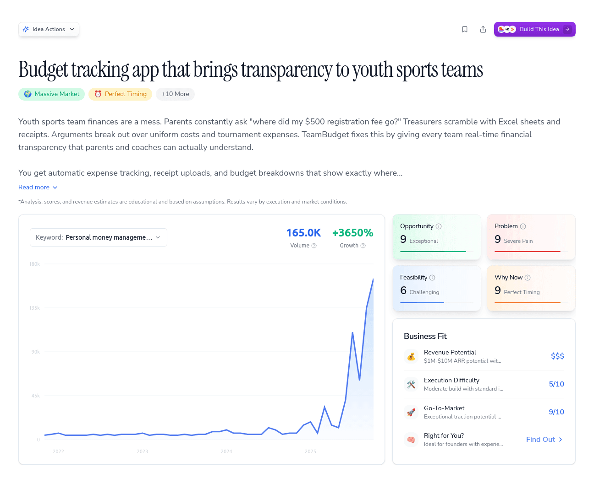

---

## Ideabrowser | #1 Software to Find Startup Ideas Worth Building

**URL:** [https://www.ideabrowser.com/idea/budget-dashboard-for-sports-teams-that-shows-parents-real-time-spending-394/acp](https://www.ideabrowser.com/idea/budget-dashboard-for-sports-teams-that-shows-parents-real-time-spending-394/acp)
**Depth:** 4

[

❄

❄

❄

24 Daysof Startup Ideas — Day 11/24

Claim free ideas & earn your Dec 25 gift!

Free Gift →

](/advent-calendar)

Find IdeasBuild Ideas[Pricing](/pricing)More

1

Family Three

1

[Budget tracking app that brings transparency to youth sports teams](/idea/budget-dashboard-for-sports-teams-that-shows-parents-real-time-spending-394)ACP Framework

# ACP Framework Analysis

Analyzing your idea through the Audience-Community-Product framework to ensure product-market fit and community engagement.

AUDIENCE ANALYSIS

# Target Definition

Demographics

Parents of youth athletes (ages 28-50), sports team managers (ages 30-55), generally middle to upper-middle class.

Psychographics

Desire for transparency, financial control, reduced stress in managing team finances.

Platforms

Primarily Facebook groups, Reddit, and mobile app platforms.

# Needs Analysis

Unmet Needs

Real-time visibility into team finances for parents and avoidance of budget shortfalls.

Content Gaps

Lack of platforms offering real-time financial transparency and detailed breakdowns accessible to parents.

Differentiation

Real-time spending visibility and proactive alerts distinguish this solution from manual spreadsheets and general budgeting apps.

# Content Strategy

Secret Sauce

Engage users with testimonials from happy parents and coaches, focusing on stress reduction and transparency benefits.

Key Topics

How to manage team budgets effectively, transitioning from spreadsheets, real-world case studies of success.

Content Formats

Short-form video tutorials, step-by-step onboarding guides, webinars.

COMMUNITY ANALYSIS

# Platform Strategy

Primary Platform

Facebook groups focusing on youth sports team management.

Platform Rationale

Active participation in these communities discussing similar pain points provides access to the target audience.

Secondary Platforms

Reddit threads like r/personalfinance, r/ynab, and youth sports-focused Instagram accounts.

# Trust Building

UGC Strategy

Encourage sharing of personal stories about budget management wins and user-generated video testimonials.

Moderation Approach

Ensure discussions remain respectful and constructive, facilitate solution-sharing and best practices via community leaders.

Transparency

Share user testimonials, progress metrics, and detailed feature development updates.

# Engagement Plan

Community Rituals

Monthly webinars, team spotlight features, interactive budget management challenges.

Content Calendar

Weekly Q&A sessions on budgeting tips, monthly success story features, seasonal budgeting reminders.

Interaction Methods

Active participant in top social media groups, host AMAs on Reddit, and leverage email newsletters for updates.

PRODUCT ANALYSIS

# Core Offering

Description

A budget dashboard for youth sports teams offering parents real-time access to financial status and upcoming expenses.

Key Features

Real-time updates, budget alerts, detailed expense breakdowns, receipt uploads, and mobile accessibility.

Value Proposition

Eliminates financial confusion and last-minute budget issues, providing peace of mind to parents and coaches.

# Development Roadmap

MVP

Core dashboard with real-time data sync, parent access, and basic alert functionality.

Future Iterations

Enhancement with predictive analytics, extended integrations with other sports management tools.

Community Integration

Develop partnerships for pilot feedback, integrate user suggestions through active community engagement.

# Engagement Mechanics

Network Effects

As more teams adopt the platform, the aggregated data enables benchmarking and insights.

Sticky Features

Real-time notifications, budget condition alerts, easy receipt uploads, mobile-first design.

Usage Frequency

Regular use during sports seasons, particularly around budget updates and event planning phases.

EXECUTION PLAN

90-Day Plan

Launch beta with selected sports clubs, gather feedback, refine onboarding processes, and initiate targeted marketing on social media.

Resource Needs

Tech resources for development, community managers, marketing budget, and customer support staff.

Success Metrics

User adoption rates, drop in parent complaints, reduction in time spent by treasurers on reporting.

# Understanding ACP Framework

The ACP Framework helps validate and refine business ideas by focusing on three key pillars: Audience, Community, and Product. This holistic approach ensures your idea has strong product-market fit and community engagement potential.

# Audience

Deep understanding of target users, their needs, and how to reach them effectively through content and positioning.

# Community

Building and nurturing a engaged user base through strategic platform choices and meaningful interactions.

# Product

The core offering and its development roadmap. Focus on features that solve real problems and create lasting value for users.

# Key Benefits

Validates product-market fit early

Ensures sustainable user acquisition

Creates network effects through community

Guides content and engagement strategy

[Greg Isenberg](https://www.youtube.com/@GregIsenberg)[Startup Empire](https://www.startupempire.co/)[Late Checkout](https://www.latecheckout.studio/)

Get ideas for profitable startups, trending keywords, and go-to-market tactics, powered by data.

### Browse Ideas

*   [Idea of the Day](/idea-of-the-day)
*   [Idea Database](/database)
*   [Trends](/trends)
*   [Market Insights](/market-insights)

### Tools

*   [Idea Generator](/idea-generator)
*   [Research Your Ideas](/idea-agent)
*   [Idea Builder](/idea-builder)
*   [Chat & Strategize](/ai-chat)
*   [Founder Fit](/founder-fit)

### Resources

*   [Platform Tour](/welcome-tour)
*   [Features](/features)
*   [Tools Library](/tools)
*   [Pricing](/pricing)
*   [FAQ](/frequently-asked-questions)

### Company

*   [About](/about)
*   [Success Stories](/success-stories)
*   [Announcements](/announcements)
*   [What's New](/updates)
*   [Contact & Support](/contact)

© 2025 Ideabrowser. All rights reserved.

[Terms and Conditions](/terms)[Privacy Policy](/privacy)[Data Protection](/data-protection)[Disclaimer](/disclaimer)

Ideabrowser shares research and education, not promises or advice. Revenue estimates, scores, and examples are illustrative only; your results will vary. Always do your own due diligence.

### Images

---

## Ideabrowser | #1 Software to Find Startup Ideas Worth Building

**URL:** [https://www.ideabrowser.com/idea/budget-dashboard-for-sports-teams-that-shows-parents-real-time-spending-394/build/ad-creatives](https://www.ideabrowser.com/idea/budget-dashboard-for-sports-teams-that-shows-parents-real-time-spending-394/build/ad-creatives)
**Depth:** 4

[

❄

❄

❄

24 Daysof Startup Ideas — Day 11/24

Claim free ideas & earn your Dec 25 gift!

Free Gift →

](/advent-calendar)

Find IdeasBuild Ideas[Pricing](/pricing)More

1

Family Three

1

[Back to Templates](/idea/budget-dashboard-for-sports-teams-that-shows-parents-real-time-spending-394/build)

## Idea Builder

Choose a template to get started building

Learn how templates work

Popular3

[

Ad Creatives

High-converting ad copy and creative concepts

Active

](/idea/budget-dashboard-for-sports-teams-that-shows-parents-real-time-spending-394/build/ad-creatives)[

Brand Package

Complete brand identity with logo, colors, and voice

](/idea/budget-dashboard-for-sports-teams-that-shows-parents-real-time-spending-394/build/brand-package)[

Landing Page

Copy + wireframe blocks

](/idea/budget-dashboard-for-sports-teams-that-shows-parents-real-time-spending-394/build/landing-page)

Marketing8

Product3

Business4

Research2

[

Custom Prompt

Create your own prompt

](/idea/budget-dashboard-for-sports-teams-that-shows-parents-real-time-spending-394/build/custom)

Ad Creatives

# Budget tracking app that brings transparency to youth sports teams

Ad Creatives

+

### Let's Build It!

Click any AI builder icon to copy your prompt and get started,  
or copy first and choose your tool.

Copy Prompt & See All Tools

+

### Your Ad Creatives Prompt

Create a comprehensive ad campaign package with multiple ad variations, targeting angles, and detailed creative briefs. This should provide everything needed to launch effective paid advertising across major platforms. ## AD CREATIVE PACKAGE ### 1. FACEBOOK/INSTAGRAM ADS \*\*Campaign Angle 1: Problem-Focused\*\* - \*\*Primary Text\*\*: \[Hook that highlights the main pain point\] - \*\*Headline\*\*: \[Benefit-driven headline\] - \*\*Description\*\*: \[Supporting detail about solution\] - \*\*CTA Button\*\*: \[Action text - "Learn More", "Get Started", etc.\] - \*\*Image Prompt\*\*: "\[Detailed description for AI image generation showing the problem or frustration\]" \*\*Campaign Angle 2: Benefit-Focused\*\* - \*\*Primary Text\*\*: \[Hook that emphasizes the transformation/outcome\] - \*\*Headline\*\*: \[Result-oriented headline\] - \*\*Description\*\*: \[Specific benefit or value\] - \*\*CTA Button\*\*: \[Action text\] - \*\*Image Prompt\*\*: "\[Detailed description showing success state or positive outcome\]" \*\*Campaign Angle 3: Social Proof\*\* - \*\*Primary Text\*\*: \[Customer testimonial or success story\] - \*\*Headline\*\*: \[Trust-building headline\] - \*\*Description\*\*: \[Credibility indicator\] - \*\*CTA Button\*\*: \[Action text\] - \*\*Image Prompt\*\*: "\[Description of customer success image or testimonial graphic\]" \*\*Campaign Angle 4: Urgency/Scarcity\*\* - \*\*Primary Text\*\*: \[Time-sensitive or limited availability hook\] - \*\*Headline\*\*: \[Action-driving headline\] - \*\*Description\*\*: \[Reason to act now\] - \*\*CTA Button\*\*: \[Urgent action text\] - \*\*Image Prompt\*\*: "\[Visual showing urgency, countdown, or limited spots\]" ### 2. GOOGLE ADS \*\*Search Campaign - High Intent Keywords\*\* - \*\*Headline 1\*\*: \[Primary benefit/solution - 30 chars max\] - \*\*Headline 2\*\*: \[Secondary benefit or credibility - 30 chars max\] - \*\*Headline 3\*\*: \[Call to action or offer - 30 chars max\] - \*\*Description 1\*\*: \[Value proposition and key benefits - 90 chars max\] - \*\*Description 2\*\*: \[Social proof or risk reversal - 90 chars max\] - \*\*Display URL Path\*\*: \[Clean, relevant path\] \*\*Search Campaign - Problem-Aware Keywords\*\* - \*\*Headline 1\*\*: \[Problem acknowledgment - 30 chars max\] - \*\*Headline 2\*\*: \[Solution positioning - 30 chars max\] - \*\*Headline 3\*\*: \[Differentiator - 30 chars max\] - \*\*Description 1\*\*: \[How you solve the problem - 90 chars max\] - \*\*Description 2\*\*: \[What makes you different - 90 chars max\] - \*\*Display URL Path\*\*: \[Relevant path\] \*\*Display Campaign\*\* - \*\*Short Headline\*\*: \[Punchy benefit - 25 chars max\] - \*\*Long Headline\*\*: \[Expanded value prop - 90 chars max\] - \*\*Description\*\*: \[Supporting details - 90 chars max\] - \*\*Image Sizes Needed\*\*: \[List required dimensions: 300x250, 728x90, 160x600, etc.\] - \*\*Image Prompt\*\*: "\[Detailed description for banner ad visuals across different sizes\]" ### 3. LINKEDIN ADS (if B2B) \*\*Single Image Ad - Decision Maker Focus\*\* - \*\*Headline\*\*: \[Professional benefit or outcome\] - \*\*Intro Text\*\*: \[Hook relevant to business challenges\] - \*\*Description\*\*: \[Value for their business/role\] - \*\*CTA Button\*\*: \[Professional action text\] - \*\*Image Prompt\*\*: "\[Professional, business-focused visual description\]" \*\*Carousel Ad - Feature Showcase\*\* - \*\*Headline\*\*: \[Overview of solution\] - \*\*Intro Text\*\*: \[Business problem setup\] - \*\*Card 1\*\*: \[Feature/benefit + image description\] - \*\*Card 2\*\*: \[Feature/benefit + image description\] - \*\*Card 3\*\*: \[Feature/benefit + image description\] - \*\*Card 4\*\*: \[CTA card + image description\] ### 4. RETARGETING CAMPAIGNS \*\*Abandoned Visitors\*\* - \*\*Message\*\*: \[Address why they might have left\] - \*\*Offer\*\*: \[Incentive to return\] - \*\*Image Prompt\*\*: "\[Visual reminder of value or special offer\]" \*\*Email Subscribers (Non-customers)\*\* - \*\*Message\*\*: \[Move them closer to purchase\] - \*\*Social Proof\*\*: \[Testimonials or results\] - \*\*Image Prompt\*\*: "\[Customer success or product in action\]" ### 5. VIDEO AD SCRIPTS (15-30 seconds) \*\*Hook (First 3 seconds)\*\*: "\[Attention-grabbing opening line or visual\]" \*\*Problem (Seconds 4-8)\*\*: "\[Quickly establish the pain point\]" \*\*Solution (Seconds 9-20)\*\*: "\[Show your solution in action\]" \*\*CTA (Seconds 21-30)\*\*: "\[Clear next step with urgency\]" \*\*Visual Notes\*\*: \[Detailed description of video scenes, graphics, text overlays\] ### 6. CREATIVE TESTING VARIATIONS \*\*Headlines to Test\*\*: 1. \[Benefit-focused version\] 2. \[Problem-focused version\] 3. \[Question-based version\] 4. \[Number/stat-based version\] \*\*Images to Test\*\*: 1. \*\*Product/Demo\*\*: "\[Description of product in use\]" 2. \*\*People/Emotion\*\*: "\[Description of customer emotions/reactions\]" 3. \*\*Problem/Solution\*\*: "\[Description of before/after visual\]" 4. \*\*Text/Graphic\*\*: "\[Description of text-heavy informational graphic\]" \*\*CTAs to Test\*\*: - \[Action-focused: "Get Started", "Try Free"\] - \[Benefit-focused: "Save Time", "Increase Sales"\] - \[Discovery-focused: "Learn More", "See How"\] ### 7. AUDIENCE TARGETING NOTES \*\*Demographics\*\*: \[Age, gender, income, education relevant to your market\] \*\*Interests\*\*: \[Relevant interests, behaviors, pages they follow\] \*\*Custom Audiences\*\*: \[Website visitors, email lists, lookalikes\] \*\*Exclude\*\*: \[Audiences to exclude - current customers, competitors\] ### 8. BUDGET & BIDDING RECOMMENDATIONS \*\*Daily Budget Range\*\*: \[Suggested starting budget\] \*\*Bid Strategy\*\*: \[CPC, CPM, or conversion-focused\] \*\*Success Metrics\*\*: \[CTR, CPC, conversion rate benchmarks\] --- Create variations that speak to different customer segments and stages of awareness. Include emotional triggers that resonate with the target audience's pain points and aspirations identified in the market research. ## BUSINESS CONTEXT ### Idea Overview \*\*Product/Service\*\*: Budget tracking app that brings transparency to youth sports teams \*\*Summary\*\*: Youth sports team finances are a mess. Parents constantly ask "where did my $500 registration fee go?" Treasurers scramble with Excel sheets and receipts. Arguments break out over uniform costs and tournament expenses. TeamBudget fixes this by giving every team real-time financial transparency that parents and coaches can actually understand. You get automatic expense tracking, receipt uploads, and budget breakdowns that show exactly where every dollar goes. Parents see live updates when fees are collected and spent. Team managers get clean dashboards instead of messy spreadsheets. Everything syncs with existing payment systems and sports management platforms. The wedge is youth sports teams drowning in financial chaos. At $24-50 per team per month, you're targeting the 200,000+ organized youth sports teams in the US. You grow through Facebook parent groups where budget drama unfolds daily, partnerships with TeamSnap and SportsEngine, and word-of-mouth from treasurers who finally stop getting angry texts about missing money. Start simple with expense tracking and parent notifications. Then expand into budget forecasting, fundraising tools, and white-label solutions for sports leagues. The 290-comment Reddit threads and 18,000-member Facebook groups prove parents are desperate for this. Youth sports spending hits $30+ billion annually, but nobody's built the financial infrastructure these teams actually need. You become the trusted layer between team organizers and frustrated parents, turning budget chaos into budget clarity. \*\*Why Now\*\*: The youth sports market is at a crucial juncture. With spending surging 46% over five years and families seeking transparency amidst complex cost structures, TeamBudget offers an immediate solution. As the market grows towards $64 billion by 2033, the demand for real-time financial visibility and control has never been greater, positioning this tool perfectly in the current ecosystem. Technologically, advancements in cloud-based infrastructures and standardized payment APIs have significantly lowered development barriers, enabling effective and scalable real-time dashboards at competitive costs. This technological maturity, combined with the tech-savvy demographic now managing youth sports finances, creates a potent environment for TeamBudget's adoption. Moreover, competitive dynamics favor rapid action. While major platforms like TeamSnap dominate general management tools, they lack specialized financial transparency features. By launching now, TeamBudget can leverage first-mover advantages and establish a foothold before larger platforms develop competing solutions. This critical timing is enhanced by robust community demand and an untapped market need, making immediate execution essential. ### Market Analysis \*\*Pain Score\*\*: icon: 🔥 label: Pain Score score: 9 byline: Youth sports teams face severe budgeting challenges, demanding urgent solutions. pain\_type: Acute analyzedAt: 2025-11-26T19:08:22.939Z pain\_trends: Increasing score\_reason: The need for a specialized budgeting tool is validated by high emotional frustration, systemic barriers, and significant community demand. pain\_frequency: score: 8 reason: Budgeting challenges are a constant issue during sports seasons. pain\_intensity: score: 9 reason: The emotional and operational stress is severe and disruptive for team managers and parents. key\_pain\_points: \[ Stress from Budget Mismanagement Confusion and Accusations Urgency in Real-time Financial Transparency Gap in Real-time Transparency Features \] market\_evidence: \[ 290-comment threads on Reddit demanding better budgeting tools. 18,000-member Facebook groups voicing frustration with current solutions. High engagement on YouTube for budgeting app tutorials and reviews. \] current\_solutions: score: 3 reason: Existing solutions lack real-time financial tracking and integration with sports team needs. willingness\_to\_pay: score: 8 reason: Teams and parents are motivated to invest in solutions that offer transparency and ease of use. \*\*Opportunity Score\*\*: icon: 💎 label: Opportunity Score score: 9 byline: Strong demand for transparency in a growing youth sports market. key\_risks: \[ Competitive response from major platforms User adoption challenges Integration complexity with payment systems Regulatory compliance concerns \] analyzedAt: 2025-11-26T19:08:15.891Z score\_reason: The opportunity leverages a clear market gap and benefits from robust technological and social enablers. key\_strengths: \[ High demand for financial transparency Untapped market segment Scalable technology solutions First-mover advantage \] market\_timing: score: 9 reason: Surging demand for financial transparency aligns with growth in youth sports spending. market\_potential: score: 9 reason: The youth sports market is projected to grow significantly, increasing the demand for budget solutions. opportunity\_type: Market Gap opportunity\_window: Just Right competitive\_advantage: score: 8 reason: Lack of direct competitors focusing on financial transparency provides a clear entry point. execution\_feasibility: score: 5 reason: Moderate complexity due to necessary integrations and user adoption strategies. \*\*Market Gaps\*\*: The sports team budget dashboard opportunity stems from escalating youth sports expenditures, inadequate transparency in financial management, and a shift to tech-savvy parents demanding modern solutions. Existing systems lack real-time, parent-facing features, creating a ripe market for disruptive innovation. \*\*Go-to-Market\*\*: icon: 🚀 label: Go-To-Market score: 9 byline: Exceptional traction potential with rising demand across social platforms and key communities. analyzedAt: 2025-11-26T19:07:55.825Z gtm\_tactics: \[ Leverage Facebook groups for targeted ads and engagement Create instructional YouTube videos on team budget management Host webinars with sports clubs on financial transparency Collaborate with sports management platforms for integration partnerships \] short\_reason: Clear signals from Reddit, Facebook, and YouTube highlight unmet demand for sports budgeting solutions. traction\_signal: Strong traction audience\_clusters: \[ Youth sports team managers Parents managing team finances Club treasurers seeking digital solutions \] channels\_with\_signal: \[ Reddit (21.5M+ followers in relevant subs) Facebook Groups (18,000+ members in finance discussions) YouTube (500K+ views on sports budget content) Google Search (high growth for 'team budget app') \] early\_positioning\_angles: \[ 'Real-time budgeting for real teams' 'Transparency your team deserves' 'Budget smarter, play harder' \] ### Business Model \*\*Value Ladder\*\*: offers: \[ goal: Generate leads and build trust. name: Team Budget Tracker Demo price: Free stage: Bait description: An interactive online demo showcasing how real-time updates work with sample data. value\_provided: Instant insight into budget tracking capabilities, creating transparency and trust. goal: Convert leads to customers and validate product. name: Sports Team Budget Starter Plan price: $24/month stage: Frontend description: Basic access to the budget dashboard for one team, including real-time updates and spending alerts. value\_provided: Reduces stress and time spent on budget management by providing clarity and transparency. goal: Expand core user base and revenue. name: Pro Budget Management Suite price: $49/month stage: Middle description: Enhanced dashboard with additional features including personalized alerts, multi-team support, and priority customer service. value\_provided: Improves efficiency and control over multiple team budgets, with support and custom alerts. goal: Increase customer retention with recurring revenue. name: Team Budget Plus Subscription price: $10/month add-on stage: Continuity Program description: Monthly add-on providing advanced analytics and deeper insights into financial trends. value\_provided: Unlocks valuable data insights, helping teams make informed decisions and optimize budgets. goal: Capture high-value clients through premium offerings. name: Enterprise Sports Management Solution price: $25,000–$50,000+/year stage: Backend description: Customized white-label solution for sports organizations, integrating with existing systems and offering bespoke features. value\_provided: Provides a comprehensive budget management system tailored to meet specific organizational needs, enhancing operational efficiency. \] analyzedAt: 2025-11-26T19:08:10.336Z \*\*Revenue Potential\*\*: icon: 💰 label: Revenue Potential score: $$$ byline: $1M-$10M ARR potential with strong demand for transparency in youth sports finances. examples: \[ Team subscription: $24–$50/mo Partnership bulk subscription: $500–$5,000/yr Premium analytics: $10–$20 add-on/mo \] analyzedAt: 2025-11-26T19:07:40.192Z funding\_type: Seed short\_reason: Recurring subscription model with features that specifically target an underserved market need. example\_comps: \[ TeamSnap SportsEngine Blue Sombrero QuickBooks Mint \] business\_models: \[ Monthly subscriptions Bulk organizational partnerships Freemium with paid premium features White-label solutions Affiliate revenue through integration partners \] \*\*Execution Plan\*\*: label: Business Classification steps: \[ Conduct market research and competitive analysis. Develop interactive demo tool. Create targeted ad campaigns. Initiate pilot program with select teams. Gather feedback and iterate on product features. \] actions: \[ 1. Develop and launch the MVP dashboard. 2. Initiate the marketing campaign focusing on Facebook and Google Ads. 3. Onboard early adopters and gather feedback for product improvement. \] b2x\_type: B2C lead\_magnet: type: Interactive Tool format: Online Demo Tool delivery: Website and email sign-up creation\_steps: Develop a simplified version of the dashboard showing how real-time updates work with dummy data. conversion\_rate: 20% conversion of demo users to trial users core\_pain\_solved: Provides instant financial clarity to parents and teams. value\_demonstration: Allows users to see how real-time budget updates reduce confusion and improve transparency. mvp\_strategy: Launch a web-based platform with core functionalities like real-time updates and spending alerts. initial\_offer: model: Subscription price: $24/month value\_prop: Saves time and reduces stress by providing transparency in team finances. fulfillment: Online platform with automated updates conversion\_rate: 15% of trial to paid conversion buyer\_personas: \[ Parents of youth athletes Sports team treasurers \] key\_pain\_points: \[ Lack of financial transparency Time-consuming budget reporting \] success\_metrics: cac: $150/customer churn\_rate: <5% per quarter pilot\_conversion: 30% from free trial to paid loan\_approval\_time: N/A resources\_needed: team: \[ Product Manager Marketing Specialist Customer Support Rep \] budget: $150,000 for initial development and marketing timeline: Begin execution within 7 days with a 6-month initial phase expansion\_strategy: goal: Expand into school clubs and other group activities. type: Vertical expansion focus: Customization for different sports and organizations. dev\_timeline: 12 months go\_to\_market: Pilot with selected clubs and collect feedback for refinement. pricing\_changes: Higher tier pricing for advanced features. traction\_milestone: Achieving 1,000 paid subscriptions by the end of 18 months. acquisition\_channels: \[ reason: High engagement among target audience discussing similar pain points. channel: Facebook Groups metrics: Engagement in group discussions frequency: Weekly posts content\_format: Short videos and testimonials implementation\_steps: Create engaging content that addresses common budgeting problems in youth sports. reason: Growing interest for budgeting apps in online searches. channel: Google Ads metrics: Click-through rate and trial sign-ups frequency: Ongoing campaign content\_format: Search ads focusing on keywords like 'team budget app' implementation\_steps: Conduct keyword research, set up targeted ads, and optimize based on performance. reason: Targeted audience discussion around personal finance solutions. channel: Reddit Communities metrics: Post engagement and leads frequency: Bi-weekly content\_format: Educational posts and AMAs implementation\_steps: Participate in relevant subreddits and host AMAs to engage directly with parents and treasurers. \] risks\_and\_mitigation: \[ Resistance to new technology → Provide strong onboarding and customer support. Data privacy concerns → Implement robust security measures and compliance with regulations. \] competitive\_landscape: The current market is fragmented with many generic budgeting apps but lacks specialized tools for sports teams offering real-time spending transparency to parents. \*\*Execution Difficulty\*\*: icon: 🛠️ label: Execution Difficulty score: 5 byline: Moderate build with standard integrations, 3-month MVP timeline analyzedAt: 2025-11-26T19:07:46.733Z mvp\_timeline: Use of mobile/web frameworks (e.g., React, Flutter) with payment processing APIs (e.g., Stripe) and basic scheduling tools. short\_reason: Moderate complexity due to integration of team management and payment systems. execution\_risks: \[ Potential delays in API integration User adoption challenges in diverse teams Limited initial budget for development \] timeline\_estimate: 3mo MVP technical\_challenges: \[ Integration with third-party payment systems Developing cross-platform compatibility Ensuring data synchronization across devices \] non\_technical\_challenges: \[ User onboarding and education Gaining trust from parents and team managers Managing diverse feature requests from users \] --- Use this business context to inform all recommendations, ensuring they're specifically tailored to this opportunity and target market.

InstructionsUpdate with AI

### Ready to Build? Choose Your AI Tool

Copy your prompt and paste it into any of these AI builders to bring your idea to life.

[

Lovable](https://lovable.dev)[

v0](https://v0.dev)[

Replit](https://replit.com)[

Cursor](https://cursor.sh)[

Bolt.new](https://bolt.new)[

Claude](https://claude.ai)[

ChatGPT](https://chat.openai.com)[

Gemini](https://gemini.google.com)[

Manus](https://manus.ai)

Get ideas for profitable startups, trending keywords, and go-to-market tactics, powered by data.

### Browse Ideas

*   [Idea of the Day](/idea-of-the-day)
*   [Idea Database](/database)
*   [Trends](/trends)
*   [Market Insights](/market-insights)

### Tools

*   [Idea Generator](/idea-generator)
*   [Research Your Ideas](/idea-agent)
*   [Idea Builder](/idea-builder)
*   [Chat & Strategize](/ai-chat)
*   [Founder Fit](/founder-fit)

### Resources

*   [Platform Tour](/welcome-tour)
*   [Features](/features)
*   [Tools Library](/tools)
*   [Pricing](/pricing)
*   [FAQ](/frequently-asked-questions)

### Company

*   [About](/about)
*   [Success Stories](/success-stories)
*   [Announcements](/announcements)
*   [What's New](/updates)
*   [Contact & Support](/contact)

© 2025 Ideabrowser. All rights reserved.

[Terms and Conditions](/terms)[Privacy Policy](/privacy)[Data Protection](/data-protection)[Disclaimer](/disclaimer)

Ideabrowser shares research and education, not promises or advice. Revenue estimates, scores, and examples are illustrative only; your results will vary. Always do your own due diligence.

### Images

---

## Ideabrowser | #1 Software to Find Startup Ideas Worth Building

**URL:** [https://www.ideabrowser.com/idea/budget-dashboard-for-sports-teams-that-shows-parents-real-time-spending-394/build/brand-package](https://www.ideabrowser.com/idea/budget-dashboard-for-sports-teams-that-shows-parents-real-time-spending-394/build/brand-package)
**Depth:** 4

[

❄

❄

❄

24 Daysof Startup Ideas — Day 11/24

Claim free ideas & earn your Dec 25 gift!

Free Gift →

](/advent-calendar)

Find IdeasBuild Ideas[Pricing](/pricing)More

1

Family Three

1

[Back to Templates](/idea/budget-dashboard-for-sports-teams-that-shows-parents-real-time-spending-394/build)

## Idea Builder

Choose a template to get started building

Learn how templates work

Popular3

[

Ad Creatives

High-converting ad copy and creative concepts

](/idea/budget-dashboard-for-sports-teams-that-shows-parents-real-time-spending-394/build/ad-creatives)[

Brand Package

Complete brand identity with logo, colors, and voice

Active

](/idea/budget-dashboard-for-sports-teams-that-shows-parents-real-time-spending-394/build/brand-package)[

Landing Page

Copy + wireframe blocks

](/idea/budget-dashboard-for-sports-teams-that-shows-parents-real-time-spending-394/build/landing-page)

Marketing8

Product3

Business4

Research2

[

Custom Prompt

Create your own prompt

](/idea/budget-dashboard-for-sports-teams-that-shows-parents-real-time-spending-394/build/custom)

Brand Package

# Budget tracking app that brings transparency to youth sports teams

Brand Package

+

### Let's Build It!

Click any AI builder icon to copy your prompt and get started,  
or copy first and choose your tool.

Copy Prompt & See All Tools

+

### Your Brand Package Prompt

Create a comprehensive brand identity package for this business idea. This should be a complete brand foundation that could be handed to any designer or AI image generator to create consistent, professional brand materials. ## BRAND IDENTITY PACKAGE ### 1. LOGO CONCEPTS (3-5 variations) For each logo concept, provide: - \*\*Concept name & rationale\*\*: Why this approach fits the brand - \*\*Visual description\*\*: Detailed description for AI image generation - \*\*Style\*\*: (Wordmark, icon + text, symbol only, etc.) - \*\*Mood\*\*: (Modern, playful, professional, bold, minimalist, etc.) ### 2. COLOR PALETTE Primary Colors (2-3 colors): - \*\*Color name\*\*: - \*\*Hex code\*\*: - \*\*RGB values\*\*: - \*\*Usage\*\*: When and where to use this color - \*\*Psychology\*\*: Why this color fits the brand personality Secondary/Accent Colors (2-4 colors): - Same format as above ### 3. TYPOGRAPHY SYSTEM \*\*Primary Font (Headers)\*\*: - Font name and backup options - Character: (Bold, elegant, modern, playful, etc.) - Usage: Headlines, titles, logo text \*\*Secondary Font (Body)\*\*: - Font name and backup options - Character: (Readable, clean, friendly, etc.) - Usage: Body text, descriptions, UI elements ### 4. BRAND VOICE & PERSONALITY \*\*Brand Personality\*\* (3-5 adjectives): - Adjective 1: \[explanation of how this shows up\] - Adjective 2: \[explanation of how this shows up\] - Adjective 3: \[explanation of how this shows up\] \*\*Tone of Voice\*\*: - \*\*Formal vs Casual\*\*: \[where on the spectrum and why\] - \*\*Technical vs Simple\*\*: \[where on the spectrum and why\] - \*\*Playful vs Serious\*\*: \[where on the spectrum and why\] ### 5. TAGLINE VARIATIONS (5 options) Create 5 different taglines that capture the value proposition: 1. \*\*\[Tagline\]\*\* - \[explanation of angle/approach\] 2. \*\*\[Tagline\]\*\* - \[explanation of angle/approach\] 3. \*\*\[Tagline\]\*\* - \[explanation of angle/approach\] 4. \*\*\[Tagline\]\*\* - \[explanation of angle/approach\] 5. \*\*\[Tagline\]\*\* - \[explanation of angle/approach\] ### 6. VISUAL STYLE GUIDELINES \*\*Photography Style\*\*: - Subject matter: \[what types of images\] - Mood: \[bright, moody, clean, energetic, etc.\] - Color treatment: \[natural, saturated, muted, etc.\] \*\*Graphic Elements\*\*: - Shape language: \[rounded, sharp, organic, geometric\] - Pattern usage: \[how and when to use patterns\] - Icon style: \[outline, filled, detailed, simple\] ### 7. AI IMAGE GENERATION PROMPTS \*\*Logo Generation Prompt\*\*: "\[Detailed prompt for generating the primary logo concept\]" \*\*Brand Image Prompt\*\*: "\[Detailed prompt for generating on-brand marketing images\]" \*\*Icon Set Prompt\*\*: "\[Detailed prompt for generating consistent icons\]" --- Base all recommendations on the provided business context, target audience, and market positioning. Ensure the brand identity differentiates from competitors while appealing to the specific customer segments identified in the research. ## BUSINESS CONTEXT ### Idea Overview \*\*Product/Service\*\*: Budget tracking app that brings transparency to youth sports teams \*\*Summary\*\*: Youth sports team finances are a mess. Parents constantly ask "where did my $500 registration fee go?" Treasurers scramble with Excel sheets and receipts. Arguments break out over uniform costs and tournament expenses. TeamBudget fixes this by giving every team real-time financial transparency that parents and coaches can actually understand. You get automatic expense tracking, receipt uploads, and budget breakdowns that show exactly where every dollar goes. Parents see live updates when fees are collected and spent. Team managers get clean dashboards instead of messy spreadsheets. Everything syncs with existing payment systems and sports management platforms. The wedge is youth sports teams drowning in financial chaos. At $24-50 per team per month, you're targeting the 200,000+ organized youth sports teams in the US. You grow through Facebook parent groups where budget drama unfolds daily, partnerships with TeamSnap and SportsEngine, and word-of-mouth from treasurers who finally stop getting angry texts about missing money. Start simple with expense tracking and parent notifications. Then expand into budget forecasting, fundraising tools, and white-label solutions for sports leagues. The 290-comment Reddit threads and 18,000-member Facebook groups prove parents are desperate for this. Youth sports spending hits $30+ billion annually, but nobody's built the financial infrastructure these teams actually need. You become the trusted layer between team organizers and frustrated parents, turning budget chaos into budget clarity. \*\*Why Now\*\*: The youth sports market is at a crucial juncture. With spending surging 46% over five years and families seeking transparency amidst complex cost structures, TeamBudget offers an immediate solution. As the market grows towards $64 billion by 2033, the demand for real-time financial visibility and control has never been greater, positioning this tool perfectly in the current ecosystem. Technologically, advancements in cloud-based infrastructures and standardized payment APIs have significantly lowered development barriers, enabling effective and scalable real-time dashboards at competitive costs. This technological maturity, combined with the tech-savvy demographic now managing youth sports finances, creates a potent environment for TeamBudget's adoption. Moreover, competitive dynamics favor rapid action. While major platforms like TeamSnap dominate general management tools, they lack specialized financial transparency features. By launching now, TeamBudget can leverage first-mover advantages and establish a foothold before larger platforms develop competing solutions. This critical timing is enhanced by robust community demand and an untapped market need, making immediate execution essential. ### Market Analysis \*\*Pain Score\*\*: icon: 🔥 label: Pain Score score: 9 byline: Youth sports teams face severe budgeting challenges, demanding urgent solutions. pain\_type: Acute analyzedAt: 2025-11-26T19:08:22.939Z pain\_trends: Increasing score\_reason: The need for a specialized budgeting tool is validated by high emotional frustration, systemic barriers, and significant community demand. pain\_frequency: score: 8 reason: Budgeting challenges are a constant issue during sports seasons. pain\_intensity: score: 9 reason: The emotional and operational stress is severe and disruptive for team managers and parents. key\_pain\_points: \[ Stress from Budget Mismanagement Confusion and Accusations Urgency in Real-time Financial Transparency Gap in Real-time Transparency Features \] market\_evidence: \[ 290-comment threads on Reddit demanding better budgeting tools. 18,000-member Facebook groups voicing frustration with current solutions. High engagement on YouTube for budgeting app tutorials and reviews. \] current\_solutions: score: 3 reason: Existing solutions lack real-time financial tracking and integration with sports team needs. willingness\_to\_pay: score: 8 reason: Teams and parents are motivated to invest in solutions that offer transparency and ease of use. \*\*Opportunity Score\*\*: icon: 💎 label: Opportunity Score score: 9 byline: Strong demand for transparency in a growing youth sports market. key\_risks: \[ Competitive response from major platforms User adoption challenges Integration complexity with payment systems Regulatory compliance concerns \] analyzedAt: 2025-11-26T19:08:15.891Z score\_reason: The opportunity leverages a clear market gap and benefits from robust technological and social enablers. key\_strengths: \[ High demand for financial transparency Untapped market segment Scalable technology solutions First-mover advantage \] market\_timing: score: 9 reason: Surging demand for financial transparency aligns with growth in youth sports spending. market\_potential: score: 9 reason: The youth sports market is projected to grow significantly, increasing the demand for budget solutions. opportunity\_type: Market Gap opportunity\_window: Just Right competitive\_advantage: score: 8 reason: Lack of direct competitors focusing on financial transparency provides a clear entry point. execution\_feasibility: score: 5 reason: Moderate complexity due to necessary integrations and user adoption strategies. \*\*Market Gaps\*\*: The sports team budget dashboard opportunity stems from escalating youth sports expenditures, inadequate transparency in financial management, and a shift to tech-savvy parents demanding modern solutions. Existing systems lack real-time, parent-facing features, creating a ripe market for disruptive innovation. \*\*Go-to-Market\*\*: icon: 🚀 label: Go-To-Market score: 9 byline: Exceptional traction potential with rising demand across social platforms and key communities. analyzedAt: 2025-11-26T19:07:55.825Z gtm\_tactics: \[ Leverage Facebook groups for targeted ads and engagement Create instructional YouTube videos on team budget management Host webinars with sports clubs on financial transparency Collaborate with sports management platforms for integration partnerships \] short\_reason: Clear signals from Reddit, Facebook, and YouTube highlight unmet demand for sports budgeting solutions. traction\_signal: Strong traction audience\_clusters: \[ Youth sports team managers Parents managing team finances Club treasurers seeking digital solutions \] channels\_with\_signal: \[ Reddit (21.5M+ followers in relevant subs) Facebook Groups (18,000+ members in finance discussions) YouTube (500K+ views on sports budget content) Google Search (high growth for 'team budget app') \] early\_positioning\_angles: \[ 'Real-time budgeting for real teams' 'Transparency your team deserves' 'Budget smarter, play harder' \] ### Business Model \*\*Value Ladder\*\*: offers: \[ goal: Generate leads and build trust. name: Team Budget Tracker Demo price: Free stage: Bait description: An interactive online demo showcasing how real-time updates work with sample data. value\_provided: Instant insight into budget tracking capabilities, creating transparency and trust. goal: Convert leads to customers and validate product. name: Sports Team Budget Starter Plan price: $24/month stage: Frontend description: Basic access to the budget dashboard for one team, including real-time updates and spending alerts. value\_provided: Reduces stress and time spent on budget management by providing clarity and transparency. goal: Expand core user base and revenue. name: Pro Budget Management Suite price: $49/month stage: Middle description: Enhanced dashboard with additional features including personalized alerts, multi-team support, and priority customer service. value\_provided: Improves efficiency and control over multiple team budgets, with support and custom alerts. goal: Increase customer retention with recurring revenue. name: Team Budget Plus Subscription price: $10/month add-on stage: Continuity Program description: Monthly add-on providing advanced analytics and deeper insights into financial trends. value\_provided: Unlocks valuable data insights, helping teams make informed decisions and optimize budgets. goal: Capture high-value clients through premium offerings. name: Enterprise Sports Management Solution price: $25,000–$50,000+/year stage: Backend description: Customized white-label solution for sports organizations, integrating with existing systems and offering bespoke features. value\_provided: Provides a comprehensive budget management system tailored to meet specific organizational needs, enhancing operational efficiency. \] analyzedAt: 2025-11-26T19:08:10.336Z \*\*Revenue Potential\*\*: icon: 💰 label: Revenue Potential score: $$$ byline: $1M-$10M ARR potential with strong demand for transparency in youth sports finances. examples: \[ Team subscription: $24–$50/mo Partnership bulk subscription: $500–$5,000/yr Premium analytics: $10–$20 add-on/mo \] analyzedAt: 2025-11-26T19:07:40.192Z funding\_type: Seed short\_reason: Recurring subscription model with features that specifically target an underserved market need. example\_comps: \[ TeamSnap SportsEngine Blue Sombrero QuickBooks Mint \] business\_models: \[ Monthly subscriptions Bulk organizational partnerships Freemium with paid premium features White-label solutions Affiliate revenue through integration partners \] \*\*Execution Plan\*\*: label: Business Classification steps: \[ Conduct market research and competitive analysis. Develop interactive demo tool. Create targeted ad campaigns. Initiate pilot program with select teams. Gather feedback and iterate on product features. \] actions: \[ 1. Develop and launch the MVP dashboard. 2. Initiate the marketing campaign focusing on Facebook and Google Ads. 3. Onboard early adopters and gather feedback for product improvement. \] b2x\_type: B2C lead\_magnet: type: Interactive Tool format: Online Demo Tool delivery: Website and email sign-up creation\_steps: Develop a simplified version of the dashboard showing how real-time updates work with dummy data. conversion\_rate: 20% conversion of demo users to trial users core\_pain\_solved: Provides instant financial clarity to parents and teams. value\_demonstration: Allows users to see how real-time budget updates reduce confusion and improve transparency. mvp\_strategy: Launch a web-based platform with core functionalities like real-time updates and spending alerts. initial\_offer: model: Subscription price: $24/month value\_prop: Saves time and reduces stress by providing transparency in team finances. fulfillment: Online platform with automated updates conversion\_rate: 15% of trial to paid conversion buyer\_personas: \[ Parents of youth athletes Sports team treasurers \] key\_pain\_points: \[ Lack of financial transparency Time-consuming budget reporting \] success\_metrics: cac: $150/customer churn\_rate: <5% per quarter pilot\_conversion: 30% from free trial to paid loan\_approval\_time: N/A resources\_needed: team: \[ Product Manager Marketing Specialist Customer Support Rep \] budget: $150,000 for initial development and marketing timeline: Begin execution within 7 days with a 6-month initial phase expansion\_strategy: goal: Expand into school clubs and other group activities. type: Vertical expansion focus: Customization for different sports and organizations. dev\_timeline: 12 months go\_to\_market: Pilot with selected clubs and collect feedback for refinement. pricing\_changes: Higher tier pricing for advanced features. traction\_milestone: Achieving 1,000 paid subscriptions by the end of 18 months. acquisition\_channels: \[ reason: High engagement among target audience discussing similar pain points. channel: Facebook Groups metrics: Engagement in group discussions frequency: Weekly posts content\_format: Short videos and testimonials implementation\_steps: Create engaging content that addresses common budgeting problems in youth sports. reason: Growing interest for budgeting apps in online searches. channel: Google Ads metrics: Click-through rate and trial sign-ups frequency: Ongoing campaign content\_format: Search ads focusing on keywords like 'team budget app' implementation\_steps: Conduct keyword research, set up targeted ads, and optimize based on performance. reason: Targeted audience discussion around personal finance solutions. channel: Reddit Communities metrics: Post engagement and leads frequency: Bi-weekly content\_format: Educational posts and AMAs implementation\_steps: Participate in relevant subreddits and host AMAs to engage directly with parents and treasurers. \] risks\_and\_mitigation: \[ Resistance to new technology → Provide strong onboarding and customer support. Data privacy concerns → Implement robust security measures and compliance with regulations. \] competitive\_landscape: The current market is fragmented with many generic budgeting apps but lacks specialized tools for sports teams offering real-time spending transparency to parents. \*\*Execution Difficulty\*\*: icon: 🛠️ label: Execution Difficulty score: 5 byline: Moderate build with standard integrations, 3-month MVP timeline analyzedAt: 2025-11-26T19:07:46.733Z mvp\_timeline: Use of mobile/web frameworks (e.g., React, Flutter) with payment processing APIs (e.g., Stripe) and basic scheduling tools. short\_reason: Moderate complexity due to integration of team management and payment systems. execution\_risks: \[ Potential delays in API integration User adoption challenges in diverse teams Limited initial budget for development \] timeline\_estimate: 3mo MVP technical\_challenges: \[ Integration with third-party payment systems Developing cross-platform compatibility Ensuring data synchronization across devices \] non\_technical\_challenges: \[ User onboarding and education Gaining trust from parents and team managers Managing diverse feature requests from users \] --- Use this business context to inform all recommendations, ensuring they're specifically tailored to this opportunity and target market.

InstructionsUpdate with AI

### Ready to Build? Choose Your AI Tool

Copy your prompt and paste it into any of these AI builders to bring your idea to life.

[

Lovable](https://lovable.dev)[

v0](https://v0.dev)[

Replit](https://replit.com)[

Cursor](https://cursor.sh)[

Bolt.new](https://bolt.new)[

Claude](https://claude.ai)[

ChatGPT](https://chat.openai.com)[

Gemini](https://gemini.google.com)[

Manus](https://manus.ai)

Get ideas for profitable startups, trending keywords, and go-to-market tactics, powered by data.

### Browse Ideas

*   [Idea of the Day](/idea-of-the-day)
*   [Idea Database](/database)
*   [Trends](/trends)
*   [Market Insights](/market-insights)

### Tools

*   [Idea Generator](/idea-generator)
*   [Research Your Ideas](/idea-agent)
*   [Idea Builder](/idea-builder)
*   [Chat & Strategize](/ai-chat)
*   [Founder Fit](/founder-fit)

### Resources

*   [Platform Tour](/welcome-tour)
*   [Features](/features)
*   [Tools Library](/tools)
*   [Pricing](/pricing)
*   [FAQ](/frequently-asked-questions)

### Company

*   [About](/about)
*   [Success Stories](/success-stories)
*   [Announcements](/announcements)
*   [What's New](/updates)
*   [Contact & Support](/contact)

© 2025 Ideabrowser. All rights reserved.

[Terms and Conditions](/terms)[Privacy Policy](/privacy)[Data Protection](/data-protection)[Disclaimer](/disclaimer)

Ideabrowser shares research and education, not promises or advice. Revenue estimates, scores, and examples are illustrative only; your results will vary. Always do your own due diligence.

### Images

---

## Ideabrowser | #1 Software to Find Startup Ideas Worth Building

**URL:** [https://www.ideabrowser.com/idea/budget-dashboard-for-sports-teams-that-shows-parents-real-time-spending-394/build/custom](https://www.ideabrowser.com/idea/budget-dashboard-for-sports-teams-that-shows-parents-real-time-spending-394/build/custom)
**Depth:** 4

[

❄

❄

❄

24 Daysof Startup Ideas — Day 11/24

Claim free ideas & earn your Dec 25 gift!

Free Gift →

](/advent-calendar)

Find IdeasBuild Ideas[Pricing](/pricing)More

1

Family Three

1

[Back to Templates](/idea/budget-dashboard-for-sports-teams-that-shows-parents-real-time-spending-394/build)

## Idea Builder

Choose a template to get started building

Learn how templates work

Popular3

[

Ad Creatives

High-converting ad copy and creative concepts

](/idea/budget-dashboard-for-sports-teams-that-shows-parents-real-time-spending-394/build/ad-creatives)[

Brand Package

Complete brand identity with logo, colors, and voice

](/idea/budget-dashboard-for-sports-teams-that-shows-parents-real-time-spending-394/build/brand-package)[

Landing Page

Copy + wireframe blocks

](/idea/budget-dashboard-for-sports-teams-that-shows-parents-real-time-spending-394/build/landing-page)

Marketing8

Product3

Business4

Research2

[

Custom Prompt

Create your own prompt

](/idea/budget-dashboard-for-sports-teams-that-shows-parents-real-time-spending-394/build/custom)

# Budget tracking app that brings transparency to youth sports teams

Custom Prompt

Describe exactly what you want to build for a personalized prompt tailored to your specific needs.

Powered by Idea Agent

Includes full business context

Generate Prompt

Get ideas for profitable startups, trending keywords, and go-to-market tactics, powered by data.

### Browse Ideas

*   [Idea of the Day](/idea-of-the-day)
*   [Idea Database](/database)
*   [Trends](/trends)
*   [Market Insights](/market-insights)

### Tools

*   [Idea Generator](/idea-generator)
*   [Research Your Ideas](/idea-agent)
*   [Idea Builder](/idea-builder)
*   [Chat & Strategize](/ai-chat)
*   [Founder Fit](/founder-fit)

### Resources

*   [Platform Tour](/welcome-tour)
*   [Features](/features)
*   [Tools Library](/tools)
*   [Pricing](/pricing)
*   [FAQ](/frequently-asked-questions)

### Company

*   [About](/about)
*   [Success Stories](/success-stories)
*   [Announcements](/announcements)
*   [What's New](/updates)
*   [Contact & Support](/contact)

© 2025 Ideabrowser. All rights reserved.

[Terms and Conditions](/terms)[Privacy Policy](/privacy)[Data Protection](/data-protection)[Disclaimer](/disclaimer)

Ideabrowser shares research and education, not promises or advice. Revenue estimates, scores, and examples are illustrative only; your results will vary. Always do your own due diligence.

### Images

---

## Ideabrowser | #1 Software to Find Startup Ideas Worth Building

**URL:** [https://www.ideabrowser.com/idea/budget-dashboard-for-sports-teams-that-shows-parents-real-time-spending-394/claim-idea](https://www.ideabrowser.com/idea/budget-dashboard-for-sports-teams-that-shows-parents-real-time-spending-394/claim-idea)
**Depth:** 4

[

❄

❄

❄

24 Daysof Startup Ideas — Day 11/24

Claim free ideas & earn your Dec 25 gift!

Free Gift →

](/advent-calendar)

Find IdeasBuild Ideas[Pricing](/pricing)More

1

Family Three

1

Claim This Idea

## "Budget tracking app that brings transparency to youth sports teams"

$2,999$4,999Launch Price

Purchase this idea to REMOVE it from our public database and claim it exclusively as yours. Get complete access to all research, data, and unlimited AI conversations.

Claim Idea

## What you'll get

### Exclusive Access

The idea is hidden from the public database, giving you exclusive rights

### Complete Data Access

Get access to all raw data and detailed analysis

### Export & Integration

Export data to your favorite LLMs or analysis tools

### Unlimited AI Chats

Chat with Idea Agent about this idea as much as you want

Purchase Now

Get ideas for profitable startups, trending keywords, and go-to-market tactics, powered by data.

### Browse Ideas

*   [Idea of the Day](/idea-of-the-day)
*   [Idea Database](/database)
*   [Trends](/trends)
*   [Market Insights](/market-insights)

### Tools

*   [Idea Generator](/idea-generator)
*   [Research Your Ideas](/idea-agent)
*   [Idea Builder](/idea-builder)
*   [Chat & Strategize](/ai-chat)
*   [Founder Fit](/founder-fit)

### Resources

*   [Platform Tour](/welcome-tour)
*   [Features](/features)
*   [Tools Library](/tools)
*   [Pricing](/pricing)
*   [FAQ](/frequently-asked-questions)

### Company

*   [About](/about)
*   [Success Stories](/success-stories)
*   [Announcements](/announcements)
*   [What's New](/updates)
*   [Contact & Support](/contact)

© 2025 Ideabrowser. All rights reserved.

[Terms and Conditions](/terms)[Privacy Policy](/privacy)[Data Protection](/data-protection)[Disclaimer](/disclaimer)

Ideabrowser shares research and education, not promises or advice. Revenue estimates, scores, and examples are illustrative only; your results will vary. Always do your own due diligence.

Ideabrowser | #1 Software to Find Startup Ideas Worth Building

### Images

---

## Ideabrowser | #1 Software to Find Startup Ideas Worth Building

**URL:** [https://www.ideabrowser.com/idea/budget-dashboard-for-sports-teams-that-shows-parents-real-time-spending-394/community-signals](https://www.ideabrowser.com/idea/budget-dashboard-for-sports-teams-that-shows-parents-real-time-spending-394/community-signals)
**Depth:** 4

[

❄

❄

❄

24 Daysof Startup Ideas — Day 11/24

Claim free ideas & earn your Dec 25 gift!

Free Gift →

](/advent-calendar)

Find IdeasBuild Ideas[Pricing](/pricing)More

1

Family Three

1

[Budget tracking app that brings transparency to youth sports teams](/idea/budget-dashboard-for-sports-teams-that-shows-parents-real-time-spending-394)

Community Signals

# Community Signals

Analysis of community engagement and interest across different platforms

Summary of Community Analysis

The widespread discussions across Reddit, Facebook, YouTube, and professional networks reveal a pronounced interest in specialized budgeting tools, particularly for niche markets like sports teams. Users on various platforms express consistent frustrations with existing solutions, emphasizing the need for tailored, real-time financial tracking and seamless integration with current practices. This underscores a significant industry trend where digital literacy among sports managers and parents is on the rise, priming the market for innovative solutions. By tapping into these community signals, businesses can capitalize on this unmet demand, driving the development of specific tools to address these pervasive challenges.

Reddit communities like \*\*r/personalfinance\*\* and \*\*r/YNAB\*\* highlight a growing clamor for advanced budgeting applications, with users engaging in extensive dialogues, such as the 290-comment threads, underlining unmet needs. \*\*r/budget\*\* and \*\*r/PFtools\*\* echo these sentiments, with discussions focusing on the necessity of real-time tracking and effective integrations. The collective insights from these communities pave the way for developing a sports team budget tracker, highlighting an opportunity to offer tools that are both agile and adaptive. With the right engagement and feature set, these solutions can directly address the specific pain points identified by these passionate users.

Show More

[

### Reddit

Total Communities Found

23

Relevant Communities

5

Total Members

2.5M+

View Analysis

](/idea/budget-dashboard-for-sports-teams-that-shows-parents-real-time-spending-394/community-signals/reddit-analysis)[

### Facebook

Groups Found

10

Relevant Groups

5

Total Members

150K+

View Analysis

](/idea/budget-dashboard-for-sports-teams-that-shows-parents-real-time-spending-394/community-signals/facebook-analysis)[

### YouTube

Channels Analyzed

13

Content Themes

14

Total Formats

16

View Analysis

](/idea/budget-dashboard-for-sports-teams-that-shows-parents-real-time-spending-394/community-signals/youtube-analysis)[

### Other Communities

Community Segments

3

Community Types

5

Priority Communities

3

View Analysis

](/idea/budget-dashboard-for-sports-teams-that-shows-parents-real-time-spending-394/community-signals/other-communities)

Get ideas for profitable startups, trending keywords, and go-to-market tactics, powered by data.

### Browse Ideas

*   [Idea of the Day](/idea-of-the-day)
*   [Idea Database](/database)
*   [Trends](/trends)
*   [Market Insights](/market-insights)

### Tools

*   [Idea Generator](/idea-generator)
*   [Research Your Ideas](/idea-agent)
*   [Idea Builder](/idea-builder)
*   [Chat & Strategize](/ai-chat)
*   [Founder Fit](/founder-fit)

### Resources

*   [Platform Tour](/welcome-tour)
*   [Features](/features)
*   [Tools Library](/tools)
*   [Pricing](/pricing)
*   [FAQ](/frequently-asked-questions)

### Company

*   [About](/about)
*   [Success Stories](/success-stories)
*   [Announcements](/announcements)
*   [What's New](/updates)
*   [Contact & Support](/contact)

© 2025 Ideabrowser. All rights reserved.

[Terms and Conditions](/terms)[Privacy Policy](/privacy)[Data Protection](/data-protection)[Disclaimer](/disclaimer)

Ideabrowser shares research and education, not promises or advice. Revenue estimates, scores, and examples are illustrative only; your results will vary. Always do your own due diligence.

### Images

---

## Ideabrowser | #1 Software to Find Startup Ideas Worth Building

**URL:** [https://www.ideabrowser.com/idea/budget-dashboard-for-sports-teams-that-shows-parents-real-time-spending-394/community-signals/facebook-analysis](https://www.ideabrowser.com/idea/budget-dashboard-for-sports-teams-that-shows-parents-real-time-spending-394/community-signals/facebook-analysis)
**Depth:** 4

[

❄

❄

❄

24 Daysof Startup Ideas — Day 11/24

Claim free ideas & earn your Dec 25 gift!

Free Gift →

](/advent-calendar)

Find IdeasBuild Ideas[Pricing](/pricing)More

1

Family Three

1

[Budget tracking app that brings transparency to youth sports teams](/idea/budget-dashboard-for-sports-teams-that-shows-parents-real-time-spending-394)

[Community Signals](/idea/budget-dashboard-for-sports-teams-that-shows-parents-real-time-spending-394/community-signals)

Facebook Analysis

# Facebook Groups

10 groups analyzed

# Key Findings

With Facebook groups buzzing over budgeting apps, there's a notable opportunity in leveraging this interest for a specialized Sports Team Budget Tracker. The "Youth Sports Team Management" group, boasting over 10,000 members, reveals a tech-savvy audience keen on financial management solutions. Similarly, the "School and Club Finances" group with 8,000 members highlights the ongoing demand for efficient tools among club treasurers. Discussions often reveal frustrations with existing software's lack of transparency and a thirst for tailored solutions. Groups like "Simple Savers" and "For Band Parents" further underscore the need for a budget app focusing on both ease of use and detailed financial oversight. Engaging with these communities by sharing success stories and offering exclusive trials could prove invaluable. The collective interest signals a ripe market for launching a niche budget tracker designed for organized sports and youth activities, addressing specific needs unmet by current offerings.

# Analysis Overview

Total Groups Found

10

Relevant Groups

5

Total Members

150K+

# Relevant Groups

5 groups found

[

### Youth Sports Team Management

10,000+ members

Public

#### Description

Discussion on budget tracking apps like Mint, YNAB, and Personal Capital for team management.

#### Why It's Relevant

This group discusses budgeting apps suitable for team and personal finance management, resonating with the business idea of a Sports Team Budget Tracker. Members are likely seeking solutions to streamline financial management, similar to the proposed product.

#### Relevance Signals

*   Focus on budgeting apps, indicating a tech-aware membership.
*   Discussion on financial transparency and management.
*   Overlaps with needs of youth sports team treasurers.

Visit Group

](https://www.facebook.com/groups/618170464993648/posts/3494720114005321/)[

### School and Club Finances

8,000+ members

Private

#### Description

Discusses financial management software for personal and group use.

#### Why It's Relevant

This group's focus overlaps with the need for efficient financial management among school clubs and sports teams, directly aligning with the business idea's target audience.

#### Relevance Signals

*   Focus on software for managing group and personal finances.
*   Interest in tools enhancing transparency and efficiency.
*   Potential members include treasurers of clubs and school teams.

Visit Group

](https://www.facebook.com/groups/simplesavers/posts/2751811014968484/)[

### Simple Savers

10+ comments

Public

#### Description

YNAB (You Need a Budget) and other budgeting apps discussed; member recommendations and reviews.

#### Why It's Relevant

This group discusses a range of budgeting apps and their features, indicating an interest in financial management tools, which is useful for understanding market demand for a budget tracking solution.

#### Relevance Signals

*   Mention of budget apps, which aligns with digital finance solutions
*   Discussion on budgeting apps like YNAB
*   Topics on tracking expenses manually and automatically

Visit Group

](https://www.facebook.com/groups/simplesavers/posts/3025619244254325/)[

### For Band Parents

4 comments

Public

#### Description

Discussion on BoosterHub, Quicken, YNAB; relevant to parents managing group budgets.

#### Why It's Relevant

As this group involves parents managing budgets for youth activities, it directly correlates with the business idea's customer base of parents involved in team management.

#### Relevance Signals

*   Focus on budget management tools, relevant to the target audience
*   Parents involved with youth activities, a potential market for the business idea

Visit Group

](https://www.facebook.com/groups/forbandparents/posts/799679482891827/)[

### Women’s Personal Finance

10+ comments

Public

#### Description

Focus on sharing thoughts about budgeting apps for young adults, covering apps like Mint and YNAB.

#### Why It's Relevant

This community's focus on personal finance and budgeting apps presents an opportunity to explore user experiences and preferences, which can inform product development and marketing strategies for the Sports Team Budget Tracker.

#### Relevance Signals

*   Seeking budgeting solutions specifically
*   Targeting young adults and tech-savvy users

Visit Group

](https://www.facebook.com/groups/womenspf/posts/1316127816595099/)

Get ideas for profitable startups, trending keywords, and go-to-market tactics, powered by data.

### Browse Ideas

*   [Idea of the Day](/idea-of-the-day)
*   [Idea Database](/database)
*   [Trends](/trends)
*   [Market Insights](/market-insights)

### Tools

*   [Idea Generator](/idea-generator)
*   [Research Your Ideas](/idea-agent)
*   [Idea Builder](/idea-builder)
*   [Chat & Strategize](/ai-chat)
*   [Founder Fit](/founder-fit)

### Resources

*   [Platform Tour](/welcome-tour)
*   [Features](/features)
*   [Tools Library](/tools)
*   [Pricing](/pricing)
*   [FAQ](/frequently-asked-questions)

### Company

*   [About](/about)
*   [Success Stories](/success-stories)
*   [Announcements](/announcements)
*   [What's New](/updates)
*   [Contact & Support](/contact)

© 2025 Ideabrowser. All rights reserved.

[Terms and Conditions](/terms)[Privacy Policy](/privacy)[Data Protection](/data-protection)[Disclaimer](/disclaimer)

Ideabrowser shares research and education, not promises or advice. Revenue estimates, scores, and examples are illustrative only; your results will vary. Always do your own due diligence.

### Images

---

## Ideabrowser | #1 Software to Find Startup Ideas Worth Building

**URL:** [https://www.ideabrowser.com/idea/budget-dashboard-for-sports-teams-that-shows-parents-real-time-spending-394/community-signals/other-communities](https://www.ideabrowser.com/idea/budget-dashboard-for-sports-teams-that-shows-parents-real-time-spending-394/community-signals/other-communities)
**Depth:** 4

[

❄

❄

❄

24 Daysof Startup Ideas — Day 11/24

Claim free ideas & earn your Dec 25 gift!

Free Gift →

](/advent-calendar)

Find IdeasBuild Ideas[Pricing](/pricing)More

1

Family Three

1

[Budget tracking app that brings transparency to youth sports teams](/idea/budget-dashboard-for-sports-teams-that-shows-parents-real-time-spending-394)

[Community Signals](/idea/budget-dashboard-for-sports-teams-that-shows-parents-real-time-spending-394/community-signals)

Other Communities

# Other Communities

Analyzed 3 community segments across 5 types

# Analysis Overview

Community Segments

3

Community Types

5

Priority Communities

3

Content Strategies

3

Partnership Opportunities

3

# Community Types

Professional associations and industry groups

Online forums and discussion spaces

Local meetups and events

Conferences and trade shows

Social media communities

# Community Segments

### Sports Team Managers & Treasurers

Volunteers, club staff, school admin, ages 30-55, varying tech familiarity.

Pain Points

*   • Manual spreadsheets
*   • Time-intensive reporting
*   • Parent mistrust
*   • Surprise expenses

Interests

*   • Team management
*   • Financial reporting
*   • Community engagement

LeagueApps NextUpFacebook groupsr/personalfinancer/budget

### Parents of Youth Athletes

Ages 28-50, mobile-first, seeking transparency, not financial experts.

Pain Points

*   • Lack of access to real-time financial info
*   • Surprise bills
*   • Lack of trust in management

Interests

*   • Child sports participation
*   • Budget management
*   • Community involvement

FacebookYouTubeInstagram

### Industry Experts & Vendors

Sports software reps, consultants, financial app developers, management specialists.

Pain Points

*   • User adoption
*   • Integration with legacy processes
*   • Differentiating offerings

Interests

*   • Software development
*   • Financial technology
*   • Business networking

LinkedInNextUp communitywebinars

# Content Strategies

### Sports Team Managers & Treasurers

Save hours monthly, prevent budget surprises, lower conflict risk.

Tactics

*   • Long-form posts on Reddit and Facebook
*   • Interactive templates
*   • Webinars

### Parents of Youth Athletes

Immediate transparency, lower stress, fewer surprise expenses.

Tactics

*   • Short-form video explainers
*   • Testimonials
*   • Newsletter updates

### Industry Experts & Vendors

Modernize operations, reduce admin friction, enable standardized reporting.

Tactics

*   • Panel discussions
*   • Case studies
*   • White papers

# Partnership Opportunities

LeagueApps

TeamSnap

Regional youth sports associations

# Citations & Sources

[

\- https://leagueapps.com](https://leagueapps.com)[

\- https://teamworks.com](https://teamworks.com)[

\- https://isportz.co](https://isportz.co)

Get ideas for profitable startups, trending keywords, and go-to-market tactics, powered by data.

### Browse Ideas

*   [Idea of the Day](/idea-of-the-day)
*   [Idea Database](/database)
*   [Trends](/trends)
*   [Market Insights](/market-insights)

### Tools

*   [Idea Generator](/idea-generator)
*   [Research Your Ideas](/idea-agent)
*   [Idea Builder](/idea-builder)
*   [Chat & Strategize](/ai-chat)
*   [Founder Fit](/founder-fit)

### Resources

*   [Platform Tour](/welcome-tour)
*   [Features](/features)
*   [Tools Library](/tools)
*   [Pricing](/pricing)
*   [FAQ](/frequently-asked-questions)

### Company

*   [About](/about)
*   [Success Stories](/success-stories)
*   [Announcements](/announcements)
*   [What's New](/updates)
*   [Contact & Support](/contact)

© 2025 Ideabrowser. All rights reserved.

[Terms and Conditions](/terms)[Privacy Policy](/privacy)[Data Protection](/data-protection)[Disclaimer](/disclaimer)

Ideabrowser shares research and education, not promises or advice. Revenue estimates, scores, and examples are illustrative only; your results will vary. Always do your own due diligence.

### Images

---

## Ideabrowser | #1 Software to Find Startup Ideas Worth Building

**URL:** [https://www.ideabrowser.com/idea/budget-dashboard-for-sports-teams-that-shows-parents-real-time-spending-394/community-signals/reddit-analysis](https://www.ideabrowser.com/idea/budget-dashboard-for-sports-teams-that-shows-parents-real-time-spending-394/community-signals/reddit-analysis)
**Depth:** 4

[

❄

❄

❄

24 Daysof Startup Ideas — Day 11/24

Claim free ideas & earn your Dec 25 gift!

Free Gift →

](/advent-calendar)

Find IdeasBuild Ideas[Pricing](/pricing)More

1

Family Three

1

[Budget tracking app that brings transparency to youth sports teams](/idea/budget-dashboard-for-sports-teams-that-shows-parents-real-time-spending-394)

[Community Signals](/idea/budget-dashboard-for-sports-teams-that-shows-parents-real-time-spending-394/community-signals)

Reddit Analysis

# Reddit Community Analysis

Analyzed 5 relevant communities

# Key Findings

Amidst Reddit's vibrant fiscal forums, users are clamoring for advanced budgeting tools tailored for niche applications. With over 21.5 million followers, \*\*r/personalfinance\*\* is bustling with discussions on ideal budgeting apps, highlighting specific preferences and unmet needs within its 290-comment threads. Meanwhile, \*\*r/YNAB\*\*, with its 209.7K members, offers deep dives into the integration of existing budgeting tools, a crucial insight for developing sports team budget trackers. Smaller yet insightful, \*\*r/budget\*\* has 130.6K dedicated followers discussing real-time tracking—a feature highly sought after in 20+ comment exchanges. And \*\*r/PFtools\*\*, consisting of 17.4K finance enthusiasts, provides feedback-rich environments for refining app features. Each community outlines distinct pain points: a need for tailored solutions, integration finesse, and real-time tracking capabilities. An opportunity clearly emerges for a sports team budget tracker that listens and adapts to these vibrant, community-driven insights, positioning itself as a genuinely essential tool for fiscal management.

# Analysis Overview

Relevant Communities

5

Total Members

2.5M+

# Relevant Communities

Found 5 relevant communities

[

### r/personalfinance

21.5M+ followers

#### Why It's Relevant

As a major hub for individuals interested in financial management, discussions here reveal prevalent user needs and expectations. Important for understanding how a sports team budget tracker can fit into broader budgeting strategies.

#### Opportunity

Engage this community by discussing solutions tailored for team sports, gathering feedback on specific financial pain points, and exploring potential collaborations.

2 Relevant Discussions

](/idea/budget-dashboard-for-sports-teams-that-shows-parents-real-time-spending-394/community-signals/reddit-analysis/personalfinance)[

### r/YNAB

209.7K+ followers

#### Why It's Relevant

Dedicated to a leading budgeting tool, this community provides insights into practical usage scenarios and integration possibilities for sports teams.

#### Opportunity

Leverage community discussions to refine integration with existing budgeting tools and highlight unique sports team features.

1 Relevant Discussions

](/idea/budget-dashboard-for-sports-teams-that-shows-parents-real-time-spending-394/community-signals/reddit-analysis/YNAB)[

### r/budget

130.6K+ followers

#### Why It's Relevant

Concentrated focus on budgeting techniques, tools, and user experiences provides direction for potential feature enhancements and marketing approaches.

#### Opportunity

Introduce features specific to sports teams and solicit feedback on real-time tracking and customization, positioning your app distinctively.

1 Relevant Discussions

](/idea/budget-dashboard-for-sports-teams-that-shows-parents-real-time-spending-394/community-signals/reddit-analysis/budget)[

### r/PFtools

17.4K+ followers

#### Why It's Relevant

Provides a platform specifically focused on exploring and critiquing finance tools, offering rich insights into user expectations for budgeting applications.

#### Opportunity

Gather user feedback for a sports team budget tracker to identify desired features and improve tool effectiveness.

1 Relevant Discussions

](/idea/budget-dashboard-for-sports-teams-that-shows-parents-real-time-spending-394/community-signals/reddit-analysis/PFtools)[

### r/ExpenseTracking

Unknown

#### Why It's Relevant

Directly related to tracking expenses, a critical function of any budget tracker, revealing common challenges and expectations.

#### Opportunity

Engage the community with specific pain points your app addresses, refining features based on user feedback and suggestions for improvements.

1 Relevant Discussions

](/idea/budget-dashboard-for-sports-teams-that-shows-parents-real-time-spending-394/community-signals/reddit-analysis/ExpenseTracking)

Get ideas for profitable startups, trending keywords, and go-to-market tactics, powered by data.

### Browse Ideas

*   [Idea of the Day](/idea-of-the-day)
*   [Idea Database](/database)
*   [Trends](/trends)
*   [Market Insights](/market-insights)

### Tools

*   [Idea Generator](/idea-generator)
*   [Research Your Ideas](/idea-agent)
*   [Idea Builder](/idea-builder)
*   [Chat & Strategize](/ai-chat)
*   [Founder Fit](/founder-fit)

### Resources

*   [Platform Tour](/welcome-tour)
*   [Features](/features)
*   [Tools Library](/tools)
*   [Pricing](/pricing)
*   [FAQ](/frequently-asked-questions)

### Company

*   [About](/about)
*   [Success Stories](/success-stories)
*   [Announcements](/announcements)
*   [What's New](/updates)
*   [Contact & Support](/contact)

© 2025 Ideabrowser. All rights reserved.

[Terms and Conditions](/terms)[Privacy Policy](/privacy)[Data Protection](/data-protection)[Disclaimer](/disclaimer)

Ideabrowser shares research and education, not promises or advice. Revenue estimates, scores, and examples are illustrative only; your results will vary. Always do your own due diligence.

### Images

---

## Ideabrowser | #1 Software to Find Startup Ideas Worth Building

**URL:** [https://www.ideabrowser.com/idea/budget-dashboard-for-sports-teams-that-shows-parents-real-time-spending-394/community-signals/youtube-analysis](https://www.ideabrowser.com/idea/budget-dashboard-for-sports-teams-that-shows-parents-real-time-spending-394/community-signals/youtube-analysis)
**Depth:** 4

[

❄

❄

❄

24 Daysof Startup Ideas — Day 11/24

Claim free ideas & earn your Dec 25 gift!

Free Gift →

](/advent-calendar)

Find IdeasBuild Ideas[Pricing](/pricing)More

1

Family Three

1

[Budget tracking app that brings transparency to youth sports teams](/idea/budget-dashboard-for-sports-teams-that-shows-parents-real-time-spending-394)

[Community Signals](/idea/budget-dashboard-for-sports-teams-that-shows-parents-real-time-spending-394/community-signals)

YouTube Analysis

# YouTube Content Analysis

Analyzed 13 channels with relevant content

# Key Findings

In the bustling world of YouTube finance content, detailed app reviews and comparisons are captivating audiences with high engagement, particularly through the channels NerdWallet and Birch Finance. NerdWallet garners about 135,000 views per video with a strong subscriber base of 600K, thanks to its trusted expert analyses and in-depth reviews. Meanwhile, Birch Finance consistently attracts around 276,000 views, driven by its thorough and visual app comparisons. An emerging trend is the popularity of DIY budgeting tutorials, showcased by MyOnlineTrainingHub's stellar 531,093 views on practical content, indicating a thirst for hands-on, actionable insights. These patterns reveal a fruitful business opportunity in developing niche-specific budgeting content—particularly for sports team management—where there’s a palpable content gap. By leveraging detailed comparative reviews and interactive tutorials focused on sports budgeting, creators can tap into an untapped audience with distinct needs. This presents a promising avenue for businesses to differentiate and engage a dedicated market segment.

# Analysis Overview

Total Channels

13

Content Themes

14

Content Formats

16

Content Strategies

6

Content Gaps

5

# Top Channels

Found 13 channels creating relevant content

[

### NerdWallet

100,000 views avg. views

Content Approach

Focuses on expert reviews and comparisons of financial apps

Audience Response

Positive, high engagement

3 relevant videos

](https://youtube.com/results?search_query=NerdWallet)[

### Birch Finance

250,000 views avg. views

Content Approach

In-depth reviews and analyses

Audience Response

Highly engaged

2 relevant videos

](https://youtube.com/results?search_query=BirchFinance)[

### NerdWallet

100,000 avg. viewsUnavailable subscribers

Content Approach

Focuses on comprehensive reviews of financial tools.

Audience Response

Engaged with comparisons and expert analysis.

3 relevant videos

](https://youtube.com/results?search_query=NerdWallet)[

### Birch Finance

200,000 avg. viewsUnavailable subscribers

Content Approach

Detailed app comparisons and exclusive deals.

Audience Response

Highly positive, with interest in in-depth app analysis.

3 relevant videos

](https://youtube.com/results?search_query=BirchFinance)[

### Brittany Flammer

50,000 avg. viewsUnavailable subscribers

Content Approach

Offers rankings and reviews of multiple budget apps.

Audience Response

Responsive, appreciating tips and insights.

4 relevant videos

](https://youtube.com/results?search_query=BrittanyFlammer)[

### NerdWallet

135,000 avg. views600K subscribers

Content Approach

Focuses on in-depth reviews and comparisons of finance apps

Audience Response

Good engagement due to reputation and trusted information

2 relevant videos

](https://youtube.com/results?search_query=NerdWallet)[

### Birch Finance

276,000 avg. views200K subscribers

Content Approach

Detailed, visual comparisons of top budgeting apps

Audience Response

High engagement for detailed and thorough reviews

2 relevant videos

](https://youtube.com/results?search_query=BirchFinance)[

### MyOnlineTrainingHub

531,093 avg. views400K subscribers

Content Approach

DIY-focused tutorials on budgeting with Excel

Audience Response

Very high engagement due to practical and actionable content

1 relevant videos

](https://youtube.com/results?search_query=MyOnlineTrainingHub)[

### Birch Finance

300,000 per video avg. views200,000+ subscribers

Content Approach

In-depth comparisons and reviews of budgeting apps

Audience Response

Highly engaged audience with active discussions in comments

3 relevant videos

](https://youtube.com/results?search_query=BirchFinance)[

### MyOnlineTrainingHub

500,000 per video avg. views500,000+ subscribers

Content Approach

Step-by-step tutorials with downloadable resources

Audience Response

Positive feedback with frequent sharing of videos

2 relevant videos

](https://youtube.com/results?search_query=MyOnlineTrainingHub)[

### NerdWallet

Around 100,000+ avg. views

Content Approach

Detailed reviews and comparisons of finance apps

Audience Response

Positive, with consistent high viewership

4 relevant videos

](https://youtube.com/results?search_query=NerdWallet)[

### Birch Finance

Over 170,000 avg. views

Content Approach

Comparative reviews focused on decision-making

Audience Response

Engaged audience interested in detailed insights

3 relevant videos

](https://youtube.com/results?search_query=BirchFinance)[

### Marriage Kids and Money

Nearly 100,000 avg. views

Content Approach

Focus on family-related budgeting needs

Audience Response

Strong interaction, especially around family budgeting content

2 relevant videos

](https://youtube.com/results?search_query=MarriageKidsandMoney)

# Content Trends

[

### Common Themes

Analysis of content themes and their engagement

14

Best Apps

Very prevalent

Free Tools

Common

Personal Experience

Moderate

View all themes

](/idea/budget-dashboard-for-sports-teams-that-shows-parents-real-time-spending-394/community-signals/youtube-analysis/themes)[

### Popular Formats

Overview of successful content formats

16

Review

30%

Comparison

20%

Tutorial

25%

View all formats

](/idea/budget-dashboard-for-sports-teams-that-shows-parents-real-time-spending-394/community-signals/youtube-analysis/formats)

Get ideas for profitable startups, trending keywords, and go-to-market tactics, powered by data.

### Browse Ideas

*   [Idea of the Day](/idea-of-the-day)
*   [Idea Database](/database)
*   [Trends](/trends)
*   [Market Insights](/market-insights)

### Tools

*   [Idea Generator](/idea-generator)
*   [Research Your Ideas](/idea-agent)
*   [Idea Builder](/idea-builder)
*   [Chat & Strategize](/ai-chat)
*   [Founder Fit](/founder-fit)

### Resources

*   [Platform Tour](/welcome-tour)
*   [Features](/features)
*   [Tools Library](/tools)
*   [Pricing](/pricing)
*   [FAQ](/frequently-asked-questions)

### Company

*   [About](/about)
*   [Success Stories](/success-stories)
*   [Announcements](/announcements)
*   [What's New](/updates)
*   [Contact & Support](/contact)

© 2025 Ideabrowser. All rights reserved.

[Terms and Conditions](/terms)[Privacy Policy](/privacy)[Data Protection](/data-protection)[Disclaimer](/disclaimer)

Ideabrowser shares research and education, not promises or advice. Revenue estimates, scores, and examples are illustrative only; your results will vary. Always do your own due diligence.

### Images

---

## Ideabrowser | #1 Software to Find Startup Ideas Worth Building

**URL:** [https://www.ideabrowser.com/idea/budget-dashboard-for-sports-teams-that-shows-parents-real-time-spending-394/download-data](https://www.ideabrowser.com/idea/budget-dashboard-for-sports-teams-that-shows-parents-real-time-spending-394/download-data)
**Depth:** 4

[

❄

❄

❄

24 Daysof Startup Ideas — Day 11/24

Claim free ideas & earn your Dec 25 gift!

Free Gift →

](/advent-calendar)

Find IdeasBuild Ideas[Pricing](/pricing)More

1

Family Three

1

[Back to Idea](/idea/budget-dashboard-for-sports-teams-that-shows-parents-real-time-spending-394)

# Download Data for

## "Budget tracking app that brings transparency to youth sports teams"

Upgrade to Pro to access comprehensive research data, analysis insights, and strategic intelligence. Perfect for building detailed business plans or conducting further analysis.

Upgrade to Download Data

### Market Research

Complete analysis across Reddit, Facebook, YouTube and more

### Strategic Insights

Why now analysis, competitive positioning, and market gaps

### Execution Plans

Business models, go-to-market strategies, and growth frameworks

Get ideas for profitable startups, trending keywords, and go-to-market tactics, powered by data.

### Browse Ideas

*   [Idea of the Day](/idea-of-the-day)
*   [Idea Database](/database)
*   [Trends](/trends)
*   [Market Insights](/market-insights)

### Tools

*   [Idea Generator](/idea-generator)
*   [Research Your Ideas](/idea-agent)
*   [Idea Builder](/idea-builder)
*   [Chat & Strategize](/ai-chat)
*   [Founder Fit](/founder-fit)

### Resources

*   [Platform Tour](/welcome-tour)
*   [Features](/features)
*   [Tools Library](/tools)
*   [Pricing](/pricing)
*   [FAQ](/frequently-asked-questions)

### Company

*   [About](/about)
*   [Success Stories](/success-stories)
*   [Announcements](/announcements)
*   [What's New](/updates)
*   [Contact & Support](/contact)

© 2025 Ideabrowser. All rights reserved.

[Terms and Conditions](/terms)[Privacy Policy](/privacy)[Data Protection](/data-protection)[Disclaimer](/disclaimer)

Ideabrowser shares research and education, not promises or advice. Revenue estimates, scores, and examples are illustrative only; your results will vary. Always do your own due diligence.

### Images

---

## Ideabrowser | #1 Software to Find Startup Ideas Worth Building

**URL:** [https://www.ideabrowser.com/idea/budget-dashboard-for-sports-teams-that-shows-parents-real-time-spending-394/execution-plan](https://www.ideabrowser.com/idea/budget-dashboard-for-sports-teams-that-shows-parents-real-time-spending-394/execution-plan)
**Depth:** 4

[

❄

❄

❄

24 Daysof Startup Ideas — Day 11/24

Claim free ideas & earn your Dec 25 gift!

Free Gift →

](/advent-calendar)

Find IdeasBuild Ideas[Pricing](/pricing)More

1

Family Three

1

[Budget tracking app that brings transparency to youth sports teams](/idea/budget-dashboard-for-sports-teams-that-shows-parents-real-time-spending-394)Execution Plan

# Execution Plan

Type

B2C

Timeline

Begin execution within 7 days with a 6-month initial phase

Budget

$150,000 for initial development and marketing

PART 1: BUSINESS CLASSIFICATION

# Business Model & Market

Business Type

B2C

Market Position

The current market is fragmented with many generic budgeting apps but lacks specialized tools for sports teams offering real-time spending transparency to parents.

# Target Audience

Buyer Personas

Parents of youth athletes

Sports team treasurers

Key Pain Points

Lack of financial transparency

Time-consuming budget reporting

PART 2: PHASE 1 ROADMAP (0-6 MONTHS)

# Core Strategy

MVP Approach

Launch a web-based platform with core functionalities like real-time updates and spending alerts.

Initial Offer

Model

Subscription

Price

$24/month

Value Proposition

Saves time and reduces stress by providing transparency in team finances.

Fulfillment

Online platform with automated updates

# Lead Generation Strategy

Lead Magnet

Type & Format

Interactive Tool - Online Demo Tool

Expected Conversion

20% conversion of demo users to trial users

Value Demonstration

Allows users to see how real-time budget updates reduce confusion and improve transparency.

Acquisition Channels

Facebook Groups

Weekly posts

High engagement among target audience discussing similar pain points.

Content Format

Short videos and testimonials

Target Metrics

Engagement in group discussions

Google Ads

Ongoing campaign

Growing interest for budgeting apps in online searches.

Content Format

Search ads focusing on keywords like 'team budget app'

Target Metrics

Click-through rate and trial sign-ups

Reddit Communities

Bi-weekly

Targeted audience discussion around personal finance solutions.

Content Format

Educational posts and AMAs

Target Metrics

Post engagement and leads

PART 3: PHASE 2 ROADMAP (6-18 MONTHS)

# Growth Strategy

Traction Milestones

Achieving 1,000 paid subscriptions by the end of 18 months.

Expansion Plan

Strategic Focus

Customization for different sports and organizations.

Development Timeline

12 months

Pricing Evolution

Higher tier pricing for advanced features.

Go-to-Market Approach

Pilot with selected clubs and collect feedback for refinement.

PART 4: IMPLEMENTATION PLAN

# Step-by-Step Execution

Conduct market research and competitive analysis.

Develop interactive demo tool.

Create targeted ad campaigns.

Initiate pilot program with select teams.

Gather feedback and iterate on product features.

# Success Metrics

cac

$150/customer

churn rate

<5% per quarter

pilot conversion

30% from free trial to paid

loan approval time

N/A

# Resource Requirements

Budget Range

$150,000 for initial development and marketing

Team Structure

Product Manager, Marketing Specialist, Customer Support Rep

Timeline

Begin execution within 7 days with a 6-month initial phase

# Risk Assessment

Resistance to new technology

Provide strong onboarding and customer support.

Data privacy concerns

Implement robust security measures and compliance with regulations.

# Next Action Steps

Develop and launch the MVP dashboard.

Initiate the marketing campaign focusing on Facebook and Google Ads.

Onboard early adopters and gather feedback for product improvement.

Get ideas for profitable startups, trending keywords, and go-to-market tactics, powered by data.

### Browse Ideas

*   [Idea of the Day](/idea-of-the-day)
*   [Idea Database](/database)
*   [Trends](/trends)
*   [Market Insights](/market-insights)

### Tools

*   [Idea Generator](/idea-generator)
*   [Research Your Ideas](/idea-agent)
*   [Idea Builder](/idea-builder)
*   [Chat & Strategize](/ai-chat)
*   [Founder Fit](/founder-fit)

### Resources

*   [Platform Tour](/welcome-tour)
*   [Features](/features)
*   [Tools Library](/tools)
*   [Pricing](/pricing)
*   [FAQ](/frequently-asked-questions)

### Company

*   [About](/about)
*   [Success Stories](/success-stories)
*   [Announcements](/announcements)
*   [What's New](/updates)
*   [Contact & Support](/contact)

© 2025 Ideabrowser. All rights reserved.

[Terms and Conditions](/terms)[Privacy Policy](/privacy)[Data Protection](/data-protection)[Disclaimer](/disclaimer)

Ideabrowser shares research and education, not promises or advice. Revenue estimates, scores, and examples are illustrative only; your results will vary. Always do your own due diligence.

### Images

---

## Ideabrowser | #1 Software to Find Startup Ideas Worth Building

**URL:** [https://www.ideabrowser.com/idea/budget-dashboard-for-sports-teams-that-shows-parents-real-time-spending-394/founder-fit](https://www.ideabrowser.com/idea/budget-dashboard-for-sports-teams-that-shows-parents-real-time-spending-394/founder-fit)
**Depth:** 4

[

❄

❄

❄

24 Daysof Startup Ideas — Day 11/24

Claim free ideas & earn your Dec 25 gift!

Free Gift →

](/advent-calendar)

Find IdeasBuild Ideas[Pricing](/pricing)More

1

Family Three

1

[Back to Budget tracking app that brings transparency to youth sports teams](/idea/budget-dashboard-for-sports-teams-that-shows-parents-real-time-spending-394)

Right for You?

# Founder Fit Assessment

Get a personalized evaluation of how well this idea aligns with your skills, experience, and entrepreneurial profile.

# Get Your Founder Fit Score

We'll analyze this opportunity against your professional background, technical skills, and available resources to give you a personalized assessment.

Complete your business profile for personalized founder fit analysis

[Complete Business Profile](/dashboard/profile)

[Upgrade to get founder fit checks](/pricing)

# Quick Assessment

Best For

*   ✓
    
    Tech-savvy sports enthusiasts with finance experience
    
*   ✓
    
    Teams with app development and marketing expertise
    

Less Ideal For

*   ✗
    
    Founders without tech or finance backgrounds
    
*   ✗
    
    Solo founders lacking marketing skills
    

Assessment Note

Evaluated on sports tech familiarity and financial app experience.

Get ideas for profitable startups, trending keywords, and go-to-market tactics, powered by data.

### Browse Ideas

*   [Idea of the Day](/idea-of-the-day)
*   [Idea Database](/database)
*   [Trends](/trends)
*   [Market Insights](/market-insights)

### Tools

*   [Idea Generator](/idea-generator)
*   [Research Your Ideas](/idea-agent)
*   [Idea Builder](/idea-builder)
*   [Chat & Strategize](/ai-chat)
*   [Founder Fit](/founder-fit)

### Resources

*   [Platform Tour](/welcome-tour)
*   [Features](/features)
*   [Tools Library](/tools)
*   [Pricing](/pricing)
*   [FAQ](/frequently-asked-questions)

### Company

*   [About](/about)
*   [Success Stories](/success-stories)
*   [Announcements](/announcements)
*   [What's New](/updates)
*   [Contact & Support](/contact)

© 2025 Ideabrowser. All rights reserved.

[Terms and Conditions](/terms)[Privacy Policy](/privacy)[Data Protection](/data-protection)[Disclaimer](/disclaimer)

Ideabrowser shares research and education, not promises or advice. Revenue estimates, scores, and examples are illustrative only; your results will vary. Always do your own due diligence.

### Images

---

## Ideabrowser | #1 Software to Find Startup Ideas Worth Building

**URL:** [https://www.ideabrowser.com/idea/budget-dashboard-for-sports-teams-that-shows-parents-real-time-spending-394/keywords](https://www.ideabrowser.com/idea/budget-dashboard-for-sports-teams-that-shows-parents-real-time-spending-394/keywords)
**Depth:** 4

[

❄

❄

❄

24 Daysof Startup Ideas — Day 11/24

Claim free ideas & earn your Dec 25 gift!

Free Gift →

](/advent-calendar)

Find IdeasBuild Ideas[Pricing](/pricing)More

1

Family Three

1

[Budget tracking app that brings transparency to youth sports teams](/idea/budget-dashboard-for-sports-teams-that-shows-parents-real-time-spending-394)Keywords

# Keyword Analysis

Analysis of search trends and keyword opportunities related to this idea.

Keyword:Budgeting software

1 Year

22.2K

Volume

+124%

Growth

$15.47

CPC

LOW

Competition

# Keyword Summary

The analysis reveals a strong market trend towards personalized money management tools, highlighting a promising demand for the 'Sports Team Budget Tracker'. Keywords with high search volume and strong growth rates indicate that users are progressively seeking digital solutions to manage and track finances efficiently. This validates the business opportunity, especially targeting youth sports teams and parents.

# Fastest Growing

[

personal money management app

Volume: 49,500

Growth: +456%

](/idea/budget-dashboard-for-sports-teams-that-shows-parents-real-time-spending-394/keywords?keyword=personal money management app)[

personal finance management app

Volume: 2,400

Growth: +179%

](/idea/budget-dashboard-for-sports-teams-that-shows-parents-real-time-spending-394/keywords?keyword=personal finance management app)[

financial management app

Volume: 3,600

Growth: +78%

](/idea/budget-dashboard-for-sports-teams-that-shows-parents-real-time-spending-394/keywords?keyword=financial management app)[

budgeting software

Volume: 14,800

Growth: +68%

](/idea/budget-dashboard-for-sports-teams-that-shows-parents-real-time-spending-394/keywords?keyword=budgeting software)[

budget planning software

Volume: 14,800

Growth: +68%

](/idea/budget-dashboard-for-sports-teams-that-shows-parents-real-time-spending-394/keywords?keyword=budget planning software)

# Highest Volume

[

budget apps

Volume: 135,000

Growth: +58%

](/idea/budget-dashboard-for-sports-teams-that-shows-parents-real-time-spending-394/keywords?keyword=budget apps)[

personal money management app

Volume: 49,500

Growth: +456%

](/idea/budget-dashboard-for-sports-teams-that-shows-parents-real-time-spending-394/keywords?keyword=personal money management app)[

top budget apps

Volume: 33,100

Growth: \-14%

](/idea/budget-dashboard-for-sports-teams-that-shows-parents-real-time-spending-394/keywords?keyword=top budget apps)[

free budget app

Volume: 33,100

Growth: +2%

](/idea/budget-dashboard-for-sports-teams-that-shows-parents-real-time-spending-394/keywords?keyword=free budget app)[

best app for budgeting

Volume: 33,100

Growth: \-14%

](/idea/budget-dashboard-for-sports-teams-that-shows-parents-real-time-spending-394/keywords?keyword=best app for budgeting)

# Most Relevant

[

personal money management app

Volume: 49,500

Growth: +456%

](/idea/budget-dashboard-for-sports-teams-that-shows-parents-real-time-spending-394/keywords?keyword=personal money management app)[

budget apps

Volume: 135,000

Growth: +58%

](/idea/budget-dashboard-for-sports-teams-that-shows-parents-real-time-spending-394/keywords?keyword=budget apps)[

budget management software

Volume: 1,600

Growth: \-12%

](/idea/budget-dashboard-for-sports-teams-that-shows-parents-real-time-spending-394/keywords?keyword=budget management software)[

budgeting software

Volume: 14,800

Growth: +68%

](/idea/budget-dashboard-for-sports-teams-that-shows-parents-real-time-spending-394/keywords?keyword=budgeting software)[

budget planning software

Volume: 14,800

Growth: +68%

](/idea/budget-dashboard-for-sports-teams-that-shows-parents-real-time-spending-394/keywords?keyword=budget planning software)

Get ideas for profitable startups, trending keywords, and go-to-market tactics, powered by data.

### Browse Ideas

*   [Idea of the Day](/idea-of-the-day)
*   [Idea Database](/database)
*   [Trends](/trends)
*   [Market Insights](/market-insights)

### Tools

*   [Idea Generator](/idea-generator)
*   [Research Your Ideas](/idea-agent)
*   [Idea Builder](/idea-builder)
*   [Chat & Strategize](/ai-chat)
*   [Founder Fit](/founder-fit)

### Resources

*   [Platform Tour](/welcome-tour)
*   [Features](/features)
*   [Tools Library](/tools)
*   [Pricing](/pricing)
*   [FAQ](/frequently-asked-questions)

### Company

*   [About](/about)
*   [Success Stories](/success-stories)
*   [Announcements](/announcements)
*   [What's New](/updates)
*   [Contact & Support](/contact)

© 2025 Ideabrowser. All rights reserved.

[Terms and Conditions](/terms)[Privacy Policy](/privacy)[Data Protection](/data-protection)[Disclaimer](/disclaimer)

Ideabrowser shares research and education, not promises or advice. Revenue estimates, scores, and examples are illustrative only; your results will vary. Always do your own due diligence.

0

### Images

---

## Ideabrowser | #1 Software to Find Startup Ideas Worth Building

**URL:** [https://www.ideabrowser.com/idea/budget-dashboard-for-sports-teams-that-shows-parents-real-time-spending-394/keywords?keyword=budget%20apps](https://www.ideabrowser.com/idea/budget-dashboard-for-sports-teams-that-shows-parents-real-time-spending-394/keywords?keyword=budget%20apps)
**Depth:** 4

[

❄

❄

❄

24 Daysof Startup Ideas — Day 11/24

Claim free ideas & earn your Dec 25 gift!

Free Gift →

](/advent-calendar)

Find IdeasBuild Ideas[Pricing](/pricing)More

1

Family Three

1

[Budget tracking app that brings transparency to youth sports teams](/idea/budget-dashboard-for-sports-teams-that-shows-parents-real-time-spending-394)Keywords

# Keyword Analysis

Analysis of search trends and keyword opportunities related to this idea.

Keyword:Budget apps

1 Year

165.0K

Volume

+82%

Growth

$7.26

CPC

LOW

Competition

# Keyword Summary

The analysis reveals a strong market trend towards personalized money management tools, highlighting a promising demand for the 'Sports Team Budget Tracker'. Keywords with high search volume and strong growth rates indicate that users are progressively seeking digital solutions to manage and track finances efficiently. This validates the business opportunity, especially targeting youth sports teams and parents.

# Fastest Growing

[

personal money management app

Volume: 49,500

Growth: +456%

](/idea/budget-dashboard-for-sports-teams-that-shows-parents-real-time-spending-394/keywords?keyword=personal money management app)[

personal finance management app

Volume: 2,400

Growth: +179%

](/idea/budget-dashboard-for-sports-teams-that-shows-parents-real-time-spending-394/keywords?keyword=personal finance management app)[

financial management app

Volume: 3,600

Growth: +78%

](/idea/budget-dashboard-for-sports-teams-that-shows-parents-real-time-spending-394/keywords?keyword=financial management app)[

budgeting software

Volume: 14,800

Growth: +68%

](/idea/budget-dashboard-for-sports-teams-that-shows-parents-real-time-spending-394/keywords?keyword=budgeting software)[

budget planning software

Volume: 14,800

Growth: +68%

](/idea/budget-dashboard-for-sports-teams-that-shows-parents-real-time-spending-394/keywords?keyword=budget planning software)

# Highest Volume

[

budget apps

Volume: 135,000

Growth: +58%

](/idea/budget-dashboard-for-sports-teams-that-shows-parents-real-time-spending-394/keywords?keyword=budget apps)[

personal money management app

Volume: 49,500

Growth: +456%

](/idea/budget-dashboard-for-sports-teams-that-shows-parents-real-time-spending-394/keywords?keyword=personal money management app)[

top budget apps

Volume: 33,100

Growth: \-14%

](/idea/budget-dashboard-for-sports-teams-that-shows-parents-real-time-spending-394/keywords?keyword=top budget apps)[

free budget app

Volume: 33,100

Growth: +2%

](/idea/budget-dashboard-for-sports-teams-that-shows-parents-real-time-spending-394/keywords?keyword=free budget app)[

best app for budgeting

Volume: 33,100

Growth: \-14%

](/idea/budget-dashboard-for-sports-teams-that-shows-parents-real-time-spending-394/keywords?keyword=best app for budgeting)

# Most Relevant

[

personal money management app

Volume: 49,500

Growth: +456%

](/idea/budget-dashboard-for-sports-teams-that-shows-parents-real-time-spending-394/keywords?keyword=personal money management app)[

budget apps

Volume: 135,000

Growth: +58%

](/idea/budget-dashboard-for-sports-teams-that-shows-parents-real-time-spending-394/keywords?keyword=budget apps)[

budget management software

Volume: 1,600

Growth: \-12%

](/idea/budget-dashboard-for-sports-teams-that-shows-parents-real-time-spending-394/keywords?keyword=budget management software)[

budgeting software

Volume: 14,800

Growth: +68%

](/idea/budget-dashboard-for-sports-teams-that-shows-parents-real-time-spending-394/keywords?keyword=budgeting software)[

budget planning software

Volume: 14,800

Growth: +68%

](/idea/budget-dashboard-for-sports-teams-that-shows-parents-real-time-spending-394/keywords?keyword=budget planning software)

Get ideas for profitable startups, trending keywords, and go-to-market tactics, powered by data.

### Browse Ideas

*   [Idea of the Day](/idea-of-the-day)
*   [Idea Database](/database)
*   [Trends](/trends)
*   [Market Insights](/market-insights)

### Tools

*   [Idea Generator](/idea-generator)
*   [Research Your Ideas](/idea-agent)
*   [Idea Builder](/idea-builder)
*   [Chat & Strategize](/ai-chat)
*   [Founder Fit](/founder-fit)

### Resources

*   [Platform Tour](/welcome-tour)
*   [Features](/features)
*   [Tools Library](/tools)
*   [Pricing](/pricing)
*   [FAQ](/frequently-asked-questions)

### Company

*   [About](/about)
*   [Success Stories](/success-stories)
*   [Announcements](/announcements)
*   [What's New](/updates)
*   [Contact & Support](/contact)

© 2025 Ideabrowser. All rights reserved.

[Terms and Conditions](/terms)[Privacy Policy](/privacy)[Data Protection](/data-protection)[Disclaimer](/disclaimer)

Ideabrowser shares research and education, not promises or advice. Revenue estimates, scores, and examples are illustrative only; your results will vary. Always do your own due diligence.

0

### Images

---

## Ideabrowser | #1 Software to Find Startup Ideas Worth Building

**URL:** [https://www.ideabrowser.com/idea/budget-dashboard-for-sports-teams-that-shows-parents-real-time-spending-394/keywords?keyword=financial%20management%20app](https://www.ideabrowser.com/idea/budget-dashboard-for-sports-teams-that-shows-parents-real-time-spending-394/keywords?keyword=financial%20management%20app)
**Depth:** 4

[

❄

❄

❄

24 Daysof Startup Ideas — Day 11/24

Claim free ideas & earn your Dec 25 gift!

Free Gift →

](/advent-calendar)

Find IdeasBuild Ideas[Pricing](/pricing)More

1

Family Three

1

[Budget tracking app that brings transparency to youth sports teams](/idea/budget-dashboard-for-sports-teams-that-shows-parents-real-time-spending-394)Keywords

# Keyword Analysis

Analysis of search trends and keyword opportunities related to this idea.

Keyword:Financial management app

1 Year

2.9K

Volume

+21%

Growth

$6.04

CPC

LOW

Competition

# Keyword Summary

The analysis reveals a strong market trend towards personalized money management tools, highlighting a promising demand for the 'Sports Team Budget Tracker'. Keywords with high search volume and strong growth rates indicate that users are progressively seeking digital solutions to manage and track finances efficiently. This validates the business opportunity, especially targeting youth sports teams and parents.

# Fastest Growing

[

personal money management app

Volume: 49,500

Growth: +456%

](/idea/budget-dashboard-for-sports-teams-that-shows-parents-real-time-spending-394/keywords?keyword=personal money management app)[

personal finance management app

Volume: 2,400

Growth: +179%

](/idea/budget-dashboard-for-sports-teams-that-shows-parents-real-time-spending-394/keywords?keyword=personal finance management app)[

financial management app

Volume: 3,600

Growth: +78%

](/idea/budget-dashboard-for-sports-teams-that-shows-parents-real-time-spending-394/keywords?keyword=financial management app)[

budgeting software

Volume: 14,800

Growth: +68%

](/idea/budget-dashboard-for-sports-teams-that-shows-parents-real-time-spending-394/keywords?keyword=budgeting software)[

budget planning software

Volume: 14,800

Growth: +68%

](/idea/budget-dashboard-for-sports-teams-that-shows-parents-real-time-spending-394/keywords?keyword=budget planning software)

# Highest Volume

[

budget apps

Volume: 135,000

Growth: +58%

](/idea/budget-dashboard-for-sports-teams-that-shows-parents-real-time-spending-394/keywords?keyword=budget apps)[

personal money management app

Volume: 49,500

Growth: +456%

](/idea/budget-dashboard-for-sports-teams-that-shows-parents-real-time-spending-394/keywords?keyword=personal money management app)[

top budget apps

Volume: 33,100

Growth: \-14%

](/idea/budget-dashboard-for-sports-teams-that-shows-parents-real-time-spending-394/keywords?keyword=top budget apps)[

free budget app

Volume: 33,100

Growth: +2%

](/idea/budget-dashboard-for-sports-teams-that-shows-parents-real-time-spending-394/keywords?keyword=free budget app)[

best app for budgeting

Volume: 33,100

Growth: \-14%

](/idea/budget-dashboard-for-sports-teams-that-shows-parents-real-time-spending-394/keywords?keyword=best app for budgeting)

# Most Relevant

[

personal money management app

Volume: 49,500

Growth: +456%

](/idea/budget-dashboard-for-sports-teams-that-shows-parents-real-time-spending-394/keywords?keyword=personal money management app)[

budget apps

Volume: 135,000

Growth: +58%

](/idea/budget-dashboard-for-sports-teams-that-shows-parents-real-time-spending-394/keywords?keyword=budget apps)[

budget management software

Volume: 1,600

Growth: \-12%

](/idea/budget-dashboard-for-sports-teams-that-shows-parents-real-time-spending-394/keywords?keyword=budget management software)[

budgeting software

Volume: 14,800

Growth: +68%

](/idea/budget-dashboard-for-sports-teams-that-shows-parents-real-time-spending-394/keywords?keyword=budgeting software)[

budget planning software

Volume: 14,800

Growth: +68%

](/idea/budget-dashboard-for-sports-teams-that-shows-parents-real-time-spending-394/keywords?keyword=budget planning software)

Get ideas for profitable startups, trending keywords, and go-to-market tactics, powered by data.

### Browse Ideas

*   [Idea of the Day](/idea-of-the-day)
*   [Idea Database](/database)
*   [Trends](/trends)
*   [Market Insights](/market-insights)

### Tools

*   [Idea Generator](/idea-generator)
*   [Research Your Ideas](/idea-agent)
*   [Idea Builder](/idea-builder)
*   [Chat & Strategize](/ai-chat)
*   [Founder Fit](/founder-fit)

### Resources

*   [Platform Tour](/welcome-tour)
*   [Features](/features)
*   [Tools Library](/tools)
*   [Pricing](/pricing)
*   [FAQ](/frequently-asked-questions)

### Company

*   [About](/about)
*   [Success Stories](/success-stories)
*   [Announcements](/announcements)
*   [What's New](/updates)
*   [Contact & Support](/contact)

© 2025 Ideabrowser. All rights reserved.

[Terms and Conditions](/terms)[Privacy Policy](/privacy)[Data Protection](/data-protection)[Disclaimer](/disclaimer)

Ideabrowser shares research and education, not promises or advice. Revenue estimates, scores, and examples are illustrative only; your results will vary. Always do your own due diligence.

0

### Images

---

## Ideabrowser | #1 Software to Find Startup Ideas Worth Building

**URL:** [https://www.ideabrowser.com/idea/budget-dashboard-for-sports-teams-that-shows-parents-real-time-spending-394/keywords?keyword=free%20budget%20app](https://www.ideabrowser.com/idea/budget-dashboard-for-sports-teams-that-shows-parents-real-time-spending-394/keywords?keyword=free%20budget%20app)
**Depth:** 4

[

❄

❄

❄

24 Daysof Startup Ideas — Day 11/24

Claim free ideas & earn your Dec 25 gift!

Free Gift →

](/advent-calendar)

Find IdeasBuild Ideas[Pricing](/pricing)More

1

Family Three

1

[Budget tracking app that brings transparency to youth sports teams](/idea/budget-dashboard-for-sports-teams-that-shows-parents-real-time-spending-394)Keywords

# Keyword Analysis

Analysis of search trends and keyword opportunities related to this idea.

Keyword:Free budget app

1 Year

33.1K

Volume

+0%

Growth

$4.82

CPC

HIGH

Competition

# Keyword Summary

The analysis reveals a strong market trend towards personalized money management tools, highlighting a promising demand for the 'Sports Team Budget Tracker'. Keywords with high search volume and strong growth rates indicate that users are progressively seeking digital solutions to manage and track finances efficiently. This validates the business opportunity, especially targeting youth sports teams and parents.

# Fastest Growing

[

personal money management app

Volume: 49,500

Growth: +456%

](/idea/budget-dashboard-for-sports-teams-that-shows-parents-real-time-spending-394/keywords?keyword=personal money management app)[

personal finance management app

Volume: 2,400

Growth: +179%

](/idea/budget-dashboard-for-sports-teams-that-shows-parents-real-time-spending-394/keywords?keyword=personal finance management app)[

financial management app

Volume: 3,600

Growth: +78%

](/idea/budget-dashboard-for-sports-teams-that-shows-parents-real-time-spending-394/keywords?keyword=financial management app)[

budgeting software

Volume: 14,800

Growth: +68%

](/idea/budget-dashboard-for-sports-teams-that-shows-parents-real-time-spending-394/keywords?keyword=budgeting software)[

budget planning software

Volume: 14,800

Growth: +68%

](/idea/budget-dashboard-for-sports-teams-that-shows-parents-real-time-spending-394/keywords?keyword=budget planning software)

# Highest Volume

[

budget apps

Volume: 135,000

Growth: +58%

](/idea/budget-dashboard-for-sports-teams-that-shows-parents-real-time-spending-394/keywords?keyword=budget apps)[

personal money management app

Volume: 49,500

Growth: +456%

](/idea/budget-dashboard-for-sports-teams-that-shows-parents-real-time-spending-394/keywords?keyword=personal money management app)[

top budget apps

Volume: 33,100

Growth: \-14%

](/idea/budget-dashboard-for-sports-teams-that-shows-parents-real-time-spending-394/keywords?keyword=top budget apps)[

free budget app

Volume: 33,100

Growth: +2%

](/idea/budget-dashboard-for-sports-teams-that-shows-parents-real-time-spending-394/keywords?keyword=free budget app)[

best app for budgeting

Volume: 33,100

Growth: \-14%

](/idea/budget-dashboard-for-sports-teams-that-shows-parents-real-time-spending-394/keywords?keyword=best app for budgeting)

# Most Relevant

[

personal money management app

Volume: 49,500

Growth: +456%

](/idea/budget-dashboard-for-sports-teams-that-shows-parents-real-time-spending-394/keywords?keyword=personal money management app)[

budget apps

Volume: 135,000

Growth: +58%

](/idea/budget-dashboard-for-sports-teams-that-shows-parents-real-time-spending-394/keywords?keyword=budget apps)[

budget management software

Volume: 1,600

Growth: \-12%

](/idea/budget-dashboard-for-sports-teams-that-shows-parents-real-time-spending-394/keywords?keyword=budget management software)[

budgeting software

Volume: 14,800

Growth: +68%

](/idea/budget-dashboard-for-sports-teams-that-shows-parents-real-time-spending-394/keywords?keyword=budgeting software)[

budget planning software

Volume: 14,800

Growth: +68%

](/idea/budget-dashboard-for-sports-teams-that-shows-parents-real-time-spending-394/keywords?keyword=budget planning software)

Get ideas for profitable startups, trending keywords, and go-to-market tactics, powered by data.

### Browse Ideas

*   [Idea of the Day](/idea-of-the-day)
*   [Idea Database](/database)
*   [Trends](/trends)
*   [Market Insights](/market-insights)

### Tools

*   [Idea Generator](/idea-generator)
*   [Research Your Ideas](/idea-agent)
*   [Idea Builder](/idea-builder)
*   [Chat & Strategize](/ai-chat)
*   [Founder Fit](/founder-fit)

### Resources

*   [Platform Tour](/welcome-tour)
*   [Features](/features)
*   [Tools Library](/tools)
*   [Pricing](/pricing)
*   [FAQ](/frequently-asked-questions)

### Company

*   [About](/about)
*   [Success Stories](/success-stories)
*   [Announcements](/announcements)
*   [What's New](/updates)
*   [Contact & Support](/contact)

© 2025 Ideabrowser. All rights reserved.

[Terms and Conditions](/terms)[Privacy Policy](/privacy)[Data Protection](/data-protection)[Disclaimer](/disclaimer)

Ideabrowser shares research and education, not promises or advice. Revenue estimates, scores, and examples are illustrative only; your results will vary. Always do your own due diligence.

0

### Images

---

## Ideabrowser | #1 Software to Find Startup Ideas Worth Building

**URL:** [https://www.ideabrowser.com/idea/budget-dashboard-for-sports-teams-that-shows-parents-real-time-spending-394/keywords?keyword=personal%20finance%20management%20app](https://www.ideabrowser.com/idea/budget-dashboard-for-sports-teams-that-shows-parents-real-time-spending-394/keywords?keyword=personal%20finance%20management%20app)
**Depth:** 4

[

❄

❄

❄

24 Daysof Startup Ideas — Day 11/24

Claim free ideas & earn your Dec 25 gift!

Free Gift →

](/advent-calendar)

Find IdeasBuild Ideas[Pricing](/pricing)More

1

Family Three

1

[Budget tracking app that brings transparency to youth sports teams](/idea/budget-dashboard-for-sports-teams-that-shows-parents-real-time-spending-394)Keywords

# Keyword Analysis

Analysis of search trends and keyword opportunities related to this idea.

Keyword:Personal finance management app

1 Year

4.4K

Volume

+238%

Growth

$4.17

CPC

LOW

Competition

# Keyword Summary

The analysis reveals a strong market trend towards personalized money management tools, highlighting a promising demand for the 'Sports Team Budget Tracker'. Keywords with high search volume and strong growth rates indicate that users are progressively seeking digital solutions to manage and track finances efficiently. This validates the business opportunity, especially targeting youth sports teams and parents.

# Fastest Growing

[

personal money management app

Volume: 49,500

Growth: +456%

](/idea/budget-dashboard-for-sports-teams-that-shows-parents-real-time-spending-394/keywords?keyword=personal money management app)[

personal finance management app

Volume: 2,400

Growth: +179%

](/idea/budget-dashboard-for-sports-teams-that-shows-parents-real-time-spending-394/keywords?keyword=personal finance management app)[

financial management app

Volume: 3,600

Growth: +78%

](/idea/budget-dashboard-for-sports-teams-that-shows-parents-real-time-spending-394/keywords?keyword=financial management app)[

budgeting software

Volume: 14,800

Growth: +68%

](/idea/budget-dashboard-for-sports-teams-that-shows-parents-real-time-spending-394/keywords?keyword=budgeting software)[

budget planning software

Volume: 14,800

Growth: +68%

](/idea/budget-dashboard-for-sports-teams-that-shows-parents-real-time-spending-394/keywords?keyword=budget planning software)

# Highest Volume

[

budget apps

Volume: 135,000

Growth: +58%

](/idea/budget-dashboard-for-sports-teams-that-shows-parents-real-time-spending-394/keywords?keyword=budget apps)[

personal money management app

Volume: 49,500

Growth: +456%

](/idea/budget-dashboard-for-sports-teams-that-shows-parents-real-time-spending-394/keywords?keyword=personal money management app)[

top budget apps

Volume: 33,100

Growth: \-14%

](/idea/budget-dashboard-for-sports-teams-that-shows-parents-real-time-spending-394/keywords?keyword=top budget apps)[

free budget app

Volume: 33,100

Growth: +2%

](/idea/budget-dashboard-for-sports-teams-that-shows-parents-real-time-spending-394/keywords?keyword=free budget app)[

best app for budgeting

Volume: 33,100

Growth: \-14%

](/idea/budget-dashboard-for-sports-teams-that-shows-parents-real-time-spending-394/keywords?keyword=best app for budgeting)

# Most Relevant

[

personal money management app

Volume: 49,500

Growth: +456%

](/idea/budget-dashboard-for-sports-teams-that-shows-parents-real-time-spending-394/keywords?keyword=personal money management app)[

budget apps

Volume: 135,000

Growth: +58%

](/idea/budget-dashboard-for-sports-teams-that-shows-parents-real-time-spending-394/keywords?keyword=budget apps)[

budget management software

Volume: 1,600

Growth: \-12%

](/idea/budget-dashboard-for-sports-teams-that-shows-parents-real-time-spending-394/keywords?keyword=budget management software)[

budgeting software

Volume: 14,800

Growth: +68%

](/idea/budget-dashboard-for-sports-teams-that-shows-parents-real-time-spending-394/keywords?keyword=budgeting software)[

budget planning software

Volume: 14,800

Growth: +68%

](/idea/budget-dashboard-for-sports-teams-that-shows-parents-real-time-spending-394/keywords?keyword=budget planning software)

Get ideas for profitable startups, trending keywords, and go-to-market tactics, powered by data.

### Browse Ideas

*   [Idea of the Day](/idea-of-the-day)
*   [Idea Database](/database)
*   [Trends](/trends)
*   [Market Insights](/market-insights)

### Tools

*   [Idea Generator](/idea-generator)
*   [Research Your Ideas](/idea-agent)
*   [Idea Builder](/idea-builder)
*   [Chat & Strategize](/ai-chat)
*   [Founder Fit](/founder-fit)

### Resources

*   [Platform Tour](/welcome-tour)
*   [Features](/features)
*   [Tools Library](/tools)
*   [Pricing](/pricing)
*   [FAQ](/frequently-asked-questions)

### Company

*   [About](/about)
*   [Success Stories](/success-stories)
*   [Announcements](/announcements)
*   [What's New](/updates)
*   [Contact & Support](/contact)

© 2025 Ideabrowser. All rights reserved.

[Terms and Conditions](/terms)[Privacy Policy](/privacy)[Data Protection](/data-protection)[Disclaimer](/disclaimer)

Ideabrowser shares research and education, not promises or advice. Revenue estimates, scores, and examples are illustrative only; your results will vary. Always do your own due diligence.

0

### Images

---

## Ideabrowser | #1 Software to Find Startup Ideas Worth Building

**URL:** [https://www.ideabrowser.com/idea/budget-dashboard-for-sports-teams-that-shows-parents-real-time-spending-394/keywords?keyword=personal%20money%20management%20app](https://www.ideabrowser.com/idea/budget-dashboard-for-sports-teams-that-shows-parents-real-time-spending-394/keywords?keyword=personal%20money%20management%20app)
**Depth:** 4

[

❄

❄

❄

24 Daysof Startup Ideas — Day 11/24

Claim free ideas & earn your Dec 25 gift!

Free Gift →

](/advent-calendar)

Find IdeasBuild Ideas[Pricing](/pricing)More

1

Family Three

1

[Budget tracking app that brings transparency to youth sports teams](/idea/budget-dashboard-for-sports-teams-that-shows-parents-real-time-spending-394)Keywords

# Keyword Analysis

Analysis of search trends and keyword opportunities related to this idea.

Keyword:Personal money management app

1 Year

165.0K

Volume

+2400%

Growth

$6.30

CPC

LOW

Competition

# Keyword Summary

The analysis reveals a strong market trend towards personalized money management tools, highlighting a promising demand for the 'Sports Team Budget Tracker'. Keywords with high search volume and strong growth rates indicate that users are progressively seeking digital solutions to manage and track finances efficiently. This validates the business opportunity, especially targeting youth sports teams and parents.

# Fastest Growing

[

personal money management app

Volume: 49,500

Growth: +456%

](/idea/budget-dashboard-for-sports-teams-that-shows-parents-real-time-spending-394/keywords?keyword=personal money management app)[

personal finance management app

Volume: 2,400

Growth: +179%

](/idea/budget-dashboard-for-sports-teams-that-shows-parents-real-time-spending-394/keywords?keyword=personal finance management app)[

financial management app

Volume: 3,600

Growth: +78%

](/idea/budget-dashboard-for-sports-teams-that-shows-parents-real-time-spending-394/keywords?keyword=financial management app)[

budgeting software

Volume: 14,800

Growth: +68%

](/idea/budget-dashboard-for-sports-teams-that-shows-parents-real-time-spending-394/keywords?keyword=budgeting software)[

budget planning software

Volume: 14,800

Growth: +68%

](/idea/budget-dashboard-for-sports-teams-that-shows-parents-real-time-spending-394/keywords?keyword=budget planning software)

# Highest Volume

[

budget apps

Volume: 135,000

Growth: +58%

](/idea/budget-dashboard-for-sports-teams-that-shows-parents-real-time-spending-394/keywords?keyword=budget apps)[

personal money management app

Volume: 49,500

Growth: +456%

](/idea/budget-dashboard-for-sports-teams-that-shows-parents-real-time-spending-394/keywords?keyword=personal money management app)[

top budget apps

Volume: 33,100

Growth: \-14%

](/idea/budget-dashboard-for-sports-teams-that-shows-parents-real-time-spending-394/keywords?keyword=top budget apps)[

free budget app

Volume: 33,100

Growth: +2%

](/idea/budget-dashboard-for-sports-teams-that-shows-parents-real-time-spending-394/keywords?keyword=free budget app)[

best app for budgeting

Volume: 33,100

Growth: \-14%

](/idea/budget-dashboard-for-sports-teams-that-shows-parents-real-time-spending-394/keywords?keyword=best app for budgeting)

# Most Relevant

[

personal money management app

Volume: 49,500

Growth: +456%

](/idea/budget-dashboard-for-sports-teams-that-shows-parents-real-time-spending-394/keywords?keyword=personal money management app)[

budget apps

Volume: 135,000

Growth: +58%

](/idea/budget-dashboard-for-sports-teams-that-shows-parents-real-time-spending-394/keywords?keyword=budget apps)[

budget management software

Volume: 1,600

Growth: \-12%

](/idea/budget-dashboard-for-sports-teams-that-shows-parents-real-time-spending-394/keywords?keyword=budget management software)[

budgeting software

Volume: 14,800

Growth: +68%

](/idea/budget-dashboard-for-sports-teams-that-shows-parents-real-time-spending-394/keywords?keyword=budgeting software)[

budget planning software

Volume: 14,800

Growth: +68%

](/idea/budget-dashboard-for-sports-teams-that-shows-parents-real-time-spending-394/keywords?keyword=budget planning software)

Get ideas for profitable startups, trending keywords, and go-to-market tactics, powered by data.

### Browse Ideas

*   [Idea of the Day](/idea-of-the-day)
*   [Idea Database](/database)
*   [Trends](/trends)
*   [Market Insights](/market-insights)

### Tools

*   [Idea Generator](/idea-generator)
*   [Research Your Ideas](/idea-agent)
*   [Idea Builder](/idea-builder)
*   [Chat & Strategize](/ai-chat)
*   [Founder Fit](/founder-fit)

### Resources

*   [Platform Tour](/welcome-tour)
*   [Features](/features)
*   [Tools Library](/tools)
*   [Pricing](/pricing)
*   [FAQ](/frequently-asked-questions)

### Company

*   [About](/about)
*   [Success Stories](/success-stories)
*   [Announcements](/announcements)
*   [What's New](/updates)
*   [Contact & Support](/contact)

© 2025 Ideabrowser. All rights reserved.

[Terms and Conditions](/terms)[Privacy Policy](/privacy)[Data Protection](/data-protection)[Disclaimer](/disclaimer)

Ideabrowser shares research and education, not promises or advice. Revenue estimates, scores, and examples are illustrative only; your results will vary. Always do your own due diligence.

0

### Images

---

## Ideabrowser | #1 Software to Find Startup Ideas Worth Building

**URL:** [https://www.ideabrowser.com/idea/budget-dashboard-for-sports-teams-that-shows-parents-real-time-spending-394/keywords?keyword=top%20budget%20apps](https://www.ideabrowser.com/idea/budget-dashboard-for-sports-teams-that-shows-parents-real-time-spending-394/keywords?keyword=top%20budget%20apps)
**Depth:** 4

[

❄

❄

❄

24 Daysof Startup Ideas — Day 11/24

Claim free ideas & earn your Dec 25 gift!

Free Gift →

](/advent-calendar)

Find IdeasBuild Ideas[Pricing](/pricing)More

1

Family Three

1

[Budget tracking app that brings transparency to youth sports teams](/idea/budget-dashboard-for-sports-teams-that-shows-parents-real-time-spending-394)Keywords

# Keyword Analysis

Analysis of search trends and keyword opportunities related to this idea.

Keyword:Top budget apps

1 Year

27.1K

Volume

+0%

Growth

$5.85

CPC

HIGH

Competition

# Keyword Summary

The analysis reveals a strong market trend towards personalized money management tools, highlighting a promising demand for the 'Sports Team Budget Tracker'. Keywords with high search volume and strong growth rates indicate that users are progressively seeking digital solutions to manage and track finances efficiently. This validates the business opportunity, especially targeting youth sports teams and parents.

# Fastest Growing

[

personal money management app

Volume: 49,500

Growth: +456%

](/idea/budget-dashboard-for-sports-teams-that-shows-parents-real-time-spending-394/keywords?keyword=personal money management app)[

personal finance management app

Volume: 2,400

Growth: +179%

](/idea/budget-dashboard-for-sports-teams-that-shows-parents-real-time-spending-394/keywords?keyword=personal finance management app)[

financial management app

Volume: 3,600

Growth: +78%

](/idea/budget-dashboard-for-sports-teams-that-shows-parents-real-time-spending-394/keywords?keyword=financial management app)[

budgeting software

Volume: 14,800

Growth: +68%

](/idea/budget-dashboard-for-sports-teams-that-shows-parents-real-time-spending-394/keywords?keyword=budgeting software)[

budget planning software

Volume: 14,800

Growth: +68%

](/idea/budget-dashboard-for-sports-teams-that-shows-parents-real-time-spending-394/keywords?keyword=budget planning software)

# Highest Volume

[

budget apps

Volume: 135,000

Growth: +58%

](/idea/budget-dashboard-for-sports-teams-that-shows-parents-real-time-spending-394/keywords?keyword=budget apps)[

personal money management app

Volume: 49,500

Growth: +456%

](/idea/budget-dashboard-for-sports-teams-that-shows-parents-real-time-spending-394/keywords?keyword=personal money management app)[

top budget apps

Volume: 33,100

Growth: \-14%

](/idea/budget-dashboard-for-sports-teams-that-shows-parents-real-time-spending-394/keywords?keyword=top budget apps)[

free budget app

Volume: 33,100

Growth: +2%

](/idea/budget-dashboard-for-sports-teams-that-shows-parents-real-time-spending-394/keywords?keyword=free budget app)[

best app for budgeting

Volume: 33,100

Growth: \-14%

](/idea/budget-dashboard-for-sports-teams-that-shows-parents-real-time-spending-394/keywords?keyword=best app for budgeting)

# Most Relevant

[

personal money management app

Volume: 49,500

Growth: +456%

](/idea/budget-dashboard-for-sports-teams-that-shows-parents-real-time-spending-394/keywords?keyword=personal money management app)[

budget apps

Volume: 135,000

Growth: +58%

](/idea/budget-dashboard-for-sports-teams-that-shows-parents-real-time-spending-394/keywords?keyword=budget apps)[

budget management software

Volume: 1,600

Growth: \-12%

](/idea/budget-dashboard-for-sports-teams-that-shows-parents-real-time-spending-394/keywords?keyword=budget management software)[

budgeting software

Volume: 14,800

Growth: +68%

](/idea/budget-dashboard-for-sports-teams-that-shows-parents-real-time-spending-394/keywords?keyword=budgeting software)[

budget planning software

Volume: 14,800

Growth: +68%

](/idea/budget-dashboard-for-sports-teams-that-shows-parents-real-time-spending-394/keywords?keyword=budget planning software)

Get ideas for profitable startups, trending keywords, and go-to-market tactics, powered by data.

### Browse Ideas

*   [Idea of the Day](/idea-of-the-day)
*   [Idea Database](/database)
*   [Trends](/trends)
*   [Market Insights](/market-insights)

### Tools

*   [Idea Generator](/idea-generator)
*   [Research Your Ideas](/idea-agent)
*   [Idea Builder](/idea-builder)
*   [Chat & Strategize](/ai-chat)
*   [Founder Fit](/founder-fit)

### Resources

*   [Platform Tour](/welcome-tour)
*   [Features](/features)
*   [Tools Library](/tools)
*   [Pricing](/pricing)
*   [FAQ](/frequently-asked-questions)

### Company

*   [About](/about)
*   [Success Stories](/success-stories)
*   [Announcements](/announcements)
*   [What's New](/updates)
*   [Contact & Support](/contact)

© 2025 Ideabrowser. All rights reserved.

[Terms and Conditions](/terms)[Privacy Policy](/privacy)[Data Protection](/data-protection)[Disclaimer](/disclaimer)

Ideabrowser shares research and education, not promises or advice. Revenue estimates, scores, and examples are illustrative only; your results will vary. Always do your own due diligence.

0

### Images

---

## Ideabrowser | #1 Software to Find Startup Ideas Worth Building

**URL:** [https://www.ideabrowser.com/idea/budget-dashboard-for-sports-teams-that-shows-parents-real-time-spending-394/market-gap](https://www.ideabrowser.com/idea/budget-dashboard-for-sports-teams-that-shows-parents-real-time-spending-394/market-gap)
**Depth:** 4

[

❄

❄

❄

24 Daysof Startup Ideas — Day 11/24

Claim free ideas & earn your Dec 25 gift!

Free Gift →

](/advent-calendar)

Find IdeasBuild Ideas[Pricing](/pricing)More

1

Family Three

1

[Budget tracking app that brings transparency to youth sports teams](/idea/budget-dashboard-for-sports-teams-that-shows-parents-real-time-spending-394)

Market Gap

# Market Gap Analysis

Overall Rating

8

/10

The biggest market gap lies in real-time financial transparency for youth sports teams, addressing both acute pain points and systemic barriers. This unmet need is driven by surging costs, digital adoption, and legacy system limitations.

🚫

# Underserved Customer Segments

8

/10

### Community-based Organizations

Small sports teams and rural leagues often lack access to affordable financial management tools. The market analysis indicates a gap in solutions that cater specifically to these groups, leaving them underserved amidst growing financial management needs. [\[5\]](https://www.deloitte.com/us/en/insights/industry/technology/technology-media-telecom-outlooks/sports-industry-outlook.html)

🧩

# Feature Gaps

9

/10

### Real-time Financial Transparency

Current sports management platforms focus lightly on financial transparency. Existing solutions do not adequately provide parent-facing, real-time budget dashboards, leaving a significant gap for detailed financial tracking. [\[7\]](https://www.businessresearchinsights.com/market-reports/youth-sports-market-117644)

🌍

# Geographic Opportunities

7

/10

### Rural and Underserved Areas

North America, Europe, and Asia-Pacific have rural leagues that are not well covered by current solutions due to less focus on financial transparency and accessibility needs. [\[5\]](https://www.deloitte.com/us/en/insights/industry/technology/technology-media-telecom-outlooks/sports-industry-outlook.html)

🔗

# Integration Opportunities

8

/10

### Payment Platform Integration

Offering seamless integration with existing payment systems like Stripe or Square can simplify financial tracking and enhance UX, providing a strategic advantage over incumbents. [\[5\]](https://www.deloitte.com/us/en/insights/industry/technology/technology-media-telecom-outlooks/sports-industry-outlook.html)

💡

# Differentiation Levers

7

/10

### Emphasizing Transparency

A dedicated focus on creating clear, parent-accessible financial dashboards sets this solution apart from traditional sports management systems that prioritize event logistics over financial clarity. [\[5\]](https://www.deloitte.com/us/en/insights/industry/technology/technology-media-telecom-outlooks/sports-industry-outlook.html)

# Citations & Sources

[

1 - https://www.pwc.com/us/en/industries/tmt/library/sports-outlook-north-america.html](https://www.pwc.com/us/en/industries/tmt/library/sports-outlook-north-america.html)[

2 - https://www.econmarketresearch.com/industry-report/youth-sports-market/](https://www.econmarketresearch.com/industry-report/youth-sports-market/)[

3 - https://projectplay.org/news/2025/2/24/project-play-survey-family-spending-on-youth-sports-rises-46-over-five-years](https://projectplay.org/news/2025/2/24/project-play-survey-family-spending-on-youth-sports-rises-46-over-five-years)[

4 - https://cdn.hl.com/pdf/2025/sports-market-update-hl-fall-2025.pdf](https://cdn.hl.com/pdf/2025/sports-market-update-hl-fall-2025.pdf)[

5 - https://www.deloitte.com/us/en/insights/industry/technology/technology-media-telecom-outlooks/sports-industry-outlook.html](https://www.deloitte.com/us/en/insights/industry/technology/technology-media-telecom-outlooks/sports-industry-outlook.html)[

6 - https://www.businessresearchinsights.com/market-reports/youth-sports-software-market-122833](https://www.businessresearchinsights.com/market-reports/youth-sports-software-market-122833)[

7 - https://www.businessresearchinsights.com/market-reports/youth-sports-market-117644](https://www.businessresearchinsights.com/market-reports/youth-sports-market-117644)[

8 - https://demosphere.com/2026-youth-sports-predictions/](https://demosphere.com/2026-youth-sports-predictions/)[

9 - https://www.futuremarketinsights.com/reports/sports-analytics-market](https://www.futuremarketinsights.com/reports/sports-analytics-market)[

10 - https://dataintelo.com/report/global-sports-platform-market](https://dataintelo.com/report/global-sports-platform-market)

Get ideas for profitable startups, trending keywords, and go-to-market tactics, powered by data.

### Browse Ideas

*   [Idea of the Day](/idea-of-the-day)
*   [Idea Database](/database)
*   [Trends](/trends)
*   [Market Insights](/market-insights)

### Tools

*   [Idea Generator](/idea-generator)
*   [Research Your Ideas](/idea-agent)
*   [Idea Builder](/idea-builder)
*   [Chat & Strategize](/ai-chat)
*   [Founder Fit](/founder-fit)

### Resources

*   [Platform Tour](/welcome-tour)
*   [Features](/features)
*   [Tools Library](/tools)
*   [Pricing](/pricing)
*   [FAQ](/frequently-asked-questions)

### Company

*   [About](/about)
*   [Success Stories](/success-stories)
*   [Announcements](/announcements)
*   [What's New](/updates)
*   [Contact & Support](/contact)

© 2025 Ideabrowser. All rights reserved.

[Terms and Conditions](/terms)[Privacy Policy](/privacy)[Data Protection](/data-protection)[Disclaimer](/disclaimer)

Ideabrowser shares research and education, not promises or advice. Revenue estimates, scores, and examples are illustrative only; your results will vary. Always do your own due diligence.

### Images

---

## Ideabrowser | #1 Software to Find Startup Ideas Worth Building

**URL:** [https://www.ideabrowser.com/idea/budget-dashboard-for-sports-teams-that-shows-parents-real-time-spending-394/proof-signals](https://www.ideabrowser.com/idea/budget-dashboard-for-sports-teams-that-shows-parents-real-time-spending-394/proof-signals)
**Depth:** 4

[

❄

❄

❄

24 Daysof Startup Ideas — Day 11/24

Claim free ideas & earn your Dec 25 gift!

Free Gift →

](/advent-calendar)

Find IdeasBuild Ideas[Pricing](/pricing)More

1

Family Three

1

[Budget tracking app that brings transparency to youth sports teams](/idea/budget-dashboard-for-sports-teams-that-shows-parents-real-time-spending-394)

Proof Signals

# Proof Signals

Overall Rating

8

/10

The business idea for a budget dashboard for sports teams finds strong validation through distinct pain points, market timing, barriers in existing solutions, and demonstrated demand from the community.

💢Emotional Frustration Signals

🕰️Time-Sensitive Needs

❌Systemic Barriers

🗣️Community Demand & Engagement

💢

# Emotional Frustration Signals

9

/10

### Pain from Budget Mismanagement

Treasurers and parents face substantial stress from unclear financial tracking, leading to time-consuming reporting and risk of last-minute budget crises. [\[3\]](https://projectplay.org/news/2025/2/24/project-play-survey-family-spending-on-youth-sports-rises-46-over-five-years)[\[5\]](https://www.deloitte.com/us/en/insights/industry/technology/technology-media-telecom-outlooks/sports-industry-outlook.html)

### Confusion and Accusations

Parents often question financial decisions, creating friction and reputational risks for treasurers in charge of youth sports budgets. [\[3\]](https://projectplay.org/news/2025/2/24/project-play-survey-family-spending-on-youth-sports-rises-46-over-five-years)

### Stress from Spreadsheet Usage

Heavy reliance on spreadsheets causes frustration, as they are cumbersome and error-prone for managing dynamic team budgets. [\[5\]](https://www.deloitte.com/us/en/insights/industry/technology/technology-media-telecom-outlooks/sports-industry-outlook.html)

🕰️

# Time-Sensitive Needs

8

/10

### Urgency in Real-time Financial Transparency

With youth sports spending up 46% over five years, transparent tracking becomes urgent to prevent financial surprises and manage complex cost structures. [\[2\]](https://www.econmarketresearch.com/industry-report/youth-sports-market/)

### Immediate Window for Adoption

The growing tech-native decision-makers in youth sports fuel an urgent need for modern solutions that offer instant results through dashboards. [\[1\]](https://www.pwc.com/us/en/industries/tmt/library/sports-outlook-north-america.html)[\[2\]](https://www.econmarketresearch.com/industry-report/youth-sports-market/)

### Rise in Digital Solution Adoption

Emerging demographic shifts to younger, digitally-native parents are driving the demand for such financial tools now, before traditional practices become entrenched. [\[1\]](https://www.pwc.com/us/en/industries/tmt/library/sports-outlook-north-america.html)[\[2\]](https://www.econmarketresearch.com/industry-report/youth-sports-market/)

❌

# Systemic Barriers

7

/10

### Gap in Real-time Transparency Features

Existing sports management platforms focus little on detailed financial transparency, leaving a gap that this dashboard aims to fill. [\[5\]](https://www.deloitte.com/us/en/insights/industry/technology/technology-media-telecom-outlooks/sports-industry-outlook.html)[\[7\]](https://www.businessresearchinsights.com/market-reports/youth-sports-market-117644)

### Complexity in Adoption Due to Legacy Systems

Teams often hesitate to transition from manual systems or adopt new software, citing redundancy and learning curve concerns. [\[8\]](https://demosphere.com/2026-youth-sports-predictions/)

### Regulatory and Privacy Constraints

Compliance with COPPA, GDPR, and increasing expectations for youth data privacy pose challenges for new software implementations. [\[5\]](https://www.deloitte.com/us/en/insights/industry/technology/technology-media-telecom-outlooks/sports-industry-outlook.html)[\[7\]](https://www.businessresearchinsights.com/market-reports/youth-sports-market-117644)

🗣️

# Community Demand & Engagement

8

/10

### High Community Engagement around Team Finances

Online forums and social media indicate a strong interest in solutions that offer budgeting transparency for sports teams. [\[9\]](https://www.futuremarketinsights.com/reports/sports-analytics-market)

### Growing Search Interest in Sports Budget Apps

Search trends for terms like 'sports team budget app' and 'real-time financial transparency' have seen significant growth, spiking during peak sports seasons. [\[9\]](https://www.futuremarketinsights.com/reports/sports-analytics-market)

### Support from Industry Startups

Significant investment and startup activity in youth sports tech highlight a ripe market for budget transparency solutions. [\[10\]](https://dataintelo.com/report/global-sports-platform-market)

# Want to go deeper?

Explore detailed community signals, including Reddit, YouTube, Facebook, and more.

[Explore Community Signals](/idea/budget-dashboard-for-sports-teams-that-shows-parents-real-time-spending-394/community-signals)

# Citations & Sources

[

1 - https://www.pwc.com/us/en/industries/tmt/library/sports-outlook-north-america.html](https://www.pwc.com/us/en/industries/tmt/library/sports-outlook-north-america.html)[

2 - https://www.econmarketresearch.com/industry-report/youth-sports-market/](https://www.econmarketresearch.com/industry-report/youth-sports-market/)[

3 - https://projectplay.org/news/2025/2/24/project-play-survey-family-spending-on-youth-sports-rises-46-over-five-years](https://projectplay.org/news/2025/2/24/project-play-survey-family-spending-on-youth-sports-rises-46-over-five-years)[

4 - https://cdn.hl.com/pdf/2025/sports-market-update-hl-fall-2025.pdf](https://cdn.hl.com/pdf/2025/sports-market-update-hl-fall-2025.pdf)[

5 - https://www.deloitte.com/us/en/insights/industry/technology/technology-media-telecom-outlooks/sports-industry-outlook.html](https://www.deloitte.com/us/en/insights/industry/technology/technology-media-telecom-outlooks/sports-industry-outlook.html)[

6 - https://www.businessresearchinsights.com/market-reports/youth-sports-software-market-122833](https://www.businessresearchinsights.com/market-reports/youth-sports-software-market-122833)[

7 - https://www.businessresearchinsights.com/market-reports/youth-sports-market-117644](https://www.businessresearchinsights.com/market-reports/youth-sports-market-117644)[

8 - https://demosphere.com/2026-youth-sports-predictions/](https://demosphere.com/2026-youth-sports-predictions/)[

9 - https://www.futuremarketinsights.com/reports/sports-analytics-market](https://www.futuremarketinsights.com/reports/sports-analytics-market)[

10 - https://dataintelo.com/report/global-sports-platform-market](https://dataintelo.com/report/global-sports-platform-market)

Get ideas for profitable startups, trending keywords, and go-to-market tactics, powered by data.

### Browse Ideas

*   [Idea of the Day](/idea-of-the-day)
*   [Idea Database](/database)
*   [Trends](/trends)
*   [Market Insights](/market-insights)

### Tools

*   [Idea Generator](/idea-generator)
*   [Research Your Ideas](/idea-agent)
*   [Idea Builder](/idea-builder)
*   [Chat & Strategize](/ai-chat)
*   [Founder Fit](/founder-fit)

### Resources

*   [Platform Tour](/welcome-tour)
*   [Features](/features)
*   [Tools Library](/tools)
*   [Pricing](/pricing)
*   [FAQ](/frequently-asked-questions)

### Company

*   [About](/about)
*   [Success Stories](/success-stories)
*   [Announcements](/announcements)
*   [What's New](/updates)
*   [Contact & Support](/contact)

© 2025 Ideabrowser. All rights reserved.

[Terms and Conditions](/terms)[Privacy Policy](/privacy)[Data Protection](/data-protection)[Disclaimer](/disclaimer)

Ideabrowser shares research and education, not promises or advice. Revenue estimates, scores, and examples are illustrative only; your results will vary. Always do your own due diligence.

### Images

---

## Ideabrowser | #1 Software to Find Startup Ideas Worth Building

**URL:** [https://www.ideabrowser.com/idea/budget-dashboard-for-sports-teams-that-shows-parents-real-time-spending-394/value-equation](https://www.ideabrowser.com/idea/budget-dashboard-for-sports-teams-that-shows-parents-real-time-spending-394/value-equation)
**Depth:** 4

[

❄

❄

❄

24 Daysof Startup Ideas — Day 11/24

Claim free ideas & earn your Dec 25 gift!

Free Gift →

](/advent-calendar)

Find IdeasBuild Ideas[Pricing](/pricing)More

1

Family Three

1

[Budget tracking app that brings transparency to youth sports teams](/idea/budget-dashboard-for-sports-teams-that-shows-parents-real-time-spending-394)Value Equation

# Value Equation Analysis

Overall Rating

10

/10

Analyzing the value proposition using Alex Hormozi's Value Equation framework.

🎯

# Dream Outcome

8/10

Parents and team treasurers desire real-time financial transparency and clarity on team spending to prevent surprise bills, reduce budget mismanagement, and increase trust and satisfaction among parents.

🎲

# Perceived Likelihood

8/10

Many team managers struggle with spreadsheets and manual budgets, making a digital solution appealing. The use of live dashboards provides instant data accuracy and transparency, which parents are likely to trust and value.

⏱️

# Time Delay

8/10

Results can be achieved instantly once the dashboard is live and integrated, allowing for immediate updates and notifications on spending and budget status.

💪

# Effort & Sacrifice

6/10

Customers need to adopt a new system, which may require initial setup time and learning, but saves significant time in ongoing financial management.

💡

# Improvement Suggestions

Improve the offer by ensuring seamless integration with existing team management platforms to reduce the learning curve and further increase adoption rates. Offer clear onboarding support to mitigate resistance from non-tech-savvy users.

# Understanding the Value Equation

Alex Hormozi's Value Equation is a powerful framework for evaluating business ideas and offers. It helps identify what makes an offer compelling and how to improve it.

(Dream Outcome × Perceived Likelihood)

(Time Delay × Effort)

# Key Components

#### Dream Outcome

The deeply desired end result that transforms the customer's situation.

#### Perceived Likelihood

Customer confidence in achieving the outcome, backed by proof and guarantees.

#### Time Delay

Speed to results - faster outcomes increase perceived value.

#### Effort & Sacrifice

Resources and energy required from the customer.

[YouTube](https://www.youtube.com/@AlexHormozi)[Website](https://www.acquisition.com)[$100M Offers Book](https://shop.acquisition.com/products/100m-offers-hardcover)

Get ideas for profitable startups, trending keywords, and go-to-market tactics, powered by data.

### Browse Ideas

*   [Idea of the Day](/idea-of-the-day)
*   [Idea Database](/database)
*   [Trends](/trends)
*   [Market Insights](/market-insights)

### Tools

*   [Idea Generator](/idea-generator)
*   [Research Your Ideas](/idea-agent)
*   [Idea Builder](/idea-builder)
*   [Chat & Strategize](/ai-chat)
*   [Founder Fit](/founder-fit)

### Resources

*   [Platform Tour](/welcome-tour)
*   [Features](/features)
*   [Tools Library](/tools)
*   [Pricing](/pricing)
*   [FAQ](/frequently-asked-questions)

### Company

*   [About](/about)
*   [Success Stories](/success-stories)
*   [Announcements](/announcements)
*   [What's New](/updates)
*   [Contact & Support](/contact)

© 2025 Ideabrowser. All rights reserved.

[Terms and Conditions](/terms)[Privacy Policy](/privacy)[Data Protection](/data-protection)[Disclaimer](/disclaimer)

Ideabrowser shares research and education, not promises or advice. Revenue estimates, scores, and examples are illustrative only; your results will vary. Always do your own due diligence.

### Images

---

## Ideabrowser | #1 Software to Find Startup Ideas Worth Building

**URL:** [https://www.ideabrowser.com/idea/budget-dashboard-for-sports-teams-that-shows-parents-real-time-spending-394/value-ladder](https://www.ideabrowser.com/idea/budget-dashboard-for-sports-teams-that-shows-parents-real-time-spending-394/value-ladder)
**Depth:** 4

[

❄

❄

❄

24 Daysof Startup Ideas — Day 11/24

Claim free ideas & earn your Dec 25 gift!

Free Gift →

](/advent-calendar)

Find IdeasBuild Ideas[Pricing](/pricing)More

1

Family Three

1

[Budget tracking app that brings transparency to youth sports teams](/idea/budget-dashboard-for-sports-teams-that-shows-parents-real-time-spending-394)Value Ladder

# Value Ladder Strategy

A strategic progression of offers that build trust and maximize customer lifetime value.

LEAD MAGNET

# Team Budget Tracker Demo

Free

An interactive online demo showcasing how real-time updates work with sample data.

Value Provided

Instant insight into budget tracking capabilities, creating transparency and trust.

Goal

Generate leads and build trust.

FRONTEND OFFER

# Sports Team Budget Starter Plan

$24/month

Basic access to the budget dashboard for one team, including real-time updates and spending alerts.

Value Provided

Reduces stress and time spent on budget management by providing clarity and transparency.

Goal

Convert leads to customers and validate product.

CORE OFFER

# Pro Budget Management Suite

$49/month

Enhanced dashboard with additional features including personalized alerts, multi-team support, and priority customer service.

Value Provided

Improves efficiency and control over multiple team budgets, with support and custom alerts.

Goal

Expand core user base and revenue.

CONTINUITY PROGRAM

# Team Budget Plus Subscription

$10/month add-on

Monthly add-on providing advanced analytics and deeper insights into financial trends.

Value Provided

Unlocks valuable data insights, helping teams make informed decisions and optimize budgets.

Goal

Increase customer retention with recurring revenue.

BACKEND OFFER

# Enterprise Sports Management Solution

$25,000–$50,000+/year

Customized white-label solution for sports organizations, integrating with existing systems and offering bespoke features.

Value Provided

Provides a comprehensive budget management system tailored to meet specific organizational needs, enhancing operational efficiency.

Goal

Capture high-value clients through premium offerings.

# Understanding Value Ladder

The Value Ladder is a business framework that helps you structure your offers in ascending levels of value and price. Start with something irresistible and low-barrier, then build trust and value at each step.

# Why It Works

Builds trust incrementally

Maximizes customer lifetime value

Helps segment your audience

Creates predictable revenue

# Key Stages

Lead Magnet (Bait)

Free value to build trust and capture leads

Frontend Offer

Low-ticket product to convert leads to buyers

Core Offer

Main product/service delivering full solution

Continuity Program

Ongoing value through memberships or add-ons

Backend Offer

Premium, high-ticket solutions for best customers

[Russell Brunson](https://www.russellbrunson.com)[DotCom Secrets](https://www.amazon.com/Dotcom-Secrets-Underground-Playbook-Growing-ebook/dp/B085BSSHJ6)

Get ideas for profitable startups, trending keywords, and go-to-market tactics, powered by data.

### Browse Ideas

*   [Idea of the Day](/idea-of-the-day)
*   [Idea Database](/database)
*   [Trends](/trends)
*   [Market Insights](/market-insights)

### Tools

*   [Idea Generator](/idea-generator)
*   [Research Your Ideas](/idea-agent)
*   [Idea Builder](/idea-builder)
*   [Chat & Strategize](/ai-chat)
*   [Founder Fit](/founder-fit)

### Resources

*   [Platform Tour](/welcome-tour)
*   [Features](/features)
*   [Tools Library](/tools)
*   [Pricing](/pricing)
*   [FAQ](/frequently-asked-questions)

### Company

*   [About](/about)
*   [Success Stories](/success-stories)
*   [Announcements](/announcements)
*   [What's New](/updates)
*   [Contact & Support](/contact)

© 2025 Ideabrowser. All rights reserved.

[Terms and Conditions](/terms)[Privacy Policy](/privacy)[Data Protection](/data-protection)[Disclaimer](/disclaimer)

Ideabrowser shares research and education, not promises or advice. Revenue estimates, scores, and examples are illustrative only; your results will vary. Always do your own due diligence.

### Images

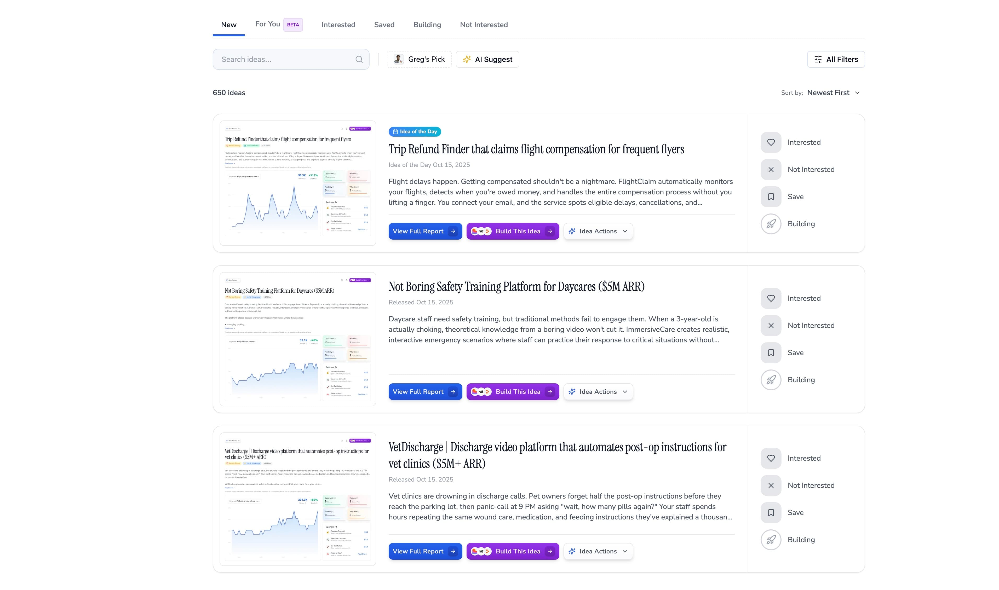

---

## Ideabrowser | #1 Software to Find Startup Ideas Worth Building

**URL:** [https://www.ideabrowser.com/idea/budget-dashboard-for-sports-teams-that-shows-parents-real-time-spending-394/value-matrix](https://www.ideabrowser.com/idea/budget-dashboard-for-sports-teams-that-shows-parents-real-time-spending-394/value-matrix)
**Depth:** 4

[

❄

❄

❄

24 Daysof Startup Ideas — Day 11/24

Claim free ideas & earn your Dec 25 gift!

Free Gift →

](/advent-calendar)

Find IdeasBuild Ideas[Pricing](/pricing)More

1

Family Three

1

[Budget tracking app that brings transparency to youth sports teams](/idea/budget-dashboard-for-sports-teams-that-shows-parents-real-time-spending-394)Market Matrix

# Market Matrix Analysis

Uniqueness

9/10

Value

8/10

The idea of a budget dashboard for sports teams is highly unique because it specifically targets a niche market needing real-time financial transparency—a feature largely unmet by current sports management solutions. The potential value is high, as it addresses acute pain points for both parents and team treasurers, such as budget shortfalls and complex financial tracking. The market trends indicate a strong demand for digital solutions in the youth sports sector, driven by increased spending and a younger, tech-savvy demographic. The market is also at an emergent stage, with no direct competitors offering such transparency-focused tools, providing a clear opportunity to establish first-mover advantage. Key challenges include integrating with existing platforms and ensuring user adoption among non-tech-savvy individuals, but these are common hurdles in SaaS that can be mitigated with strong onboarding and customer support strategies.

# Position Analysis

### Tech Novelty

High uniqueness

Low value

### Category King

High uniqueness

High value

### Low Impact

Low uniqueness

Low value

### Commodity Play

Low uniqueness

High value

Category King

This idea has high uniqueness and high value potential, positioning it for category leadership.

# Understanding the Quadrants

# Category King

High uniqueness + High value. These are breakthrough products that create new categories and capture significant value. Think iPhone, Tesla, or Airbnb.

# Tech Novelty

High uniqueness + Low value. Interesting technology that doesn't solve a valuable problem. Often "solutions looking for a problem."

# Commodity Play

Low uniqueness + High value. Established markets with proven demand but intense competition. Success requires operational excellence.

# Low Impact

Low uniqueness + Low value. These ideas may need significant refinement to find a viable market position. Consider pivoting to increase either uniqueness or value proposition.

Get ideas for profitable startups, trending keywords, and go-to-market tactics, powered by data.

### Browse Ideas

*   [Idea of the Day](/idea-of-the-day)
*   [Idea Database](/database)
*   [Trends](/trends)
*   [Market Insights](/market-insights)

### Tools

*   [Idea Generator](/idea-generator)
*   [Research Your Ideas](/idea-agent)
*   [Idea Builder](/idea-builder)
*   [Chat & Strategize](/ai-chat)
*   [Founder Fit](/founder-fit)

### Resources

*   [Platform Tour](/welcome-tour)
*   [Features](/features)
*   [Tools Library](/tools)
*   [Pricing](/pricing)
*   [FAQ](/frequently-asked-questions)

### Company

*   [About](/about)
*   [Success Stories](/success-stories)
*   [Announcements](/announcements)
*   [What's New](/updates)
*   [Contact & Support](/contact)

© 2025 Ideabrowser. All rights reserved.

[Terms and Conditions](/terms)[Privacy Policy](/privacy)[Data Protection](/data-protection)[Disclaimer](/disclaimer)

Ideabrowser shares research and education, not promises or advice. Revenue estimates, scores, and examples are illustrative only; your results will vary. Always do your own due diligence.

### Images

---

## Ideabrowser | #1 Software to Find Startup Ideas Worth Building

**URL:** [https://www.ideabrowser.com/idea/budget-dashboard-for-sports-teams-that-shows-parents-real-time-spending-394/why-now](https://www.ideabrowser.com/idea/budget-dashboard-for-sports-teams-that-shows-parents-real-time-spending-394/why-now)
**Depth:** 4

[

❄

❄

❄

24 Daysof Startup Ideas — Day 11/24

Claim free ideas & earn your Dec 25 gift!

Free Gift →

](/advent-calendar)

Find IdeasBuild Ideas[Pricing](/pricing)More

1

Family Three

1

[Budget tracking app that brings transparency to youth sports teams](/idea/budget-dashboard-for-sports-teams-that-shows-parents-real-time-spending-394)

Why Now

# Why Now

Overall Rating

9

/10

The optimal timing for launching the 'TeamBudget' dashboard aligns with surging financial transparency needs in the rapidly growing $40+ billion youth sports market, aided by demographic and technological shifts.

📈

# Market Timing Factors

10

/10

### Youth sports spending growth

The youth sports market is experiencing explosive growth, with spending projected to increase from $40 billion to $64 billion by 2033. Family spending has surged by 46% over five years, highlighting the urgent need for financial transparency. [\[2\]](https://www.econmarketresearch.com/industry-report/youth-sports-market/)[\[3\]](https://projectplay.org/news/2025/2/24/project-play-survey-family-spending-on-youth-sports-rises-46-over-five-years)[\[4\]](https://www.capstonepartners.com/insights/article-sports-technology-ma-update/)

🧠

# Technological Enablers

8

/10

### Cloud and API maturity

Cloud infrastructure and payment APIs have matured, allowing lean teams to build scalable solutions without heavy investment, making real-time financial dashboards feasible and efficient. [\[1\]](https://www.pwc.com/us/en/industries/tmt/library/sports-outlook-north-america.html)

🏛️

# Regulatory & Social Catalysts

9

/10

### Increased demand for transparency

There is a strong social demand for financial transparency in youth sports as parents' expectations for clear financial tracking increase with rising expenses. [\[2\]](https://www.econmarketresearch.com/industry-report/youth-sports-market/)[\[3\]](https://projectplay.org/news/2025/2/24/project-play-survey-family-spending-on-youth-sports-rises-46-over-five-years)[\[4\]](https://www.capstonepartners.com/insights/article-sports-technology-ma-update/)

🔒

# Risk Reduction Factors

8

/10

### Proven adjacent demand

Success in similar markets like small business accounting and HOA management validates the demand for transparent financial dashboards, reducing adoption risk for TeamBudget. [\[8\]](https://www.deloitte.com/us/en/insights/industry/technology/technology-media-telecom-outlooks/sports-industry-outlook.html)

🚀

# Competitive Window

9

/10

### Lack of direct competitors

Major platforms provide general management tools but lack focused financial transparency features, creating a clear competitive entry point for TeamBudget. [\[3\]](https://projectplay.org/news/2025/2/24/project-play-survey-family-spending-on-youth-sports-rises-46-over-five-years)[\[4\]](https://www.capstonepartners.com/insights/article-sports-technology-ma-update/)

📊

# Supporting Data Points

8

/10

### Market size and trajectory

The youth sports market is valued at $40+ billion with a trajectory towards $64 billion, driven by significant increases in family spending and the need for organized financial management. [\[2\]](https://www.econmarketresearch.com/industry-report/youth-sports-market/)[\[3\]](https://projectplay.org/news/2025/2/24/project-play-survey-family-spending-on-youth-sports-rises-46-over-five-years)[\[4\]](https://www.capstonepartners.com/insights/article-sports-technology-ma-update/)

⚠️

# Timing Risks

6

/10

### Competitive entry

Rapid competitive responses from larger platforms are expected once market traction is gained, making quick market entry imperative. [\[3\]](https://projectplay.org/news/2025/2/24/project-play-survey-family-spending-on-youth-sports-rises-46-over-five-years)[\[4\]](https://www.capstonepartners.com/insights/article-sports-technology-ma-update/)

⏰

# Why Wait = Why Fail

9

/10

### First-mover advantage

Timing is critical—securing early mover status can capture significant market share and establish customer loyalty before major incumbents react. [\[3\]](https://projectplay.org/news/2025/2/24/project-play-survey-family-spending-on-youth-sports-rises-46-over-five-years)[\[4\]](https://www.capstonepartners.com/insights/article-sports-technology-ma-update/)

# Citations & Sources

[

1 - https://www.pwc.com/us/en/industries/tmt/library/sports-outlook-north-america.html](https://www.pwc.com/us/en/industries/tmt/library/sports-outlook-north-america.html)[

2 - https://www.econmarketresearch.com/industry-report/youth-sports-market/](https://www.econmarketresearch.com/industry-report/youth-sports-market/)[

3 - https://projectplay.org/news/2025/2/24/project-play-survey-family-spending-on-youth-sports-rises-46-over-five-years](https://projectplay.org/news/2025/2/24/project-play-survey-family-spending-on-youth-sports-rises-46-over-five-years)[

4 - https://www.capstonepartners.com/insights/article-sports-technology-ma-update/](https://www.capstonepartners.com/insights/article-sports-technology-ma-update/)[

8 - https://www.deloitte.com/us/en/insights/industry/technology/technology-media-telecom-outlooks/sports-industry-outlook.html](https://www.deloitte.com/us/en/insights/industry/technology/technology-media-telecom-outlooks/sports-industry-outlook.html)

Get ideas for profitable startups, trending keywords, and go-to-market tactics, powered by data.

### Browse Ideas

*   [Idea of the Day](/idea-of-the-day)
*   [Idea Database](/database)
*   [Trends](/trends)
*   [Market Insights](/market-insights)

### Tools

*   [Idea Generator](/idea-generator)
*   [Research Your Ideas](/idea-agent)
*   [Idea Builder](/idea-builder)
*   [Chat & Strategize](/ai-chat)
*   [Founder Fit](/founder-fit)

### Resources

*   [Platform Tour](/welcome-tour)
*   [Features](/features)
*   [Tools Library](/tools)
*   [Pricing](/pricing)
*   [FAQ](/frequently-asked-questions)

### Company

*   [About](/about)
*   [Success Stories](/success-stories)
*   [Announcements](/announcements)
*   [What's New](/updates)
*   [Contact & Support](/contact)

© 2025 Ideabrowser. All rights reserved.

[Terms and Conditions](/terms)[Privacy Policy](/privacy)[Data Protection](/data-protection)[Disclaimer](/disclaimer)

Ideabrowser shares research and education, not promises or advice. Revenue estimates, scores, and examples are illustrative only; your results will vary. Always do your own due diligence.

### Images

---

## Newsletter ad tool where sponsors book slots, upload assets, and pay automatically

**URL:** [https://www.ideabrowser.com/idea/self-serve-ad-booking-calendar-for-newsletter-operators-that-lets-sponsors-select-open-dates-and-pay-instantly-362](https://www.ideabrowser.com/idea/self-serve-ad-booking-calendar-for-newsletter-operators-that-lets-sponsors-select-open-dates-and-pay-instantly-362)
**Depth:** 4

[

❄

❄

❄

24 Daysof Startup Ideas — Day 11/24

Claim free ideas & earn your Dec 25 gift!

Free Gift →

](/advent-calendar)

Find IdeasBuild Ideas[Pricing](/pricing)More

1

Family Three

1

Idea Actions

[

Build This Idea

](/idea/self-serve-ad-booking-calendar-for-newsletter-operators-that-lets-sponsors-select-open-dates-and-pay-instantly-362/build/landing-page)

[

Build This Idea

](/idea/self-serve-ad-booking-calendar-for-newsletter-operators-that-lets-sponsors-select-open-dates-and-pay-instantly-362/build/landing-page)

# Newsletter ad tool where sponsors book slots, upload assets, and pay automatically

⏰Perfect Timing

⏰Perfect Timing

🌍Massive Market

+17 More

Newsletter operators waste hours managing sponsor relationships through email chains, tracking payments in spreadsheets, and manually coordinating creative assets. AdBooker creates a Calendly-style booking system where sponsors browse available slots, select dates, upload materials, and pay instantly. You get automated invoicing, real-time analytics, and seamless payment processing. Pricing runs $49-$199/month plus a 5% transaction fee on bookings. Target newsletter creators earning $5K-$50K/month who want to replace administrative tasks with creative time. Growth comes through newsletter Facebook groups, YouTube tutorials demonstrating the booking flow, and Reddit AMAs in newsletter communities. Begin with a simple booking widget that embeds into existing newsletters. Later expand into: • Sponsor discovery marketplace • Creative approval workflows • Cross-platform analytics dashboards • Performance reporting for sponsors With 2,000 active newsletters averaging $500/month in fees, this becomes a $12M ARR business. The ad booking market remains underserved despite significant demand, creating an opportunity to build infrastructure that transforms manual sponsor management into predictable, scalable revenue.

\*Analysis, scores, and revenue estimates are educational and based on assumptions. Results vary by execution and market conditions.

Keyword:Google ads newsletter

6.6K

Volume

+650%

Growth

### Opportunity

9

Exceptional

### Problem

9

Severe Pain

### Feasibility

5

Challenging

### Why Now

9

Perfect Timing

## Business Fit

💰

Revenue Potential$1M-$10M ARR potential driven by streamlined ad booking automation.

$$$

🛠️

Execution DifficultySimple build with ad integration, 3-month MVP timeline

4/10

🚀

Go-To-MarketExceptional market potential with high traction across Reddit, Facebook, and YouTube.

9/10

[

🧠

Right for You?Ideal for founders with ad tech and media experience

Find Out

](/idea/self-serve-ad-booking-calendar-for-newsletter-operators-that-lets-sponsors-select-open-dates-and-pay-instantly-362/founder-fit)

[Offer](/idea/self-serve-ad-booking-calendar-for-newsletter-operators-that-lets-sponsors-select-open-dates-and-pay-instantly-362/value-ladder)[Why Now](/idea/self-serve-ad-booking-calendar-for-newsletter-operators-that-lets-sponsors-select-open-dates-and-pay-instantly-362/why-now)[Proof & Signals](/idea/self-serve-ad-booking-calendar-for-newsletter-operators-that-lets-sponsors-select-open-dates-and-pay-instantly-362/proof-signals)[Market Gap](/idea/self-serve-ad-booking-calendar-for-newsletter-operators-that-lets-sponsors-select-open-dates-and-pay-instantly-362/market-gap)[Execution Plan](/idea/self-serve-ad-booking-calendar-for-newsletter-operators-that-lets-sponsors-select-open-dates-and-pay-instantly-362/execution-plan)

### Start Building in 1-click

Turn this idea into your business with pre-built prompts

[

Ad Creatives

High-converting ad copy and creative concepts

](/idea/self-serve-ad-booking-calendar-for-newsletter-operators-that-lets-sponsors-select-open-dates-and-pay-instantly-362/build/ad-creatives)[

Brand Package

Complete brand identity with logo, colors, and voice

](/idea/self-serve-ad-booking-calendar-for-newsletter-operators-that-lets-sponsors-select-open-dates-and-pay-instantly-362/build/brand-package)[

Landing Page

Copy + wireframe blocks

](/idea/self-serve-ad-booking-calendar-for-newsletter-operators-that-lets-sponsors-select-open-dates-and-pay-instantly-362/build/landing-page)[

More prompts...

View all available prompts

](/idea/self-serve-ad-booking-calendar-for-newsletter-operators-that-lets-sponsors-select-open-dates-and-pay-instantly-362/build)

Works with:

+more

### Idea Actions

Download, analyze & more

[

#### Get Instant Answers

AI Chat with this idea

](/chat/idea/self-serve-ad-booking-calendar-for-newsletter-operators-that-lets-sponsors-select-open-dates-and-pay-instantly-362)[

#### Download Data

Export all research & analysis

](/idea/self-serve-ad-booking-calendar-for-newsletter-operators-that-lets-sponsors-select-open-dates-and-pay-instantly-362/download-data)[

#### Founder Fit

Is this idea right for you?

](/idea/self-serve-ad-booking-calendar-for-newsletter-operators-that-lets-sponsors-select-open-dates-and-pay-instantly-362/founder-fit)[

#### Claim Idea

Make this idea yours

](/idea/self-serve-ad-booking-calendar-for-newsletter-operators-that-lets-sponsors-select-open-dates-and-pay-instantly-362/claim-idea)

[

Research Tool

Research Tool

### Get a Report Exactly Like This for Your Idea

Have your own business idea? Our AI Research Agent conducts a comprehensive 40-step analysis to validate and research any idea you give it.

Research My Idea

Research Tool

### Get a Report Exactly Like This for Your Idea

Have your own business idea? Our AI Research Agent conducts a comprehensive 40-step analysis to validate and research any idea you give it.

Research My Idea

### Get a Report Exactly Like This for Your Idea

Have your own business idea? Our AI Research Agent conducts a comprehensive 40-step analysis to validate and research any idea you give it.

Research My Idea

](/idea-agent)

## Offer

1

Lead MagnetInteractive Calendar Demo (Free)

A live demo showing real-time ad slot availability and booking process.

2

FrontendBasic Plan Subscription ($20/month)

Access to the automated calendar with essential ad booking features.

3

CorePro Plan with Analytics ($50/month)

Includes advanced analytics dashboard for tracking ad performance and optimizations.

[View full value ladder→](/idea/self-serve-ad-booking-calendar-for-newsletter-operators-that-lets-sponsors-select-open-dates-and-pay-instantly-362/value-ladder)

## Why Now?

The rapid surge in newsletters combined with technological advancements makes this the perfect time to launch a self-serve ad booking calendar, addressing market demands efficiently.

[See why this opportunity matters now](/idea/self-serve-ad-booking-calendar-for-newsletter-operators-that-lets-sponsors-select-open-dates-and-pay-instantly-362/why-now)

## Proof & Signals

The demand for a self-serve ad booking calendar is validated by user frustrations, immediate market needs, gaps in current offerings, and active community interest. Newsletter operators face significant pain points in manual booking processes, while market timing and technological advancements align to make a streamlined solution highly attractive. Active community discussions and increase in related roles indicate strong demand, positioning this solution to take advantage of ripe market conditions.

[Explore proof & signals](/idea/self-serve-ad-booking-calendar-for-newsletter-operators-that-lets-sponsors-select-open-dates-and-pay-instantly-362/proof-signals)

## The Market Gap

Newsletter operators face increasing frustration with manual ad booking processes, creating a significant market opportunity for a self-serve ad calendar that streamlines workflows and boosts revenue.

[Understand the market opportunity](/idea/self-serve-ad-booking-calendar-for-newsletter-operators-that-lets-sponsors-select-open-dates-and-pay-instantly-362/market-gap)

## Execution Plan

Launch an embeddable calendar widget for seamless ad booking and Stripe payment integration, solving manual scheduling woes. Drive quick wins via interactive demos. Then, target Reddit and LinkedIn for community outreach and validation. Ready to increase global reach with local partnerships and tiered pricing? Let's expand!

[View detailed execution strategy](/idea/self-serve-ad-booking-calendar-for-newsletter-operators-that-lets-sponsors-select-open-dates-and-pay-instantly-362/execution-plan)

## Framework Fit

See how this idea fits into popular frameworks

[

### The Value Equation

View Analysis

](/idea/self-serve-ad-booking-calendar-for-newsletter-operators-that-lets-sponsors-select-open-dates-and-pay-instantly-362/value-equation)[

### Market Matrix

### Tech Novelty

High uniqueness

Low value

### Category King

High uniqueness

High value

### Low Impact

Low uniqueness

Low value

### Commodity Play

Low uniqueness

High value

View Analysis

](/idea/self-serve-ad-booking-calendar-for-newsletter-operators-that-lets-sponsors-select-open-dates-and-pay-instantly-362/value-matrix)[

### The A.C.P. Framework

Audience8/10

Community9/10

Product9/10

View Analysis

](/idea/self-serve-ad-booking-calendar-for-newsletter-operators-that-lets-sponsors-select-open-dates-and-pay-instantly-362/acp)[

### The Value Ladder

Bait

Frontend

Core Offer

Backend

Continuity

View Analysis

](/idea/self-serve-ad-booking-calendar-for-newsletter-operators-that-lets-sponsors-select-open-dates-and-pay-instantly-362/value-ladder)

### Start Building in 1-click

Turn this idea into your business with pre-built prompts

[

Ad Creatives

High-converting ad copy and creative concepts

](/idea/self-serve-ad-booking-calendar-for-newsletter-operators-that-lets-sponsors-select-open-dates-and-pay-instantly-362/build/ad-creatives)[

Brand Package

Complete brand identity with logo, colors, and voice

](/idea/self-serve-ad-booking-calendar-for-newsletter-operators-that-lets-sponsors-select-open-dates-and-pay-instantly-362/build/brand-package)[

Landing Page

Copy + wireframe blocks

](/idea/self-serve-ad-booking-calendar-for-newsletter-operators-that-lets-sponsors-select-open-dates-and-pay-instantly-362/build/landing-page)[

More prompts...

View all available prompts

](/idea/self-serve-ad-booking-calendar-for-newsletter-operators-that-lets-sponsors-select-open-dates-and-pay-instantly-362/build)

Works with:

+more

### Idea Actions

Download, analyze & more

[

#### Get Instant Answers

AI Chat with this idea

](/chat/idea/self-serve-ad-booking-calendar-for-newsletter-operators-that-lets-sponsors-select-open-dates-and-pay-instantly-362)[

#### Download Data

Export all research & analysis

](/idea/self-serve-ad-booking-calendar-for-newsletter-operators-that-lets-sponsors-select-open-dates-and-pay-instantly-362/download-data)[

#### Founder Fit

Is this idea right for you?

](/idea/self-serve-ad-booking-calendar-for-newsletter-operators-that-lets-sponsors-select-open-dates-and-pay-instantly-362/founder-fit)[

#### Claim Idea

Make this idea yours

](/idea/self-serve-ad-booking-calendar-for-newsletter-operators-that-lets-sponsors-select-open-dates-and-pay-instantly-362/claim-idea)

### Categorization

Type

platform

Market

B2B

Target

content creators

Main Competitor

Beehiiv

Trend Analysis

The newsletter industry is rapidly growing with increasing demand for ad monetization solutions, particularly as advertisers shift from traditional channels to newsletters.

[

### Community Signals

](/idea/self-serve-ad-booking-calendar-for-newsletter-operators-that-lets-sponsors-select-open-dates-and-pay-instantly-362/community-signals)

[

Reddit

4 subreddits · 2.5M+ members

8 / 10

](/idea/self-serve-ad-booking-calendar-for-newsletter-operators-that-lets-sponsors-select-open-dates-and-pay-instantly-362/community-signals/reddit-analysis)[

Facebook

5 groups · 150K+ members

7 / 10

](/idea/self-serve-ad-booking-calendar-for-newsletter-operators-that-lets-sponsors-select-open-dates-and-pay-instantly-362/community-signals/facebook-analysis)[

YouTube

13 channels · views

7 / 10

](/idea/self-serve-ad-booking-calendar-for-newsletter-operators-that-lets-sponsors-select-open-dates-and-pay-instantly-362/community-signals/youtube-analysis)[

Other

4 segments · 3 priorities

8 / 10

](/idea/self-serve-ad-booking-calendar-for-newsletter-operators-that-lets-sponsors-select-open-dates-and-pay-instantly-362/community-signals/other-communities)

[View detailed breakdown](/idea/self-serve-ad-booking-calendar-for-newsletter-operators-that-lets-sponsors-select-open-dates-and-pay-instantly-362/community-signals)

### Top Keywords

Fastest Growing

[

facebook ads newsletter

LOW competition

590

](/idea/self-serve-ad-booking-calendar-for-newsletter-operators-that-lets-sponsors-select-open-dates-and-pay-instantly-362/keywords?keyword=facebook ads newsletter)[

google ads newsletter

LOW competition

3.6K

](/idea/self-serve-ad-booking-calendar-for-newsletter-operators-that-lets-sponsors-select-open-dates-and-pay-instantly-362/keywords?keyword=google ads newsletter)[

newsletter adverts

LOW competition

14.8K

](/idea/self-serve-ad-booking-calendar-for-newsletter-operators-that-lets-sponsors-select-open-dates-and-pay-instantly-362/keywords?keyword=newsletter adverts)

Highest Volume

[

newsletter adverts

LOW competition

14.8K

](/idea/self-serve-ad-booking-calendar-for-newsletter-operators-that-lets-sponsors-select-open-dates-and-pay-instantly-362/keywords?keyword=newsletter adverts)[

ads newsletter

LOW competition

5.4K

](/idea/self-serve-ad-booking-calendar-for-newsletter-operators-that-lets-sponsors-select-open-dates-and-pay-instantly-362/keywords?keyword=ads newsletter)[

google ads newsletter

LOW competition

3.6K

](/idea/self-serve-ad-booking-calendar-for-newsletter-operators-that-lets-sponsors-select-open-dates-and-pay-instantly-362/keywords?keyword=google ads newsletter)

Most Relevant

[

newsletter adverts

LOW competition

14.8K

](/idea/self-serve-ad-booking-calendar-for-newsletter-operators-that-lets-sponsors-select-open-dates-and-pay-instantly-362/keywords?keyword=newsletter adverts)[

ads newsletter

LOW competition

5.4K

](/idea/self-serve-ad-booking-calendar-for-newsletter-operators-that-lets-sponsors-select-open-dates-and-pay-instantly-362/keywords?keyword=ads newsletter)[

google ads newsletter

LOW competition

3.6K

](/idea/self-serve-ad-booking-calendar-for-newsletter-operators-that-lets-sponsors-select-open-dates-and-pay-instantly-362/keywords?keyword=google ads newsletter)

[View full keyword analysis](/idea/self-serve-ad-booking-calendar-for-newsletter-operators-that-lets-sponsors-select-open-dates-and-pay-instantly-362/keywords)

### What'd you think of this idea?

Chef's kiss

Pretty interesting

You didn't bring the heat

## Get Instant Answers

Ask anything about this business idea

Powered by Idea Agent

Popular questions

What problem does this solve?How big is the market opportunity?What's the competitive landscape?What's the revenue model?How hard is it to build?What are the key risks?

**Important:** Revenue estimates, scores, and market data are illustrative based on research and assumptions. Results vary by execution, timing, and market conditions. Not investment or business advice.

### More Ideas

[

#### Materials estimation app that calculates exact quantities for home renovations

Home renovation costs skyrocket when you buy too much drywall or run out of paint halfway through. EstiMate uses computer vision to scan your room and instantly calculate exactly how much material you need, down to the last tile and gallon. Upload photos, answer a few questions about your project, and get precise shopping lists that account for waste, cuts, and your skill level. You charge $9.99/month for the pro version after a free basic tier hooks people in. The app learns from millions of real projects to get more accurate about edge cases like uneven walls, complex cuts, and material-specific waste factors. You grow by partnering with Home Depot and Lowe's for seamless checkout integration, sponsoring popular DIY YouTube channels, and building a community where people share their successful projects with exact material costs. The initial focus is individual DIYers, but you expand into small contractors who need quick, accurate estimates for client quotes. At $50-200/month for business accounts, you become the essential tool for anyone measuring twice and cutting once. Add features like cost tracking, project timelines, and supplier price comparisons. Eventually, you're the operating system for home improvement, turning every weekend warrior into a precision renovator who completes projects on budget without excess materials piling up in the garage.

](/idea/smart-material-estimator-app-with-ai-predicted-waste-reduction-354)[

#### Budget tracking app that brings transparency to youth sports teams

Youth sports team finances are a mess. Parents constantly ask "where did my $500 registration fee go?" Treasurers scramble with Excel sheets and receipts. Arguments break out over uniform costs and tournament expenses. TeamBudget fixes this by giving every team real-time financial transparency that parents and coaches can actually understand. You get automatic expense tracking, receipt uploads, and budget breakdowns that show exactly where every dollar goes. Parents see live updates when fees are collected and spent. Team managers get clean dashboards instead of messy spreadsheets. Everything syncs with existing payment systems and sports management platforms. The wedge is youth sports teams drowning in financial chaos. At $24-50 per team per month, you're targeting the 200,000+ organized youth sports teams in the US. You grow through Facebook parent groups where budget drama unfolds daily, partnerships with TeamSnap and SportsEngine, and word-of-mouth from treasurers who finally stop getting angry texts about missing money. Start simple with expense tracking and parent notifications. Then expand into budget forecasting, fundraising tools, and white-label solutions for sports leagues. The 290-comment Reddit threads and 18,000-member Facebook groups prove parents are desperate for this. Youth sports spending hits $30+ billion annually, but nobody's built the financial infrastructure these teams actually need. You become the trusted layer between team organizers and frustrated parents, turning budget chaos into budget clarity.

](/idea/budget-dashboard-for-sports-teams-that-shows-parents-real-time-spending-394)[

#### Auction tool that predicts prices and suggests winning strategies for collectors and resellers

Most people lose money at auctions because they're bidding blind. You see something you want, guess what it's worth, and either overpay or get outbid by someone who knows something you don't. BidSmart changes the game by analyzing thousands of completed auctions to predict what items will actually sell for and tells you exactly when to bid, how much to offer, and when to walk away. The tool works across eBay, Heritage Auctions, LiveAuctioneers, and other major platforms. Upload a photo or paste a listing link, and you get an instant price prediction with confidence intervals, comparable sales data, and a custom bidding strategy. For a vintage watch, it might say "This will likely sell for $800-$1,200, bid up to $850 in the final 30 seconds." For comic books, it shows recent sales of similar grades and suggests your maximum bid before you lose money. You charge $29/month for casual collectors and $99/month for professional resellers who need bulk analysis and profit margin tracking. The pro version includes inventory management, tax reporting, and alerts when underpriced items hit the market. At scale, you can offer white-label solutions to auction houses at $5K-$15K per month. The wedge is frustrated collectors who keep overpaying and resellers who need better profit margins. You grow through Reddit auction communities, Facebook collector groups, and YouTube channels focused on flipping and investing. Start with eBay integration and expand to specialty auction platforms as you prove the concept. This becomes the Bloomberg Terminal for auction markets, turning gut-feeling bidders into data-driven profit machines who never wonder "what's this really worth?" again.

](/idea/ai-auction-strategist)

Get ideas for profitable startups, trending keywords, and go-to-market tactics, powered by data.

### Browse Ideas

*   [Idea of the Day](/idea-of-the-day)
*   [Idea Database](/database)
*   [Trends](/trends)
*   [Market Insights](/market-insights)

### Tools

*   [Idea Generator](/idea-generator)
*   [Research Your Ideas](/idea-agent)
*   [Idea Builder](/idea-builder)
*   [Chat & Strategize](/ai-chat)
*   [Founder Fit](/founder-fit)

### Resources

*   [Platform Tour](/welcome-tour)
*   [Features](/features)
*   [Tools Library](/tools)
*   [Pricing](/pricing)
*   [FAQ](/frequently-asked-questions)

### Company

*   [About](/about)
*   [Success Stories](/success-stories)
*   [Announcements](/announcements)
*   [What's New](/updates)
*   [Contact & Support](/contact)

© 2025 Ideabrowser. All rights reserved.

[Terms and Conditions](/terms)[Privacy Policy](/privacy)[Data Protection](/data-protection)[Disclaimer](/disclaimer)

Ideabrowser shares research and education, not promises or advice. Revenue estimates, scores, and examples are illustrative only; your results will vary. Always do your own due diligence.

0

### Images

---

## Materials estimation app that calculates exact quantities for home renovations

**URL:** [https://www.ideabrowser.com/idea/smart-material-estimator-app-with-ai-predicted-waste-reduction-354](https://www.ideabrowser.com/idea/smart-material-estimator-app-with-ai-predicted-waste-reduction-354)
**Depth:** 4

[

❄

❄

❄

24 Daysof Startup Ideas — Day 11/24

Claim free ideas & earn your Dec 25 gift!

Free Gift →

](/advent-calendar)

Find IdeasBuild Ideas[Pricing](/pricing)More

1

Family Three

1

Idea Actions

[

Build This Idea

](/idea/smart-material-estimator-app-with-ai-predicted-waste-reduction-354/build/landing-page)

[

Build This Idea

](/idea/smart-material-estimator-app-with-ai-predicted-waste-reduction-354/build/landing-page)

# Materials estimation app that calculates exact quantities for home renovations

⏰Perfect Timing

⏰Perfect Timing

🚀10x Better

+16 More

Home renovation costs skyrocket when you buy too much drywall or run out of paint halfway through. EstiMate uses computer vision to scan your room and instantly calculate exactly how much material you need, down to the last tile and gallon. Upload photos, answer a few questions about your project, and get precise shopping lists that account for waste, cuts, and your skill level. You charge $9.99/month for the pro version after a free basic tier hooks people in. The app learns from millions of real projects to get more accurate about edge cases like uneven walls, complex cuts, and material-specific waste factors. You grow by partnering with Home Depot and Lowe's for seamless checkout integration, sponsoring popular DIY YouTube channels, and building a community where people share their successful projects with exact material costs. The initial focus is individual DIYers, but you expand into small contractors who need quick, accurate estimates for client quotes. At $50-200/month for business accounts, you become the essential tool for anyone measuring twice and cutting once. Add features like cost tracking, project timelines, and supplier price comparisons. Eventually, you're the operating system for home improvement, turning every weekend warrior into a precision renovator who completes projects on budget without excess materials piling up in the garage.

\*Analysis, scores, and revenue estimates are educational and based on assumptions. Results vary by execution and market conditions.

Keyword:Concrete pad calculator

90.5K

Volume

+814%

Growth

### Opportunity

9

Exceptional

### Problem

9

Severe Pain

### Feasibility

8

Manageable

### Why Now

9

Perfect Timing

## Business Fit

💰

Revenue Potential$1M-$10M ARR potential in DIY and contractor segments with scalable AI-driven features.

$$$

🛠️

Execution DifficultyModerate complexity with custom development for DIY tools, 6-month MVP timeline.

6/10

🚀

Go-To-MarketThe DIY and renovation market shows viral potential with clear traction across Reddit, Facebook, and YouTube.

9/10

[

🧠

Right for You?Great for product-focused founders in home improvement tech

Find Out

](/idea/smart-material-estimator-app-with-ai-predicted-waste-reduction-354/founder-fit)

[Offer](/idea/smart-material-estimator-app-with-ai-predicted-waste-reduction-354/value-ladder)[Why Now](/idea/smart-material-estimator-app-with-ai-predicted-waste-reduction-354/why-now)[Proof & Signals](/idea/smart-material-estimator-app-with-ai-predicted-waste-reduction-354/proof-signals)[Market Gap](/idea/smart-material-estimator-app-with-ai-predicted-waste-reduction-354/market-gap)[Execution Plan](/idea/smart-material-estimator-app-with-ai-predicted-waste-reduction-354/execution-plan)

### Start Building in 1-click

Turn this idea into your business with pre-built prompts

[

Ad Creatives

High-converting ad copy and creative concepts

](/idea/smart-material-estimator-app-with-ai-predicted-waste-reduction-354/build/ad-creatives)[

Brand Package

Complete brand identity with logo, colors, and voice

](/idea/smart-material-estimator-app-with-ai-predicted-waste-reduction-354/build/brand-package)[

Landing Page

Copy + wireframe blocks

](/idea/smart-material-estimator-app-with-ai-predicted-waste-reduction-354/build/landing-page)[

More prompts...

View all available prompts

](/idea/smart-material-estimator-app-with-ai-predicted-waste-reduction-354/build)

Works with:

+more

### Idea Actions

Download, analyze & more

[

#### Get Instant Answers

AI Chat with this idea

](/chat/idea/smart-material-estimator-app-with-ai-predicted-waste-reduction-354)[

#### Download Data

Export all research & analysis

](/idea/smart-material-estimator-app-with-ai-predicted-waste-reduction-354/download-data)[

#### Founder Fit

Is this idea right for you?

](/idea/smart-material-estimator-app-with-ai-predicted-waste-reduction-354/founder-fit)[

#### Claim Idea

Make this idea yours

](/idea/smart-material-estimator-app-with-ai-predicted-waste-reduction-354/claim-idea)

[

Research Tool

Research Tool

### Get a Report Exactly Like This for Your Idea

Have your own business idea? Our AI Research Agent conducts a comprehensive 40-step analysis to validate and research any idea you give it.

Research My Idea

Research Tool

### Get a Report Exactly Like This for Your Idea

Have your own business idea? Our AI Research Agent conducts a comprehensive 40-step analysis to validate and research any idea you give it.

Research My Idea

### Get a Report Exactly Like This for Your Idea

Have your own business idea? Our AI Research Agent conducts a comprehensive 40-step analysis to validate and research any idea you give it.

Research My Idea

](/idea-agent)

## Offer

1

Lead MagnetRenovation Material Estimator Tool (Free)

A free online calculator to estimate material needs for common projects like tiling or painting.

2

FrontendEstiMate Basic Package ($9.99/month)

Unlock advanced features in the app including personalized project tracking and cost analytics.

3

CorePro Contractor Package ($50–$200/month)

Advanced tools for small-scale contractors, offering project management and client portfolio features.

[View full value ladder→](/idea/smart-material-estimator-app-with-ai-predicted-waste-reduction-354/value-ladder)

## Why Now?

With explosive growth in smart waste management, advances in AI, and a surge in DIY projects, now is the perfect time to launch EstiMate. This app saves users up to 20% per project by reducing waste and costs.

[See why this opportunity matters now](/idea/smart-material-estimator-app-with-ai-predicted-waste-reduction-354/why-now)

## Proof & Signals

The business idea of a smart material estimator app is validated by strong signals across several dimensions. There's notable frustration and cost associated with overbuying materials, a significant DIY boom driving urgency, systemic gaps in existing market tools that fail to adaptively reduce waste, and growing engagement within DIY communities seeking efficient solutions.

[Explore proof & signals](/idea/smart-material-estimator-app-with-ai-predicted-waste-reduction-354/proof-signals)

## The Market Gap

The biggest market gap is the lack of adaptive, AI-powered estimation tools that reduce material waste and costs by up to 20%. This matters because it directly addresses the frustration and financial loss homeowners face due to overbuying materials.

[Understand the market opportunity](/idea/smart-material-estimator-app-with-ai-predicted-waste-reduction-354/market-gap)

## Execution Plan

Launch EstiMate—a breakthrough MVP delivering AI-driven material estimations that cut waste by 20%, providing first-time renovators and contractors a fast solution. Integrate with real-time data tools, then harness user feedback to enhance features. Ready to scale? B2B SaaS expansion targets complex projects. Imagine the possibilities!

[View detailed execution strategy](/idea/smart-material-estimator-app-with-ai-predicted-waste-reduction-354/execution-plan)

## Framework Fit

See how this idea fits into popular frameworks

[

### The Value Equation

View Analysis

](/idea/smart-material-estimator-app-with-ai-predicted-waste-reduction-354/value-equation)[

### Market Matrix

### Tech Novelty

High uniqueness

Low value

### Category King

High uniqueness

High value

### Low Impact

Low uniqueness

Low value

### Commodity Play

Low uniqueness

High value

View Analysis

](/idea/smart-material-estimator-app-with-ai-predicted-waste-reduction-354/value-matrix)[

### The A.C.P. Framework

Audience8/10

Community8/10

Product9/10

View Analysis

](/idea/smart-material-estimator-app-with-ai-predicted-waste-reduction-354/acp)[

### The Value Ladder

Bait

Frontend

Core Offer

Backend

Continuity

View Analysis

](/idea/smart-material-estimator-app-with-ai-predicted-waste-reduction-354/value-ladder)

### Start Building in 1-click

Turn this idea into your business with pre-built prompts

[

Ad Creatives

High-converting ad copy and creative concepts

](/idea/smart-material-estimator-app-with-ai-predicted-waste-reduction-354/build/ad-creatives)[

Brand Package

Complete brand identity with logo, colors, and voice

](/idea/smart-material-estimator-app-with-ai-predicted-waste-reduction-354/build/brand-package)[

Landing Page

Copy + wireframe blocks

](/idea/smart-material-estimator-app-with-ai-predicted-waste-reduction-354/build/landing-page)[

More prompts...

View all available prompts

](/idea/smart-material-estimator-app-with-ai-predicted-waste-reduction-354/build)

Works with:

+more

### Idea Actions

Download, analyze & more

[

#### Get Instant Answers

AI Chat with this idea

](/chat/idea/smart-material-estimator-app-with-ai-predicted-waste-reduction-354)[

#### Download Data

Export all research & analysis

](/idea/smart-material-estimator-app-with-ai-predicted-waste-reduction-354/download-data)[

#### Founder Fit

Is this idea right for you?

](/idea/smart-material-estimator-app-with-ai-predicted-waste-reduction-354/founder-fit)[

#### Claim Idea

Make this idea yours

](/idea/smart-material-estimator-app-with-ai-predicted-waste-reduction-354/claim-idea)

### Categorization

Type

mobile\_app

Market

B2C

Target

DIY enthusiasts

Main Competitor

Home Depot

Trend Analysis

Growing interest in DIY projects and sustainability, combined with advancements in AI and smart waste management, creates ideal conditions for EstiMate's growth.

[

### Community Signals

](/idea/smart-material-estimator-app-with-ai-predicted-waste-reduction-354/community-signals)

[

Reddit

6 subreddits · 2.5M+ members

8 / 10

](/idea/smart-material-estimator-app-with-ai-predicted-waste-reduction-354/community-signals/reddit-analysis)[

Facebook

5 groups · 150K+ members

7 / 10

](/idea/smart-material-estimator-app-with-ai-predicted-waste-reduction-354/community-signals/facebook-analysis)[

YouTube

12 channels · views

7 / 10

](/idea/smart-material-estimator-app-with-ai-predicted-waste-reduction-354/community-signals/youtube-analysis)[

Other

3 segments · 3 priorities

8 / 10

](/idea/smart-material-estimator-app-with-ai-predicted-waste-reduction-354/community-signals/other-communities)

[View detailed breakdown](/idea/smart-material-estimator-app-with-ai-predicted-waste-reduction-354/community-signals)

### Top Keywords

Fastest Growing

[

ready mix concrete calculator

LOW competition

6.6K

](/idea/smart-material-estimator-app-with-ai-predicted-waste-reduction-354/keywords?keyword=ready mix concrete calculator)[

home improvement diy projects

LOW competition

5.4K

](/idea/smart-material-estimator-app-with-ai-predicted-waste-reduction-354/keywords?keyword=home improvement diy projects)[

concrete pad calculator

LOW competition

27.1K

](/idea/smart-material-estimator-app-with-ai-predicted-waste-reduction-354/keywords?keyword=concrete pad calculator)

Highest Volume

[

cement estimator

LOW competition

673.0K

](/idea/smart-material-estimator-app-with-ai-predicted-waste-reduction-354/keywords?keyword=cement estimator)[

gravel estimator

LOW competition

74.0K

](/idea/smart-material-estimator-app-with-ai-predicted-waste-reduction-354/keywords?keyword=gravel estimator)[

mulch estimator

LOW competition

60.5K

](/idea/smart-material-estimator-app-with-ai-predicted-waste-reduction-354/keywords?keyword=mulch estimator)

Most Relevant

[

cement estimator

LOW competition

673.0K

](/idea/smart-material-estimator-app-with-ai-predicted-waste-reduction-354/keywords?keyword=cement estimator)[

gravel estimator

LOW competition

74.0K

](/idea/smart-material-estimator-app-with-ai-predicted-waste-reduction-354/keywords?keyword=gravel estimator)[

mulch estimator

LOW competition

60.5K

](/idea/smart-material-estimator-app-with-ai-predicted-waste-reduction-354/keywords?keyword=mulch estimator)

[View full keyword analysis](/idea/smart-material-estimator-app-with-ai-predicted-waste-reduction-354/keywords)

### What'd you think of this idea?

Chef's kiss

Pretty interesting

You didn't bring the heat

## Get Instant Answers

Ask anything about this business idea

Powered by Idea Agent

Popular questions

What problem does this solve?How big is the market opportunity?What's the competitive landscape?What's the revenue model?How hard is it to build?What are the key risks?

**Important:** Revenue estimates, scores, and market data are illustrative based on research and assumptions. Results vary by execution, timing, and market conditions. Not investment or business advice.

### More Ideas

[

#### Budget tracking app that brings transparency to youth sports teams

Youth sports team finances are a mess. Parents constantly ask "where did my $500 registration fee go?" Treasurers scramble with Excel sheets and receipts. Arguments break out over uniform costs and tournament expenses. TeamBudget fixes this by giving every team real-time financial transparency that parents and coaches can actually understand. You get automatic expense tracking, receipt uploads, and budget breakdowns that show exactly where every dollar goes. Parents see live updates when fees are collected and spent. Team managers get clean dashboards instead of messy spreadsheets. Everything syncs with existing payment systems and sports management platforms. The wedge is youth sports teams drowning in financial chaos. At $24-50 per team per month, you're targeting the 200,000+ organized youth sports teams in the US. You grow through Facebook parent groups where budget drama unfolds daily, partnerships with TeamSnap and SportsEngine, and word-of-mouth from treasurers who finally stop getting angry texts about missing money. Start simple with expense tracking and parent notifications. Then expand into budget forecasting, fundraising tools, and white-label solutions for sports leagues. The 290-comment Reddit threads and 18,000-member Facebook groups prove parents are desperate for this. Youth sports spending hits $30+ billion annually, but nobody's built the financial infrastructure these teams actually need. You become the trusted layer between team organizers and frustrated parents, turning budget chaos into budget clarity.

](/idea/budget-dashboard-for-sports-teams-that-shows-parents-real-time-spending-394)[

#### Newsletter ad tool where sponsors book slots, upload assets, and pay automatically

Newsletter operators waste hours managing sponsor relationships through email chains, tracking payments in spreadsheets, and manually coordinating creative assets. AdBooker creates a Calendly-style booking system where sponsors browse available slots, select dates, upload materials, and pay instantly. You get automated invoicing, real-time analytics, and seamless payment processing. Pricing runs $49-$199/month plus a 5% transaction fee on bookings. Target newsletter creators earning $5K-$50K/month who want to replace administrative tasks with creative time. Growth comes through newsletter Facebook groups, YouTube tutorials demonstrating the booking flow, and Reddit AMAs in newsletter communities. Begin with a simple booking widget that embeds into existing newsletters. Later expand into: • Sponsor discovery marketplace • Creative approval workflows • Cross-platform analytics dashboards • Performance reporting for sponsors With 2,000 active newsletters averaging $500/month in fees, this becomes a $12M ARR business. The ad booking market remains underserved despite significant demand, creating an opportunity to build infrastructure that transforms manual sponsor management into predictable, scalable revenue.

](/idea/self-serve-ad-booking-calendar-for-newsletter-operators-that-lets-sponsors-select-open-dates-and-pay-instantly-362)[

#### Auction tool that predicts prices and suggests winning strategies for collectors and resellers

Most people lose money at auctions because they're bidding blind. You see something you want, guess what it's worth, and either overpay or get outbid by someone who knows something you don't. BidSmart changes the game by analyzing thousands of completed auctions to predict what items will actually sell for and tells you exactly when to bid, how much to offer, and when to walk away. The tool works across eBay, Heritage Auctions, LiveAuctioneers, and other major platforms. Upload a photo or paste a listing link, and you get an instant price prediction with confidence intervals, comparable sales data, and a custom bidding strategy. For a vintage watch, it might say "This will likely sell for $800-$1,200, bid up to $850 in the final 30 seconds." For comic books, it shows recent sales of similar grades and suggests your maximum bid before you lose money. You charge $29/month for casual collectors and $99/month for professional resellers who need bulk analysis and profit margin tracking. The pro version includes inventory management, tax reporting, and alerts when underpriced items hit the market. At scale, you can offer white-label solutions to auction houses at $5K-$15K per month. The wedge is frustrated collectors who keep overpaying and resellers who need better profit margins. You grow through Reddit auction communities, Facebook collector groups, and YouTube channels focused on flipping and investing. Start with eBay integration and expand to specialty auction platforms as you prove the concept. This becomes the Bloomberg Terminal for auction markets, turning gut-feeling bidders into data-driven profit machines who never wonder "what's this really worth?" again.

](/idea/ai-auction-strategist)

Get ideas for profitable startups, trending keywords, and go-to-market tactics, powered by data.

### Browse Ideas

*   [Idea of the Day](/idea-of-the-day)
*   [Idea Database](/database)
*   [Trends](/trends)
*   [Market Insights](/market-insights)

### Tools

*   [Idea Generator](/idea-generator)
*   [Research Your Ideas](/idea-agent)
*   [Idea Builder](/idea-builder)
*   [Chat & Strategize](/ai-chat)
*   [Founder Fit](/founder-fit)

### Resources

*   [Platform Tour](/welcome-tour)
*   [Features](/features)
*   [Tools Library](/tools)
*   [Pricing](/pricing)
*   [FAQ](/frequently-asked-questions)

### Company

*   [About](/about)
*   [Success Stories](/success-stories)
*   [Announcements](/announcements)
*   [What's New](/updates)
*   [Contact & Support](/contact)

© 2025 Ideabrowser. All rights reserved.

[Terms and Conditions](/terms)[Privacy Policy](/privacy)[Data Protection](/data-protection)[Disclaimer](/disclaimer)

Ideabrowser shares research and education, not promises or advice. Revenue estimates, scores, and examples are illustrative only; your results will vary. Always do your own due diligence.

0

### Images

---

